## 0. lntroduction to Pointers

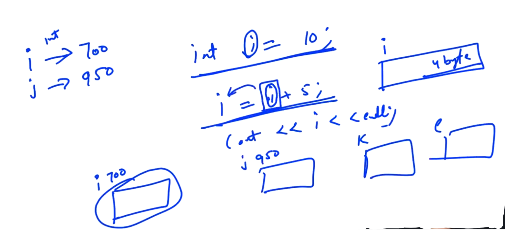

**<u>3 Steps</u>**:

1. Memory Allocation

2. Variable having Address

3. Filling of the memory allocation...

-

Note: Symbol Table is created during Compile time...

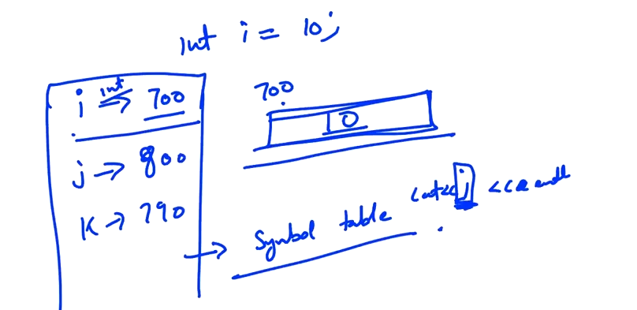

**<u>NOTE</u>**:

"&i" will tell the Address of i.

```cpp
#include<iostream>
using namespace std;
int main()
{
    int i;
    cout<<&i<<endl;    //Address of "i"
    return 0;
}
```

Output:

0x7ffd8ffd21a4

(In Hexa-Decimal i.e.  0, 1, 2, 3, 4, 5, 6, 7, 8, 9, a, b, c, d, e, f)

-

int * p = &i;

i.e. p is a Pointer to an Integer... Since, p can store address of Integers...

```cpp
#include<iostream>
using namespace std;
int main()
{
    int i;
    cout<<&i<<endl;
    int *p = &i;
    cout<<p<<endl;
    return 0;
}
```

Output:

0x7ffcf6b3fb7c
0x7ffcf6b3fb7c

```cpp
#include<iostream>
using namespace std;
int main()
{
    int i=10;
    cout<<&i<<endl;
    int *p = &i;
    cout<<p<<endl;

    cout<<*p<<endl; 
//Dereference operator i.e. Gives the value pointed by p

    float f = 10.2;
    float * pf = &f;

    double d = 122.32;
    double * pd = &d;

    return 0;
}
```

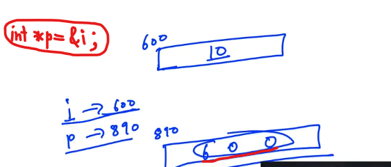

-

```cpp
#include<iostream>
using namespace std;
int main()
{
    int i=10;
    cout<<&i<<endl;
    int *p = &i;

    cout << sizeof(p) << endl;

    return 0;
}
```

-

```cpp
#include<iostream>
using namespace std;
int main()
{
    int i=10;
    cout<<&i<<endl;
    int *p = &i;

    int *q = p;      //SEE

    cout << sizeof(p) << endl;
    cout << i << endl;
    cout << *p << endl;

    i++;

    cout << i << endl;
    cout << *p << endl;

    int a = *p;
    // int a = i;
    a++;
    cout << a << endl;
    cout << *p << endl;

    i=12;
    cout << i << endl;
    cout << *p << endl;

    *p = 23;
    cout << i << endl;
    cout << *p << endl;

    (*p)++;
    cout << i << endl;
    cout << *p << endl;

    return 0;
}
```

-

```cpp
#include<iostream>
using namespace std;
int main()
{
    int i;
    cout<<i<<endl;

    i++;
    cout<<i<<endl;

    // int *p = 0;     //Null pointer
    int *p;
    cout<<p<<endl;

    cout<<*p<<endl; //Don't Do...

    (*p)++;     //Risky - Don't Do....
    cout<<*p<<endl;

    return 0;
}
```

---------------

## 2. Pointer Arithmetic

```cpp
#include<iostream>
using namespace std;
int main()
{
    int i = 10;
    int *p = &i;

    cout << p << endl;

    p = p + 2;  
    // Go "two" integer up i.e. 8 Bytes forward...
    cout << p << endl;

    p = p - 2;  
    // Go "two" integer down i.e. 8 Bytes back again...
    cout << p << endl;

    return 0;
}
```

In case of Array, this Increment and Decrement case will work...

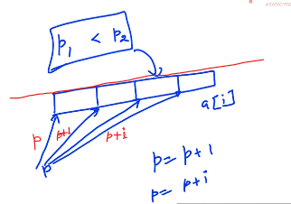

-

```cpp
#include<iostream>
using namespace std;
int main()
{
    int i = 10;
    int *p = &i;

    cout << p << endl;

    p = p + 2;
    cout << p << endl;

    p = p - 2;
    cout << p << endl;

    double d = 102.3;
    double *dp = &d;
    cout<< dp << endl;
    dp++;
    cout<< dp <<endl;

    return 0;
}
```

OUTPUT:

0x7ffde394a83c
0x7ffde394a844
0x7ffde394a83c
0x7ffde394a840
0x7ffde394a848    (Increased by 8)

----

## 4.Arrays and Pointers

```cpp
//Example to show "a" is basically just the address of "a[0]"
#include<iostream>
using namespace std;
int main()
{
    int a[10];
    cout << a << endl;
    cout << &a[0] <<endl;

    cout << a[0] << endl;   //Shows Garbage Value

    a[0] = 5;
    a[1] = 10;
    cout<< *a << endl; //De-referencing and get zeroth element
    cout<< *(a+1) << endl;
    return 0;
}
```

-

**<u>Note</u>**:

*(a)    ->    a[0]

*(a+1)    ->    a[1]

*(a+i)    ->    a[i]

i[a]    ->    *(i+a)

**<u>Conclusion</u>**:

we can get the <mark>i</mark>th element by using: 

a[i]    (OR)    *(a+i)    (OR)    i[a]  

--

<mark>Differences between Array and Pointer</mark>:

1) **sizeof( ) concept**:

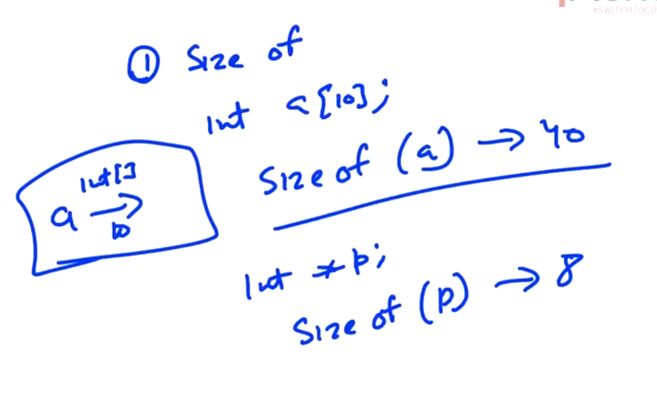

-

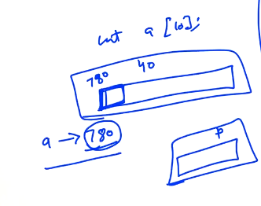

While printing the Address of the "a" gives the Address of the zeroth Element in the Array... whereas in case of Pointer we need Extra 8 bytes space...

-

2. **"&" operator**:

&p and &a 

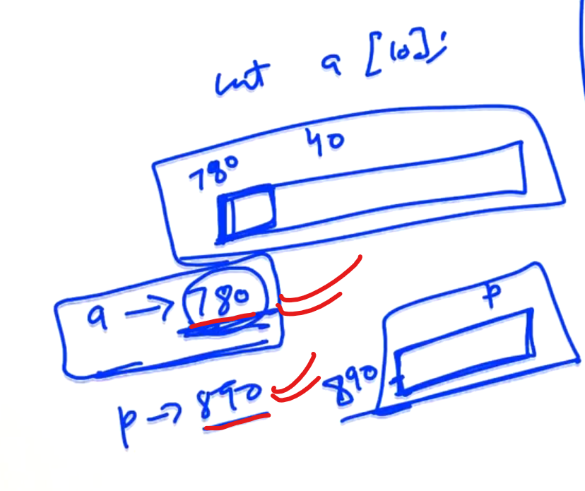

```
cout << a << endl;
cout << &a << endl;

Note:
Both will give the same result i.e. 780. Since, there is no other 
memory for "a" other than this... 
```

Example:

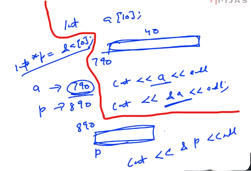

In <mark>int *p = &a[0];</mark> there is extra 8 bytes allocated because of Pointer... but in case of "a" there is no extra space allocated...

    cout << &p << endl;
    Will print different because "p" contains differnet memory...

3. Array can't be reassigned...  

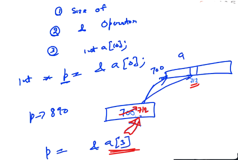

In symbol table we can't change any thing....

a = a+3 (NOT POSSIBLE...) i.e. Array can't be reassigned... 

(OR)

"a" cann't assign to any pointer... but p = a

--

EXAMPLE:

```cpp
//Example to show "a" is basically just the address of "a[0]"
#include<iostream>
using namespace std;
int main()
{
    int a[10];
    cout << a << endl;
    cout << &a[0] <<endl;

    cout << a[0] << endl;   //Shows Garbage Value

    a[0] = 5;
    a[1] = 10;
    cout << *a << endl; //De-referencing and get zeroth element
    cout << *(a+1) << endl;

    int* p = &a[0];

    cout << a << endl;  //line1
    cout << p << endl;

    //SEE NEXT LINES
    cout << &p << endl;
    cout << &a << endl; //line2

    // line1 and line2 have the same address...


    //sizeof concept
    cout << sizeof(p) << endl;
    cout << sizeof(a) << endl;

    //SEE Next LINES

    p = p + 1;
    // a = a + 1; 
// (Shows Error... Not Possible because corresponding to array 
// we can't change (OR) "a" can't reassign...)  
    return 0;
}
```

Output:

0x7ffe451cad60
0x7ffe451cad60
1697936104
5
10
0x7ffe451cad60
0x7ffe451cad60
0x7ffe451cad58
0x7ffe451cad60
8
40

-----

## 6.Characters and pointers

```cpp
#include<iostream>
using namespace std;
int main()
{
    int a[] = {1, 2, 3};
    char b[] = "abc";
    cout << a << endl;
    cout << b << endl;
    return 0;
}
```

Output:

0x7ffcdcb4f668
abc

--

```cpp
// Contd... 
// How character pointers are behaving different than Integer Pointers
#include<iostream>
using namespace std;
int main()
{
    int a[] = {1, 2, 3};
    char b[] = "abc";
    cout << a << endl;
    cout << b << endl;

    char *c = &b[0];
    cout << c << endl;

    char c1 = 'a';
    char* pc = &c1;

    cout << c1 << endl;
    cout << pc << endl;
    return 0;
}
```

Output:

0x7ffe0db7a128
abc
abc
a
a4��

--

```cpp
char str[] = "abcde";    //String Array
here, firstly create a temporary memory where "abcde" get stored and
then make an array which consist of 6 Elements including (NULL i.e. \0)
(i.e. Temporary memory ki copy bani hai... aaur humare liye memory 
allocate hui hai... and we are using it...)

and

char* pstr = "abcde";
Firstly make an Temporary Memory to store "abcde" and the pointer "pstr"
which will points this Temporary Memory... This is WRONG... may be leads 
to ERROR...
```

---------

## 8.Pointers and functions

**<u>Functions in Pointer</u>**:

Example:

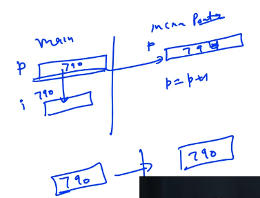

Here , increment's "p" has copied Address of main's "p"... so any change in the address of increment's "p" will not going to impact in the address of the main's "p". So, the Address will remain same...

```cpp
#include<iostream>
using namespace std;

void print(int *p)
{
    cout<<*p<<endl;
}

void incrementPointer(int *p)
{
    p = p+1;
}

int main()
{
    int i = 10;
    int *p = &i;
    print(p);

    cout << p << endl;
    incrementPointer(p);
    cout << p << endl;
    return 0;
}
```

Output:

10
0x7ffe61114c4c
0x7ffe61114c4c

--

Example:

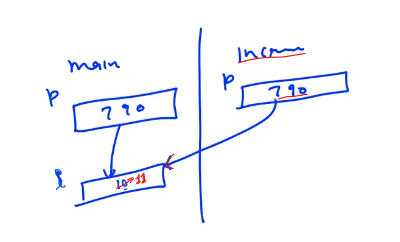

main's "p" and increment's "p", both have the same Address...

Here,  we change the value... pointed by "p"

```cpp
#include<iostream>
using namespace std;

void print(int *p)
{
    cout<<*p<<endl;
}

void incrementPointer(int *p)
{
    p = p+1;
}

void increment(int *p)
{
    (*p)++;
}

int main()
{
    int i = 10;
    int *p = &i;
    print(p);

    cout << p << endl;
    incrementPointer(p);
    cout << p << endl;

    cout << *p << endl;
    increment(p);
    cout << *p << endl;

    return 0;
}
```

Output:

10
0x7ffc95869c6c
0x7ffc95869c6c
10
11

--

**<u>Functions in Array</u>**:

Example:

Array "<mark>a</mark>" goes as a Pointer in sum(<mark>int a[ ]</mark>, int size) not as an Array...

"sizeof" in case of Pointer gives "8" 

```cpp
#include<iostream>
using namespace std;

int sum(int a[], int size)
{
    cout << sizeof(a) << endl;  //return size of Pointer i.e. 8
    return 0;
}

int main()
{
    int a[10];
    cout << sizeof(a) << endl;  
    //return size of Array i.e. 40 in this case
    return 0;
}
```

-

```cpp
// Return garbage sum of 10 Elements...
#include<iostream>
using namespace std;

int sum(int * a, int size)
{
    int ans = 0;
    for(int i = 0; i < size; i++)
    {
        ans += a[i];
    }
    return ans;
}

int main()
{
    int a[10];
    cout << sizeof(a) << endl;
    cout << sum(a,10) << endl;
    return 0;
}
```

OUTPUT:
40
-953531283

--

<mark>a[5]</mark>    =>    <mark>*(a+5)</mark>

**<u>Conclusion</u>**:

Hum Arrays ko pass kar sakte hai... aaur wo effecctively Pointer ki tarah pass hoga...

--

```cpp
#include<iostream>
using namespace std;

int sum(int * a, int size)
{
    int ans = 0;
    for(int i = 0; i < size; i++)
    {
        ans += a[i];
    }
    return ans;
}

int main()
{
    int a[10];
    cout << sizeof(a) << endl;

    // Passing part of an Arrary to the function
    cout << sum(a+3,7) << endl;
    return 0;
}
```

--------------

## 10.Double pointer

~~02:43~~

Double Pointers are the Pointers storing the Address of other pointers...

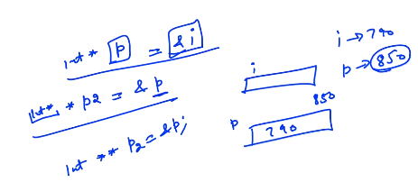

-

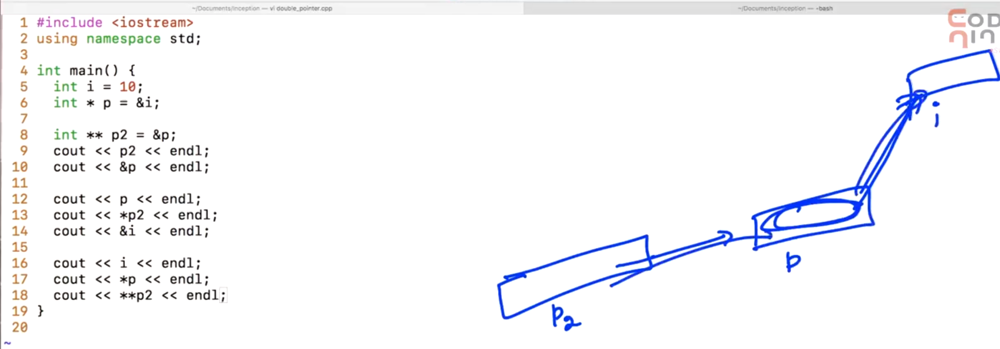

-

```cpp
#include<iostream>
using namespace std;
int main()
{
    int i =10;
    int *p = &i;

    int **p2 = &p;
    cout << p2 << endl;
    cout << &p << endl;
    return 0;
}
```

Output:

0x7ffd25866248
0x7ffd25866248

--

```cpp
#include<iostream>
using namespace std;
int main()
{
    int i = 10;
    int *p = &i;

    int **p2 = &p;
    cout << p2 << endl;
    cout << &p << endl;

    cout << p << endl;
    cout << *p2 << endl;
    cout << &i << endl;

    cout << i << endl;
    cout << *p << endl;
    cout << **p2 << endl;
    return 0;
}
```

Output:

0x7fff646ebb18
0x7fff646ebb18
0x7fff646ebb14
0x7fff646ebb14
0x7fff646ebb14
10
10
10

--

Example: (contd.)

```cpp
#include<iostream>
using namespace std;

void increment1(int** p)    //Case - 1
{
    p = p + 1;
}

void increment2(int** p)    //Case - 2
{
    *p = *p + 1;
}

void increment3(int** p)    //Case - 3
{
    **p = **p + 1;
}

int main()
{
    int i = 10;
    int *p = &i;

    int **p2 = &p;
    cout << p2 << endl;
    cout << &p << endl;

    cout << p << endl;
    cout << *p2 << endl;
    cout << &i << endl;

    cout << i << endl;
    cout << *p << endl;
    cout << **p2 << endl;
    return 0;
}
```

Case - 1 (Not Working)

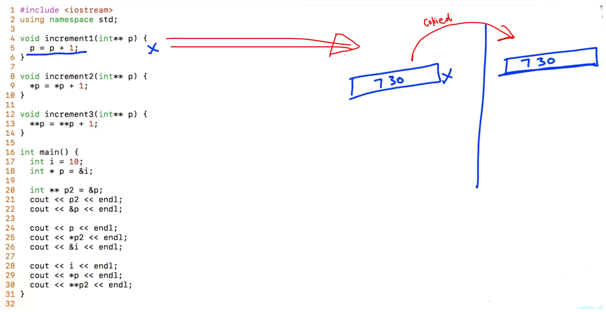

Case - 2 (Working)

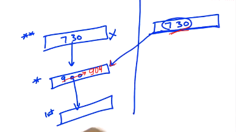

Case - 3 (Changes will reflect)

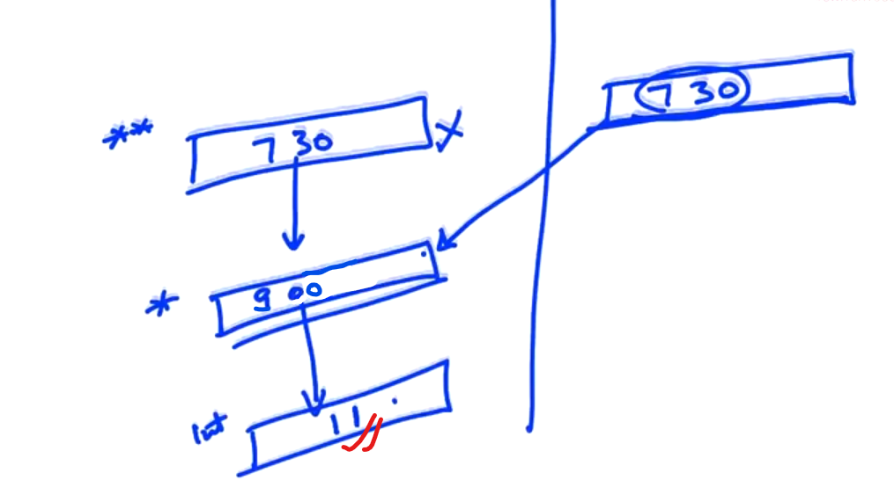

------------------------------
