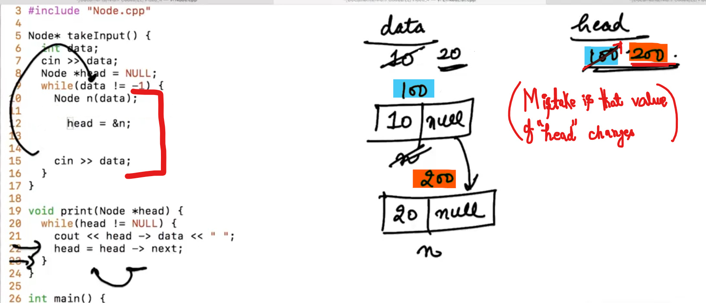
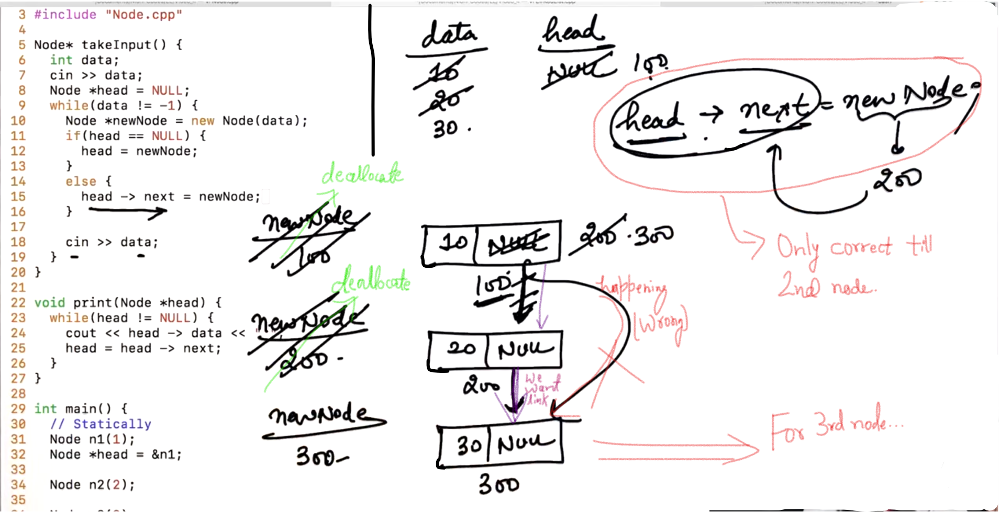
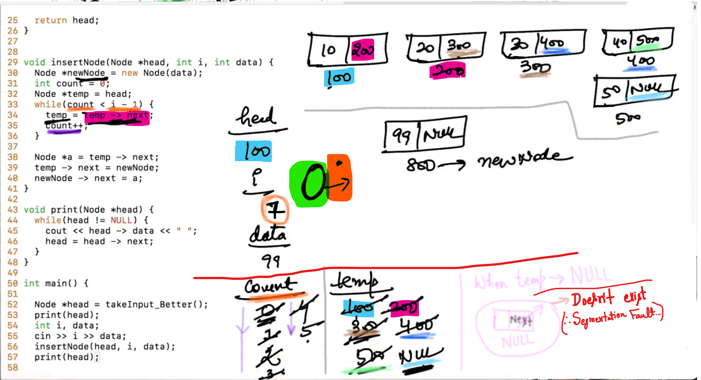

## 0.What are Data Structures

Data  Structures are the way to store the Data....

-----------

## 1.What is Linked List

If we want to store Data, there are two ways:

1. Variable ()

2. Array (To store a set of elements)

**<u>Note</u>**:

- Size of Array is Fixed...

- Array is continuous, so that we can't extend size of the Array... (Athough we can remove this problem using Dynamic Arrays)

To remove this issue we have created a New Data Structure named as "Linked List"


--

Linked List: List of elements which is connected together... i.e.


1 stores address of 2

2 stores address of 3

3 stores address of 4


-


-

<u>Note</u>:

The number of objects of class node are same as the number of elements in the Linked List...

<mark>Node *head = &n1;</mark>        =>        Here, we **haven't** created a new node, we just created a pointer variable (of 8 Bytes) of head type... (To store the Address of n1)

-

"head" is a pointer variable...


// We want to print n1 and n2 with the help of "head":

<mark>cout << head -> data;</mark>

------------

## 2.Print the Linked List


-

```cpp
// From above discussions:
#include<iostream>
using namespace std;

class Node{
    public:
    int data;
    Node *next;

    Node(int data){         //Constructor
        this -> data = data;
        next = NULL;
    }
};

int main(){
    // Statically
    Node n1(1);
    Node *head = &n1;

    Node n2(2);

    n1.next = &n2;      //Nodes n1 and n2 is now connected... 

    cout << n1.data << " " << n2.data << endl;

    // Dynamic Allocation
    Node *n3 = new Node(10);
    Node *head2 = n3;

    Node *n4 = new Node(20);
    n3 -> next = n4;

}
```

<u>Output</u>:

1 2

-

Make a linked list of 5 nodes


-


-


-


Note:

1. Whenever we want to travel in the whole list then the condition will be: 
   
   <mark>(head != NULL)</mark> 

2. If we want to stop at the last Node then the condition will be: 
   
   <mark>(head -> next != NULL)</mark>

-

```cpp
// Example having problem: (SEE Note)

#include<iostream>
using namespace std;

class Node{
    public:
    int data;
    Node *next;

    Node(int data){         //Constructor
        this -> data = data;
        next = NULL;
    }
};

void print(Node *head){
    // while(head -> next != NULL){  // This will show ERROR...
    while(head != NULL){
        cout << head -> data << " ";
        head = head -> next;
    }

    // After passing the "while" loop ; "head" becomes "NULL"

    /*
    while(head != NULL){
        cout << head -> data << " ";
        head = head -> next;
    }
    // So only print one time... After again using the "while" loop...
    // since, we are getting out of the "while" loop...
    */

    /*
    NOTE: Here, we lost address of the first "Node", We can't access 
    the list again... so, ideally we need to make a Temporary pointer
    */
}

int main(){
    // Statically
    Node n1(1);
    Node *head = &n1;

    Node n2(2);

    Node n3(3);
    Node n4(4);
    Node n5(5);

    n1.next = &n2;
    n2.next = &n3;
    n3.next = &n4;
    n4.next = &n5;

    print(head);

}
```

<u>Output</u>:

1 2 3 4 5 

-

Problem: In above example, we have lost address of the first "Node", We can't access the list again... so, ideally we need to make a Temporary pointer...

-

```cpp
// Solution of the previous program

#include<iostream>
using namespace std;

class Node{
    public:
    int data;
    Node *next;

    Node(int data){         //Constructor
        this -> data = data;
        next = NULL;
    }
};

void print(Node *head){
    Node *temp = head;        //Temporary Pointer

// Here, we called "while" loop twice:

    while(temp != NULL){                    //1st while
        cout << temp -> data << " ";
        temp = temp -> next;
    }
    cout << endl;
    temp = head;                //SEE
    while(temp != NULL){                        //2nd while
        cout << temp -> data << " ";
        temp = temp -> next;
    }
}

int main(){
    // Statically
    Node n1(1);
    Node *head = &n1;

    Node n2(2);

    Node n3(3);
    Node n4(4);
    Node n5(5);

    n1.next = &n2;
    n2.next = &n3;
    n3.next = &n4;
    n4.next = &n5;

    print(head);

}
```

Output:

1 2 3 4 5 
1 2 3 4 5 

-


-

<u>Note</u>:

In main(), "head" is unchanged because main() had passed head's value and our function had made a new "head" pointer and in it copied the value of main()'s "head"...

So, any change in the functions's "head", won't affect the main's "head"


Here in above case print() function called two times...

```cpp
// From the above example: called print() function twice:

int main(){
    // Statically
    Node n1(1);
    Node *head = &n1;

    Node n2(2);

    Node n3(3);
    Node n4(4);
    Node n5(5);

    n1.next = &n2;
    n2.next = &n3;
    n3.next = &n4;
    n4.next = &n5;

    print(head);        //SEE
    cout << endl;
    print(head);        //SEE

}
```

<u>Output</u>:

1 2 3 4 5 
1 2 3 4 5 

--------------------

## 4.Take Input - 1

Here, we are going to take the input "-1" as terminator...



-


We need to create each "node" dynamically...



-


-


-

```cpp
// Example to take multiple values:

#include<iostream>
using namespace std;

class Node{
    public:
    int data;
    Node *next;

    Node(int data){         //Constructor
        this -> data = data;
        next = NULL;
    }
};

Node* takeInput(){
    int data;
    cin >> data;
    Node *head = NULL;
    while(data != -1){
        Node *newNode = new Node(data);     // Dynamically
        // Node n(data);           // Statically created
        if(head == NULL){
            head = newNode;
        }
        else{
            Node *temp = head;
            while(temp -> next != NULL){
                temp = temp -> next;
            }
            temp -> next = newNode;
        }

        cin >> data;
    }
    return head;
}

void print(Node *head){
    while(head != NULL){
        cout << head -> data << " ";
        head = head -> next;
    }
}

int main(){

    Node *head = takeInput();
    print(head);
}
```

<u>Output - 1</u>: 

78
4
65
-1
78 4 65 

<u>Output - 2</u>: (By me)

45 86 96 -1 75
45 86 96 

<u>Note</u>:

"-1" is not part of the linked list... This only indicates that we don't want to use more inputs...

------------------

## 5.Take Input - 2


no. of nodes => "n"

For "<mark>n</mark>th" nodes, we need to do (n-1) comparisions...


Solution: (Improvement)


-

So, the complexity of the function is order of "n" for inserting "n" nodes i.e.   O(n)

```cpp
// Example: (Above Discussed)

#include<iostream>
using namespace std;

class Node{
    public:
    int data;
    Node *next;

    Node(int data){         //Constructor
        this -> data = data;
        next = NULL;
    }
};

Node* takeInput_Better(){
    int data;
    cin >> data;
    Node *head = NULL;
    Node *tail = NULL;
    while(data != -1){
        Node *newNode = new Node(data);     // Dynamically
        if(head == NULL){
            head = newNode;
            tail = newNode;
        }
        else{
            tail -> next = newNode;
            tail = tail -> next;
            // or
            // tail = newNode;
        }

        cin >> data;
    }
    return head;
}

void print(Node *head){
    while(head != NULL){
        cout << head -> data << " ";
        head = head -> next;
    }
}

int main(){

    Node *head = takeInput_Better();
    print(head);
}
```

<u>Output</u>:

65
74
1
-1
65 74 1 

------------------

## 8.Insert node at ith position

Place 100 in 2nd index of the Array...


-


"i" is the position...


-


If we want to insert "99" between index 1 and 2

We should know the Address of the "i - <u>Previous Node</u>" 


we need to use: <mark>count < i - 1</mark> so that we will get address of index "1".


**<u>Problem</u>**:

Because of <mark>temp -> next =newNode;</mark> node of index "1" starts pointing to the new node and we lost the Address of the Node with index "2"

**<u>Solution</u>**:

<u>Case</u>: II

We can store the Address of the Node with index "2" in a new Variable...

-


<u>Case</u>: I

Either we can store the Address of the Node with index "2" **in** block (i.e. newNode) of Address 800


-

```cpp
// Example from Above Discussed:
#include<iostream>
using namespace std;

class Node{
    public:
    int data;
    Node *next;

    Node(int data){         //Constructor
        this -> data = data;
        next = NULL;
    }
};

Node* takeInput_Better(){
    int data;
    cin >> data;
    Node *head = NULL;
    Node *tail = NULL;
    while(data != -1){
        Node *newNode = new Node(data);     // Dynamically
        if(head == NULL){
            head = newNode;
            tail = newNode;
        }
        else{
            tail -> next = newNode;
            tail = tail -> next;
            // or
            // tail = newNode;
        }

        cin >> data;
    }
    return head;
}

void insertNode(Node *head, int i, int data){       //SEE
    Node *newNode = new Node(data);
    int count = 0;
    Node *temp = head;      // Here, we have created a temporary variable
    while(count < i - 1){
        temp = temp -> next;
        count++;
    }

    Node *a = temp -> next;
    temp -> next = newNode;
    newNode -> next = a;            //Case - II used
}

void print(Node *head){
    while(head != NULL){
        cout << head -> data << " ";
        head = head -> next;
    }
}

int main(){

    Node *head = takeInput_Better();
    print(head);

    int i, data;
    cin >> i >> data;
    insertNode(head, i, data);
    print(head);
}
```

<u>Output - 1</u>:

1 2 3 4 5 -1
1 2 3 4 5 
2 99
1 2 99 3 4 5 

<u>Output - 2:</u>

1 2 3 4 5 -1
1 2 3 4 5 
7 99
Segmentation fault: 11

-

Reason of Segmentation Fault:



We cann't acccess the NULL memory...

Either in ( . i.e. dot operator) or ( -> ), we need to make sure object or variable before dot(.) or arrow(->) <mark>shouldn't</mark> be <mark>NULL</mark>...

<mark><u>NULL</u> -> next</mark>     =>    shows segmentation fault...

--

Error Discussion: (When i = 0)

When "newNode" get insert at 1st position...


"newNode" get insert at 1st position... which is Wrong.....

solution:  

```cpp
 if(i == 0){
        newNode -> next = head;

  //Now for the first node of the updated linked list
        head = newNode;

 //changes in the "head" happens in the local
 //Now we have to return updated "head" value to main()
        return head;
    }
```

Since we are returning "head", so that we have to change the return type also... from <mark>void</mark> to <mark>Node*</mark>.

    void insertNode(Node *head, int i, int data){ 
    
    to
    
    Node* insertNode(Node *head, int i, int data){ 

-

```cpp
// Correct program (Above Discussed)

#include<iostream>
using namespace std;

class Node{
    public:
    int data;
    Node *next;

    Node(int data){         //Constructor
        this -> data = data;
        next = NULL;
    }
};

Node* takeInput_Better(){
    int data;
    cin >> data;
    Node *head = NULL;
    Node *tail = NULL;
    while(data != -1){
        Node *newNode = new Node(data);     // Dynamically
        if(head == NULL){
            head = newNode;
            tail = newNode;
        }
        else{
            tail -> next = newNode;
            tail = tail -> next;
            // or
            // tail = newNode;
        }

        cin >> data;
    }
    return head;        //see
}

Node* insertNode(Node *head, int i, int data){       //SEE
    Node *newNode = new Node(data);
    int count = 0;
    Node *temp = head;  // Here, we have created a temporary variable...

    if(i == 0){
        newNode -> next = head;
        head = newNode;
        return head;            //see
        //because we have changed the return type
    }

    while(temp != NULL && count < i - 1){       //See
        temp = temp -> next;
        count++;
    }

    if(temp != NULL){                   //see
        Node *a = temp -> next;
        temp -> next = newNode;
        newNode -> next = a;            //Case - II used
    }
    return head;         //because we have changed the return type
}

void print(Node *head){
    while(head != NULL){
        cout << head -> data << " ";
        head = head -> next;
    }
}

int main(){

    Node *head = takeInput_Better();
    print(head);

    int i, data;
    cin >> i >> data;
    head = insertNode(head, i, data);   //SEE
    print(head);
}
```

<u>Output</u>:

54 96 34 -1
54 96 34 
0 11
11 54 96 34 

<u>Output</u>:

1 2 3 4 -1
1 2 3 4 
0 55
55 1 2 3 4 

-

<u>Note</u>: 

We are returning "head" only when we insert "Node" at "zeroth" index... because only in this case our "head" changes... so we need to return the updated 'head'.

------------

## 9.Delete Node at ith position


We want to delete Node 3

<u>Solution</u>:

Rather than pointing to the "2 to 3"; start points to "2 to 4"


We have created each Node of the linked list dynamically... So, its our responsibility to deallocate each node of the linked list... using <mark>delete</mark> keyword...

-----------

## 12.Insert node recursively

<u>Steps</u>:

We are breaking our problems into two parts i.e. "1" and "n-1" . We need to work in "head" node and the rest linked list will work by Recursion...

-

Case - I (When i = 0)


When we need to insert node at zeroth index i.e. i = 0; We have to create a new node with the required data... and then attach new node with "head" then update "head" and then return "head". 

-

Case - II (When i is not equal to 0)

Tell recursion... to insert node at required position in the respected linked list...


-


------------

## 14.Delete node recursively

<u>Recursion steps</u>:

1. Base Case

2. Our calculation

3. Recursion call

<u>Base Case</u>:

When (head == NULL), simply return NULL...

<u>Case - I</u>: (When i = 0 )

- update head

- Deallocate the Node (having index 0) and return the updated head...

<u>Case - II</u>: (When i is not equal to 0)


x => variable will receive to address of the updated head (from the linkage list of Recursion...) after deleting the required node...

After deleting the required node, we should return the updated head....

----------------
