## 0.Find a Node in Linked List[HINT]

e.g:

- If 15 is present in multiple time, then return the first occurance...

- If the number is not present in the Linked List, then return -1 (-1 is not a valid index...)

 curr ->  which is pointing to head node... (current pointer)

When we found x = 15, we will simply return count....

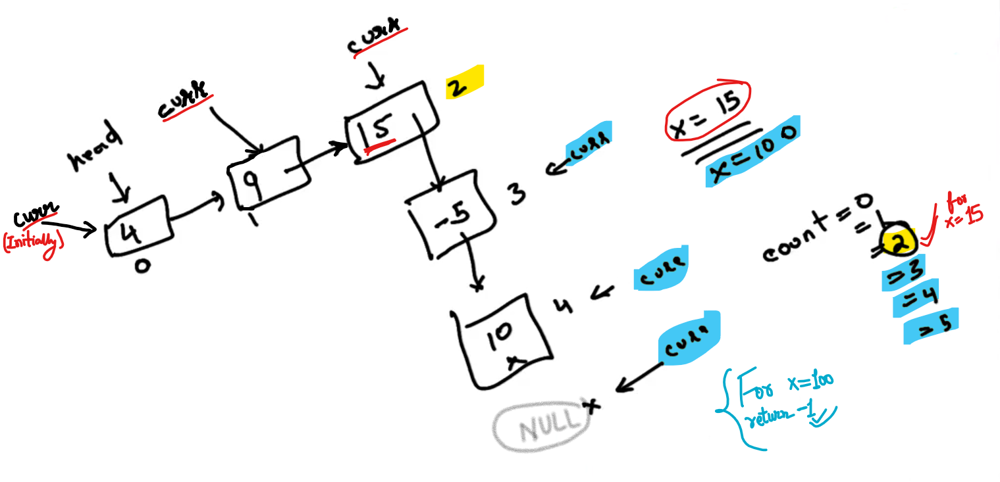

For x = 100, we are not able to find 100 in the Linked List (Invalid Index), so return -1.

--------

## 1.AppendLastNToFirst[HINT]

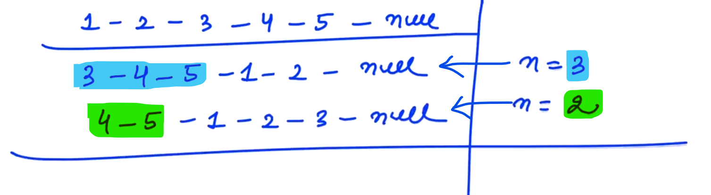

-

cur -> current pointer (which starts from head)

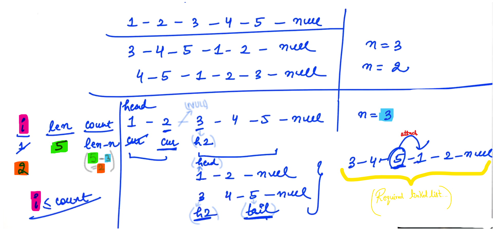

cur -> Next      =>         NULL

- figure out the address of tail... then attach head (which consist value "1") in the "next of tail"... And we will get required Linked list... and "3" (i.e. h2) is the final updated head which we need to return (i.e. return value of head2 (h2)).

-----

## 2.Eliminate duplicates from LL[HINT]

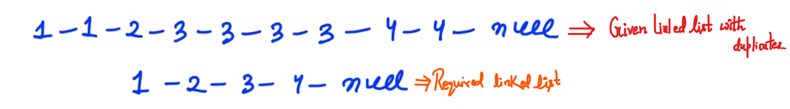

<u>Result</u>:

Output list after updation should have unique elements... 

<u>Steps</u>:

- Check (head == NULL) and (head -> Next == NULL)
  
  - If (head -> Next == NULL) represents linked list length is "1"

- Maintain two variables "t1" and "t2"

- "t1" should initialise to head and "t2" should be initialise to " head -> Next ".

- Compare that "t1" and "t2" data is same or not...

- If t1 and t2 are not equal then connect "t1" and "t2"
  
  After certain loop operations, stops when (t2 == NULL)
  
  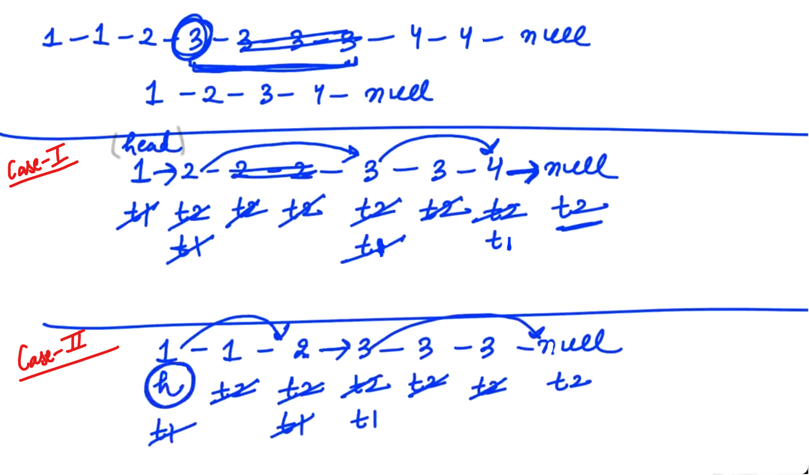
  
  For Case - II: (Compulsory) we need to write <mark>t1 -> Next = t2;</mark> 

Then we should return our previous "head" as it is...

--

<u>NOTE</u>:

In Java, we don't need to explicitily deallocate the Nodes, there is a Garbage Collector which automatically work for us...

But in cpp, the nodes that we don't require... we should deallocate that nodes simultaneously....

-------------------------------------

## 3.Print Reverse LinkedList[HINT]

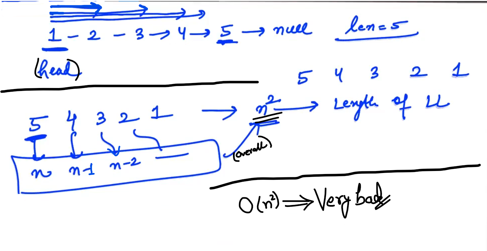

"n"    =>     length of linked list

-

Time Complexity    =>    n^2 

because for printing 1st element: we travel in "n" nodes

for printing 2nd element: we travel in "n-1" nodes

SImilarly, for printing 3rd element: we travel in "n-2" nodes and So on....

-

We can move in backward direction with the help of Recursion...

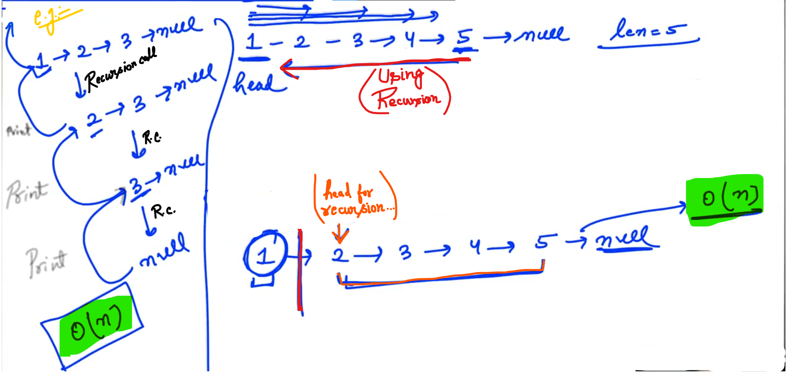

Base Case: (head == NULL), we should return simply...

--------------

## 4.Palindrome LinkedList[HINT]

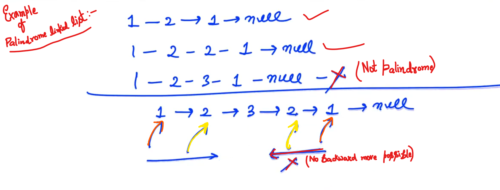

-

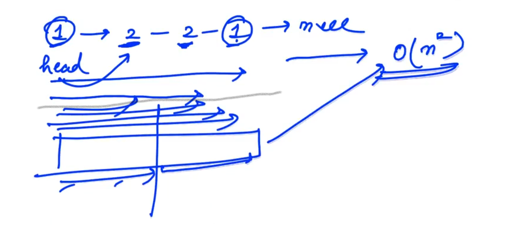

Everytime we need to travel from 1st to last... 

So, the Time Complexity is O(n^2)

-

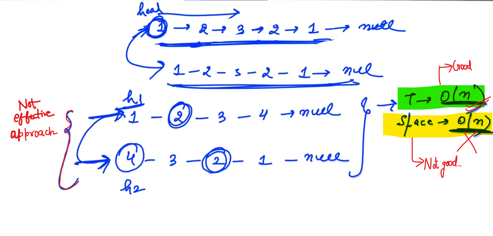

- We get "head" from user,  and Whenever we reverse the Linked List; we reverse the SAME linked list... So, that we lost our original list... and we will got wrong answer...

- Now, for each element we will make new Node, and then we will connect all nodes one-by-one to form new linked list and then we will reverse it and then compare it with the original one...

- Time Complexity is good i.e. O(n) but Space complexity is not so good i.e. O(n^2). So, we need to find good approach...

--

Case - I: (When length of linked list is EVEN)

e.g:     1-2-2-1-NULL

- Dividing at mid point, reverse the second linked list (second half part) and now compare new second linked list with the first half... if comparison done then return True else False...

Case - II:(When length of linked list is ODD)

- Figure out the mid point, break the linked list from the mid point... create 2 separate linked lists, Now, reverse the second half and then compare element-by-element...

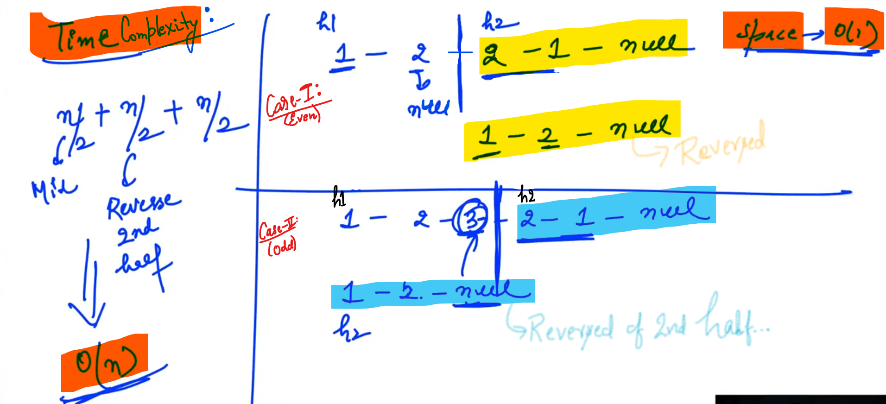

Space complexity:    O(1)

-

Time Complexity:     O(n)

- We calculated the <mark>mid point</mark>... so, time taken is n/2

- We break the linked list from Mid point then <mark>reverse the second half</mark>, which tooks n/2 time (if linked list length is "n" then length of second half is "n/2" so reversing it tooks n/2 time...)

- we <mark>compare</mark> both first half and second half element-by-element which tooks n/2 time. 

Here, above method is highly optimised from both complexity of Time and Space...

------------------------

