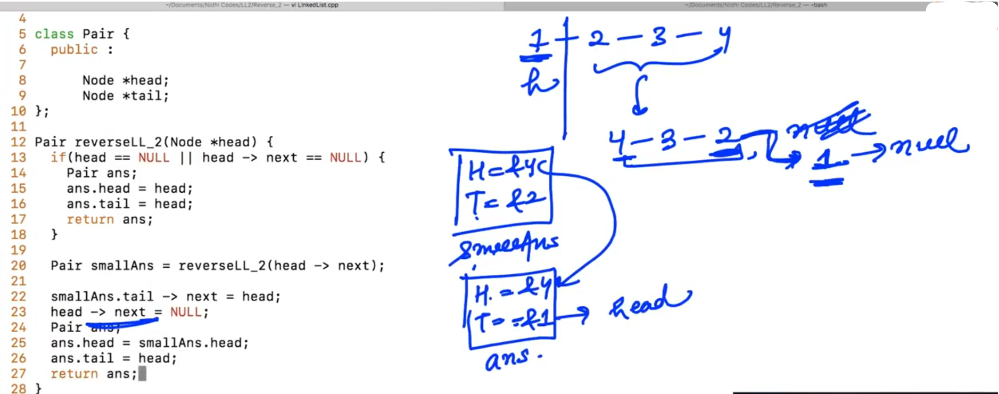

## 0.Midpoint of LL


--

Calculate the Mid without finding the length of the linked list...

1. In case of Odd linked list length:


In <mark>fast = fast -> next -> next;</mark> :         <mark>fast</mark> and <mark>fast -> next</mark> should not be NULL...

At fast == NULL;     =>    stop

-

2. In case of Even linked list length:


Program will crash in <mark>fast = fast -> next -> next</mark> at <mark>fast -> next</mark> i.e. <mark>NULL -> next;</mark> 

--------------

## 2.Merge Two Sorted Linked Lists

Merge two sorted linked list such that final linked list should be sorted...

Example:

fH    =>    Final Head

fT    =>    Final Tail

These pointers represents the final merged linked list's Head and Tail...


return final head (fH) which is pointing to fist node of Final sorted linked list...

----

## 4.Merge Sort

Here, we are given random order linked list and we need to sort that linked list using merge sort...


Steps:

Initially, We are dividing the linked list into two parts continuously till the length of the linked list becomes "1". When length of Linked list becomes "1" it means our linked list is sorted... Now, merge the linked lists... and finally we get our final input list which is sorted...


Finally, return the updated head...

--------------

## 7.Reverse LL (Recursive)

Reverse Linked list using Recursion...

Base Case:    If the length of the linked list is "Zero" or "1" then we simply return.  


smallAns        =>    Temporary pointer to receive "head" of the reversed linked list (of size (n-1)) that we get after Recursive Call...

 Now, figure out the last node of the linked list (which got from recursion) and Attach "head" at the last node... and attach NULL next to "head" (i.e. "1" - According to the example...) And retrun the address which is store at "smallAns".

-

```cpp
// Example from Above Discussed:
#include<iostream>
using namespace std;

class Node{
    public:
    int data;
    Node *next;

    Node(int data){         //Constructor
        this -> data = data;
        next = NULL;
    }
};

Node* reverseLL(Node *head){
    if(head == NULL || head -> next == NULL){
        return head;
    }

    Node *smallAns = reverseLL(head -> next);   
    // list of (n-1) size get reversed

    Node *temp = smallAns;
    while(temp -> next != NULL){
        temp = temp -> next;
    }

    temp -> next = head;
    head -> next = NULL;
    return smallAns;
}

Node* takeInput_Better(){
    int data;
    cin >> data;
    Node *head = NULL;
    Node *tail = NULL;
    while(data != -1){
        Node *newNode = new Node(data);     // Dynamically
        if(head == NULL){
            head = newNode;
            tail = newNode;
        }
        else{
            tail -> next = newNode;
            tail = tail -> next;
            // or
            // tail = newNode;
        }

        cin >> data;
    }
    return head;
}

void print(Node *head){
    while(head != NULL){
        cout << head -> data << " ";
        head = head -> next;
    }
}

int main(){

    Node *head = takeInput_Better();
    head = reverseLL(head);
    print(head);
}
```

Output:

1 2 3 4 5 -1
5 4 3 2 1 

-

Dry run:


------------

## 8.Reverse LL (Recursive) - Double Node

(From Previous Example)

<u>Complexity</u>:

We need to reverse list of "n" size;

Firstly we are calling recursion on list of (n-1) size... and (n-1) iteration on running loop


Complexity will be: O(n^2)

--

Better Method:


We want to return Multiple parameters using functions...

Instead of returning the "head", we want to return class of the object... so we can get - "head" and "tail".



-

```cpp
// Example from Above Discussed: // Method - 2 (Better)
#include<iostream>
using namespace std;

class Node{
    public:
    int data;
    Node *next;

    Node(int data){         //Constructor
        this -> data = data;
        next = NULL;
    }
};

class Pair {
    public :

        Node *head;
        Node *tail;
};

Pair reverseLL_2(Node *head){
    if(head == NULL || head -> next == NULL) {
        Pair ans;
        ans.head = head;
        ans.tail = head;
        return ans;
    }

    Pair smallAns = reverseLL_2(head -> next);   

    smallAns.tail -> next = head;
    head -> next = NULL;
    Pair ans;
    ans.head = smallAns.head;
    ans.tail = head;
    return ans;
}

Node* reverseLL_Better(Node *head){
    return reverseLL_2(head).head;
}

/*
Node* reverseLL(Node *head){
    if(head == NULL || head -> next == NULL){
        return head;
    }

    Node *smallAns = reverseLL(head -> next);   
    // list of (n-1) size get reversed

    Node *temp = smallAns;
    while(temp -> next != NULL){
        temp = temp -> next;
    }

    temp -> next = head;
    head -> next = NULL;
    return smallAns;
}
*/
Node* takeInput_Better(){
    int data;
    cin >> data;
    Node *head = NULL;
    Node *tail = NULL;
    while(data != -1){
        Node *newNode = new Node(data);     // Dynamically
        if(head == NULL){
            head = newNode;
            tail = newNode;
        }
        else{
            tail -> next = newNode;
            tail = tail -> next;
            // or
            // tail = newNode;
        }

        cin >> data;
    }
    return head;
}

void print(Node *head){
    while(head != NULL){
        cout << head -> data << " ";
        head = head -> next;
    }
}

int main(){

    Node *head = takeInput_Better();
    head = reverseLL_Better(head);
    print(head);
}
```

Output:

1 2 3 4 5 -1
5 4 3 2 1 

-

Dry Run:


-

Complexity:

We need to reverse list of "n" size;

Firstly we are calling recursion on list of (n-1) size... and Performing some constant task "k"


Complexity will be: O(n)

-------------------

## 9.Reverse LL (Recursive) - O(n)


"2" will be tail after reverse and"1" is pointing to "2" 

(Second node of the input list is the tail of reversed list of recursion)

```cpp
// Example from Above Discussed: // Method - 3 (Easy)
#include<iostream>
using namespace std;

class Node{
    public:
    int data;
    Node *next;

    Node(int data){         //Constructor
        this -> data = data;
        next = NULL;
    }
};

// Method - 3

Node* reverseLL_3(Node *head){
    if(head == NULL || head -> next == NULL){
        return head;
    }

    Node *smallAns = reverseLL_3(head -> next);   

    Node *tail = head -> next;
    tail -> next = head;
    head -> next = NULL;
    return smallAns;
}

/*
// Method - 2
class Pair {
    public :

        Node *head;
        Node *tail;
};

Pair reverseLL_2(Node *head){
    if(head == NULL || head -> next == NULL) {
        Pair ans;
        ans.head = head;
        ans.tail = head;
        return ans;
    }

    Pair smallAns = reverseLL_2(head -> next);   

    smallAns.tail -> next = head;
    head -> next = NULL;
    Pair ans;
    ans.head = smallAns.head;
    ans.tail = head;
    return ans;
}

Node* reverseLL_Better(Node *head){
    return reverseLL_2(head).head;
}
*/

/* 
// Method - 1

Node* reverseLL(Node *head){
    if(head == NULL || head -> next == NULL){
        return head;
    }

    Node *smallAns = reverseLL(head -> next);   
    // list of (n-1) size get reversed

    Node *temp = smallAns;
    while(temp -> next != NULL){
        temp = temp -> next;
    }

    temp -> next = head;
    head -> next = NULL;
    return smallAns;
}
*/
Node* takeInput_Better(){
    int data;
    cin >> data;
    Node *head = NULL;
    Node *tail = NULL;
    while(data != -1){
        Node *newNode = new Node(data);     // Dynamically
        if(head == NULL){
            head = newNode;
            tail = newNode;
        }
        else{
            tail -> next = newNode;
            tail = tail -> next;
            // or
            // tail = newNode;
        }

        cin >> data;
    }
    return head;
}

void print(Node *head){
    while(head != NULL){
        cout << head -> data << " ";
        head = head -> next;
    }
}

int main(){

    Node *head = takeInput_Better();
    head = reverseLL_3(head);
    print(head);
}
```

Output:

1 2 3 4 5 -1
5 4 3 2 1 


----------------

## 10.Reverse LL (Iterative)


-

e.g:


c    =>    current (should be "head" initially)

n    =>    next    (    <mark>next = current -> next;</mark>    )

prev    =>    previous (should be NULL initially)

"head" of final reversed list is stored in "previous". When **current reachs NULL then stop** and return "previous"...

e.g:


----------

## 12.Variations of LL

1. Singly Linked List

2. Doubly Linked List


-

**<u>Doubly Linked List</u>**:

- In Doubly linked List, every node storing own Data as well as holding the Address of the two nodes (i.e. previous node and next node). In this linked list we can travel over any Direction i.e. back and fronth... 

```cpp
// Node class structure of Doubly Linked List
Node{
    int data;
    Node *next, *prev;
}
```

- Problem with Doubly linked list is: Memory Consumption is little more...

- Memory requirement increases from 12 bytes (i.e. in Singly Linked List) to 20 bytes (Doubly linked list)

**<u>Insert Operation in Doubly Linked List</u>**:


--

3. Circular Singly Linked List:

If we want to find the length of the linked list...


- Benefit:    Now we don't need to maintain "head" node, if we have Address of <mark>any node</mark> then we can travel to whole linked list (which is not possible in Singly Linked List...)

Example: If we want to insert a node at "head" in case of Circular Singly Linked List... 


Here, Time Complexity is: O(n)

But in normal singly linked list, Time Complexity is: O(1)

--

4. Circular Doubly Linked List:


Here, Every Node has Address of "previous node" and "next node"... And last node is pointing to the first Node....

------------


