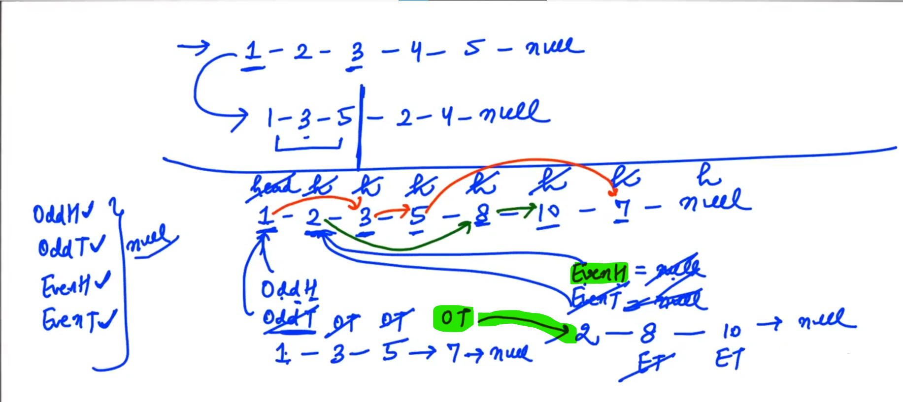
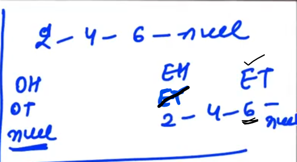
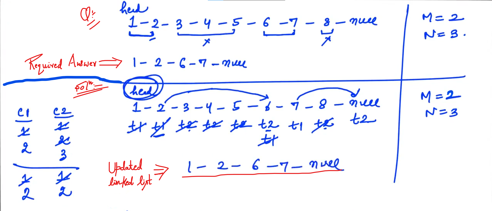
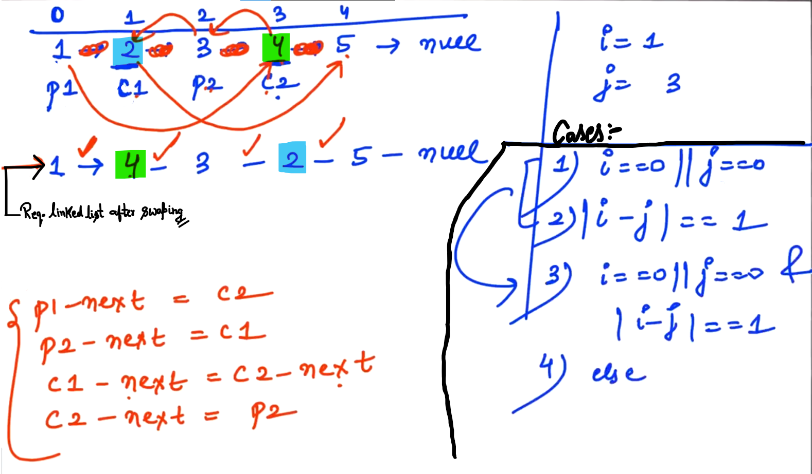
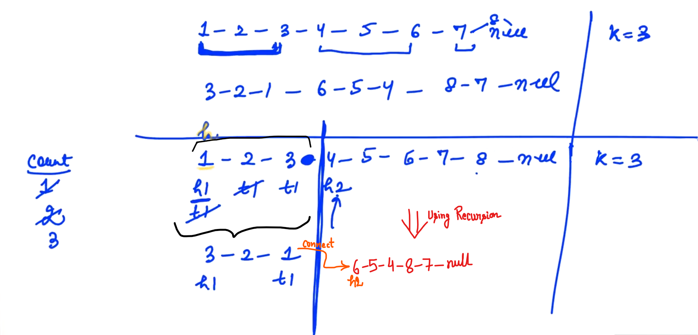
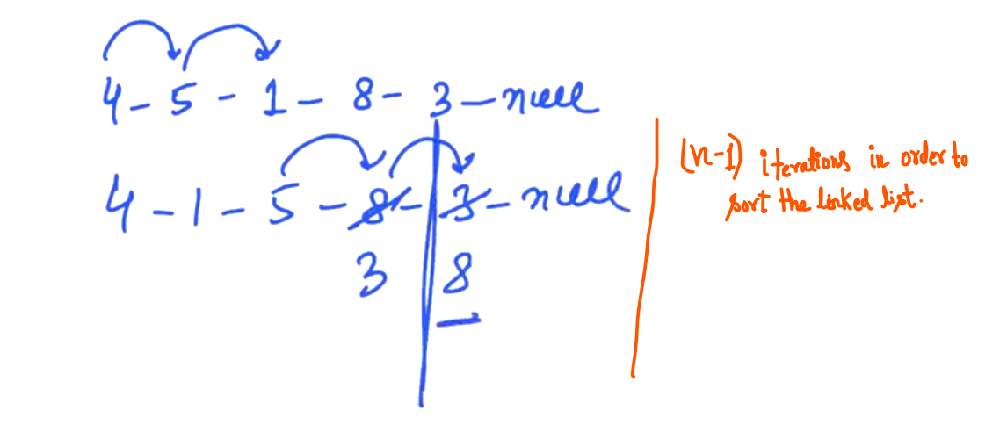
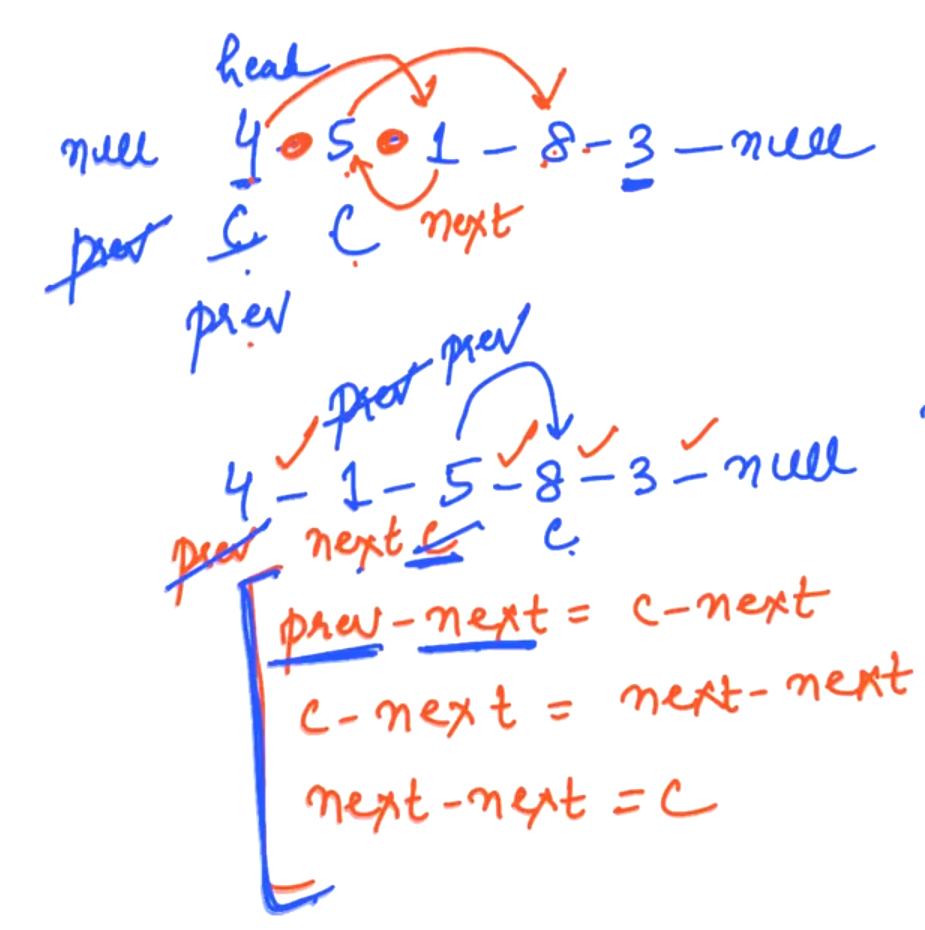
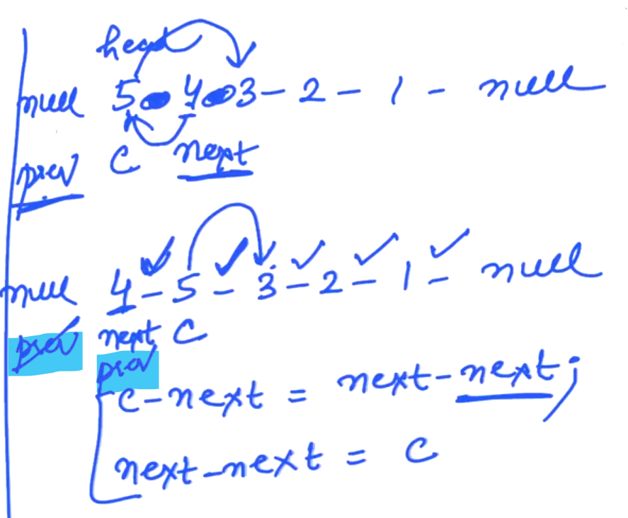
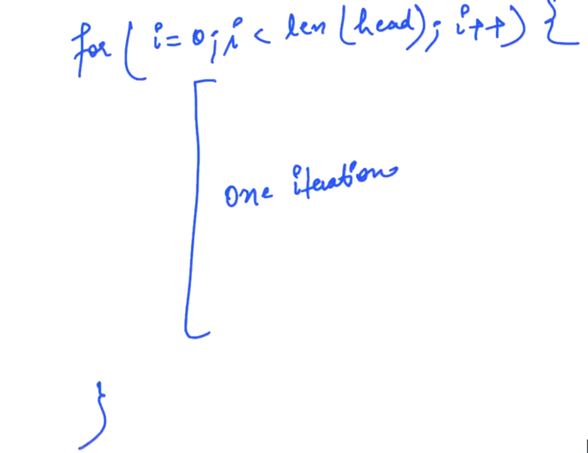

## 1.Even after Odd LinkedList[HINT]

Steps:

- Maintain two separate linked list one for Odd elements and one for Even elements...

- For maintaning, make 4 elements: 
  
  - OddH (odd head will point to head of the linked list containing odd elements)
  
  - OddT (odd tail will point to the last element of the odd linked list)
  
  - EvenH (even head point to the head of even linked list)
  
  - EvenT (even tail points to the last element of even linked list)

- When "head" reaches to NULL; put <mark>OddT -> next == NULL</mark> and <mark>EvenT -> next == NULL</mark> so both (Even linked list and Odd linked list) will break...

- Now in next of "OddT" attach "EvenH"

In case, when all elements are odd or even in the linked list...

-------------

## 2.Delete every N nodes[HINT]

After every "M" nodes, we have to delete "N" node...

c1    =>    variable count 1 (Note: c1 starts from 1 i.e. c1 = 1)

c2    =>    variable count 2 (Note: c2 starts from 1 i.e. c2 = 1)

t1    =>    temp 1 variable

t2    =>    temp 2 variable

- Now, we will check till the value of c1 (i.e. count 1) equals to "M" then we move "t1" and will update "c1"

- Now, For deleting the "N" nodes.... we have to use one more loop; where we start from "t2" which should be initialise with "t1 -> next" i.e. <mark>t2 = t1 -> next</mark> 

- Now, we will check till the value of c2 (i.e. count 2) equals to "N"; "t2" will move forward in the linked list... and we will update "c2".

Note: "t1" represents the last node of "M" and "t2" represents the last node of "N".

- Now, connect "t1" to "t2"

Note: The nodes which we are deleting in the linked list... need to delete EXPLICITILY (Explicitily Deallocate)... (Only in C++)

- Now, reset both "c1" and "c2" with 1 and "t1" should come at "t2"

- We should stop and get out of the loop when either "t1" or "t2" reaches to NULL...

- return "head" at last (if asked...)

-----

## 3.Swap two Nodes of LL[HINT]

We will get a linked list from the user and along with that we will get two integer values and at those indices we need to swap nodes...

p1    =>    previous 1

c1    =>    current 1

p2    =>    previous 2

c2    =>    current 2

<u>Steps</u>:

- <mark>p1 -> next = c2;</mark>     =>    so, "1" and "4" gets connected... and Address of "2" will get lost but it already stored in "c1".

- <mark>p2 -> next = c1;</mark>    =>    so, "3" and "2" will connected...

- We want to connect "2" and "5" (Note: Address of 3 stored in p2), therefore, <mark>c1 -> next = c2 -> next;</mark> 

- Now, we want to connect "4" and "3"     =>      <mark>c2 -> next = p2;</mark>

--

**Need to take care of 4 different cases**:

1. <mark>i == 0 || j == 0;</mark> i.e. out of 2 nodes, any one is "head" node, so we have to deal it...

2. When "i" and "j" are in alternate positions... i.e. (Swaping of nodes which are alternate to each other) <mark>|i - j| == 1</mark>.

3. Combined case of (1) and (2)     =>   <mark> i == 0 || j == 0 & |i - j| == 1</mark> (i.e. swap 1st two nodes (OR) In other words; 1st node is head and 2nd node is the alternating node...) 

4. else part (i.e. other than cases - 1, 2 and 3)

-----------------------

## 4.kReverse[HINT]

Reverse "k" elements

count    =>    It figures out "k" elements and reverse it... therefore, count = 1

"h1" and "t1" represents the head and tail of the smaller linked list.. 

Steps:

- we will check till the value of count equals to "k"; if not, then we will update tail "t1" and "count". When **count == k;** stops....

- "h2"     =>     h2 = t1 -> next;

- create a small reverse function... and ask that function to return "head" and "tail" both...

- After reversing the small linked list, now for the rest of the linked list use Recursion....

- We will tell recursion to take the value of "h2" and <mark>kReverse</mark> the rest of list...

- Getting "head" after <mark>kReverse</mark> then connect the "head" with the tail "t1"

----------

## 5.Bubble Sort (Iterative) LinkedList[HINT]

In every iteration, the largest element goes to the last...

<u>Steps</u>:    (When "prev" is not NULL)

c    =>    current

prev    =>    previous

next ("next" stores the address of "1")   =>    <mark>next = c -> next;</mark>

- prev    =>    previous ( prev == NULL )

- Maintain a "c" variable which pointing to the head variable... (current is basically pointing node where we will currently working (OR) the node which we are comparing to its next i.e. we will compare the <u>current (c)'s data</u> to <u>current(c) -> next 's data</u> )

- We should stops as soon as <mark>c -> next == NULL;</mark> 

- For connecting "4" to "1"     =>     <mark>prev -> next = c -> next;</mark> 

- For connecting "5" to "8"       =>      <mark>c -> next = next -> next;</mark> 

- For connecting "1" to "5"       =>      <mark>next -> next = c;</mark> 

--

<u>CASE</u>:  ("prev" is NULL)  

Now, when "prev" is "NULL" we should use other approach...

We should make:

c    =>    current,

prev,

next    =>    <mark>next = c-> next;</mark> 

<u>Steps</u>:

- For connecting "5" and "3"     =>     <mark>c -> next = next -> next;</mark> 

- For connecting "4" and "5"      =>    <mark>next -> next = c;</mark> 

(CHECK IT)

One iteration will complete and largest element will reach to the last...

-

All above is done for one iteration and now, we need to repeat these iterations for "n" number of times rather "n-1" number of times...

At last we need to return "head" because it got changed...

----------------

