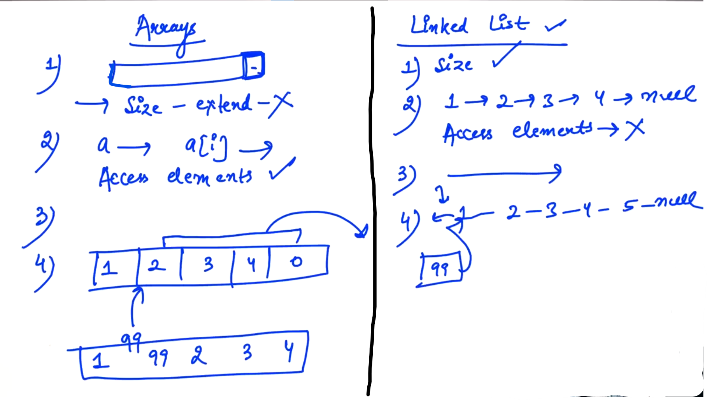

## 0.Stack Introduction

Difference between Arrays and Linked List:



-

<u>Arrays</u>:

1) Can't extend the size in case of an Array..

2) To access <mark>i</mark>th element of the Array, the time will be O(1). So, it's easy to access elements in the Array...

3) In Arrays, we can travel back and forth....

4) If we want to insert any element in the array.... So, we need to create a space for the element. so, we need to shift all elements towards Right...

-

<u>Linked List</u>:

1. No issue of size in the case of Linked List...

2. In case of Linked list, if we have a "head" and if we want to access <mark>i</mark>th element then we need to travel from "head" to "i" and then i need to access <mark>i</mark>th element... So it is little bit bad...

3. In case of "singly" linked list, it's not possible to travel back and forth... So, we can travel to only one direction i.e. forward direction...

4. Insert Elements:
   
   - At position ZERO    =>    If we want to insert element in the "head" of the Linked List... We need to make a new node... <mark>newNode -> next = head;</mark> and then update / return "head". Insertion at Zeroth (0th) position in linked list: O(1)
   
   - At <mark>i</mark>th position    =>    We need to travel till "i" but we don't need to shift the elements like in Arrays...

--

If we want to "delete" element of zeroth (0th) index element


--

**<u>Stacks</u>**:

- Stacks are also linear Data structure like Arrays and Linked list where we can store "n" number of elements...

- Stacks are "Abstract Data Type".

Abstract Data Type means in stack we can insert or delete elements in a specific order...

-

<u>Practical Examples of Stacks</u>: 

(Stack of Books, Stack of chairs)


-

In stack, there is only one entry and only one exit point...


-

**<u>Operations in the Stack</u>**:


1. If we want to "Insert" elements in the stack then that operation is called "push( )" in stack...

2. To "Delete" an element in the stack using operation called "pop( )". So, Toppest element will delete in the Stack memory... 

3. To access the top most element using operation called "top( )"

Note: top( ) only read the top most element of the stack; there is no change in the status of the stack...

4. To know the size of the stack using operation called "size( )".

since the element in the stack is 1 (in numbers) i.e. 10

5. To know that stack is empty or not using operation called "isEmpty( )". The answer should be in True or False...

since the element in the stack is 10 i.e. stack is not empty. Therfore, isEmpty => false

--

Recursion also uses stack:


-----------

## 1.Stack Using Array


Stack is also called "Last in First out" (i.e. LIFO structure) i.e. the element which is inserted at the last that element will come out first...

-

Now, we need to add restriction on our data structure that if our element will insert in the Top and if element will delete then top-most element should come out... So, we need to use the classes for stack...

- Array should be private in the class. So that it should not be accessible to anyone else from outside the class...

--


push();    =>    Tells the element which it have to insert... (not the position)

nextIndex    =>    Tells that next element will go in which index (Initially "nextIndex" should be zero...)


-

    isEmpty() Case:
    
    nextIndex == 0;  =>  Stack is empty   =>    return True;    else False

-


-

    int *data = new int[10];
    Since, we don't kvnow the size, so we created pointer i.e. int *data;
    
    When we reach to the constructor then we will points pointer to the
    Array(size which we get from the user...) 

-


-

When nextIndex == capacity   (i.e. Stack gets full) =>    It's total capacity of the Array... So, stop.


-


-

When stack is empty... during "delete" element operation:

- When nextIndex == 0;    =>    stack is empty...


- Other than this we can also use size() function... in which value of size is zero... If yes, it means stack is Empty...

And,

- Also we can use isEmpty function...

-

For Topmost element:


-

Dry Run:


-

```cpp
// Stack using Array (Above Discussed)

#include<iostream>
using namespace std;
#include <climits>  // Since, we used int main()... So, we should include the header file...

class StackUsingArray {
    int *data;
    int nextIndex;
    int capacity;   // Tells the total size of the Stack...

    public:

    StackUsingArray(int totalSize){  //Constructor
        //totalSize => of the Stack have to create
    data = new int[totalSize];
    nextIndex = 0;
    capacity = totalSize;
    }

//return the number of elements present in my stack 
int size(){
    return nextIndex;
}

bool isEmpty(){
    /*
    if (nextIndex == 0){
        return true;
    }
    else {
        return false;
    }
    */

    return nextIndex == 0;
}

// To insert an element in the stack...
void push(int element) {
    if(nextIndex == capacity){
        cout << "Stack full " << endl;
        return;
    }
    data[nextIndex] = element;
    nextIndex++;
}

// delete element
int pop(){      
    /* return type should be "int" because the element we 
    are deleting we also have to return that...
    */
    if(isEmpty()) {
        cout << "Stack is empty " << endl;
        return INT_MIN; // For indication that our stack is Empty
    }
    nextIndex--;
    return data[nextIndex];
}

// Top operation

int top(){
    /* return type should be "int" because i want to know that 
    what is the topmost element of the stack...
    */
    if(isEmpty()) {
            cout << "Stack is empty " << endl;
            return INT_MIN; // For indication that our stack is Empty
    }
    return data[nextIndex - 1];
    }
};
int main(){
    StackUsingArray s(4);
    s.push(10);
    s.push(20);
    s.push(30);
    s.push(40);
    s.push(50);

    cout << s.top() << endl;

    cout << s.pop() << endl;
    cout << s.pop() << endl;
    cout << s.pop() << endl;

    cout << s.size() << endl;

    cout << s.isEmpty() << endl;

}
```

<u>Output</u>:

Stack full 
40
40
30
20
1
0

----------------------

## 2.Dynamic Stack

<u>Problem from previous example</u>:

We can add as much as elements as size told by user... (i.e. In stack, there is constraints (प्रतिबंध) of size...)

So, we don't want to enter size from the user...

<u>Solution</u>:

We have to double the stack or the Array...

-


-


-

```cpp
// Stack using Array (Above Discussed)

#include<iostream>
using namespace std;
#include <climits>

class StackUsingArray {
    int *data;
    int nextIndex;
    int capacity;

    public:

    StackUsingArray(){  //Constructor
    data = new int[4];
    nextIndex = 0;
    capacity = 4;
    }

//return the number of elements present in my stack 
int size(){
    return nextIndex;
}

bool isEmpty(){
    /*
    if (nextIndex == 0){
        return true;
    }
    else {
        return false;
    }
    */

    return nextIndex == 0;
}

// insert an element in the stack...
void push(int element) {
    if(nextIndex == capacity){
        int *newData = new int[2 * capacity];        //SEE
        for(int i = 0; i < capacity; i++){            //SEE
            newData[i] = data[i];
        }
        capacity *= 2;
        delete [] data;        //Deallocate "data"
        data = newData;
      /*  cout << "Stack full " << endl;
        return; */
    }
    data[nextIndex] = element;
    nextIndex++;
}

// delete element
int pop(){
    if(isEmpty()) {
        cout << "Stack is empty " << endl;
        return INT_MIN;
    }
    nextIndex--;
    return data[nextIndex];
}

// Top operation
int top(){
    if(isEmpty()) {
            cout << "Stack is empty " << endl;
            return INT_MIN;
    }
    return data[nextIndex - 1];
    }
};
int main(){
    StackUsingArray s;
    s.push(10);
    s.push(20);
    s.push(30);
    s.push(40);
    s.push(50);

    cout << s.top() << endl;

    cout << s.pop() << endl;
    cout << s.pop() << endl;
    cout << s.pop() << endl;

    cout << s.size() << endl;

    cout << s.isEmpty() << endl;

}
```

Output:

50
50
40
30
2
0

------------

## 4.Templates

// create pair class
// Need pair class with two doubles...

// Now need pair of characters...

<u>Conclusion</u>:

We need same class with different datatypes... like int, double, char etc...


In order to solve such problems we can use "templates"

    //Templates:
    
    template <typename T>    //Syntax...
    
    T x;
    T y;    // T    =>    Temporary datatype...

-


-

```cpp
#include<iostream>
using namespace std;

template <typename T>

class Pair{
    T x;
    T y;

    public:

    void setX(T x) {
        this -> x = x;
    }

    T getX() {
        return x;
    }

    void setY(T y) {
        this -> y = y;
    }

    T getY(){
        return y;
    }
};

int main() {
    Pair<int> p1;     //SEE
    p1.setX(10);
    p1.setY(20);

    cout << p1.getX() << " " << p1.getY() << endl;

    Pair<double> p2;    //SEE

    p2.setX(100.34);
    p2.setY(34.21);
    cout << p2.getX() << " " << p2.getY() << endl;

    // Pair<char> p3;     //SEE

}
```

Output:

10 20
100.34 34.21

--

```cpp
template <typename T>
class Pair{
    T x;
    T y;
// Here, x and y both will be either integer, char, double etc...
----------------------------------

template <typename T, typename V>
class Pair{
    T x;
    T y;
/*
Here, x -> either integer, char, double etc...
y -> either integer, char, double etc...

e.g.: x => int and y => double
*/
```

Example: (Above  Discussed):

```cpp
#include<iostream>
using namespace std;

template <typename T, typename V>

class Pair{
    T x;
    V y;

    public:

    void setX(T x) {
        this -> x = x;
    }

    T getX() {
        return x;
    }

    void setY(V y) {
        this -> y = y;
    }

    V getY(){
        return y;
    }
};

int main() {

    Pair<int, double> p1;   
    // "int" replace "T" and "double" replace "V"
    p1.setX(100.34);
    p1.setY(100.34);

    cout << p1.getX() << " " << p1.getY() << endl;
}
```

Output:

100 100.34

--

For Triplet:


-

Now, I want - not to make a new class... and use the pair class....


Example: (Above Discussed):

```cpp
#include<iostream>
using namespace std;

template <typename T, typename V>

class Pair{
    T x;
    V y;

    public:

    void setX(T x) {
        this -> x = x;
    }

    T getX() {
        return x;
    }

    void setY(V y) {
        this -> y = y;
    }

    V getY(){
        return y;
    }
};

int main() {

    Pair<Pair<int, int>, int> p2;
    p2.setY(10);
    Pair<int, int> p4;
    p4.setX(5);
    p4.setY(16);

    p2.setX(p4);    // Internally copy assignment operator where used...

    cout << p2.getX().getX() << " " << p2.getX().getY() << " " << p2.getY() << endl;
}
```

Output:

5 16 10

--

Dry Run:


--

Now, for making Triplet: (of different datatypes...)


--------------------------

## 5.Stack Using Templates

```cpp
// Stack using Array (and Stack using templates)

#include<iostream>
using namespace std;
#include <climits>

template <typename T>
class StackUsingArray {
    T *data;                    //SEE
    int nextIndex;
    int capacity; 
    //capacity tells the space for holding the elements in the stack...

    public:

    StackUsingArray(){  //Constructor
    data = new T[4];
    nextIndex = 0;
    capacity = 4;
    }

//return the number of elements present in my stack 
int size(){
    return nextIndex;
}

bool isEmpty(){
    /*
    if (nextIndex == 0){
        return true;
    }
    else {
        return false;
    }
    */

    return nextIndex == 0;
}

// insert an element in the stack...
void push(T element) {                      // SEE
    if(nextIndex == capacity){
        T *newData = new T[2 * capacity];     //SEE
        for(int i = 0; i < capacity; i++){
            newData[i] = data[i];
        }
        capacity *= 2;
        delete [] data;        //Deallocate "data"
        data = newData;
      /*  cout << "Stack full " << endl;
        return; */
    }
    data[nextIndex] = element;
    nextIndex++;
}

// delete element
T pop(){                //SEE
    if(isEmpty()) {
        cout << "Stack is empty " << endl;
        return INT_MIN;
    }
    nextIndex--;
    return data[nextIndex];
}

// Top operation
T top(){                //SEE
    if(isEmpty()) {
            cout << "Stack is empty " << endl;
            return INT_MIN;
    }
    return data[nextIndex - 1];
    }
};
int main(){
    StackUsingArray<int> s;   //SEE
    //means "T" is replaced with "integer" in stack "s"

    s.push(10);
    s.push(20);
    s.push(30);
    s.push(40);
    s.push(50);

    cout << s.top() << endl;

    cout << s.pop() << endl;
    cout << s.pop() << endl;
    cout << s.pop() << endl;

    cout << s.size() << endl;

    cout << s.isEmpty() << endl;

}
```

Output:

50
50
40
30
2
0

--

```cpp
// changing "int" to "char"
// Stack using Array 
// (Stack using templates which can be used for any type of data (i.e. DataType))

#include<iostream>
using namespace std;
#include <climits>

template <typename T>
class StackUsingArray {
    T *data;                    //SEE
    int nextIndex;
    int capacity; 
    //capacity tells the space for holding the elements in the stack...

    public:

    StackUsingArray(){  //Constructor
    data = new T[4];
    nextIndex = 0;
    capacity = 4;
    }

//return the number of elements present in my stack 
int size(){
    return nextIndex;
}

bool isEmpty(){
    /*
    if (nextIndex == 0){
        return true;
    }
    else {
        return false;
    }
    */

    return nextIndex == 0;
}

// insert an element in the stack...
void push(T element) {                      // SEE
    if(nextIndex == capacity){
        T *newData = new T[2 * capacity];     //SEE
        for(int i = 0; i < capacity; i++){
            newData[i] = data[i];
        }
        capacity *= 2;
        delete [] data;     //Deallocate "data"
        data = newData;
      /*  cout << "Stack full " << endl;
        return; */
    }
    data[nextIndex] = element;
    nextIndex++;
}

// delete element
T pop(){                //SEE
    if(isEmpty()) {
        cout << "Stack is empty " << endl;
        return 0;       //SEE   // INT_MIN; is specific value for integers...
    }
    nextIndex--;
    return data[nextIndex];
}

// Top operation
T top(){                //SEE   
    if(isEmpty()) {
            cout << "Stack is empty " << endl;
            return 0;   //SEE  // INT_MIN; is specific value for integers...
    }
    return data[nextIndex - 1];
    }
};
int main(){
    StackUsingArray<char> s;   //SEE
    //means "T" is replaced with "character" in stack "s"

    s.push(100);        // Gives ASCII
    s.push(101);        // ASCII
    s.push(102);        // ASCII
    s.push(103);        // ASCII
    s.push(104);        // ASCII

    cout << s.top() << endl;

    cout << s.pop() << endl;
    cout << s.pop() << endl;
    cout << s.pop() << endl;

    cout << s.size() << endl;

    cout << s.isEmpty() << endl;

}
```

Output:

h
h
g
f
2
0

--

<u>Note</u>: (For Single element)

1. push -> Time Complexity: O(1)        =>        Insert element in the nextIndex...

2. pop -> Time Complexity: O(1)        =>         Delete element 

3. top -> Time Complexity: O(1)        =>            Returning the value of nextIndex...

4. size -> Time Complexity: O(1)        =>             Returning the value of nextIndex...

5. isEmpty -> Time Complexity: O(1)    =>        Using the value of nextIndex tells stack is empty or NOT....

----------
