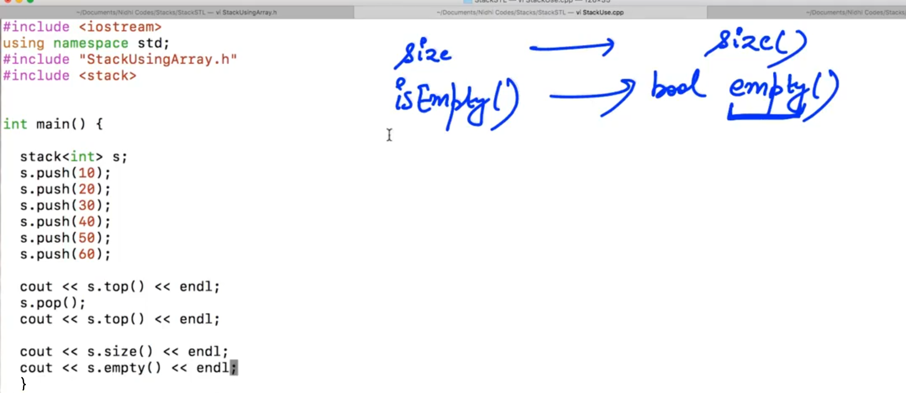
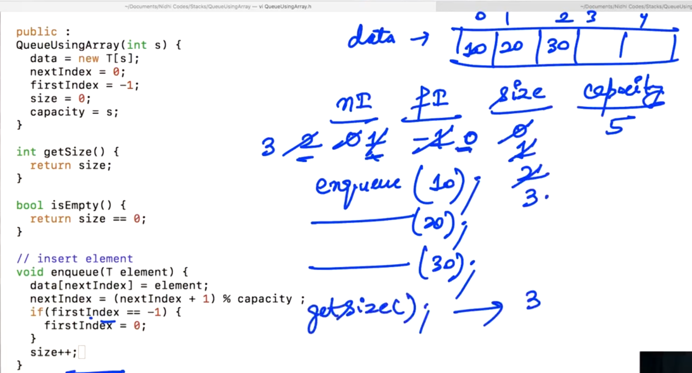

## 6.Stack Using LL Introduction

<u>Note</u>: (For Single element - In stack using Array)

1. push -> Time Complexity: O(1)        =>        Insert element in the nextIndex...

2. pop -> Time Complexity: O(1)        =>         Delete element

3. top -> Time Complexity: O(1)        =>            Returning the value of nextIndex...

4. size -> Time Complexity: O(1)        =>             Returning the value of nextIndex...

5. isEmpty -> Time Complexity: O(1)    =>        Using the value of nextIndex tells stack is empty or NOT....


--


For getting the Address of the last node we have to travel in the linked list; so, that the Time Complexity will be O(n^2) which is bad...

So, solving this, we need to create "tail" pointer.... So stack class will have two data members... "head" and "tail" 


- push() function works on the O(1).

- top() function should return the value of "tail"... So, it also works on the O(1).

- pop():


<u>NOTE</u>:  "tail" cann't go back in case of "Singly Linked list" i.e. Not allowed to go backward. 


To solve this, lets make a "prev" pointer which contain address of "one node which is just before the tail"

"Prev" can go one node backward... For reading many nodes we have to mantain the address of the whole list... 

So, There is no way that with the help of "prev" we can impliment our pop() function...


There is no way to go backward... so we have to travel from head to the "node just before the "tail" i.e. last second node..." lets travel with the help of "temp" i.e. <mark>tail = temp;</mark> and return by deleting the node (i.e. 40 in the example) 

i.e. Whenever we pop() the element we need to delete the last element... So, tail should update and go at previous node but which is not possible... So, we have to travel from "head" to last... and figure out the updated "tail"...

So, our pop() function becomes O(n) which is not good....

-


Solution:

Instead of adding element on the "tail", We need to insert element at the Zeroth position i.e. insert at "head".

So, pop() function will be work on O(1).

- size: 

Now, we need to know the size of the linked list (stack). So, for that we need to travel the linked list and figure out its length... From this the time complexity of size() function will be O(n) which is bad...


- isEmpty: (To check stack is empty or not...)

For isEmpty, either we can use the "size" variable, getSize() function (or) can check (head == NULL;)

-

```cpp
// Without templates

#include<iostream>
using namespace std;

class Node{
  public:
   int data;
   Node *next;

   Node(int data){
       this -> data = data;
       next = NULL;
   }
};

class Stack {
    Node *head;
    int size;   // number of elements present in stack...

    public:
    Stack() {

    }

    int getSize(){

    }

    bool isEmpty(){

    }

    void push(int element){

    }

    int pop(){

    }

    int top(){

    }
}
```

-


-

```cpp
// With Templates

#include<iostream>
using namespace std;

template <typename T>        //SEE
class Node{
  public:
   T data;          //SEE
   Node<T> *next;   //SEE

   Node(T data){    //SEE
       this -> data = data;
       next = NULL;
   }
};

template <typename T>
class Stack {
    Node<T> *head;
    int size;   // number of elements present in stack...

    public:
    Stack() {

    }

    int getSize(){

    }

    bool isEmpty(){

    }

    void push(T element) {        //SEE

    }

    T pop(){        //SEE

    }

    T top(){        //SEE

    }
}
```

-------------

## 8.Stack Using LL - Solution

NOTE: In use of linked list, there is no any issue of "size" just like "Array".

-

getSize()    ->    To return the number of elements which are present in the stack...

-

For making push() function:


-

When "stack" is initially empty: (i.e. head == NULL;)


-


-

Remember: "Node" class is made of "templates". So, wherever we write node... we need to specify... template...

```cpp
// Complete Program (From previous discussion)
// Using templates...

#include<iostream>
using namespace std;

template <typename T>
class Node{
  public:
   T data;          //SEE
   Node<T> *next;   //SEE

   Node(T data){
       this -> data = data;
       next = NULL;
   }
};

template <typename T>
class Stack {
    Node<T> *head;
    int size;   // number of elements present in stack...

    public:
    Stack() {                //Constructor
        head = NULL;
        size = 0;
    }

    int getSize(){
        return size;
    }

    bool isEmpty(){
        return size == 0;
    }

    void push(T element) {
        Node<T> *newNode = new Node<T>(element);
        newNode -> next = head;
        head = newNode;
        size++;
    }

    T pop(){
        if(isEmpty()) {
            return 0;
        }
        T ans = head -> data;  //SEE... 
        // "ans" is of "T" type... Since, Node's data is of "T" type
        Node<T> *temp = head;
        //creating a temporary pointer in which we save the "head" address
        head = head -> next;
        delete temp;
        size--;
        return ans;
    }

    T top(){
        if(isEmpty()){
            return 0;
        }
        return head -> data;
    }
 };

 int main(){
    Stack<char> s;

    s.push(100);
    s.push(101);
    s.push(102);
    s.push(103);
    s.push(104);

    cout << s.top() << endl;

    cout << s.pop() << endl;
    cout << s.pop() << endl;
    cout << s.pop() << endl;

    cout << s.getSize() << endl;

    cout << s.isEmpty() << endl;

}
```

Output:

h
h
g
f
2
0

Dry Run:


--------------

## 9.Inbuilt Stack


-



Output:


Dry Run:


Differences here:    

1. pop() is void

2. name of "isEmpty" is "empty"

Conclusion:

Whenever if we want to use "stack" then directly include the "stack" and use its function... No need to make our own "stack"...

--------------------

## 10.Balanced Parenthesis

We need to check if the brackets involved in this expression are balanced or not... 

Example:


Here for checking we need to create a "stack" of "char" type...


Example:


-


Here, Stack is not empty, we need to check that "stack" is empty??? after travelling complete string...

If yes    =>   return True... otherwise, False...

----------------------------

## 12.Queues Introduction


- Queue is also an "Abstract DataType".

- - Abstract DataType means we don't care how elements where saved but we just care about in which order elements were inserting and in which order elements come out...

- Unlike stacks, Queue have two points one is "exit point" and other is "entry point".

- Order of entering and exiting will be same...

Note:

- In Queue, we can access only first element... We can access second element only when first element get removed... 


**<u>In Queue</u>**, 

- enqueue -> For inserting    =>    (just like "push()" in stack)

- front()   ->   No need of any Argument...   =>   return the first element on the queue... (similar as "top()" in the stack)

- dequeue()    ->   No need of any Argument   =>    For delete element in the queue... (just like "pop()" of a stack)

- size()    ->    Elements present in the queue...

- isEmpty    ->   We can find "queue" is empty (return True) or not (return False)...

---------------

## 13.Queue using array - Introduction


- "firstIndex" will hold the index of that value which we want to delete....

- "firstIndex" will hold the index of first value of the queue...

Initially, firstIndex == -1; representing my queue is empty(i.e. No element at the first index...)


-


-

Every time shifting creates issue... To avoid this issue, we will move circularly...


In circularly, (<mark>nextIndex - frontIndex</mark>) won't help... so, we need to maintain the "size" variable... and size initially should be zero... 

So, during "enqueue" element... use "++" and during "dequeue" use "--". Therfore, we need to return the value of "size" variable... 


-------------

## 14.Queue using array - Code

"nextIndex" will tell next element will insert in which index...

"frontIndex" will tell us what's the first element in the "queue's first" and we will maintain its index...

- nextIndex = 0 represents first element should go at index 0.

- firstIndex = -1 represents queue is empty... If we want to delete an Element then we don't have any element to delete...

If we use firstIndex = 0 then we delete Zeroth element... which is wrong (because there is no any zeroth element, there is only garbage...) 


- capacity will hold the size of the Array... <mark>capacity = s;</mark> (or) maximum elements enter in the queue...


-



contd.


queue is full because <mark>size == capacity</mark>.

-

When queue is Empty... and <mark>firstIndex = -1</mark> 


Here, we can also use anyone in below listing... for checking queue is empty or not...

- isEmpty function

- getSize function

- "size" variable

- first index

-

Dequeue:

Wrong to use firstIndex (++)


-

Right way:


-

    // In Dequeue
    // Not necesssary to do; its just for better...
    // When "queue" will empty (i.e. size == 0)... we will again reset the 
    // nextIndex and firstIndex to 0 and -1...
    
    if(size == 0){
        firstIndex = -1;
        nextIndex = 0;
    }

-

```cpp
// Example of QUEUE:
#include<iostream>
using namespace std;

template <typename T>

class QueueUsingArray {
    T *data;
    int nextIndex;
    int firstIndex;
    int size;
    int capacity;

    public:
    QueueUsingArray(int s) {        //Constructor
        data = new T[s];
        nextIndex = 0;
        firstIndex = -1;
        size = 0;
        capacity = s;
    }

    int getSize(){
        return size;
    }

    bool isEmpty() {
        return size == 0;
    }

    // insert element
    void enqueue(T element){
        if(size == capacity) {
            cout << "Queue Full ! " << endl;
            return;
        }
        data[nextIndex] = element;
        nextIndex = (nextIndex + 1) % capacity;
    //for using mode function we should know the total size of the Array...
        if(firstIndex == -1){
            firstIndex = 0;
        }
        size++;
    }

    // front function
    T front() {
        if(isEmpty()) {
            cout << "Queue is Empty ! " << endl;
            return 0;
        }
        return data[firstIndex];
    }

    // Dequeue
    T dequeue( ){
        if(isEmpty()) {
            cout << "Queue is empty !" << endl;
            return 0;
        }
        T ans = data[firstIndex];
        firstIndex = (firstIndex + 1) % capacity;
        size--;
        if(size == 0){
            firstIndex = -1;
            nextIndex = 0;
        }
        return ans;
    }
};

int main(){
    QueueUsingArray<int> q(5);

    q.enqueue(10);
    q.enqueue(20);
    q.enqueue(30);
    q.enqueue(40);
    q.enqueue(50);
    q.enqueue(60);

    cout << q.front() << endl;
    cout << q.dequeue() << endl;
    cout << q.dequeue() << endl;
    cout << q.dequeue() << endl;

    cout << q.getSize() << endl;
    cout << q.isEmpty() << endl;
}
```

Output:

Queue Full ! 
10
10
20
30
2
0

-

Dry Run:


----------------

## 15.Dynamic Queue

Example: Now, we want to add elements as much as possible... without issue of <mark>size == capacity</mark> 

For this we need to create a new Array of double the size of capacity i.e. newData...


-


-


contd.


-

```cpp
#include<iostream>
using namespace std;

template <typename T>

class QueueUsingArray {
    T *data;
    int nextIndex;
    int firstIndex;
    int size;
    int capacity;

    public:
    QueueUsingArray(int s) {        //Constructor
        data = new T[s];
        nextIndex = 0;
        firstIndex = -1;
        size = 0;
        capacity = s;
    }

    int getSize(){
        return size;
    }

    bool isEmpty() {
        return size == 0;
    }

    // insert element
    void enqueue(T element){
        if(size == capacity) {
            T *newData = new T[2 * capacity];
            int j = 0;
            for(int i = firstIndex; i < capacity; i++){
                newData[j] = data[i];
                j++;
            }
            for(int i = 0; i < firstIndex; i++){
                newData[j] = data[i];
                j++;
            }
            delete [] data;
            data = newData;
            firstIndex = 0;  //shows that first element is in 0th index of new Array...
            nextIndex = capacity;
            capacity *= 2;
          //  cout << "Queue Full ! " << endl;
          //  return;
        }
        data[nextIndex] = element;
        nextIndex = (nextIndex + 1) % capacity;
    //for using mode function we should know the total size of the Array...
        if(firstIndex == -1){
            firstIndex = 0;
        }
        size++;
    }

    // front function
    T front() {
        if(isEmpty()) {
            cout << "Queue is Empty ! " << endl;
            return 0;
        }
        return data[firstIndex];
    }

    // Dequeue
    T dequeue( ){
        if(isEmpty()) {
            cout << "Queue is empty !" << endl;
            return 0;
        }
        T ans = data[firstIndex];
        firstIndex = (firstIndex + 1) % capacity;
        size--;
        if(size == 0){
            firstIndex = -1;
            nextIndex = 0;
        }
        return ans;
    }
};

int main(){
    QueueUsingArray<int> q(5);

    q.enqueue(10);
    q.enqueue(20);
    q.enqueue(30);
    q.enqueue(40);
    q.enqueue(50);
    q.enqueue(60);

    cout << q.front() << endl;
    cout << q.dequeue() << endl;
    cout << q.dequeue() << endl;
    cout << q.dequeue() << endl;

    cout << q.getSize() << endl;
    cout << q.isEmpty() << endl;
}
```

Output:

10
10
20
30
3
0

------

## 17.Queue Using LL Introduction


-


----------------

## 19.Queue using LL - Solution

contd.


-


Solution of segmentation fault:

```cpp
void enqueue(T element){
        Node<T> *newNode = new Node<T>(element);
        if(head == NULL){
            head = newNode;
            tail = newNode;
        }
        else {
            tail -> next = newNode;
            tail = newNode;
        }
        size++;
    }
```

-


-

Example(Above Discussed)

```cpp
#include<iostream>
using namespace std;

template <typename T>
class Node {
    public:
        T data;
        Node<T> *next;
        
        Node(T data){
            this -> data = data;
            next = NULL;
        }
};

template <typename T>
class Queue {
    Node<T> *head;
    Node<T> *tail;
    int size;
    
    public:
    
    Queue(){
        head = NULL;
        tail = NULL;
        size = 0;
    }
    
    int getSize(){
        return size;
    }
    
    bool isEmpty(){
        return size == 0;
    }
    
    void enqueue(T element){
        Node<T> *newNode = new Node<T>(element);
        if(head == NULL){
            head = newNode;
            tail = newNode;
        }
        else {
            tail -> next = newNode;
            tail = newNode;
        }
        size++;
    }
    
    T front(){
        if(isEmpty()) {
            return 0;
        }
        return head -> data;
    }
    
    T dequeue(){
        if(isEmpty()) {
            return 0;
        }
        T ans = head -> data;
        Node<T> *temp = head;
        head = head -> next;
        delete temp;
        size--;
        return ans;
    }
};

int main(){
    Queue<int> q;

    q.enqueue(10);
    q.enqueue(20);
    q.enqueue(30);
    q.enqueue(40);
    q.enqueue(50);
    q.enqueue(60);

    cout << q.front() << endl;
    cout << q.dequeue() << endl;
    cout << q.dequeue() << endl;
    cout << q.dequeue() << endl;

    cout << q.getSize() << endl;
    cout << q.isEmpty() << endl;
}
```

Output:

10
10
20
30
3
0

-----------------------

## 20.Inbuilt Queue


-


Output:


-

```cpp
// Example of inbuilt queue (Above Discussed)
// ERROR (Not working)
#include<iostream>
using namespace std;
#include <queue>        //SEE

template <typename T>
class Node {
    public:
        T data;
        Node<T> *next;
        
        Node(T data){
            this -> data = data;
            next = NULL;
        }
};

template <typename T>
class Queue {
    Node<T> *head;
    Node<T> *tail;
    int size;
    
    public:
    
    Queue(){
        head = NULL;
        tail = NULL;
        size = 0;
    }
    
    int getSize(){
        return size;
    }
    
    bool isEmpty(){
        return size == 0;
    }
    
    void enqueue(T element){
        Node<T> *newNode = new Node<T>(element);
        if(head == NULL){
            head = newNode;
            tail = newNode;
        }
        else {
            tail -> next = newNode;
            tail = newNode;
        }
        size++;
    }
    
    T front(){
        if(isEmpty()) {
            return 0;
        }
        return head -> data;
    }
    
    T dequeue(){
        if(isEmpty()) {
            return 0;
        }
        T ans = head -> data;
        Node<T> *temp = head;
        head = head -> next;
        delete temp;
        size--;
        return ans;
    }
};

int main(){
    queue<int> q;

    q.push(10);
    q.push(20);
    q.push(30);
    q.push(40);
    q.push(50);
    q.push(60);

    cout << q.front() << endl;
    q.pop();
    cout << q.front << endl;
    cout << q.size << endl;
    cout << q.empty() << endl;
}

while(!q.empty()){
    cout << q.front() << endl;
    q.pop();
}
```

Output:


-------------------------------
