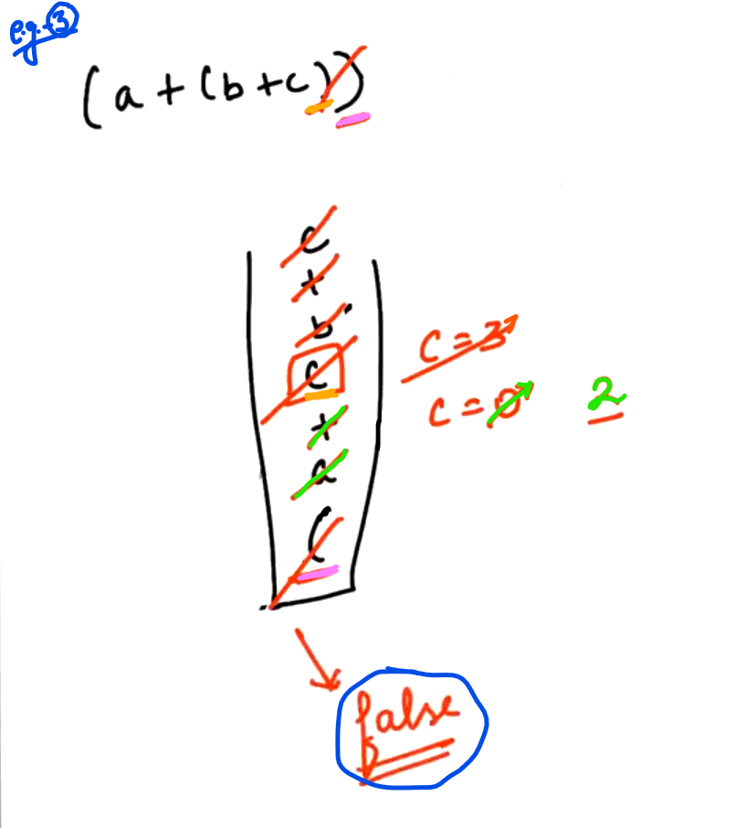

## 0.Reverse a Stack[HINT]

We need to use implict stack i.e. Recursion (Recursion uses stack internally...)

Note: Recursive calls of our functions saves at the stack of our system... So, we are using that inbuilt stack...

-

Base case: When size of stack "s1" size is equals to 0 or 1 then we should return...

When size of stack "s1" is one that means only one element is present and we don't need to reverse it...

----------------

## 2.Check redundant brackets[HINT]

In given expression, we have to find out wheather the expression contains one or more  pair of random brackets or not...

For every pair of paranthesis (i.e. brackets), we have to find out that there is useful information between them or not...

-

Example:

-

We have to check number of characters between opening and closing of the bracket...

After each matching of opening and closing bracket... Start count c = 0;

--------------

## 3.Stock Span[HINT]

Prices of a particular stock at the different days...

We have to find out the span of every price of the stock...

For every element there is one insertion and one deletion... i.e. total "2n" operations....

Therefore the complexity will be O(n)...

--------------

## 4.Minimum bracket Reversal[HINT]

In order to maintain the expression balance, how much minimum Brackets we need to reverse... 

<u>Example</u>:

CASE - 1:

At first, we need to check that the string length is Odd or Even... If it is Odd thenn return -1 and if it is Even then we willl proceed futher...

CASE - 2:

Here, if stack is empty => push

if stack is not empty then we will have to see different cases:

Case - 3:

-------------------------------

