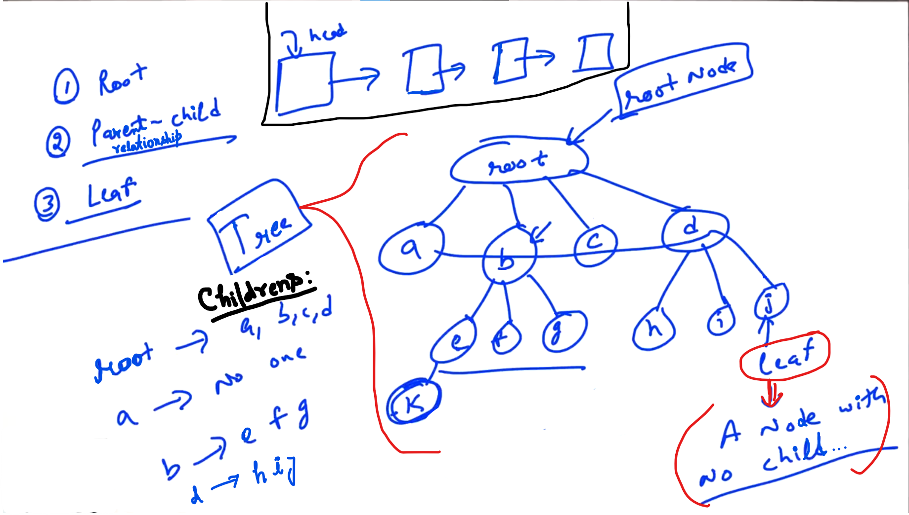
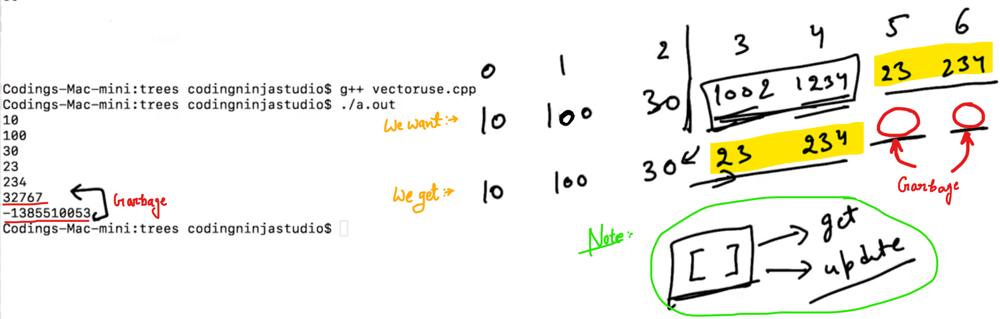

## 0.Trees Introduction


There are two ways of Data Structures:

1. Which changes How data is stored in memory (These are like data structure in which stored data in basic memory e.g: Array and Linked list...)

2. Layer above a basic data structure which defines how data is accessible to the user... e.g: stack and queues...

--

 <u>Example</u>:


d => directory

f => file

--

<u>Example</u>:


--



leaf: Node which doesnot have any child and is the end node... called as leaf...

---------------

## 1.Vectors

Vector => Dynamic Array...

vector is a template...

```cpp
// Example to use vector:
#include <iostream>
#include <vector>
using namespace std;

int main(){
    // vector<int> * vp = new vector<int>();   //Dynamically Allocation
    vector<int> v;  //Static Allocation
    v.push_back(10);
    v.push_back(20);
    v.push_back(30);

    cout << v[0] << endl;
    cout << v[1] << endl;
    cout << v[2] << endl;
}
```

<u>Output</u>:

10
20
30

-

Q. Why it is important to do "push_back"?

Ans: "push__back" is a function helps to check the current size, space is present or not to add more elements... and it is also used to double the size of the Array...

```cpp
// More about vectors:
// Why it important to use push_back

#include <iostream>
#include <vector>
using namespace std;

int main(){
    // vector<int> * vp = new vector<int>();   //Dynamically Allocation
    vector<int> v;  //Static Allocation
    v.push_back(10);
    v.push_back(20);
    v.push_back(30);

    v[1] = 100;

    v[3] = 1002;
    v[4] = 1234;

    v.push_back(23);
    v.push_back(234);

    cout << v[0] << endl;
    cout << v[1] << endl;
    cout << v[2] << endl;
    cout << v[3] << endl;
    cout << v[4] << endl;
    cout << v[5] << endl;
    cout << v[6] << endl;
}
```

<u>Output</u>:



10
100
30
23
234
0            //Garbage Value...
0            //Garbage Value...

<u>NOTE</u>:

In case of vector, <u>**don't**</u> use [ ] for <u>**inserting**</u> element... and Use [ ] for <mark>get</mark> the value and <mark>update</mark> the value...

--

```cpp
// same as previous: (Vector use)

#include <iostream>
#include <vector>
using namespace std;

int main(){
    // vector<int> * vp = new vector<int>();   //Dynamically Allocation
    vector<int> v;  //Static Allocation
    v.push_back(10);
    v.push_back(20);
    v.push_back(30);

    v[1] = 100;

    v[3] = 1002;
    v[4] = 1234;

    v.push_back(23);
    v.push_back(234);

    cout << v[0] << endl;
    cout << v[1] << endl;
    cout << v[2] << endl;
    cout << v[3] << endl;
    cout << v[4] << endl;
    cout << v[5] << endl;
    cout << v[6] << endl;       // It gives Garbage... (Not safer)

    cout << "Size: " << v.size() << endl;

    cout << v.at(2) << endl;    //Element at position 2
    cout << v.at(6) << endl;    //Element at position 6
    //At element 6 we will get ERROR i.e. Out of Range... which means 
    // "at" is Safer to use...
}
```

<u>Output</u>:

10
100
30
23
234
0
0
Size: 5
30
terminate called after throwing an instance of 'std::out_of_range'
  what():  vector::_M_range_check: __n (which is 6) >= this->size() (which is 5)

--

```cpp
// Example (From previous example concept...)

#include <iostream>
#include <vector>
using namespace std;

int main(){
    // vector<int> * vp = new vector<int>();   //Dynamically Allocation
    vector<int> v;  //Static Allocation
    v.push_back(10);
    v.push_back(20);
    v.push_back(30);

    v[1] = 100;

    //Don't use [ ] for inserting elements...
    // v[3] = 1002;
    // v[4] = 1234;

    v.push_back(23);
    v.push_back(234);

    v.pop_back();   // delete element (i.e. remove the last element)

    for (int i = 0; i < v.size(); i++){
        cout << v[i] << endl;
    }

}
```

<u>Output</u>:

10
100
30
23

--

capacity: It will tell the current capacity i.e. size of the underline Array of the Vector...

```cpp
// Example (From previous example concept...)
#include <iostream>
#include <vector>
using namespace std;

int main(){
    // vector<int> * vp = new vector<int>();   //Dynamically Allocation
    vector<int> v;  //Static Allocation

    for (int i = 0; i < 100; i++){
        cout << "cap:" << v.capacity() << endl;
        cout << "size:" << v.size() << endl;
        v.push_back(i + 1);
    }

    v.push_back(10);
    v.push_back(20);
    v.push_back(30);

    v[1] = 100;

    v.push_back(23);
    v.push_back(234);

    v.pop_back();   // delete element (i.e. remove the last element)

}
```

Output:

cap:0
size:0
cap:1                //Capacity increased
size:1
cap:2                //Capacity get doubled
size:2
cap:4                //Capacity get doubled
size:3
cap:4
size:4
cap:8                //Capacity get doubled
.
size:8
cap:16                //Capacity get doubled
size:9
cap:16
.
size:32
cap:32                //Capacity get doubled

size:33
cap:64                // Capacity get doubled
.

size:98
cap:128
size:99

----------------

## 2.TreeNode class

We need to store the address of "root".

<u>Problems facing during storing of address of the childrens i.e. Tree Nodes</u>:

- In case of an Array there is an issue of "size" and in case of Linked list there is an issue of "accessing" of elements...

To solve this issue we have to use "vector".


Note: If parent is of Integer type then children's data will becomes of integer type...


-----

## 3.Take input and print Recursive

We want to:

1. print a tree

2. Make a function which will take Tree input from the user...

-

```cpp
//Create tree node class...
#include<iostream>
#include <vector>
using namespace std;

template <typename T>
class TreeNode {
    public:
    T data;
    vector<TreeNode<T>*> children;
    
    TreeNode(T data) {          //Making a constructor
        this -> data = data;
    }
};

// Using Recursion...
void printTree(TreeNode<int>* root){
    
    // To handle edge case:
    if (root == NULL) {
        return;
    }
    
    cout << root->data << ":";   
    for(int i = 0; i < root->children.size(); i++){
        cout << root->children[i]->data << ",";
    }
    cout << endl;
    for(int i = 0; i < root->children.size(); i++){
        printTree(root->children[i]);
    }
}

int main(){
    TreeNode<int>* root = new TreeNode<int>(1);
    TreeNode<int>* node1 = new TreeNode<int>(2);
    TreeNode<int>* node2 = new TreeNode<int>(3);
    root->children.push_back(node1);
    root->children.push_back(node2);
    printTree(root);
    //TODO delete the tree... 
}
```

Output:

1:2,3,
2:
3:

--

While using recursion we don't required to write "Base Case"???

Here, single node is working as a base case... ((or) in case of generics trees we don't need to use "Base case")

Note: Edge case is different from Base case...

-- 

```cpp
// Create tree node class... (Taking input and printing)

#include<iostream>
#include <vector>
using namespace std;

template <typename T>
class TreeNode {
    public:
    T data;
    vector<TreeNode<T>*> children;
    
    TreeNode(T data) {          //Making a constructor
        this -> data = data;
    }
};

TreeNode<int>* takeInput() {
    int rootData;
    cout << "Enter data" << endl;
    cin >> rootData;
    TreeNode<int>* root = new TreeNode<int>(rootData);
    
    int n;
    cout << "Enter num of children of " << rootData << endl;
    cin >> n;
    for (int i = 0; i < n; i++){
        TreeNode<int>* child = takeInput();
        root->children.push_back(child);
    }
    return root;
}

// Using Recursion...
void printTree(TreeNode<int>* root){
    
    // To handle edge case:
    if (root == NULL) {
        return;
    }
    
    cout << root->data << ":";   
    for(int i = 0; i < root->children.size(); i++){
        cout << root->children[i]->data << ",";
    }
    cout << endl;
    for(int i = 0; i < root->children.size(); i++){
        printTree(root->children[i]);
    }
}

int main(){
    TreeNode<int>* root = takeInput();
    printTree(root);
    //TODO delete the tree... 
}
```

Output:


Enter data
1
Enter num of children of 1
3
Enter data
2
Enter num of children of 2
2
Enter data
5
Enter num of children of 5
0
Enter data
6
Enter num of children of 6
0
Enter data
3
Enter num of children of 3
1
Enter data
7
Enter num of children of 7
0
Enter data
4
Enter num of children of 4
1
Enter data
8
Enter num of children of 8
0
1:2,3,4,
2:5,6,
5:
6:
3:7,
7:
4:8,
8:

-------------

## 4.Take input level wise

Solution other than use of Recursion: (With the help of Queue)


When "Queue" will be Empty, we are done...

```cpp
// Create tree node class... (Taking input and printing "Levelwise")
// From previous example
#include <iostream>
#include <queue>
#include <vector>
using namespace std;

template <typename T>
class TreeNode {
    public:
    T data;
    vector<TreeNode<T>*> children;
    
    TreeNode(T data) {          //Making a constructor
        this -> data = data;
    }
};

TreeNode<int>* takeInputLevelWise(){
    int rootData;
    cout << "Enter root data" << endl;
    cin >> rootData;
    TreeNode<int>* root = new TreeNode<int>(rootData);
    
    queue<TreeNode<int>*> pendingNodes; //inbuilt queue
    
    pendingNodes.push(root);
    while (pendingNodes.size() != 0){
        TreeNode<int>* front = pendingNodes.front();
        pendingNodes.pop();
        cout << "Enter num of children of " << front->data << endl;
        int numChild;
        cin >> numChild;
        for (int i = 0; i < numChild; i++){
            int childData;
            cout << "Enter " << i << "th child of " << front->data << endl;
            cin >> childData;
            /*
            TreeNode<int> child(childData); // Statically allocate So, memory 
            will loss after the brackets. So, use Dynamically allocate...
            to make memory survive...
            */
            TreeNode<int>* child = new TreeNode<int>(childData); //Dynamically Allocate...
            front->children.push_back(child);
            pendingNodes.push(child);
        }
    }
    return root;
}

/*
TreeNode<int>* takeInput() {
    int rootData;
    cout << "Enter data" << endl;
    cin >> rootData;
    TreeNode<int>* root = new TreeNode<int>(rootData);
    
    int n;
    cout << "Enter num of children of " << rootData << endl;
    cin >> n;
    for (int i = 0; i < n; i++){
        TreeNode<int>* child = takeInput();
        root->children.push_back(child);
    }
    return root;
}
*/

// Using Recursion...
void printTree(TreeNode<int>* root){
    
    // To handle edge case:
    if (root == NULL) {
        return;
    }
    
    cout << root->data << ":";   
    for(int i = 0; i < root->children.size(); i++){
        cout << root->children[i]->data << ",";
    }
    cout << endl;
    for(int i = 0; i < root->children.size(); i++){
        printTree(root->children[i]);
    }
}

int main(){
    TreeNode<int>* root = takeInputLevelWise();
    printTree(root);
    //TODO delete the tree... 
}
```

Output:


Enter root data
1
Enter num of children of 1
3
Enter 0th child of 1
2
Enter 1th child of 1
3
Enter 2th child of 1
4
Enter num of children of 2
2
Enter 0th child of 2
5
Enter 1th child of 2
6
Enter num of children of 3
0
Enter num of children of 4
0
Enter num of children of 5
0
Enter num of children of 6
0
1:2,3,4,
2:5,6,
5:
6:
3:
4:

--

TASK: (Do Level order printing)

Hint:


---------------

## 6.Count Nodes


-


-

```cpp
//Create tree node class...
#include <iostream>
#include <queue>
#include <vector>
using namespace std;

template <typename T>
class TreeNode {
    public:
    T data;
    vector<TreeNode<T>*> children;
    
    TreeNode(T data) {          //Making a constructor
        this -> data = data;
    }
};

TreeNode<int>* takeInputLevelWise(){
    int rootData;
    cout << "Enter root data" << endl;
    cin >> rootData;
    TreeNode<int>* root = new TreeNode<int>(rootData);
    
    queue<TreeNode<int>*> pendingNodes; //inbuilt queue
    
    pendingNodes.push(root);
    while (pendingNodes.size() != 0){
        TreeNode<int>* front = pendingNodes.front();
        pendingNodes.pop();
        cout << "Enter num of children of " << front->data << endl;
        int numChild;
        cin >> numChild;
        for (int i = 0; i < numChild; i++){
            int childData;
            cout << "Enter " << i << "th child of " << front->data << endl;
            cin >> childData;
            /*
            TreeNode<int> child(childData); // Statically allocate So, memory 
            will loss after the brackets. So, use Dynamically allocate...
            to make memory survive...
            */
            TreeNode<int>* child = new TreeNode<int>(childData); //Dynamically Allocate...
            front->children.push_back(child);
            pendingNodes.push(child);
        }
    }
    return root;
}

// Using Recursion...
void printTree(TreeNode<int>* root){
    
    // To handle edge case:
    if (root == NULL) {
        return;
    }
    
    cout << root->data << ":";   
    for(int i = 0; i < root->children.size(); i++){
        cout << root->children[i]->data << ",";
    }
    cout << endl;
    for(int i = 0; i < root->children.size(); i++){
        printTree(root->children[i]);
    }
}

////////////////////////////////////////////////SEE
int numNodes(TreeNode<int>* root){
    if (root == NULL){
        return 0;
    }
    int ans = 1;
    for (int i = 0; i < root->children.size(); i++){
        ans += numNodes(root->children[i]);
    }
    return ans;
}
///////////////////////////////////////////////////

int main(){
    TreeNode<int>* root = takeInputLevelWise();
    printTree(root);
    //TODO delete the tree... 
}
```

---------

## 9.Find Height

Number of Levels (Not number of nodes...)


We have to call at every child and and ask for height and among them the maximum we get, return it with (+1) and we will get our answer...

-----------

## 12.Count leaf nodes

- leaf nodes are the nodes which don't have any child further...


If the node is leaf, return "1" otherwise ask the sub-trees then sum all and return...

--------

## 14.Traversals

Pre order Traversals:


--

Post order Traversals:

Here, childrens print first instead of root...


--------------

## 16.Destructor

```cpp
//From previous example
#include <iostream>
#include <queue>
#include <vector>
using namespace std;

template <typename T>
class TreeNode {
    public:
    T data;
    vector<TreeNode<T>*> children;
    
    TreeNode(T data) {          //Making a constructor
        this -> data = data;
    }
    
    ~TreeNode(){            //Destructor (Using Recursion)
        for (int i = 0; i < children.size(); i++){
            delete children[i];
        }
    }
};

TreeNode<int>* takeInputLevelWise(){
    int rootData;
    cout << "Enter root data" << endl;
    cin >> rootData;
    TreeNode<int>* root = new TreeNode<int>(rootData); //Dynamically allocate
    
    queue<TreeNode<int>*> pendingNodes; //inbuilt queue
    
    pendingNodes.push(root);
    while (pendingNodes.size() != 0){
        TreeNode<int>* front = pendingNodes.front();
        pendingNodes.pop();
        cout << "Enter num of children of " << front->data << endl;
        int numChild;
        cin >> numChild;
        for (int i = 0; i < numChild; i++){
            int childData;
            cout << "Enter " << i << "th child of " << front->data << endl;
            cin >> childData;
            /*
            TreeNode<int> child(childData); // Statically allocate So, memory 
            will loss after the brackets. So, use Dynamically allocate...
            to make memory survive...
            */
            TreeNode<int>* child = new TreeNode<int>(childData); //Dynamically Allocate...
            front->children.push_back(child);
            pendingNodes.push(child);
        }
    }
    return root;
}

// Using Recursion...
void printTree(TreeNode<int>* root){
    
    // To handle edge case:
    if (root == NULL) {
        return;
    }
    
    cout << root->data << ":";   
    for(int i = 0; i < root->children.size(); i++){
        cout << root->children[i]->data << ",";
    }
    cout << endl;
    for(int i = 0; i < root->children.size(); i++){
        printTree(root->children[i]);
    }
}

/*


MISSING
for (int i = 0; i < root->children.size(); i++){
    printAtLevelK(root->children[i], k - 1);
}
}

*/

////////////////////////////////////////////////SEE
int numNodes(TreeNode<int>* root){
    if (root == NULL){
        return 0;
    }
    int ans = 1;
    for (int i = 0; i < root->children.size(); i++){
        ans += numNodes(root->children[i]);
    }
    return ans;
}

void preorder(TreeNode<int>* root){
    if (root == NULL){
        return;
    }
    cout << root->data << " ";
    for(int i = 0; i < root->children.size(); i++){
        preorder(root->children[i]);
    }
}

void deleteTree(TreeNode<int>* root){   //SEE NOTE
    for(int i = 0; i < root->children.size(); i++){
        deleteTree(root->children[i]);
    }
    delete root;
}
///////////////////////////////////////////////////

// 1 3 2 3 4 2 5 6 2 7 8 0 0 0 0 1 9 0
int main(){
    TreeNode<int>* root = takeInputLevelWise();
    printTree(root);
    cout << "num: " << numNodes(root) << endl;
    cout << "Level 2:" << endl;
    printAtLevelK(root, 2);     //CODING still remain...
    preorder(root);
    //TODO delete the tree... (Since we allocated the tree Dynamically)
    deleteTree(root);
}
```

-


- On using <mark>delete root;</mark> root will delete as well as (Since we allocated the vector statically without using the "new" keyword, so, if the vector will delete. So, address of all the children will delete)

- root consist of data and vector, If "root" will delete then data and  vector both will delete... If vector will delete we don't have excess for all the nodes (i.e. Other than rootnode...)

- NOTE: Delete children first then delete the root...

----------------------


