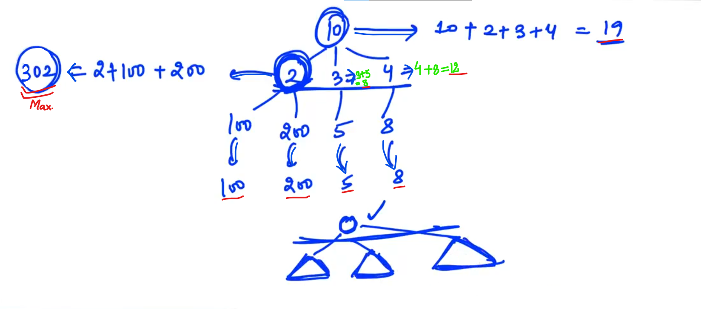
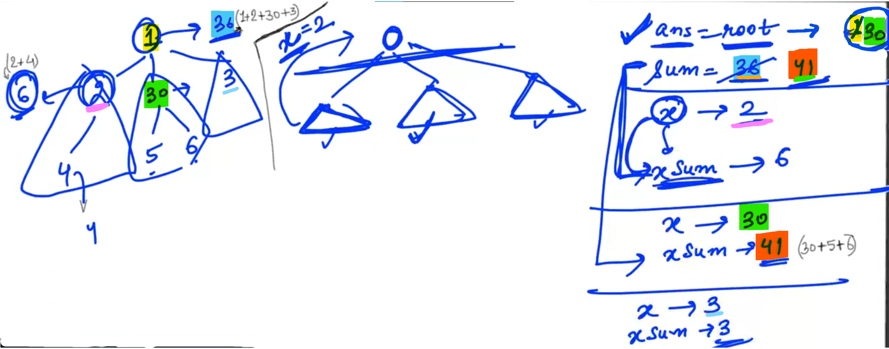
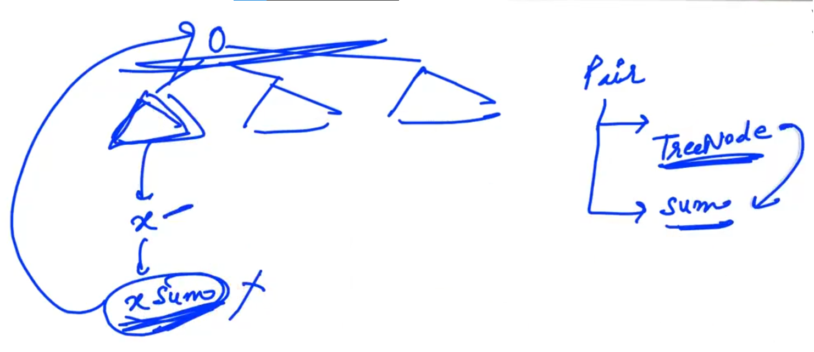
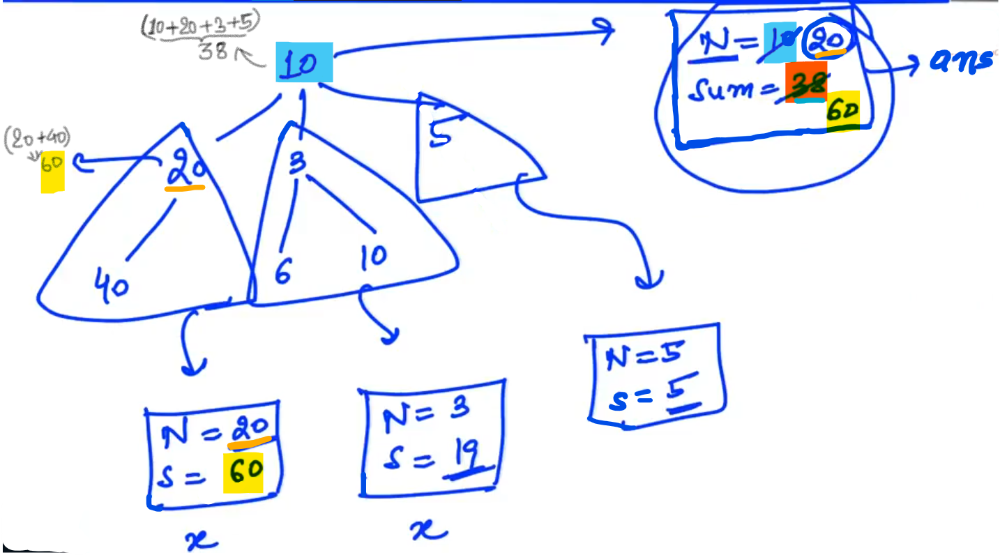
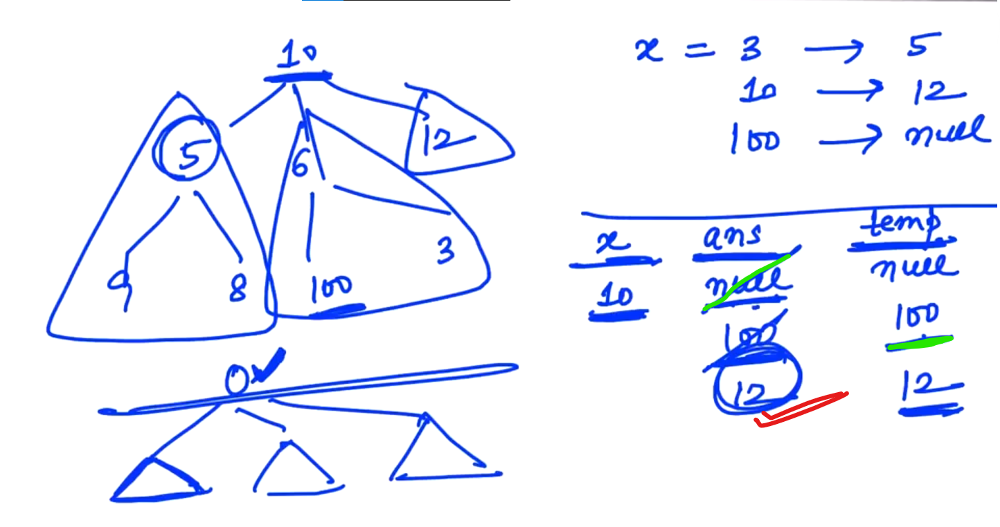
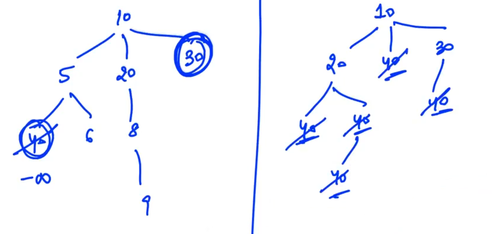
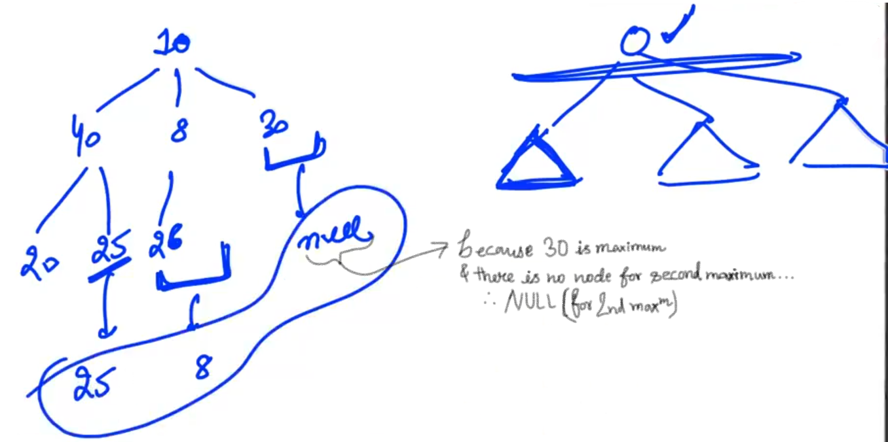
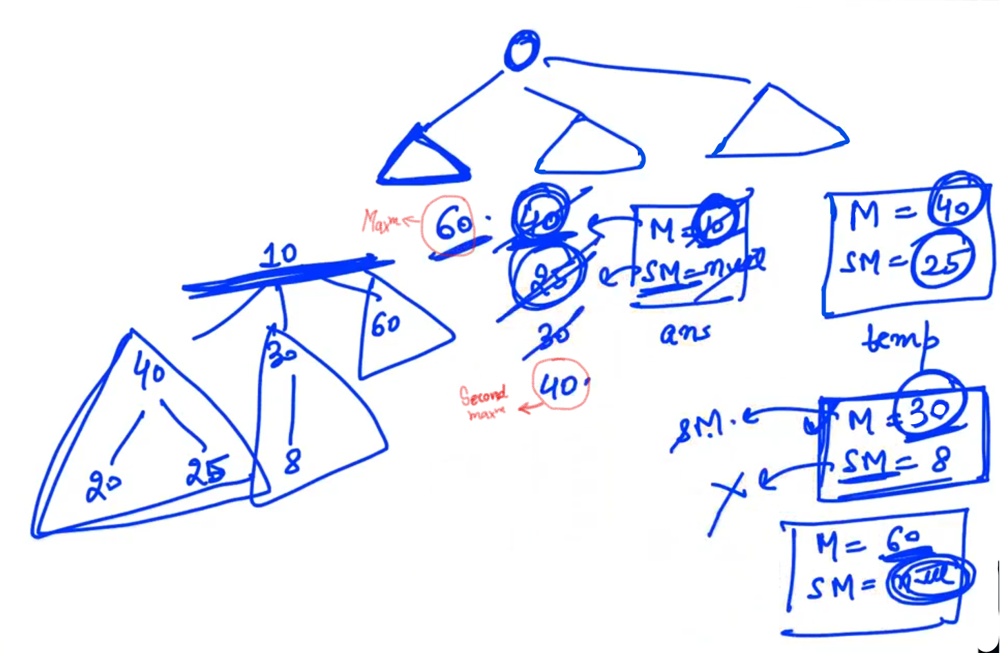
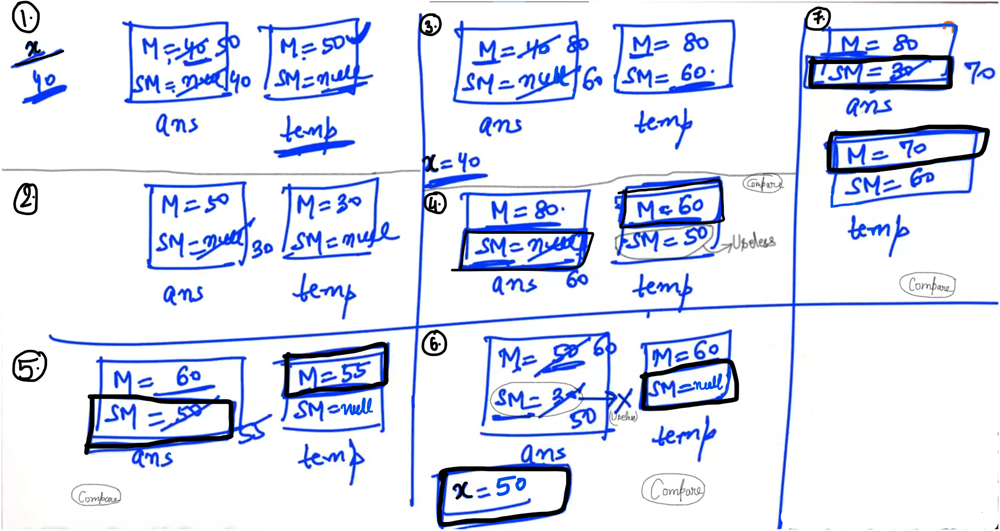
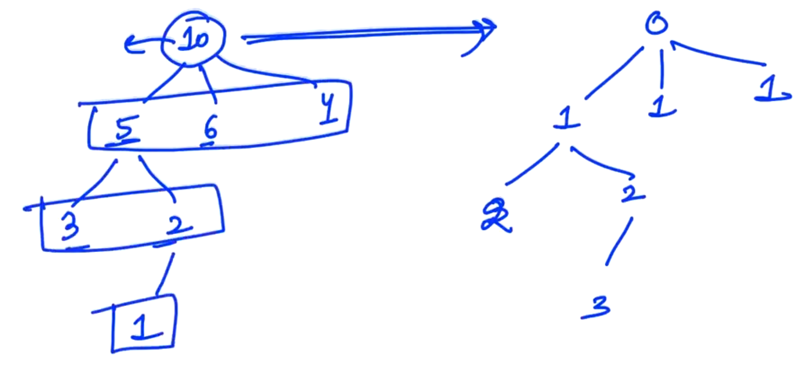

## 2.Node with maximum child sum[HINT]

Steps:

Do the calculation part on the root.

Call the recursion in every child...

<u>Method 1</u>:

We need better approach where we don't need to calculate the "xsum".

<u>Method 2</u>:

So we need to create a "class" and ask the recursion to return multiple parameters "x" i.e. Node and "xsum" i.e. its data.

"pair" class having two parameters: 1) TreeNode (i.e. Actual answer) and 2) sum 

Example:

----------

## 4.Next larger[HINT]

Find **just Next** larger node (value) of any node...

We have:

x (which is given)

ans (which is initialise with Null)

temp (which is initialise with Null)

<u>Example</u>:

compare "ans" and "temp" and return the smaller value after comparision... (i.e. just next larger value of "x" )

----

## 5.Second Largest Element In Tree[HINT]

<u>Method - 1</u>:

In this method we are repacing the maximum value with (- infinity) and this approach is not so  goood because we are changing are given input... and we have to replace whenever maximum comes...

-

<u>Method - 2</u>:

Here, we can't find the second largest value by finding the second maximum in sub-trees, and comparing the values that we get from the sub-trees...

Here, 2nd maximum skips because it can be maximum of any sub-tree...

This Approach is not going to help us...

-

<u>Method - 3</u>:

We will ask recursion to return maximum (M) and second maximum (S.M.) and we need to create a class...

Steps:

On comparing the maximum of "temp" and maximum of "ans" and update the maximum of "ans"

Find second maximum (S.M.)

-

All possible cases:

----

## 6.Replace with depth[HINT]

Depth means nodes value replace with the levels value...

Example:

<u>Hint</u>: 

root starts with 0.

Childerens replace by "+1" value.

We need to create a function where we need to pass "root" and "depth".

Initialise "depth" with 0.

Replace the value of "root" with "depth".

Call recursion in every child... (make sure instead of passing "depth", pass "depth + 1")

So this way our tree will update to required depth value...

-------------

