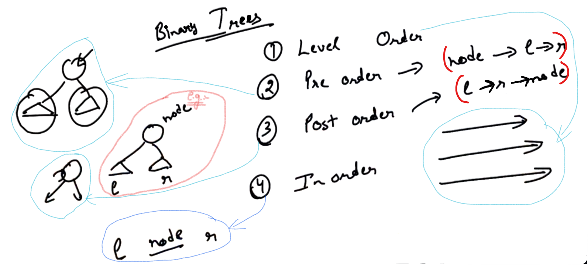

## 0.Binary Trees Introduction

Binary Tree: Tree where every node has maximum 2 children...


Note: 

- We can have 0 children, 1 children (or) max. 2 children.

- In Binary tree we can have max. 2 sub-trees...


Example:


Recursive Destructor: On calling at 1, everything should delete automatically ,So, 1 (Delete hote hote) should call delete at 2 and 3 and 2 (Delete hote hote) should call delete at 4 and 5.

So, Every Node before deleting itself, call delete on left and right inside its destructor...

-


-

Now, In case of single Node, we call delete at the sigle node... So, it will call delete in left and right... But in left and right there  is NULL... So effectively we are calling delete NULL; which is actually okay, and won't have any effect...

----------

## 1.Take Input and print recursive

contd.


-

```cpp
// Binary Tree Node Example
#include <iostream>
using namespace std;

template <typename T>
class BinaryTreeNode{
    public:
    T data;
    BinaryTreeNode* left;
    BinaryTreeNode* right;

    //Constructor
    BinaryTreeNode(T data){
        this -> data = data;
        left = NULL;
        right = NULL;
    }
    // Recursive Destructor
    ~BinaryTreeNode(){
        delete left;
        delete right;
    }
};

void printTree(BinaryTreeNode<int>* root){
    if(root == NULL){
        return;
    }
    cout << root -> data << ":";
    if(root->left != NULL){
        cout << "L" << root->left->data;
    }

    if(root->right != NULL){
        cout << "R" << root->right->data;
    }
    cout << endl;
    printTree(root->left);
    printTree(root->right);
}

int main(){
    BinaryTreeNode<int>* root = new BinaryTreeNode<int>(1);
    BinaryTreeNode<int>* node1 = new BinaryTreeNode<int>(2);
    BinaryTreeNode<int>* node2 = new BinaryTreeNode<int>(3);
    root->left = node1;
    root->right = node2;
    printTree(root);
    delete root;
}
```

<u>Output</u>:

1:L2R3
2:
3:

--

Example: Taking input from the user...

```cpp
#include <iostream>
using namespace std;

template <typename T>
class BinaryTreeNode{
    public:
    T data;
    BinaryTreeNode* left;
    BinaryTreeNode* right;

    //Constructor
    BinaryTreeNode(T data){
        this -> data = data;
        left = NULL;
        right = NULL;
    }
    // Recursive Destructor
    ~BinaryTreeNode(){
        delete left;
        delete right;
    }
};

void printTree(BinaryTreeNode<int>* root){
    if(root == NULL){
        return;
    }
    cout << root -> data << ":";
    if(root->left != NULL){
        cout << "L" << root->left->data;
    }

    if(root->right != NULL){
        cout << "R" << root->right->data;
    }
    cout << endl;
    printTree(root->left);
    printTree(root->right);
}

BinaryTreeNode<int>* takeInput(){
    int rootData;
    cout << "Enter data" << endl;
    cin >> rootData;
    if (rootData == -1){
        return NULL;
    }
// Let -1 means return NULL (i.e. User doesn't want to give any tree input)

    BinaryTreeNode<int>* root = new BinaryTreeNode<int>(rootData);
    BinaryTreeNode<int>* leftChild = takeInput();
    BinaryTreeNode<int>* rightChild = takeInput();
    root->left = leftChild;
    root->right = rightChild;
    return root;
}

int main(){
    /*
    BinaryTreeNode<int>* root = new BinaryTreeNode<int>(1);
    BinaryTreeNode<int>* node1 = new BinaryTreeNode<int>(2);
    BinaryTreeNode<int>* node2 = new BinaryTreeNode<int>(3);
    root->left = node1;
    root->right = node2;
    */
    BinaryTreeNode<int>* root = takeInput();
    printTree(root);
    delete root;
}
```

<u>Output - 1</u>:

Enter data
1
Enter data
 2
Enter data
-1
Enter data
-1
Enter data
3
Enter data
-1
Enter data
-1
1:L2R3
2:
3:


--

<u>Output - 2</u>:


-


----------

## 2.Take input level wise


-

```cpp
//Example of "Take input level wise"
#include <iostream>
#include <queue>
using namespace std;

template <typename T>
class BinaryTreeNode{
    public:
    T data;
    BinaryTreeNode* left;
    BinaryTreeNode* right;

    //Constructor
    BinaryTreeNode(T data){
        this -> data = data;
        left = NULL;
        right = NULL;
    }
    // Recursive Destructor
    ~BinaryTreeNode(){
        delete left;
        delete right;
    }
};

BinaryTreeNode<int>* takeInputLevelWise() {
    int rootData;
    cout << "Enter root data" << endl;
    cin >> rootData;
    if (rootData == -1) {
        return NULL;
    }

    BinaryTreeNode<int>* root = new BinaryTreeNode<int>(rootData);

    queue<BinaryTreeNode<int>*> pendingNodes;
    pendingNodes.push(root);
    while (pendingNodes.size() != 0) {
        BinaryTreeNode<int>* front = pendingNodes.front();
        pendingNodes.pop();
        cout << "Enter left child of " << front->data << endl;
        int leftChildData;
        cin >> leftChildData;
        if (leftChildData != -1) {
            BinaryTreeNode<int>* child = new BinaryTreeNode<int>(leftChildData);
            front->left = child;
            pendingNodes.push(child);
        }
        cout << "Enter right child of " << front->data << endl;
        int rightChildData;
        cin >> rightChildData;
        if (rightChildData != -1){
            BinaryTreeNode<int>* child = new BinaryTreeNode<int>(rightChildData);
            front->right = child;
            pendingNodes.push(child);
        }
    }
    return root;
}

void printTree(BinaryTreeNode<int>* root){
    if(root == NULL){
        return;
    }
    cout << root -> data << ":";
    if(root->left != NULL){
        cout << "L" << root->left->data;
    }

    if(root->right != NULL){
        cout << "R" << root->right->data;
    }
    cout << endl;
    printTree(root->left);
    printTree(root->right);
}

BinaryTreeNode<int>* takeInput(){
    int rootData;
    cout << "Enter data" << endl;
    cin >> rootData;
    if (rootData == -1){
        return NULL;
    }
// Let -1 means return NULL (i.e. User doesn't want to give any tree input)

    BinaryTreeNode<int>* root = new BinaryTreeNode<int>(rootData);
    BinaryTreeNode<int>* leftChild = takeInput();
    BinaryTreeNode<int>* rightChild = takeInput();
    root->left = leftChild;
    root->right = rightChild;
    return root;
}

int main(){
    /*
    BinaryTreeNode<int>* root = new BinaryTreeNode<int>(1);
    BinaryTreeNode<int>* node1 = new BinaryTreeNode<int>(2);
    BinaryTreeNode<int>* node2 = new BinaryTreeNode<int>(3);
    root->left = node1;
    root->right = node2;
    */
    BinaryTreeNode<int>* root = takeInputLevelWise();
    printTree(root);
    delete root;
}
```

Output:


-


--------------

## 4.Count nodes

Take Base case "Null"


-


-

Output:


-

```cpp
// Example of "Count nodes (i.e. Number of Nodes)"

#include <iostream>
#include <queue>
using namespace std;

template <typename T>
class BinaryTreeNode{
    public:
    T data;
    BinaryTreeNode* left;
    BinaryTreeNode* right;

    //Constructor
    BinaryTreeNode(T data){
        this -> data = data;
        left = NULL;
        right = NULL;
    }
    // Recursive Destructor
    ~BinaryTreeNode(){
        delete left;
        delete right;
    }
};

BinaryTreeNode<int>* takeInputLevelWise() {
    int rootData;
    cout << "Enter root data" << endl;
    cin >> rootData;
    if (rootData == -1) {
        return NULL;
    }

    BinaryTreeNode<int>* root = new BinaryTreeNode<int>(rootData);

    queue<BinaryTreeNode<int>*> pendingNodes;
    pendingNodes.push(root);
    while (pendingNodes.size() != 0) {
        BinaryTreeNode<int>* front = pendingNodes.front();
        pendingNodes.pop();
        cout << "Enter left child of " << front->data << endl;
        int leftChildData;
        cin >> leftChildData;
        if (leftChildData != -1) {
            BinaryTreeNode<int>* child = new BinaryTreeNode<int>(leftChildData);
            front->left = child;
            pendingNodes.push(child);
        }
        cout << "Enter right child of " << front->data << endl;
        int rightChildData;
        cin >> rightChildData;
        if (rightChildData != -1){
            BinaryTreeNode<int>* child = new BinaryTreeNode<int>(rightChildData);
            front->right = child;
            pendingNodes.push(child);
        }
    }
    return root;
}

void printTree(BinaryTreeNode<int>* root){
    if(root == NULL){
        return;
    }
    cout << root -> data << ":";
    if(root->left != NULL){
        cout << "L" << root->left->data;
    }

    if(root->right != NULL){
        cout << "R" << root->right->data;
    }
    cout << endl;
    printTree(root->left);
    printTree(root->right);
}

BinaryTreeNode<int>* takeInput(){
    int rootData;
    cout << "Enter data" << endl;
    cin >> rootData;
    if (rootData == -1){
        return NULL;
    }
// Let -1 means return NULL (i.e. User doesn't want to give any tree input)

    BinaryTreeNode<int>* root = new BinaryTreeNode<int>(rootData);
    BinaryTreeNode<int>* leftChild = takeInput();
    BinaryTreeNode<int>* rightChild = takeInput();
    root->left = leftChild;
    root->right = rightChild;
    return root;
}

//SEE... Count nodes...
int numNodes(BinaryTreeNode<int>* root){
    if (root == NULL) {
        return 0;
    }
    return 1 + numNodes(root->left) + numNodes(root->right);
}

// 1 2 3 4 5 6 7 -1 -1 -1 -1 8 9 -1 -1 -1 -1 -1 -1

int main(){
    /*
    BinaryTreeNode<int>* root = new BinaryTreeNode<int>(1);
    BinaryTreeNode<int>* node1 = new BinaryTreeNode<int>(2);
    BinaryTreeNode<int>* node2 = new BinaryTreeNode<int>(3);
    root->left = node1;
    root->right = node2;
    */
    BinaryTreeNode<int>* root = takeInputLevelWise();
    printTree(root);
    cout << "Num: " << numNodes(root);    //SEE...
    delete root;
}
```

Output:

Enter root data
1 2 3 4 5 6 7 -1 -1 -1 -1 8 9 -1 -1 -1 -1 -1 -1
Enter left child of 1
Enter right child of 1
Enter left child of 2
Enter right child of 2
Enter left child of 3
Enter right child of 3
Enter left child of 4
Enter right child of 4
Enter left child of 5
Enter right child of 5
Enter left child of 6
Enter right child of 6
Enter left child of 7
Enter right child of 7
Enter left child of 8
Enter right child of 8
Enter left child of 9
Enter right child of 9
1:L2R3
2:L4R5
4:
5:
3:L6R7
6:L8R9
8:
9:
7:
Num: 9

----------

## 8.Binary Tree Traversal



1. Level Order

2. Pre-order:    First print the root then print the children.

3. Post-order:   First print the children then print the node(root)

4. In-order:    First print the left then node then right.

-

```cpp
// Example of "In-order":

#include <iostream>
#include <queue>
using namespace std;

template <typename T>
class BinaryTreeNode{
    public:
    T data;
    BinaryTreeNode* left;
    BinaryTreeNode* right;

    //Constructor
    BinaryTreeNode(T data){
        this -> data = data;
        left = NULL;
        right = NULL;
    }
    // Recursive Destructor
    ~BinaryTreeNode(){
        delete left;
        delete right;
    }
};

BinaryTreeNode<int>* takeInputLevelWise() {
    int rootData;
    cout << "Enter root data" << endl;
    cin >> rootData;
    if (rootData == -1) {
        return NULL;
    }

    BinaryTreeNode<int>* root = new BinaryTreeNode<int>(rootData);

    queue<BinaryTreeNode<int>*> pendingNodes;
    pendingNodes.push(root);
    while (pendingNodes.size() != 0) {
        BinaryTreeNode<int>* front = pendingNodes.front();
        pendingNodes.pop();
        cout << "Enter left child of " << front->data << endl;
        int leftChildData;
        cin >> leftChildData;
        if (leftChildData != -1) {
            BinaryTreeNode<int>* child = new BinaryTreeNode<int>(leftChildData);
            front->left = child;
            pendingNodes.push(child);
        }
        cout << "Enter right child of " << front->data << endl;
        int rightChildData;
        cin >> rightChildData;
        if (rightChildData != -1){
            BinaryTreeNode<int>* child = new BinaryTreeNode<int>(rightChildData);
            front->right = child;
            pendingNodes.push(child);
        }
    }
    return root;
}

void printTree(BinaryTreeNode<int>* root){
    if(root == NULL){
        return;
    }
    cout << root -> data << ":";
    if(root->left != NULL){
        cout << "L" << root->left->data;
    }

    if(root->right != NULL){
        cout << "R" << root->right->data;
    }
    cout << endl;
    printTree(root->left);
    printTree(root->right);
}

BinaryTreeNode<int>* takeInput(){
    int rootData;
    cout << "Enter data" << endl;
    cin >> rootData;
    if (rootData == -1){
        return NULL;
    }
// Let -1 means return NULL (i.e. User doesn't want to give any tree input)

    BinaryTreeNode<int>* root = new BinaryTreeNode<int>(rootData);
    BinaryTreeNode<int>* leftChild = takeInput();
    BinaryTreeNode<int>* rightChild = takeInput();
    root->left = leftChild;
    root->right = rightChild;
    return root;
}

int numNodes(BinaryTreeNode<int>* root){
    if (root == NULL) {
        return 0;
    }
    return 1 + numNodes(root->left) + numNodes(root->right);
}

// SEE....
void inorder(BinaryTreeNode<int>* root) {
    if (root == NULL) {
        return;
    }
    inorder(root->left);
    cout << root->data << " ";
    inorder(root->right);
}

// 1 2 3 4 5 6 7 -1 -1 -1 -1 8 9 -1 -1 -1 -1 -1 -1

int main(){
    /*
    BinaryTreeNode<int>* root = new BinaryTreeNode<int>(1);
    BinaryTreeNode<int>* node1 = new BinaryTreeNode<int>(2);
    BinaryTreeNode<int>* node2 = new BinaryTreeNode<int>(3);
    root->left = node1;
    root->right = node2;
    */
    BinaryTreeNode<int>* root = takeInputLevelWise();
    printTree(root);
    cout << "Num: " << numNodes(root) << endl;
    inorder(root);    //SEE...
    delete root;
}
```

-

Output:


------------

## 11.Construct Tree From Preorder and Inorder

Applications of Pre-order, post-order, in-order:

**<u>Problem</u>**:

Build the Tree 

Given: in-order and pre-order both have the same size...  (Since the number of nodes in a tree is same...)


<u>Note</u>:

If we get both in-order as well as pre-order then there is going to be a unique tree... which we can make...

-

Identify root and Make left and right recursively.


l in S    -> Where left starts in in-order

l in E    -> Where left ends in in-order

l pre S    -> Where left starts in pre-order

l pre E    -> Where left ends in pre-order

in    -> in-order

pre    -> pre-order

inS    -> in-order starts

inE    -> in-order ends

preS    -> pre-order starts

preE    -> pre-order ends

<u>Note</u>: In pre-order, first element is root (i.e. first element is in preS), we will search it in in-order and when we find out it in in-order, before that all in-order are of left and after that all in-order are of right... since we know the length so, in pre-order we can decide left is available from where to where and right from where to where. And we will finish our work using recursion.

-----------------

## 13.Construct Tree From Preorder and Inorder Solution


-


-

```cpp
#include <iostream>
#include <queue>
using namespace std;

template <typename T>
class BinaryTreeNode{
    public:
    T data;
    BinaryTreeNode* left;
    BinaryTreeNode* right;

    //Constructor
    BinaryTreeNode(T data){
        this -> data = data;
        left = NULL;
        right = NULL;
    }
    // Recursive Destructor
    ~BinaryTreeNode(){
        delete left;
        delete right;
    }
};

BinaryTreeNode<int>* takeInputLevelWise() {
    int rootData;
    cout << "Enter root data" << endl;
    cin >> rootData;
    if (rootData == -1) {
        return NULL;
    }

    BinaryTreeNode<int>* root = new BinaryTreeNode<int>(rootData);

    queue<BinaryTreeNode<int>*> pendingNodes;
    pendingNodes.push(root);
    while (pendingNodes.size() != 0) {
        BinaryTreeNode<int>* front = pendingNodes.front();
        pendingNodes.pop();
        cout << "Enter left child of " << front->data << endl;
        int leftChildData;
        cin >> leftChildData;
        if (leftChildData != -1) {
            BinaryTreeNode<int>* child = new BinaryTreeNode<int>(leftChildData);
            front->left = child;
            pendingNodes.push(child);
        }
        cout << "Enter right child of " << front->data << endl;
        int rightChildData;
        cin >> rightChildData;
        if (rightChildData != -1){
            BinaryTreeNode<int>* child = new BinaryTreeNode<int>(rightChildData);
            front->right = child;
            pendingNodes.push(child);
        }
    }
    return root;
}

void printTree(BinaryTreeNode<int>* root){
    if(root == NULL){
        return;
    }
    cout << root -> data << ":";
    if(root->left != NULL){
        cout << "L" << root->left->data;
    }

    if(root->right != NULL){
        cout << "R" << root->right->data;
    }
    cout << endl;
    printTree(root->left);
    printTree(root->right);
}

BinaryTreeNode<int>* takeInput(){
    int rootData;
    cout << "Enter data" << endl;
    cin >> rootData;
    if (rootData == -1){
        return NULL;
    }
// Let -1 means return NULL (i.e. User doesn't want to give any tree input)

    BinaryTreeNode<int>* root = new BinaryTreeNode<int>(rootData);
    BinaryTreeNode<int>* leftChild = takeInput();
    BinaryTreeNode<int>* rightChild = takeInput();
    root->left = leftChild;
    root->right = rightChild;
    return root;
}

int numNodes(BinaryTreeNode<int>* root){
    if (root == NULL) {
        return 0;
    }
    return 1 + numNodes(root->left) + numNodes(root->right);
}

// SEE....
void inorder(BinaryTreeNode<int>* root) {
    if (root == NULL) {
        return;
    }
    inorder(root->left);
    cout << root->data << " ";
    inorder(root->right);
}

BinaryTreeNode<int>* buildTreeHelper(int* in, int* pre, int inS, int inE, int preS, int preE) {
    if (inS > inE) {    //Base Case //In case of Empty Array
        return NULL;
    }

    int rootData = pre[preS];
    int rootIndex = -1;
    for (int i = inS; i <= inE; i++) {
        if (in[i] == rootData) {
            rootIndex = i;
            break;
        }
    }

    int lInS = inS;
    int lInE = rootIndex - 1;
    int lPreS = preS + 1;
    int lPreE = lInE - lInS + lPreS;
    int rPreS = lPreE + 1;
    int rPreE = preE;
    int rInS = rootIndex + 1;
    int rInE = inE;
    BinaryTreeNode<int>* root = new BinaryTreeNode<int>(rootData);
    // Recursion on the left sub-Tree:
    root->left = buildTreeHelper(in, pre, lInS, lInE, lPreS, lPreE);
    // Recursion on the right sub-Tree:
    root->right = buildTreeHelper(in, pre, rInS, rInE, rPreS, rPreE);
    return root;
}

BinaryTreeNode<int>* buildTree(int* in, int* pre, int size) {
    return buildTreeHelper(in, pre, 0, size - 1, 0, size - 1);
}

// 1 2 3 4 5 6 7 -1 -1 -1 -1 8 9 -1 -1 -1 -1 -1 -1

int main(){
    /*
    BinaryTreeNode<int>* root = new BinaryTreeNode<int>(1);
    BinaryTreeNode<int>* node1 = new BinaryTreeNode<int>(2);
    BinaryTreeNode<int>* node2 = new BinaryTreeNode<int>(3);
    root->left = node1;
    root->right = node2;
    */
    int in[] = {4,2,5,1,8,6,9,3,7};
    int pre[] = {1,2,4,5,3,6,8,9,7};
    BinaryTreeNode<int>* root = buildTree(in, pre, 9);
    printTree(root);
    cout << "Num: " << numNodes(root) << endl;
    inorder(root);
    delete root;

}
```

<u>Output</u>:

1:L2R3
2:L4R5
4:
5:
3:L6R7
6:L8R9
8:
9:
7:
Num: 9
4 2 5 1 8 6 9 3 7 

-


--------------------

## 15.Diameter of Binary Tree

NOTE: Diameter of a circle is the maximum distance between the two points.

Here, Diameter of a Binary Tree refers to the maximum distance between the two nodes...


Answer: Diameter of Binary Tree is 5 (Since Maximum)

Example:


lh    ->    Left Height

rh    ->    Right Height

But not working everytime Example:


Here Diameter of Binary Tree is 6 instead of 5.

NOTE: It is <mark>not</mark> neccessary that Diameter has to pass through the "ROOT".

ld    ->    Left side Diameter

rd    ->    Right side Diameter

-

```cpp
// Example for the Diameter of the Binary Tree:
```

NOTE: 

- "max" is an inbuilt function.

- Time Complexity of the Height function is: O(n).


- Time Complexity  of the Diameter function is: 


Similarly, Time Complexity for the "Merge Sort" = O(n logn)


In "Bubble Sort" we get the Time Complexity same as the Time Complexity as Diameter Function in Type - 2 case i.e. O(n sq.)


So the current Solution will be: (n*h)

### Remaining Task:

We need to make a function "height diameter" which will return a pair and pair will consist of Height and Diameter and we need to use this pair....

-------------

## 16.Diameter of Binary Tree - Better Approach

contd. (Remaining Task):


-

```cpp
 // Example for the Diameter of the Binary Tree:
#include <iostream>
#include <queue>
using namespace std;

template <typename T>
class BinaryTreeNode{
    public:
    T data;
    BinaryTreeNode* left;
    BinaryTreeNode* right;

    //Constructor
    BinaryTreeNode(T data){
        this -> data = data;
        left = NULL;
        right = NULL;
    }
    // Recursive Destructor
    ~BinaryTreeNode(){
        delete left;
        delete right;
    }
};

BinaryTreeNode<int>* takeInputLevelWise() {
    int rootData;
    cout << "Enter root data" << endl;
    cin >> rootData;
    if (rootData == -1) {
        return NULL;
    }

    BinaryTreeNode<int>* root = new BinaryTreeNode<int>(rootData);

    queue<BinaryTreeNode<int>*> pendingNodes;
    pendingNodes.push(root);
    while (pendingNodes.size() != 0) {
        BinaryTreeNode<int>* front = pendingNodes.front();
        pendingNodes.pop();
        cout << "Enter left child of " << front->data << endl;
        int leftChildData;
        cin >> leftChildData;
        if (leftChildData != -1) {
            BinaryTreeNode<int>* child = new BinaryTreeNode<int>(leftChildData);
            front->left = child;
            pendingNodes.push(child);
        }
        cout << "Enter right child of " << front->data << endl;
        int rightChildData;
        cin >> rightChildData;
        if (rightChildData != -1){
            BinaryTreeNode<int>* child = new BinaryTreeNode<int>(rightChildData);
            front->right = child;
            pendingNodes.push(child);
        }
    }
    return root;
}

void printTree(BinaryTreeNode<int>* root){
    if(root == NULL){
        return;
    }
    cout << root -> data << ":";
    if(root->left != NULL){
        cout << "L" << root->left->data;
    }

    if(root->right != NULL){
        cout << "R" << root->right->data;
    }
    cout << endl;
    printTree(root->left);
    printTree(root->right);
}

BinaryTreeNode<int>* takeInput(){
    int rootData;
    cout << "Enter data" << endl;
    cin >> rootData;
    if (rootData == -1){
        return NULL;
    }
// Let -1 means return NULL (i.e. User doesn't want to give any tree input)

    BinaryTreeNode<int>* root = new BinaryTreeNode<int>(rootData);
    BinaryTreeNode<int>* leftChild = takeInput();
    BinaryTreeNode<int>* rightChild = takeInput();
    root->left = leftChild;
    root->right = rightChild;
    return root;
}

int numNodes(BinaryTreeNode<int>* root){
    if (root == NULL) {
        return 0;
    }
    return 1 + numNodes(root->left) + numNodes(root->right);
}

// SEE....
void inorder(BinaryTreeNode<int>* root) {
    if (root == NULL) {
        return;
    }
    inorder(root->left);
    cout << root->data << " ";
    inorder(root->right);
}

BinaryTreeNode<int>* buildTreeHelper(int* in, int* pre, int inS, int inE, int preS, int preE) {
    if (inS > inE) {    //Base Case //In case of Empty Array
        return NULL;
    }

    int rootData = pre[preS];
    int rootIndex = -1;
    for (int i = inS; i <= inE; i++) {
        if (in[i] == rootData) {
            rootIndex = i;
            break;
        }
    }

    int lInS = inS;
    int lInE = rootIndex - 1;
    int lPreS = preS + 1;
    int lPreE = lInE - lInS + lPreS;
    int rPreS = lPreE + 1;
    int rPreE = preE;
    int rInS = rootIndex + 1;
    int rInE = inE;
    BinaryTreeNode<int>* root = new BinaryTreeNode<int>(rootData);
    // Recursion on the left sub-Tree:
    root->left = buildTreeHelper(in, pre, lInS, lInE, lPreS, lPreE);
    // Recursion on the right sub-Tree:
    root->right = buildTreeHelper(in, pre, rInS, rInE, rPreS, rPreE);
    return root;
}

BinaryTreeNode<int>* buildTree(int* in, int* pre, int size) {
    return buildTreeHelper(in, pre, 0, size - 1, 0, size - 1);
}

//SEE... (For Height function)
int height(BinaryTreeNode<int>* root) {
    if (root == NULL) {
        return 0;
    }
    return 1 + max(height(root->left), height(root->right));
}

//SEE... (For Diameter function)
int diameter(BinaryTreeNode<int>* root){
    if (root == NULL) {
        return 0;
    }

    int option1 = height(root->left) + height(root->right);
    int option2 = diameter(root->left);
    int option3 = diameter(root->right);
    return max(option1, max(option2, option3));
    // NOTE: "max" is a inbuilt function...
}

pair<int, int> heightDiameter(BinaryTreeNode<int>* root) {
    if (root == NULL) {
        pair<int, int> p;
        p.first = 0;
        p.second = 0;
        return p;
    }
    pair<int, int> leftAns = heightDiameter(root->left);
    pair<int, int> rightAns = heightDiameter(root->right);
    int ld = leftAns.second;
    int lh = leftAns.first;
    int rd = rightAns.second;
    int rh = rightAns.first;

    int height = 1 + max(lh, rh);
    int diameter = max(lh + rh, max(ld, rd));
    pair<int, int> p;
    p.first = height;
    p.second = diameter;
    return p;
}

// 1 2 3 4 5 6 7 -1 -1 -1 -1 8 9 -1 -1 -1 -1 -1 -1

int main(){
    /*
    BinaryTreeNode<int>* root = new BinaryTreeNode<int>(1);
    BinaryTreeNode<int>* node1 = new BinaryTreeNode<int>(2);
    BinaryTreeNode<int>* node2 = new BinaryTreeNode<int>(3);
    root->left = node1;
    root->right = node2;
    */
    /*
    int in[] = {4,2,5,1,8,6,9,3,7};
    int pre[] = {1,2,4,5,3,6,8,9,7};
    BinaryTreeNode<int>* root = buildTree(in, pre, 9);
    */
    BinaryTreeNode<int>* root = takeInputLevelWise();
    printTree(root);
    cout << "Num: " << numNodes(root) << endl;
    inorder(root);
    cout << endl;
    pair<int, int> p = heightDiameter(root);
    cout << "Height: " << p.first << endl;
    cout << "Diameter: " << p.second << endl;
    delete root;

}
```

-

<u>Output</u>:

Enter root data
1
Enter left child of 1
2
Enter right child of 1
3
Enter left child of 2
4
Enter right child of 2
5
Enter left child of 3
-1
Enter right child of 3
-1
Enter left child of 4
6
Enter right child of 4
-1
Enter left child of 5
-1
Enter right child of 5
7
Enter left child of 6
8
Enter right child of 6
-1
Enter left child of 7
-1
Enter right child of 7
9
Enter left child of 8
-1
Enter right child of 8
-1
Enter left child of 9
-1
Enter right child of 9
-1
1:L2R3
2:L4R5
4:L6
6:L8
8:
5:R7
7:R9
9:
3:
Num: 9
8 6 4 2 5 7 9 1 3 
Height: 5
Diameter: 6

-

<u>Dry Run</u>:


Contd.


-

Time Complexity:     O(n)


-

```cpp
// From Previous Example 
class pair {
    int height;
    int diameter;
}
/* NOTE: We Don't need to make by ourselves.. there is already a inbuilt 
pair class is present */
```

-------------
