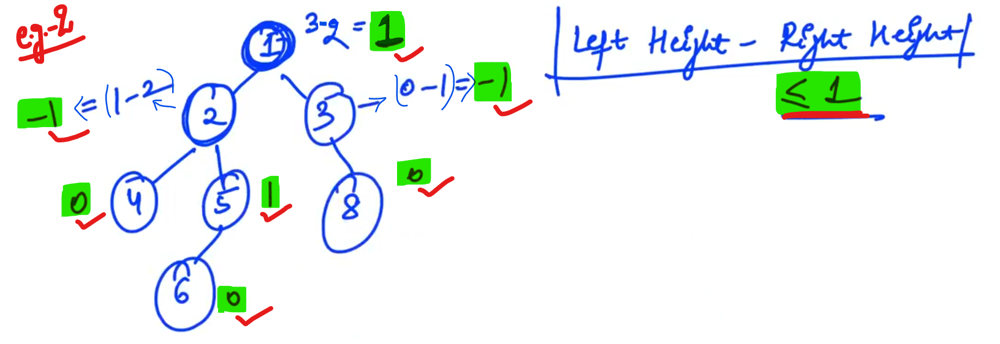

## 1. Balanced[HINT]

We need to check that given Binary Tree is Balanced or not.

Example: 1

Example: 2

-

Problem need to Approach:

-

"a", "b" & "ans" is of type "Pair"

Complexity: O(n)

-

    // For calculating height:
    
    int height = 1 + max(lh, rh);

------------

## 2.Level order traversal[HINT]

Here, we need to print every level in different new lines.

Create a queue "q" first.

Whenever level got finish we will insert "NULL" in queue. (Just as an Indicator that level finished after this element.)

We need to insert "root" in the queue "q" and as we know after "root" level got finish then we need to insert "NULL" also...

Then run loop in the queue till our queue will not empty.

<u>Solution for "infinte loop"</u>:

At last check if "NULL" comes out i.e. Queue "q" is empty then break loop and come out of the loop... and if it's not empty then proceed with the same steps... (i.e. print the new line and insert the NULL...)

-----------

## 3.Remove Leaf nodes[HINT]

<u>Leaf Nodes</u>: Leaf nodes are those which don't have any children (i.e. left and right both children are NULL)

<u>Base Case</u>: When root is NULL.

When Root is "Leaf Node" then root need to remove: Check root's "left" and "right" is NULL.

Now, Remove leaf nodes in sub-trees using recursion...

Call recursion in both sub-trees of Root.

---------------------

## 4.Level wise linkedlist[HINT]

We have to make separate linked list for each level and save and return the head of the each linked list in the Array.

We need to create a new node "n" of the linked list.

<u>NOTE</u>: 

- When queue "q" is not empty then insert NULL in queue "q" and If queue is Empty then break...

- When NULL comes insert "head" in the output.

- Reset "head" and "tail" to NULL. (So, for new linked list, "head" and "tail" should be NULL)

------------

## 5.ZigZag tree[HINT]

Print the Binary Tree in the Zig-zag order...

Firstly we need to matain two stacks: s1 and s2 (Because we have to print each levels in different line)

When we switch stack, we will print new line.

<u>NOTE</u>:

R    ->    Right,    L    ->    Left

Stack s1 and stack s2 will we empty and we will get our elements at the required order...

---------

