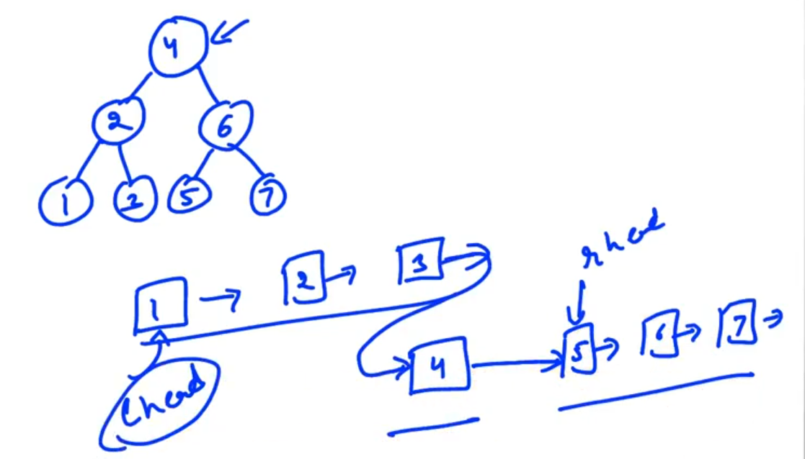
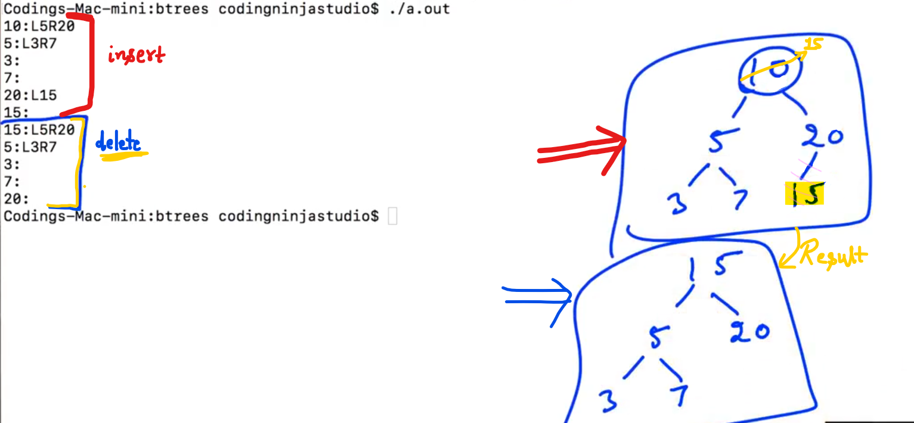
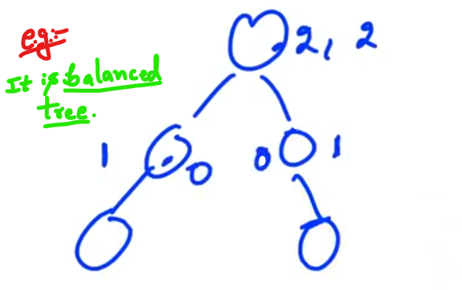

## 0.BST Introduction

Binary Search Trees (BST) inspired from Binary Search Algorithm.

-

If we want to search something linearly in the Array it will take O(n) times.

But if the Array is sorted, we can do Binary Search and it will take O(logn) i.e. much much faster...

Example of Binary Search Tree:


Condition for "Binary Tree" to become "Binary Search Trees"


Examples:


-----------

## 1.Search in BST

Base Case: If the root is NULL return NULL...


--------------

## 3.Print Elements in Range

We want to print all the elements in the Given range...

We can figure out in which direction we want to go...


-----------

## 6.Check BST - 1

Check given Binary Tree is BST or NOT...

NOTE:

Conditions for BST here:

- Root should be <mark>Bigger</mark> than the "max. of the left sub-tree" and Root should be <mark>Less</mark> or equal to the "min. of the right sub-tree".

- Right and left sub-tree should be BST...

```cpp
// INCOMPLETE
// Check BST:
#include <iostream>
#include <queue>
using namespace std;

template <typename T>
class BinaryTreeNode{
    public:
    T data;
    BinaryTreeNode* left;
    BinaryTreeNode* right;

    //Constructor
    BinaryTreeNode(T data){
        this -> data = data;
        left = NULL;
        right = NULL;
    }
    // Recursive Destructor
    ~BinaryTreeNode(){
        delete left;
        delete right;
    }
};

BinaryTreeNode<int>* takeInputLevelWise() {
    int rootData;
    cout << "Enter root data" << endl;
    cin >> rootData;
    if (rootData == -1) {
        return NULL;
    }

    BinaryTreeNode<int>* root = new BinaryTreeNode<int>(rootData);

    queue<BinaryTreeNode<int>*> pendingNodes;
    pendingNodes.push(root);
    while (pendingNodes.size() != 0) {
        BinaryTreeNode<int>* front = pendingNodes.front();
        pendingNodes.pop();
        cout << "Enter left child of " << front->data << endl;
        int leftChildData;
        cin >> leftChildData;
        if (leftChildData != -1) {
            BinaryTreeNode<int>* child = new BinaryTreeNode<int>(leftChildData);
            front->left = child;
            pendingNodes.push(child);
        }
        cout << "Enter right child of " << front->data << endl;
        int rightChildData;
        cin >> rightChildData;
        if (rightChildData != -1){
            BinaryTreeNode<int>* child = new BinaryTreeNode<int>(rightChildData);
            front->right = child;
            pendingNodes.push(child);
        }
    }
    return root;
}

void printTree(BinaryTreeNode<int>* root){
    if(root == NULL){
        return;
    }
    cout << root -> data << ":";
    if(root->left != NULL){
        cout << "L" << root->left->data;
    }

    if(root->right != NULL){
        cout << "R" << root->right->data;
    }
    cout << endl;
    printTree(root->left);
    printTree(root->right);
}

BinaryTreeNode<int>* takeInput(){
    int rootData;
    cout << "Enter data" << endl;
    cin >> rootData;
    if (rootData == -1){
        return NULL;
    }
// Let -1 means return NULL (i.e. User doesn't want to give any tree input)

    BinaryTreeNode<int>* root = new BinaryTreeNode<int>(rootData);
    BinaryTreeNode<int>* leftChild = takeInput();
    BinaryTreeNode<int>* rightChild = takeInput();
    root->left = leftChild;
    root->right = rightChild;
    return root;
}

int numNodes(BinaryTreeNode<int>* root){
    if (root == NULL) {
        return 0;
    }
    return 1 + numNodes(root->left) + numNodes(root->right);
}

// SEE....
void inorder(BinaryTreeNode<int>* root) {
    if (root == NULL) {
        return;
    }
    inorder(root->left);
    cout << root->data << " ";
    inorder(root->right);
}

BinaryTreeNode<int>* buildTreeHelper(int* in, int* pre, int inS, int inE, int preS, int preE) {
    if (inS > inE) {    //Base Case //In case of Empty Array
        return NULL;
    }

    int rootData = pre[preS];
    int rootIndex = -1;
    for (int i = inS; i <= inE; i++) {
        if (in[i] == rootData) {
            rootIndex = i;
            break;
        }
    }

    int lInS = inS;
    int lInE = rootIndex - 1;
    int lPreS = preS + 1;
    int lPreE = lInE - lInS + lPreS;
    int rPreS = lPreE + 1;
    int rPreE = preE;
    int rInS = rootIndex + 1;
    int rInE = inE;
    BinaryTreeNode<int>* root = new BinaryTreeNode<int>(rootData);
    // Recursion on the left sub-Tree:
    root->left = buildTreeHelper(in, pre, lInS, lInE, lPreS, lPreE);
    // Recursion on the right sub-Tree:
    root->right = buildTreeHelper(in, pre, rInS, rInE, rPreS, rPreE);
    return root;
}

BinaryTreeNode<int>* buildTree(int* in, int* pre, int size) {
    return buildTreeHelper(in, pre, 0, size - 1, 0, size - 1);
}

//SEE... (For Height function)
int height(BinaryTreeNode<int>* root) {
    if (root == NULL) {
        return 0;
    }
    return 1 + max(height(root->left), height(root->right));
}

//SEE... (For Diameter function)
int diameter(BinaryTreeNode<int>* root){
    if (root == NULL) {
        return 0;
    }

    int option1 = height(root->left) + height(root->right);
    int option2 = diameter(root->left);
    int option3 = diameter(root->right);
    return max(option1, max(option2, option3));
    // NOTE: "max" is a inbuilt function...
}

pair<int, int> heightDiameter(BinaryTreeNode<int>* root) {
    if (root == NULL) {
        pair<int, int> p;
        p.first = 0;
        p.second = 0;
        return p;
    }
    pair<int, int> leftAns = heightDiameter(root->left);
    pair<int, int> rightAns = heightDiameter(root->right);
    int ld = leftAns.second;
    int lh = leftAns.first;
    int rd = rightAns.second;
    int rh = rightAns.first;

    int height = 1 + max(lh, rh);
    int diameter = max(lh + rh, max(ld, rd));
    pair<int, int> p;
    p.first = height;
    p.second = diameter;
    return p;
}
/* // Incomplete
        return root;
    }   else if (data < root->data) {
        return findNode(root -> left, data);
    }   else {
        return findNode(root->right, data);
    }
}
void printBetweenK1K2(BinaryTreeNode<int>* root, int k1, int k2) {
    if (root == NULL) {
        return;
    }

    if (root->data >= k1 && root->data <= k2) {
        cout << root->data << endl;
    }
    if (root->data > k1) {
        printBetweenK1K2(root->left, k1, k2);
    }

    if (root->data <= k2) {
        printBetweenK1K2(root->right, k1, k2);
    }
}

int maximum(BinaryTreeNode<int>* root) {
    if (root == NULL) {
        return INT_MIN;
    }
    return max(root->data, max(maximum(root->left), maximum(root->right)));
}

int minimum(BinaryTreeNode<int>* root) {
    if (root == NULL ) {
        return INT_MAX;
        // Here positive infinity is the largest number that 
        // I can store in a integer...
    }
    return min(root->data, min(minimum(root->left), minimum(root->right)));
}

bool isBST(BinaryTreeNode<int>* root) {
    if (root == NULL) {
        return true;
    }

    int leftMax = maximum(root->left);
    int rightMin = minimum(root->right);
    bool output = (root->data > leftMax) && (root->data <= rightMin) && isBST(root->left) && isBST(root->right);
    return output;
}

*/

// 1 2 3 4 5 6 7 -1 -1 -1 -1 8 9 -1 -1 -1 -1 -1 -1

int main(){
    BinaryTreeNode<int>* root = takeInputLevelWise();
    /*
    printTree(root);
    printBetweenK1K2(root, 2, 6);
    BinaryTreeNode<int>* search = findNode(root, 3);
    cout << search->data << endl;
    */
    cout << isBST(root) << endl;
    delete root;
}
```

Output - 1:


Output - 2:


Output - 3:


-

Now, Time Complexity:

To find maximum and minimum we have to go to each Node...


-

For good Time Complexity; we need to find "max, min and IsBST" together...


---------------

## 7.Check BST - 2

We can find overall min and overall max


-


-

```cpp
// Incomplete 
#include <iostream>
#include <queue>
using namespace std;

template <typename T>
class BinaryTreeNode{
    public:
    T data;
    BinaryTreeNode* left;
    BinaryTreeNode* right;

    //Constructor
    BinaryTreeNode(T data){
        this -> data = data;
        left = NULL;
        right = NULL;
    }
    // Recursive Destructor
    ~BinaryTreeNode(){
        delete left;
        delete right;
    }
};

BinaryTreeNode<int>* takeInputLevelWise() {
    int rootData;
    cout << "Enter root data" << endl;
    cin >> rootData;
    if (rootData == -1) {
        return NULL;
    }

    BinaryTreeNode<int>* root = new BinaryTreeNode<int>(rootData);

    queue<BinaryTreeNode<int>*> pendingNodes;
    pendingNodes.push(root);
    while (pendingNodes.size() != 0) {
        BinaryTreeNode<int>* front = pendingNodes.front();
        pendingNodes.pop();
        cout << "Enter left child of " << front->data << endl;
        int leftChildData;
        cin >> leftChildData;
        if (leftChildData != -1) {
            BinaryTreeNode<int>* child = new BinaryTreeNode<int>(leftChildData);
            front->left = child;
            pendingNodes.push(child);
        }
        cout << "Enter right child of " << front->data << endl;
        int rightChildData;
        cin >> rightChildData;
        if (rightChildData != -1){
            BinaryTreeNode<int>* child = new BinaryTreeNode<int>(rightChildData);
            front->right = child;
            pendingNodes.push(child);
        }
    }
    return root;
}

void printTree(BinaryTreeNode<int>* root){
    if(root == NULL){
        return;
    }
    cout << root -> data << ":";
    if(root->left != NULL){
        cout << "L" << root->left->data;
    }

    if(root->right != NULL){
        cout << "R" << root->right->data;
    }
    cout << endl;
    printTree(root->left);
    printTree(root->right);
}

BinaryTreeNode<int>* takeInput(){
    int rootData;
    cout << "Enter data" << endl;
    cin >> rootData;
    if (rootData == -1){
        return NULL;
    }
// Let -1 means return NULL (i.e. User doesn't want to give any tree input)

    BinaryTreeNode<int>* root = new BinaryTreeNode<int>(rootData);
    BinaryTreeNode<int>* leftChild = takeInput();
    BinaryTreeNode<int>* rightChild = takeInput();
    root->left = leftChild;
    root->right = rightChild;
    return root;
}

int numNodes(BinaryTreeNode<int>* root){
    if (root == NULL) {
        return 0;
    }
    return 1 + numNodes(root->left) + numNodes(root->right);
}

// SEE....
void inorder(BinaryTreeNode<int>* root) {
    if (root == NULL) {
        return;
    }
    inorder(root->left);
    cout << root->data << " ";
    inorder(root->right);
}

BinaryTreeNode<int>* buildTreeHelper(int* in, int* pre, int inS, int inE, int preS, int preE) {
    if (inS > inE) {    //Base Case //In case of Empty Array
        return NULL;
    }

    int rootData = pre[preS];
    int rootIndex = -1;
    for (int i = inS; i <= inE; i++) {
        if (in[i] == rootData) {
            rootIndex = i;
            break;
        }
    }

    int lInS = inS;
    int lInE = rootIndex - 1;
    int lPreS = preS + 1;
    int lPreE = lInE - lInS + lPreS;
    int rPreS = lPreE + 1;
    int rPreE = preE;
    int rInS = rootIndex + 1;
    int rInE = inE;
    BinaryTreeNode<int>* root = new BinaryTreeNode<int>(rootData);
    // Recursion on the left sub-Tree:
    root->left = buildTreeHelper(in, pre, lInS, lInE, lPreS, lPreE);
    // Recursion on the right sub-Tree:
    root->right = buildTreeHelper(in, pre, rInS, rInE, rPreS, rPreE);
    return root;
}

BinaryTreeNode<int>* buildTree(int* in, int* pre, int size) {
    return buildTreeHelper(in, pre, 0, size - 1, 0, size - 1);
}

//SEE... (For Height function)
int height(BinaryTreeNode<int>* root) {
    if (root == NULL) {
        return 0;
    }
    return 1 + max(height(root->left), height(root->right));
}

//SEE... (For Diameter function)
int diameter(BinaryTreeNode<int>* root){
    if (root == NULL) {
        return 0;
    }

    int option1 = height(root->left) + height(root->right);
    int option2 = diameter(root->left);
    int option3 = diameter(root->right);
    return max(option1, max(option2, option3));
    // NOTE: "max" is a inbuilt function...
}

pair<int, int> heightDiameter(BinaryTreeNode<int>* root) {
    if (root == NULL) {
        pair<int, int> p;
        p.first = 0;
        p.second = 0;
        return p;
    }
    pair<int, int> leftAns = heightDiameter(root->left);
    pair<int, int> rightAns = heightDiameter(root->right);
    int ld = leftAns.second;
    int lh = leftAns.first;
    int rd = rightAns.second;
    int rh = rightAns.first;

    int height = 1 + max(lh, rh);
    int diameter = max(lh + rh, max(ld, rd));
    pair<int, int> p;
    p.first = height;
    p.second = diameter;
    return p;
}
/* // Incomplete
        return root;
    }   else if (data < root->data) {
        return findNode(root -> left, data);
    }   else {
        return findNode(root->right, data);
    }
}
void printBetweenK1K2(BinaryTreeNode<int>* root, int k1, int k2) {
    if (root == NULL) {
        return;
    }

    if (root->data >= k1 && root->data <= k2) {
        cout << root->data << endl;
    }
    if (root->data > k1) {
        printBetweenK1K2(root->left, k1, k2);
    }

    if (root->data <= k2) {
        printBetweenK1K2(root->right, k1, k2);
    }
}

int maximum(BinaryTreeNode<int>* root) {
    if (root == NULL) {
        return INT_MIN;
    }
    return max(root->data, max(maximum(root->left), maximum(root->right)));
}

int minimum(BinaryTreeNode<int>* root) {
    if (root == NULL ) {
        return INT_MAX;
        // Here positive infinity is the largest number that 
        // I can store in a integer...
    }
    return min(root->data, min(minimum(root->left), minimum(root->right)));
}

bool isBST(BinaryTreeNode<int>* root) {
    if (root == NULL) {
        return true;
    }

    int leftMax = maximum(root->left);
    int rightMin = minimum(root->right);
    bool output = (root->data > leftMax) && (root->data <= rightMin) && isBST(root->left) && isBST(root->right);
    return output;
}

class IsBSTReturn {
    public:
        bool isBST;
        int minimum;
        int maximum;
}

IsBSTReturn isBST2(BinaryTreeNode<int>* root) {
    if (root == NULL) {
        IsBSTReturn output;
        output.isBST = true;
        output.minimum = INT_MAX;
        output.maximum = INT_MIN;
        return output;
    }
    IsBSTReturn leftOutput = isBST2(root->left);
    IsBSTReturn rightOutput = isBST2(root->right);
    int minimum = min(root->data, min(leftOutput.minimum, rightOutput.minimum));
    int maximum = max(root->data, max(leftOutput.maximum, rightOutput.maximum));
    bool isBSTFinal = (root->data > leftOutput.maximum) && (root->data <= rightOutput.minimum) &&
        leftOutput.isBST && rightOutput.isBST;
    IsBSTReturn output;
    output.minimum = minimum;
    output.maximum = maximum;
    output.isBST = isBSTFinal;
    return output;

}
*/

// 1 2 3 4 5 6 7 -1 -1 -1 -1 8 9 -1 -1 -1 -1 -1 -1

int main(){
    BinaryTreeNode<int>* root = takeInputLevelWise();
    /*
    printTree(root);
    printBetweenK1K2(root, 2, 6);
    BinaryTreeNode<int>* search = findNode(root, 3);
    cout << search->data << endl;
    */
    cout << isBST(root) << endl;
    delete root;
}
```

-------------

## 8.Check BST - 3


-

```cpp
 // Incomplete
#include <iostream>
#include <queue>
using namespace std;

template <typename T>
class BinaryTreeNode{
    public:
    T data;
    BinaryTreeNode* left;
    BinaryTreeNode* right;

    //Constructor
    BinaryTreeNode(T data){
        this -> data = data;
        left = NULL;
        right = NULL;
    }
    // Recursive Destructor
    ~BinaryTreeNode(){
        delete left;
        delete right;
    }
};

BinaryTreeNode<int>* takeInputLevelWise() {
    int rootData;
    cout << "Enter root data" << endl;
    cin >> rootData;
    if (rootData == -1) {
        return NULL;
    }

    BinaryTreeNode<int>* root = new BinaryTreeNode<int>(rootData);

    queue<BinaryTreeNode<int>*> pendingNodes;
    pendingNodes.push(root);
    while (pendingNodes.size() != 0) {
        BinaryTreeNode<int>* front = pendingNodes.front();
        pendingNodes.pop();
        cout << "Enter left child of " << front->data << endl;
        int leftChildData;
        cin >> leftChildData;
        if (leftChildData != -1) {
            BinaryTreeNode<int>* child = new BinaryTreeNode<int>(leftChildData);
            front->left = child;
            pendingNodes.push(child);
        }
        cout << "Enter right child of " << front->data << endl;
        int rightChildData;
        cin >> rightChildData;
        if (rightChildData != -1){
            BinaryTreeNode<int>* child = new BinaryTreeNode<int>(rightChildData);
            front->right = child;
            pendingNodes.push(child);
        }
    }
    return root;
}

void printTree(BinaryTreeNode<int>* root){
    if(root == NULL){
        return;
    }
    cout << root -> data << ":";
    if(root->left != NULL){
        cout << "L" << root->left->data;
    }

    if(root->right != NULL){
        cout << "R" << root->right->data;
    }
    cout << endl;
    printTree(root->left);
    printTree(root->right);
}

BinaryTreeNode<int>* takeInput(){
    int rootData;
    cout << "Enter data" << endl;
    cin >> rootData;
    if (rootData == -1){
        return NULL;
    }
// Let -1 means return NULL (i.e. User doesn't want to give any tree input)

    BinaryTreeNode<int>* root = new BinaryTreeNode<int>(rootData);
    BinaryTreeNode<int>* leftChild = takeInput();
    BinaryTreeNode<int>* rightChild = takeInput();
    root->left = leftChild;
    root->right = rightChild;
    return root;
}

int numNodes(BinaryTreeNode<int>* root){
    if (root == NULL) {
        return 0;
    }
    return 1 + numNodes(root->left) + numNodes(root->right);
}

// SEE....
void inorder(BinaryTreeNode<int>* root) {
    if (root == NULL) {
        return;
    }
    inorder(root->left);
    cout << root->data << " ";
    inorder(root->right);
}

BinaryTreeNode<int>* buildTreeHelper(int* in, int* pre, int inS, int inE, int preS, int preE) {
    if (inS > inE) {    //Base Case //In case of Empty Array
        return NULL;
    }

    int rootData = pre[preS];
    int rootIndex = -1;
    for (int i = inS; i <= inE; i++) {
        if (in[i] == rootData) {
            rootIndex = i;
            break;
        }
    }

    int lInS = inS;
    int lInE = rootIndex - 1;
    int lPreS = preS + 1;
    int lPreE = lInE - lInS + lPreS;
    int rPreS = lPreE + 1;
    int rPreE = preE;
    int rInS = rootIndex + 1;
    int rInE = inE;
    BinaryTreeNode<int>* root = new BinaryTreeNode<int>(rootData);
    // Recursion on the left sub-Tree:
    root->left = buildTreeHelper(in, pre, lInS, lInE, lPreS, lPreE);
    // Recursion on the right sub-Tree:
    root->right = buildTreeHelper(in, pre, rInS, rInE, rPreS, rPreE);
    return root;
}

BinaryTreeNode<int>* buildTree(int* in, int* pre, int size) {
    return buildTreeHelper(in, pre, 0, size - 1, 0, size - 1);
}

//SEE... (For Height function)
int height(BinaryTreeNode<int>* root) {
    if (root == NULL) {
        return 0;
    }
    return 1 + max(height(root->left), height(root->right));
}

//SEE... (For Diameter function)
int diameter(BinaryTreeNode<int>* root){
    if (root == NULL) {
        return 0;
    }

    int option1 = height(root->left) + height(root->right);
    int option2 = diameter(root->left);
    int option3 = diameter(root->right);
    return max(option1, max(option2, option3));
    // NOTE: "max" is a inbuilt function...
}

pair<int, int> heightDiameter(BinaryTreeNode<int>* root) {
    if (root == NULL) {
        pair<int, int> p;
        p.first = 0;
        p.second = 0;
        return p;
    }
    pair<int, int> leftAns = heightDiameter(root->left);
    pair<int, int> rightAns = heightDiameter(root->right);
    int ld = leftAns.second;
    int lh = leftAns.first;
    int rd = rightAns.second;
    int rh = rightAns.first;

    int height = 1 + max(lh, rh);
    int diameter = max(lh + rh, max(ld, rd));
    pair<int, int> p;
    p.first = height;
    p.second = diameter;
    return p;
}
/* // Incomplete
        return root;
    }   else if (data < root->data) {
        return findNode(root -> left, data);
    }   else {
        return findNode(root->right, data);
    }
}
void printBetweenK1K2(BinaryTreeNode<int>* root, int k1, int k2) {
    if (root == NULL) {
        return;
    }

    if (root->data >= k1 && root->data <= k2) {
        cout << root->data << endl;
    }
    if (root->data > k1) {
        printBetweenK1K2(root->left, k1, k2);
    }

    if (root->data <= k2) {
        printBetweenK1K2(root->right, k1, k2);
    }
}

int maximum(BinaryTreeNode<int>* root) {
    if (root == NULL) {
        return INT_MIN;
    }
    return max(root->data, max(maximum(root->left), maximum(root->right)));
}

int minimum(BinaryTreeNode<int>* root) {
    if (root == NULL ) {
        return INT_MAX;
        // Here positive infinity is the largest number that 
        // I can store in a integer...
    }
    return min(root->data, min(minimum(root->left), minimum(root->right)));
}

bool isBST(BinaryTreeNode<int>* root) {
    if (root == NULL) {
        return true;
    }

    int leftMax = maximum(root->left);
    int rightMin = minimum(root->right);
    bool output = (root->data > leftMax) && (root->data <= rightMin) && isBST(root->left) && isBST(root->right);
    return output;
}

class IsBSTReturn {
    public:
        bool isBST;
        int minimum;
        int maximum;
}

IsBSTReturn isBST2(BinaryTreeNode<int>* root) {
    if (root == NULL) {
        IsBSTReturn output;
        output.isBST = true;
        output.minimum = INT_MAX;
        output.maximum = INT_MIN;
        return output;
    }
    IsBSTReturn leftOutput = isBST2(root->left);
    IsBSTReturn rightOutput = isBST2(root->right);
    int minimum = min(root->data, min(leftOutput.minimum, rightOutput.minimum));
    int maximum = max(root->data, max(leftOutput.maximum, rightOutput.maximum));
    bool isBSTFinal = (root->data > leftOutput.maximum) && (root->data <= rightOutput.minimum) &&
        leftOutput.isBST && rightOutput.isBST;
    IsBSTReturn output;
    output.minimum = minimum;
    output.maximum = maximum;
    output.isBST = isBSTFinal;
    return output;
}

bool isBST3(BinaryTreeNode<int>* root,int min = INT_MIN, int max = INT_MAX) {
    if (root == NULL) {
        return true;
    }
    if (root->data < min || root->data > max) {
        return false;
    }
    bool isLeftOk = isBST3(root->left, min, root->data - 1);
    bool isRightOk = isBST3(root->right, root->data, max);
    return isLeftOk && isRightOk;
}
*/

// 1 2 3 4 5 6 7 -1 -1 -1 -1 8 9 -1 -1 -1 -1 -1 -1
//Example for BST:
// BST: 4 2 6 1 3 5 7 -1 -1 -1 -1 -1-1 -1 -1
// Not a BST: 4 2 6 1 30 5 7 -1 -1 -1 -1 -1-1 -1 -1

int main(){
    BinaryTreeNode<int>* root = takeInputLevelWise();
    /*
    printTree(root);
    printBetweenK1K2(root, 2, 6);
    BinaryTreeNode<int>* search = findNode(root, 3);
    cout << search->data << endl;
    */
    cout << isBST(root) << endl;
    cout << isBST3(root) << endl;
    delete root;
}
```

Output 1: (BST)


Output 2: (Not a BST)


---------------

## 9.Construct BST from a Sorted Array


Now in case of the Balanced one i.e. Equal number of nodes both sides...

Steps: Make the middle one root and call recursion for left and right sub-tree

si => start index

ei => end index


------------

## 11.BST to Sorted LL


-



-


lh    ->    left head

lt    ->    left tail

rh    ->    right head

rt    ->    right tail

t    ->    temp

------------------------

## 13.Root to Node Path in Binary Tree

- Base Case: If root is NULL, then return NULL vector... i.e. vector<int>*

- Case: If root data is equal to the required node data then we make a new vector, add the root data into that vector and return the data in the vector.

Example:


-

```cpp
 // Incomplete
#include <iostream>
#include <queue>
using namespace std;

template <typename T>
class BinaryTreeNode{
    public:
    T data;
    BinaryTreeNode* left;
    BinaryTreeNode* right;

    //Constructor
    BinaryTreeNode(T data){
        this -> data = data;
        left = NULL;
        right = NULL;
    }
    // Recursive Destructor
    ~BinaryTreeNode(){
        delete left;
        delete right;
    }
};

BinaryTreeNode<int>* takeInputLevelWise() {
    int rootData;
    cout << "Enter root data" << endl;
    cin >> rootData;
    if (rootData == -1) {
        return NULL;
    }

    BinaryTreeNode<int>* root = new BinaryTreeNode<int>(rootData);

    queue<BinaryTreeNode<int>*> pendingNodes;
    pendingNodes.push(root);
    while (pendingNodes.size() != 0) {
        BinaryTreeNode<int>* front = pendingNodes.front();
        pendingNodes.pop();
        cout << "Enter left child of " << front->data << endl;
        int leftChildData;
        cin >> leftChildData;
        if (leftChildData != -1) {
            BinaryTreeNode<int>* child = new BinaryTreeNode<int>(leftChildData);
            front->left = child;
            pendingNodes.push(child);
        }
        cout << "Enter right child of " << front->data << endl;
        int rightChildData;
        cin >> rightChildData;
        if (rightChildData != -1){
            BinaryTreeNode<int>* child = new BinaryTreeNode<int>(rightChildData);
            front->right = child;
            pendingNodes.push(child);
        }
    }
    return root;
}

void printTree(BinaryTreeNode<int>* root){
    if(root == NULL){
        return;
    }
    cout << root -> data << ":";
    if(root->left != NULL){
        cout << "L" << root->left->data;
    }

    if(root->right != NULL){
        cout << "R" << root->right->data;
    }
    cout << endl;
    printTree(root->left);
    printTree(root->right);
}

BinaryTreeNode<int>* takeInput(){
    int rootData;
    cout << "Enter data" << endl;
    cin >> rootData;
    if (rootData == -1){
        return NULL;
    }
// Let -1 means return NULL (i.e. User doesn't want to give any tree input)

    BinaryTreeNode<int>* root = new BinaryTreeNode<int>(rootData);
    BinaryTreeNode<int>* leftChild = takeInput();
    BinaryTreeNode<int>* rightChild = takeInput();
    root->left = leftChild;
    root->right = rightChild;
    return root;
}

int numNodes(BinaryTreeNode<int>* root){
    if (root == NULL) {
        return 0;
    }
    return 1 + numNodes(root->left) + numNodes(root->right);
}

// SEE....
void inorder(BinaryTreeNode<int>* root) {
    if (root == NULL) {
        return;
    }
    inorder(root->left);
    cout << root->data << " ";
    inorder(root->right);
}

BinaryTreeNode<int>* buildTreeHelper(int* in, int* pre, int inS, int inE, int preS, int preE) {
    if (inS > inE) {    //Base Case //In case of Empty Array
        return NULL;
    }

    int rootData = pre[preS];
    int rootIndex = -1;
    for (int i = inS; i <= inE; i++) {
        if (in[i] == rootData) {
            rootIndex = i;
            break;
        }
    }

    int lInS = inS;
    int lInE = rootIndex - 1;
    int lPreS = preS + 1;
    int lPreE = lInE - lInS + lPreS;
    int rPreS = lPreE + 1;
    int rPreE = preE;
    int rInS = rootIndex + 1;
    int rInE = inE;
    BinaryTreeNode<int>* root = new BinaryTreeNode<int>(rootData);
    // Recursion on the left sub-Tree:
    root->left = buildTreeHelper(in, pre, lInS, lInE, lPreS, lPreE);
    // Recursion on the right sub-Tree:
    root->right = buildTreeHelper(in, pre, rInS, rInE, rPreS, rPreE);
    return root;
}

BinaryTreeNode<int>* buildTree(int* in, int* pre, int size) {
    return buildTreeHelper(in, pre, 0, size - 1, 0, size - 1);
}

//(For Height function)
int height(BinaryTreeNode<int>* root) {
    if (root == NULL) {
        return 0;
    }
    return 1 + max(height(root->left), height(root->right));
}

//(For Diameter function)
int diameter(BinaryTreeNode<int>* root){
    if (root == NULL) {
        return 0;
    }

    int option1 = height(root->left) + height(root->right);
    int option2 = diameter(root->left);
    int option3 = diameter(root->right);
    return max(option1, max(option2, option3));
    // NOTE: "max" is a inbuilt function...
}

pair<int, int> heightDiameter(BinaryTreeNode<int>* root) {
    if (root == NULL) {
        pair<int, int> p;
        p.first = 0;
        p.second = 0;
        return p;
    }
    pair<int, int> leftAns = heightDiameter(root->left);
    pair<int, int> rightAns = heightDiameter(root->right);
    int ld = leftAns.second;
    int lh = leftAns.first;
    int rd = rightAns.second;
    int rh = rightAns.first;

    int height = 1 + max(lh, rh);
    int diameter = max(lh + rh, max(ld, rd));
    pair<int, int> p;
    p.first = height;
    p.second = diameter;
    return p;
}
/* // Incomplete
        return root;
    }   else if (data < root->data) {
        return findNode(root -> left, data);
    }   else {
        return findNode(root->right, data);
    }
}
void printBetweenK1K2(BinaryTreeNode<int>* root, int k1, int k2) {
    if (root == NULL) {
        return;
    }

    if (root->data >= k1 && root->data <= k2) {
        cout << root->data << endl;
    }
    if (root->data > k1) {
        printBetweenK1K2(root->left, k1, k2);
    }

    if (root->data <= k2) {
        printBetweenK1K2(root->right, k1, k2);
    }
}

int maximum(BinaryTreeNode<int>* root) {
    if (root == NULL) {
        return INT_MIN;
    }
    return max(root->data, max(maximum(root->left), maximum(root->right)));
}

int minimum(BinaryTreeNode<int>* root) {
    if (root == NULL ) {
        return INT_MAX;
        // Here positive infinity is the largest number that 
        // I can store in a integer...
    }
    return min(root->data, min(minimum(root->left), minimum(root->right)));
}

bool isBST(BinaryTreeNode<int>* root) {
    if (root == NULL) {
        return true;
    }

    int leftMax = maximum(root->left);
    int rightMin = minimum(root->right);
    bool output = (root->data > leftMax) && (root->data <= rightMin) && isBST(root->left) && isBST(root->right);
    return output;
}

class IsBSTReturn {
    public:
        bool isBST;
        int minimum;
        int maximum;
}

IsBSTReturn isBST2(BinaryTreeNode<int>* root) {
    if (root == NULL) {
        IsBSTReturn output;
        output.isBST = true;
        output.minimum = INT_MAX;
        output.maximum = INT_MIN;
        return output;
    }
    IsBSTReturn leftOutput = isBST2(root->left);
    IsBSTReturn rightOutput = isBST2(root->right);
    int minimum = min(root->data, min(leftOutput.minimum, rightOutput.minimum));
    int maximum = max(root->data, max(leftOutput.maximum, rightOutput.maximum));
    bool isBSTFinal = (root->data > leftOutput.maximum) && (root->data <= rightOutput.minimum) &&
        leftOutput.isBST && rightOutput.isBST;
    IsBSTReturn output;
    output.minimum = minimum;
    output.maximum = maximum;
    output.isBST = isBSTFinal;
    return output;
}

bool isBST3(BinaryTreeNode<int>* root,int min = INT_MIN, int max = INT_MAX) {
    if (root == NULL) {
        return true;
    }
    if (root->data < min || root->data > max) {
        return false;
    }
    bool isLeftOk = isBST3(root->left, min, root->data - 1);
    bool isRightOk = isBST3(root->right, root->data, max);
    return isLeftOk && isRightOk;
}

//SEE..........
vector<int>* getRootToNodePath(BinaryTreeNode<int>* root, int data) {
    if (root == NULL)   {
        return NULL;
    }

    if (root->data == data) {
        vector<int>* output = new vector<int>();    //Dynamically Allocate
        output->push_back(root->data);
        return output;
    }

    vector<int>* leftOutput = getRootToNodePath(root->left, data);
    if (leftOutput != NULL) {
        leftOutput->push_back(root->data);
        return leftOutput;
    }

    vector<int>* rightOutput = getRootToNodePath(root->right, data);
    if (rightOutput != NULL) {
        rightOutput->push_back(root->data);
        return rightOutput;
    }   else  {
        return NULL;
    }

}

*/

// 1 2 3 4 5 6 7 -1 -1 -1 -1 8 9 -1 -1 -1 -1 -1 -1

int main(){
    BinaryTreeNode<int>* root = takeInputLevelWise();
    /*
    cout << isBST(root) << endl;
    cout << isBST3(root) << endl;
    */
    vector<int>* output = getRootToNodePath(root, 8);
    for (int i = 0; i < output->size(); i++) {
        cout << output->at(i) << endl;
    }
    delete output;
    delete root;
}
```

Output:


--------------

## 15.BST Class

Three basic functions: search, insert and delete

Program (for Search):


-

```cpp
//#include "BinaryTreeNode.h"
class BST {
    BinaryTreeNode<int>* root;

    public:

    BST(){
        root = NULL;
    }

    ~BST() {
        delete root;
    }

    void deleteData(int data) {

    }

    void insert(int data) {

    }

    private:    //Helper private function:
    bool hasData(int data, BinaryTreeNode<int>* node) {
        if (node == NULL) {
            return false;
        }

        if (node->data == data) {
            return true;
        } else if (data < node->data) {
            return hasData(data, node->left);
        } else {
            return hasData(data, node->right);
        }
    }

    public:
    bool hasData(int data) {
        return hasData(data, root);
    }
};
```

------------------

## 16.BST Class - How to Insert and Delete node

Now, make functions to insert and delete

--

- **Insert case**:

We have to insert in Binary Search Tree (BST)


-

Firstly, Check the base case i.e. if root is NULL then we create the Node and return the node... 

If root is not NULL, we will check that insert in the left side or right side...

We need to return the Root... (Since, in NULL case root gets changed if NULL is in the right side)


--

- **delete case**:

Base case: If root is NULL, we will return... then we will compare "root data" to the one which is going to delete...

When the Root data is smaller than the one which is going to be delete then call in the right side...

When Root data is Bigger than the one which is going to be delete then call the left side...

When Root data is equal to the one which is going to be delete then 

- - if Root has no child then return NULL.
  
  - if Root has one child then return the child.


- - Complication starts when there is data (child) present in the left and right then how will we delete the "root".

<u>Solution</u>: Choose the largest of the left side... that is the good replacement for the current root... 

(OR)

We can choose the smallest in the right side... that is also the good replacement for the current root... And replace it with the "root" then for deletion the smallest in the right side we will use recursion...


--------------------

## 18.BST Class - Insert Delete Solution

```cpp
 // Incomplete
#include <iostream>
#include <queue>
using namespace std;

//BinaryTreeNode.h
template <typename T>
class BinaryTreeNode{
    public:
    T data;
    BinaryTreeNode* left;
    BinaryTreeNode* right;

    //Constructor
    BinaryTreeNode(T data){
        this -> data = data;
        left = NULL;
        right = NULL;
    }
    // Recursive Destructor
    ~BinaryTreeNode(){
        delete left;
        delete right;
    }
};

//BinarySearchTree.h
class BST {
    BinaryTreeNode<int>* root;

    public:

    BST(){
        root = NULL;
    }

    ~BST() {
        delete root;
    }

    private:
    BinaryTreeNode<int>* deleteData(int data, BinaryTreeNode<int>* node) {
        if (node == NULL) {
            return NULL;
        }

        if (data > node->data) {
            node->right = deleteData(data, node->right);
            return node;
        } else if (data < node->data) {
            node->left = deleteData(data, node->left);
            return node;
        } else {
            if (node->left == NULL && node->right == NULL) {
                delete node;
                return NULL;
            } else if (node->left == NULL) {
                BinaryTreeNode<int>* temp = node->right;
                node->right = NULL;
                delete node;
                return temp;
            } else if (node->right == NULL) {
                BinaryTreeNode<int>* temp = node->left;
                node->left = NULL;
                delete node;
                return temp;
            } else {    // Here, replacement is Minimum of right side...
                BinaryTreeNode<int>* minNode = node->right;
                while (minNode -> left != NULL) {
                    minNode = minNode->left;
                }
                int rightMin = minNode->data;
                node->data = rightMin;
                node->right = deleteData(rightMin, node->right);
                return node;
            }
        }
    }

    public:
    void deleteData(int data) {
        root = deleteData(data, root);
    }

    void printTree(BinaryTreeNode<int>* root){
        if(root == NULL){
            return;
        }
        cout << root -> data << ":";
        if(root->left != NULL){
            cout << "L" << root->left->data;
        }

        if(root->right != NULL){
            cout << "R" << root->right->data;
        }
        cout << endl;
        printTree(root->left);
        printTree(root->right);
}

    void printTree() {
        printTree(root);
    }

    private:
    BinaryTreeNode<int>* insert(int data, BinaryTreeNode<int>* node) {
        if (node == NULL) {
            BinaryTreeNode<int>* newNode = new BinaryTreeNode<int>(data);
            return newNode;
        }

        if (data < node->data) {
            node->left = insert(data, node->left);
        } else {
            node->right = insert(data, node->right);
        }
        return node;
    }

    public:
    void insert(int data) {
        this->root = insert(data, this->root);
    }

    private:    //Helper private function:
    bool hasData(int data, BinaryTreeNode<int>* node) {
        if (node == NULL) {
            return false;
        }

        if (node->data == data) {
            return true;
        } else if (data < node->data) {
            return hasData(data, node->left);
        } else {
            return hasData(data, node->right);
        }
    }

    public:
    bool hasData(int data) {
        return hasData(data, root);
    }
};


BinaryTreeNode<int>* takeInputLevelWise() {
    int rootData;
    cout << "Enter root data" << endl;
    cin >> rootData;
    if (rootData == -1) {
        return NULL;
    }

    BinaryTreeNode<int>* root = new BinaryTreeNode<int>(rootData);

    queue<BinaryTreeNode<int>*> pendingNodes;
    pendingNodes.push(root);
    while (pendingNodes.size() != 0) {
        BinaryTreeNode<int>* front = pendingNodes.front();
        pendingNodes.pop();
        cout << "Enter left child of " << front->data << endl;
        int leftChildData;
        cin >> leftChildData;
        if (leftChildData != -1) {
            BinaryTreeNode<int>* child = new BinaryTreeNode<int>(leftChildData);
            front->left = child;
            pendingNodes.push(child);
        }
        cout << "Enter right child of " << front->data << endl;
        int rightChildData;
        cin >> rightChildData;
        if (rightChildData != -1){
            BinaryTreeNode<int>* child = new BinaryTreeNode<int>(rightChildData);
            front->right = child;
            pendingNodes.push(child);
        }
    }
    return root;
}

void printTree(BinaryTreeNode<int>* root){
    if(root == NULL){
        return;
    }
    cout << root -> data << ":";
    if(root->left != NULL){
        cout << "L" << root->left->data;
    }

    if(root->right != NULL){
        cout << "R" << root->right->data;
    }
    cout << endl;
    printTree(root->left);
    printTree(root->right);
}

BinaryTreeNode<int>* takeInput(){
    int rootData;
    cout << "Enter data" << endl;
    cin >> rootData;
    if (rootData == -1){
        return NULL;
    }
// Let -1 means return NULL (i.e. User doesn't want to give any tree input)

    BinaryTreeNode<int>* root = new BinaryTreeNode<int>(rootData);
    BinaryTreeNode<int>* leftChild = takeInput();
    BinaryTreeNode<int>* rightChild = takeInput();
    root->left = leftChild;
    root->right = rightChild;
    return root;
}

int numNodes(BinaryTreeNode<int>* root){
    if (root == NULL) {
        return 0;
    }
    return 1 + numNodes(root->left) + numNodes(root->right);
}

// SEE....
void inorder(BinaryTreeNode<int>* root) {
    if (root == NULL) {
        return;
    }
    inorder(root->left);
    cout << root->data << " ";
    inorder(root->right);
}

BinaryTreeNode<int>* buildTreeHelper(int* in, int* pre, int inS, int inE, int preS, int preE) {
    if (inS > inE) {    //Base Case //In case of Empty Array
        return NULL;
    }

    int rootData = pre[preS];
    int rootIndex = -1;
    for (int i = inS; i <= inE; i++) {
        if (in[i] == rootData) {
            rootIndex = i;
            break;
        }
    }

    int lInS = inS;
    int lInE = rootIndex - 1;
    int lPreS = preS + 1;
    int lPreE = lInE - lInS + lPreS;
    int rPreS = lPreE + 1;
    int rPreE = preE;
    int rInS = rootIndex + 1;
    int rInE = inE;
    BinaryTreeNode<int>* root = new BinaryTreeNode<int>(rootData);
    // Recursion on the left sub-Tree:
    root->left = buildTreeHelper(in, pre, lInS, lInE, lPreS, lPreE);
    // Recursion on the right sub-Tree:
    root->right = buildTreeHelper(in, pre, rInS, rInE, rPreS, rPreE);
    return root;
}

BinaryTreeNode<int>* buildTree(int* in, int* pre, int size) {
    return buildTreeHelper(in, pre, 0, size - 1, 0, size - 1);
}

//(For Height function)
int height(BinaryTreeNode<int>* root) {
    if (root == NULL) {
        return 0;
    }
    return 1 + max(height(root->left), height(root->right));
}

//(For Diameter function)
int diameter(BinaryTreeNode<int>* root){
    if (root == NULL) {
        return 0;
    }

    int option1 = height(root->left) + height(root->right);
    int option2 = diameter(root->left);
    int option3 = diameter(root->right);
    return max(option1, max(option2, option3));
    // NOTE: "max" is a inbuilt function...
}

pair<int, int> heightDiameter(BinaryTreeNode<int>* root) {
    if (root == NULL) {
        pair<int, int> p;
        p.first = 0;
        p.second = 0;
        return p;
    }
    pair<int, int> leftAns = heightDiameter(root->left);
    pair<int, int> rightAns = heightDiameter(root->right);
    int ld = leftAns.second;
    int lh = leftAns.first;
    int rd = rightAns.second;
    int rh = rightAns.first;

    int height = 1 + max(lh, rh);
    int diameter = max(lh + rh, max(ld, rd));
    pair<int, int> p;
    p.first = height;
    p.second = diameter;
    return p;
}
/* // Incomplete
        return root;
    }   else if (data < root->data) {
        return findNode(root -> left, data);
    }   else {
        return findNode(root->right, data);
    }
}
void printBetweenK1K2(BinaryTreeNode<int>* root, int k1, int k2) {
    if (root == NULL) {
        return;
    }

    if (root->data >= k1 && root->data <= k2) {
        cout << root->data << endl;
    }
    if (root->data > k1) {
        printBetweenK1K2(root->left, k1, k2);
    }

    if (root->data <= k2) {
        printBetweenK1K2(root->right, k1, k2);
    }
}

int maximum(BinaryTreeNode<int>* root) {
    if (root == NULL) {
        return INT_MIN;
    }
    return max(root->data, max(maximum(root->left), maximum(root->right)));
}

int minimum(BinaryTreeNode<int>* root) {
    if (root == NULL ) {
        return INT_MAX;
        // Here positive infinity is the largest number that 
        // I can store in a integer...
    }
    return min(root->data, min(minimum(root->left), minimum(root->right)));
}

bool isBST(BinaryTreeNode<int>* root) {
    if (root == NULL) {
        return true;
    }

    int leftMax = maximum(root->left);
    int rightMin = minimum(root->right);
    bool output = (root->data > leftMax) && (root->data <= rightMin) && isBST(root->left) && isBST(root->right);
    return output;
}

class IsBSTReturn {
    public:
        bool isBST;
        int minimum;
        int maximum;
}

IsBSTReturn isBST2(BinaryTreeNode<int>* root) {
    if (root == NULL) {
        IsBSTReturn output;
        output.isBST = true;
        output.minimum = INT_MAX;
        output.maximum = INT_MIN;
        return output;
    }
    IsBSTReturn leftOutput = isBST2(root->left);
    IsBSTReturn rightOutput = isBST2(root->right);
    int minimum = min(root->data, min(leftOutput.minimum, rightOutput.minimum));
    int maximum = max(root->data, max(leftOutput.maximum, rightOutput.maximum));
    bool isBSTFinal = (root->data > leftOutput.maximum) && (root->data <= rightOutput.minimum) &&
        leftOutput.isBST && rightOutput.isBST;
    IsBSTReturn output;
    output.minimum = minimum;
    output.maximum = maximum;
    output.isBST = isBSTFinal;
    return output;
}

bool isBST3(BinaryTreeNode<int>* root,int min = INT_MIN, int max = INT_MAX) {
    if (root == NULL) {
        return true;
    }
    if (root->data < min || root->data > max) {
        return false;
    }
    bool isLeftOk = isBST3(root->left, min, root->data - 1);
    bool isRightOk = isBST3(root->right, root->data, max);
    return isLeftOk && isRightOk;
}

//SEE..........
vector<int>* getRootToNodePath(BinaryTreeNode<int>* root, int data) {
    if (root == NULL)   {
        return NULL;
    }

    if (root->data == data) {
        vector<int>* output = new vector<int>();    //Dynamically Allocate
        output->push_back(root->data);
        return output;
    }

    vector<int>* leftOutput = getRootToNodePath(root->left, data);
    if (leftOutput != NULL) {
        leftOutput->push_back(root->data);
        return leftOutput;
    }

    vector<int>* rightOutput = getRootToNodePath(root->right, data);
    if (rightOutput != NULL) {
        rightOutput->push_back(root->data);
        return rightOutput;
    }   else  {
        return NULL;
    }

}

*/

// 1 2 3 4 5 6 7 -1 -1 -1 -1 8 9 -1 -1 -1 -1 -1 -1

int main(){
    BST b;
    b.insert(10);
    b.insert(5);
    b.insert(20);
    b.insert(7);
    b.insert(3);
    b.insert(15);
    b.printTree();
    b.deleteData(10);
    b.deleteData(100);  //Random Number
    b.printTree();
}
```

Output:



-------------

## 19.Types of Balanced BSTs

In BST, For <u>Searching</u> a Node; We have to do O(h) work..


-

Now in case of <u>Insertion</u>: We have to do O(h) work..


-

Now in case of "<u>Deletion</u>":

E.g.: For deleting the minimum: 

<mark>d</mark> work to find the node and 2 times <mark>d'</mark> work to find the minimum and to delete the minimum i.e. again O(h) work...


--

For Balanced Tree: (Conditions)


st    ->    sub-tree

E.g.: 



E.g.:


Here difference is more than "1". So, It is not Balanced Tree (or) Unbalanced Tree...

--

Height for a Balanced Tree is O(log n).


--

We have many Binary Search Tree (BST) types which maintain the Balance:

- AVL Tree

- Red Black Tree

- 2-4 Tree

**<u>AVL Tree</u>**: Slightly Rotate so that we can maintain Height...


----------
