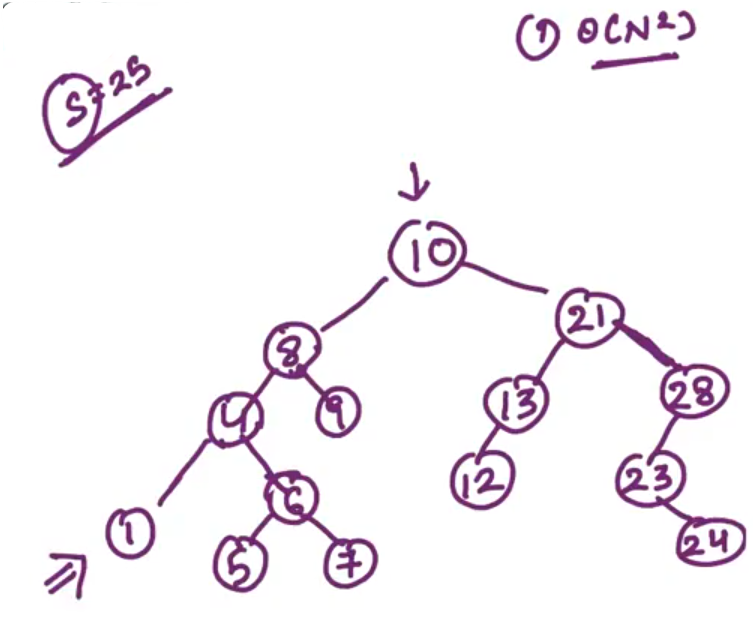

## 0.Create Insert Duplicate Node[HINT]

Put duplicate in the left side...

Example:

Required steps:

- Code for one particular root

- Code to Create dublicate of the root

- Make the Connections properly

- Root should now points to its duplicate

- duplicate should point to its left child...

- Make connections properly

- and a recursive call to the left sub-tree and right sub-tree...

---------------------

## 1.Pair sum Binary Tree[HINT]

GIVEN: Not to print duplicate pairs... (Print pair only once)

Do: 

- For Every node our target is to print its corresponding pair... Once the pair has been printed... We will mark it as used i.e. <mark>-(infinity)</mark>.

- <mark>-(infinity)</mark> is an indicator that Node has already been used and printed...

- If any Node's data value is <mark>-(infinity)</mark>, we are not going to look up for its pair

-

<u>1st Approach</u>:

C. Node     ->    Current Node 

Now the time complexity:

- "find" function will take O(N) time; where "N" is the total number of Nodes in the Binary trees...

- There are "N" nodes in total so, therefore for "N" nodes there is "N" work...

So, overall complexity of our solution is O(N^2). 

NOTE: N^2 is really bad approach...

--

<u>2nd Approach</u>:

Time complexity:

- Firstly, Convert whole tree into Array... So that travelling at every element (whether in in-order, pre-order or post-order) will take O(N) times... 

- Complexity for Sorting the Array will be (N logN).

- scaning every elements once (i.e. i, j changing process), So, for "N" elements we are performing O(N) work...

So, overall time complexity is: <mark>N + N logN + N</mark> i.e. <mark>N logN</mark>.

-

NOTE: In order to save time, we are comprimising space and we have to store all the elements into the Array... So, we require extra Array for the process...

Added space complexity for this approach is: O(N)

------------------------

## 2.LCA of Binary Tree[HINT]

LCA    ->    Lowest Common Ancestor

Find LCA of "n1" and "n2" from left sub-tree and saves at "a".

Find LCA of "n1" and "n2" from right sub-tree and saves at "b".

-------

## 4.Largest BST[HINT]

<u>Time Complexity</u>:

O(n) for a height "n" BST

Therefore Complexity for calculating the largest BST will be:     O(n*h)

Above is the worst case complexity...

<u>Improvement for it</u>:

- Return "min", "max" and "isBST" from the function itself and not calculate "isBST" with the help of another function...

--

Cases:

Call recursion on left and call recursion on right...

In example 1; <mark>height of the tree = max(leftHeight, rightHeight) + 1;</mark> when isBST = True in both left and right sub-tree...

height means height of the largest BST... 

-------------------

## 5.Replace with Sum of greater nodes[HINT]

In a given Binary Tree, and we need to replace every node with sum of values of all nodes that are greater than the current node...

-

(FULL CONFUSING DON'T UNDERSTAND)

root    ->    Node that we are working on...

sum    ->    sum of nodes greater than current node (root)

"replace" function will replace data of all the nodes in the right sub-tree...

root should replace its data with => root + sum + right sum (R.S.)

-

Time Complexity:

We are travelling over every node once; therefore O(N).

------------------

## 6.Path Sum Root to Leaf[HINT]

**---------(Not understand)--------**

Example:

Store the path in a string...

-----------

## 7.Print nodes at distance k from node[HINT]

**---------(Not understand)--------**

<u>Approach - 1</u>:

Step 1: To figure out all the nodes in the path from "root" to that particular node which we are looking for...

<u>Approach - 2</u>:

Here, we are not required to store the path...

k    ->    Distance

element    ->    It is the data of the node that we are looking for...

- Now, int can be "-1"; If the element is <mark>not</mark> reachable from "root". (OR) If it is reachable from "root" it will return "Distance between root & element"

lD    ->    left distance

- If lD is "-1", it means that node is not reachable from the left child of the root...

rD    ->    right distance

- If rD is "-1", it means that node doesn't exist in left and node doesn't exist in right...

- If "rD + 1 = k", it means root is "k" distance apart from the node that we are looking for... then we should print "root".

- If "rD + 1" is not equal to "k" then we should print all nodes in left sub-tree of root, which are at "k-rd-2".

------------

## 8.Pair sum in a BST[HINT]

<u>Approach - 1</u>:

Travel in pre-order, post-order (OR) In-order there will be no issue...

Time Complexity: O(N^2)

"N" is the Total number of nodes in the Tree...

Since, for every node we have to find wheather the other node which makes pair with the Current node exist or not... 

--

<u>Approach - 2</u>:

Convert the complete Binary Tree into a SORTED Array...

<u>NOTE</u>:

**In-order** <mark>(Left    ->    Root    ->    Right)</mark> traversal of Binary Search Tree will give us SORTED Array...

For finding the Pairs; We need to have 2 variables - "i" & "j" and move ahead...

Time Complexity:

- "i" & "j" scan takes O(N) complexity...        +        Converting Binary Tree into sorted Array takes O(N) complexity...

So, overall time complexity will be: O(N).

AND,

Since, we are storing all elements into an Array and the size of the Array will be Number of nodes in the Tree, So that the overall, space complexity will also be O(N).

We need to **<u>improve</u>** the space complexity O(N).

-

Use **Reverse In-order** <mark>(Right    ->    Root    ->    Left)</mark> fashion 

We need to use "Stacks" to store **in-order** & **reverse in-order**...

Lets take a track of total number of elements that we have to scan...

--------------

