## 0.Introduction to Hashmaps

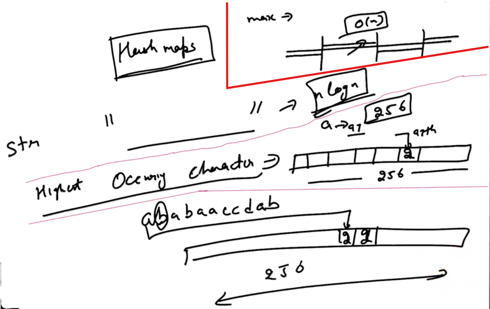

Sorting will take "n logn" time

For figuring out the highest occuring character in sorted string => O(n) 

There are total 256 different characters are possible...

--

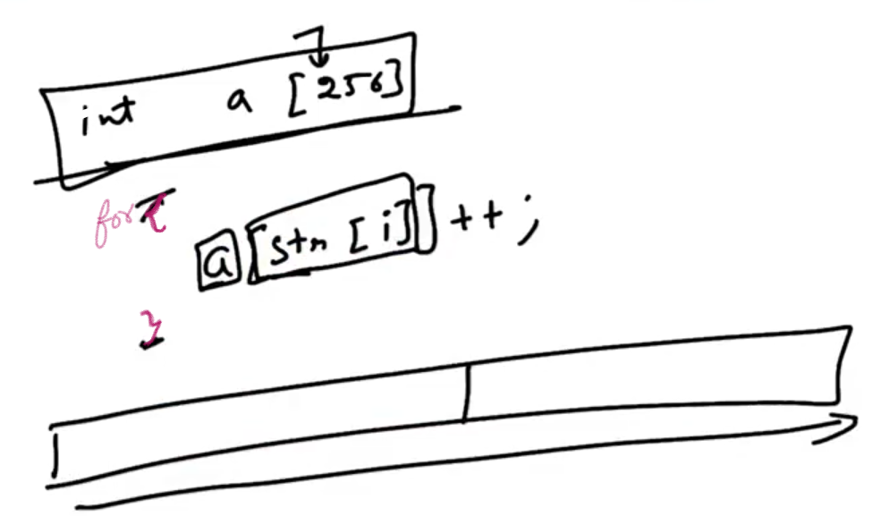

It will take O(n).

--

Find the maximum occuring **word**...

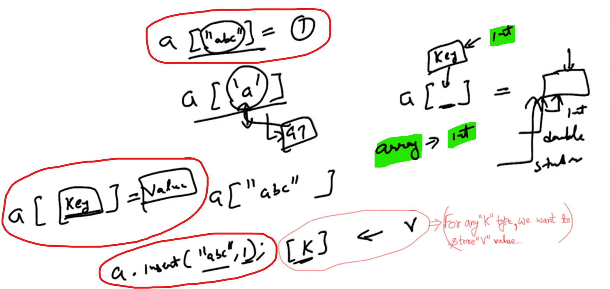

<u>NOTE</u>:

There are infinite possible words; So we can't have an infinite sized Array...

--

So, We need three functions in our Hashmap:


--

Make a linked list and at every node will have a **key as well as a value**...

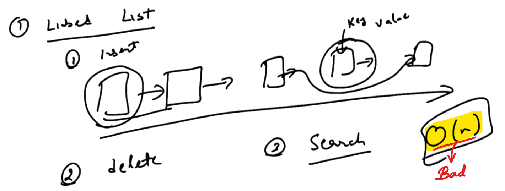

--

Using BST:

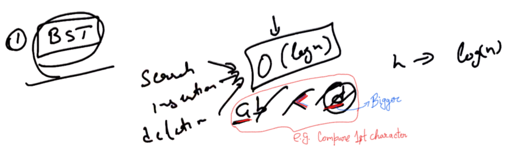

Assume height is "log n"

Inserting a node in a BST is proportional to the height... i.e. "log n"

In BST; Insertion, Deletion and search all are in "O(log n)".

------------

## 1.Inbuilt Hashmap

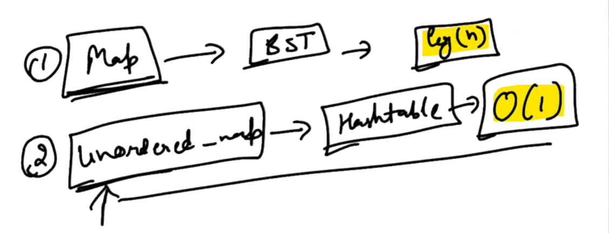

1) Map: It is used using BST. So, Having a O(log n) time complexity.

2) Unordered Map: It is built using HashTable. So, the time complexity is O(1).

```cpp
// Example
#include <iostream>
#include <unordered_map>
#include <string>
using namespace std;

int main() {
    unordered_map<string, int> ourmap;

    // insert elements (i.e. key and value) into the unordered map
    pair<string, int> p("abc", 1);
    ourmap.insert(p);
    ourmap["def"] = 2;  //Also we can use for insert values

    // find or access
    cout << ourmap["abc"] << endl;
    cout << ourmap.at("abc") << endl; // One more way to access the value...
    // (We gave the key and get the value...)

    // cout << ourmap.at("ghi") << endl;   // NOT WORKING // ERROR
    cout << "size : " << ourmap.size() << endl;
    cout << ourmap["ghi"] << endl;
    cout << "size : " << ourmap.size() << endl;

    // check presence
    if (ourmap.count("ghi") > 0) {
        cout << "ghi is present" << endl;
    }

    // erase
    ourmap.erase("ghi");
    cout << "size : " << ourmap.size() << endl;
    if (ourmap.count("ghi") > 0) {
        cout << "ghi is present" << endl;
    }

}
```

<u>Output</u>:

1
1
size : 2
0
size : 3
ghi is present
size : 2

--

Note:

- unordered_map : It is a template it asks what is the type and what is the value...

- unordered_map makes pair to the <key, value>.
  
    We can also use:
  
    map["abc"] = 1

- In a map "key" can come only once... So, <mark>count</mark> function will give either "0" or "1".

--------------

## 2.Remove Duplicates

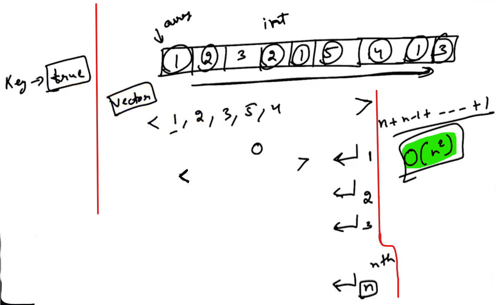

- Search every element in the **Vector**; If element is not present then we will insert the element which will take time complexity of O(n^2).

- We want that the element is present or not and we want to store it in the corresponding to the "key" i.e. TRUE/False

We will use "Map" instead of "Array", since, Map is going to take less space as compare to Array...

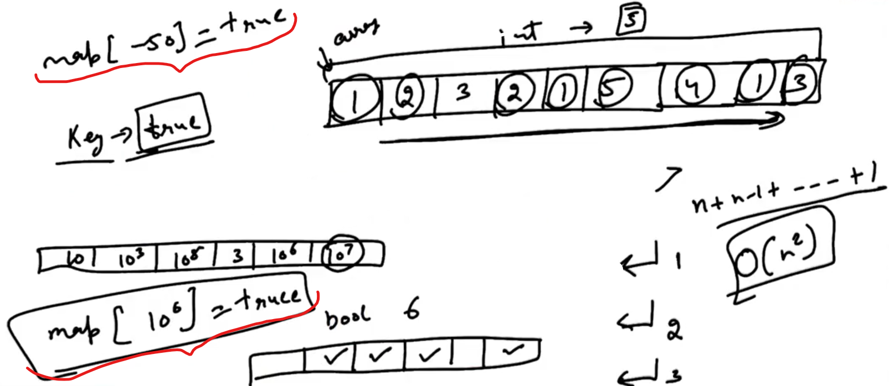

Here, In above if we want use 10^7 as an index in the Array then then we need array of size (10^7 + 1). So, space required is huge...

```cpp
// Example
#include <iostream>
#include <vector>
#include <unordered_map>
using namespace std;

vector<int> removeDuplicates(int* a, int size) {
    vector<int> output;
    unordered_map<int, bool> seen;
    for (int i = 0; i < size; i++) {
        if (seen.count(a[i]) > 0) {
            continue;
        }
        seen[a[i]] = true;
        output.push_back(a[i]);
    }
    return output;
}

int main() {
    int a[] = {1,2,3,3,2,1,4,3,6,5,5};
    vector<int> output = removeDuplicates(a, 11);
    for (int i = 0; i < output.size(); i++) {
        cout << output[i] << endl;
    }
}
```

<u>Output</u>:

1
2
3
4
6
5

-----------------------

## 6.Iterators

To access all the elements in the Map; we use **Iterators**...

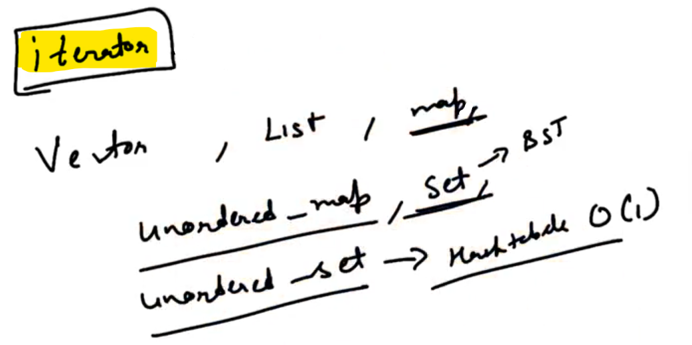

Iterators are use in many inbuilt classes... e.g.: Vector, List (Implementation of Linked list), map, unordered_map, Set, unordered_set

-

Note: 

- A <mark>set</mark> is contain of alot of "keys" not stored the values... But <mark>map</mark> contains of **key and Value** pairs...

- <mark>set</mark> implemented using BST and <mark>unordered_set</mark> using **Hashtables** with O(1).

- In vector, we can use with or without Iterator...

- If we want to erase something in the Vector, so, Iterators are best way to do it...

--

Example:

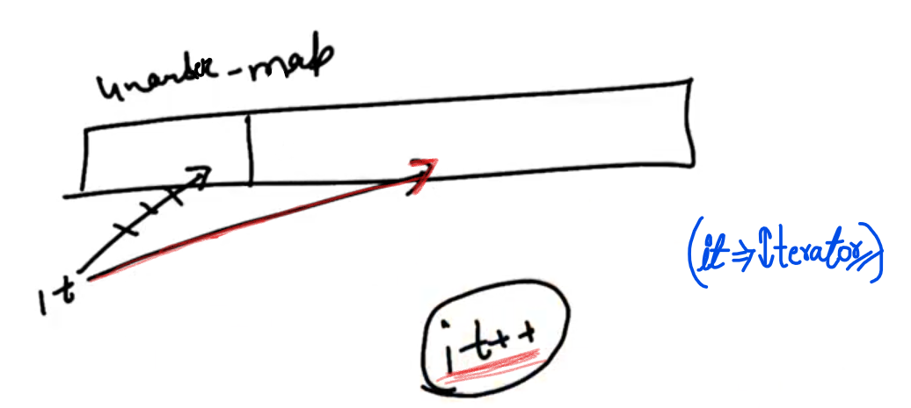

Using it++; we will go to the next element...

-

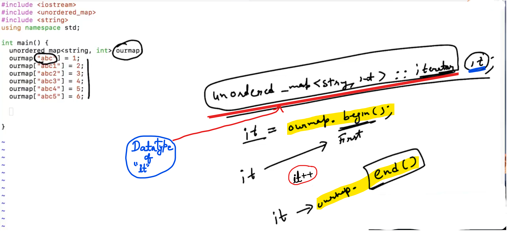

- In map, we have functions: <mark>begin()</mark> and <mark>end()</mark>.

- <mark>end()</mark> doesnot mean we get the Address of the last element, we get address of "after the last element".

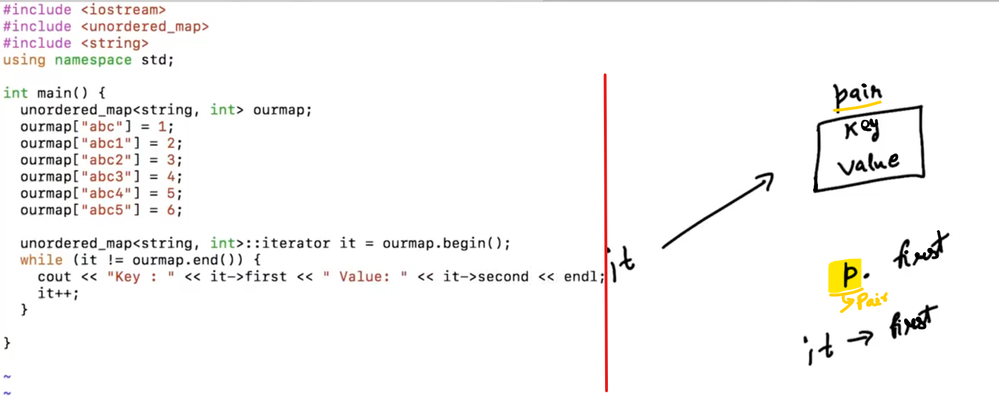

-

```cpp
// Example
#include <iostream>
#include <unordered_map>
#include <vector>
#include <string>
using namespace std;

int main() {
    // Iterator using unordered map
    unordered_map<string, int> ourmap;
    ourmap["abc"] = 1;
    ourmap["abc1"] = 2;
    ourmap["abc2"] = 3;
    ourmap["abc3"] = 4;
    ourmap["abc4"] = 5;
    ourmap["abc5"] = 6;

    unordered_map<string, int>::iterator it = ourmap.begin();
    while (it != ourmap.end()) {
        cout << "Key : " << it->first << " Value: " << it->second << endl;
        it++;
    }

    /*
    // find 
    unordered_map<string, int>::iterator it2 = ourmap.find("abc");
    ourmap.erase(it2, it2 + 4);
    // It will delete: it2, it2+1, it2+2
    */

    //Now, iterator over Vectors
    vector<int> v;
    v.push_back(1);
    v.push_back(2);
    v.push_back(3);
    v.push_back(4);
    v.push_back(5);

    vector<int>::iterator it1 = v.begin();
    while (it1 != v.end()) {
        cout << *it1 << endl;
        it1++;
    }

}
```

<u>Output</u>:

Key : abc4 Value: 5
Key : abc5 Value: 6
Key : abc2 Value: 3
Key : abc1 Value: 2
Key : abc3 Value: 4
Key : abc Value: 1
1
2
3
4
5
-

- Using <mark>find</mark>, we get the iterator...

- erase function can also use Iterator... (And the iterator will delete where it is pointing...)

-----------

## 7.Bucket Array and hash function

We want to store "keys" and "values", so, we want that time taken to store these should be less as well as less time taken to access them...

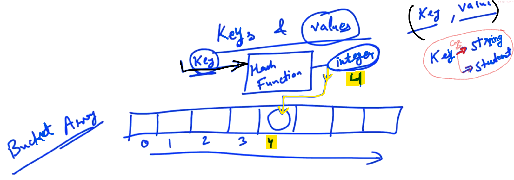

We have "Hash function" through which our key passed and we get an integer and we stored "key" in the index...

--

<u>Hash functions consist of 2 parts</u>:

- Hash code

- Compression function

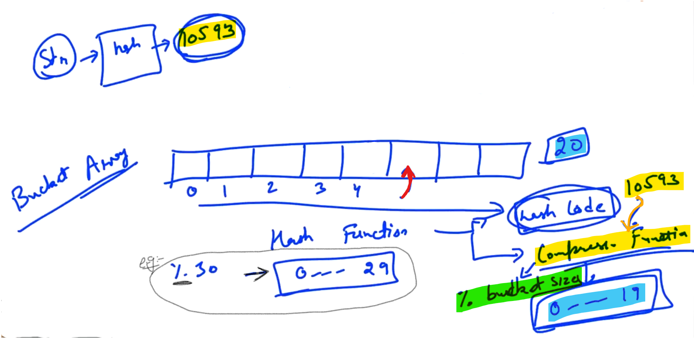

<mark>Steps</mark>:

Hash Code is the way for converting the key into an Integer... (For different keys there should be different Hash Code which will give us Integer...)

Then Integer will pass through the "Compression function" and we will get the Value which will be present at the limit of the Array... then we will store the "key" in the Index (i.e. value we get after the Compression function.)

<u>Note</u>:

A Perfect compression function can be Percentage (%) bucket size...

--

Example:

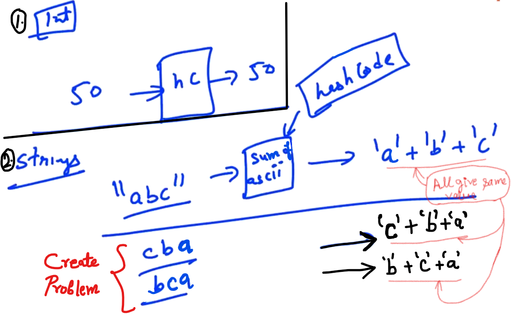

For string above is not a very good Approach...

Popular way of finding Hash Code...

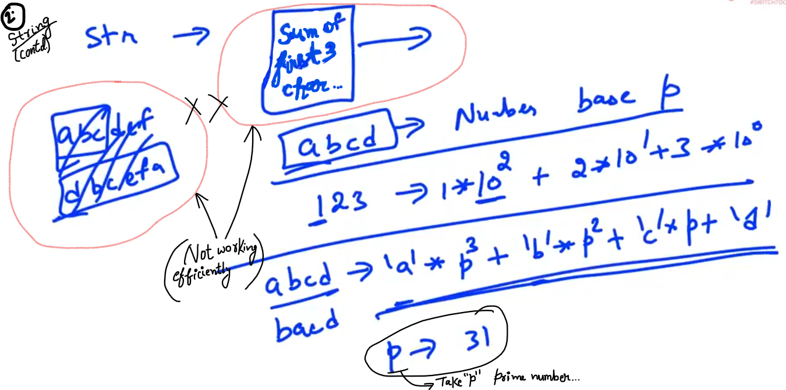

Note: Took "p" as prime number because Prime Number gives very good Distribution...

--

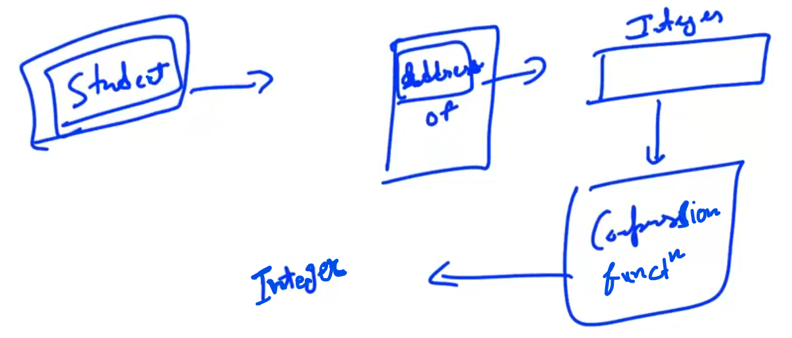

--

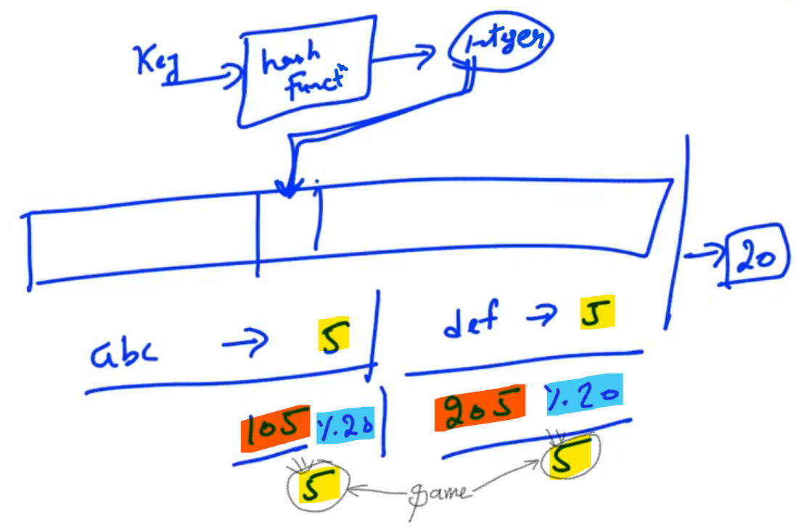

"Hash code" is different but using compression function we get the same value...

Here, possibly problem is 2 keys can go to the same Index... (This is called Collision and we need to handle this...) 

--------

## 8.Collision Handling

It's possible that more than one key would like to go to the same index... So, we need to do collision handling...


We have two ways of doing this:

- Closed Hashing (Closed Addressing)    // Separate Chaining

- Open Addressing

<u>Separate Chaining</u>: Every bucket has separate chain... (Use of Linked List)

<u>Open Addressing</u>: Here, we need to find a Alternate where exactly we need to go, if the default initial box is not available for us...

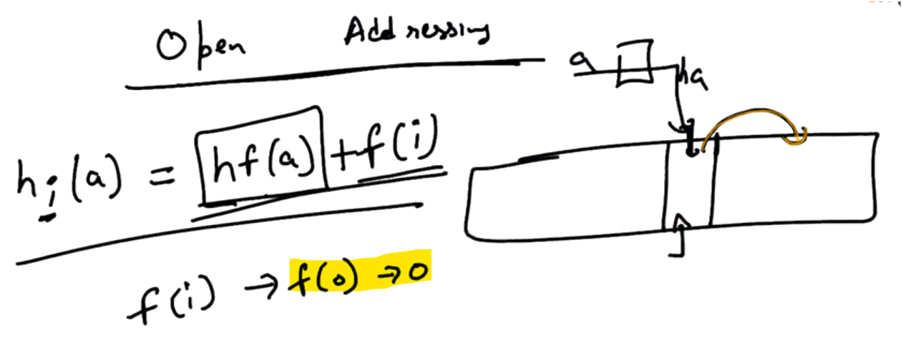

hi(a)    ->    <mark>i</mark>th attempt for "a"

hf(a)    ->    original "hash function"

f(i)    ->    function of "i"

<u>Note</u>: Requirement of f(i) is f(0) -> 0

Now, All different kind of Open Addressing Techniques means a different f(i).

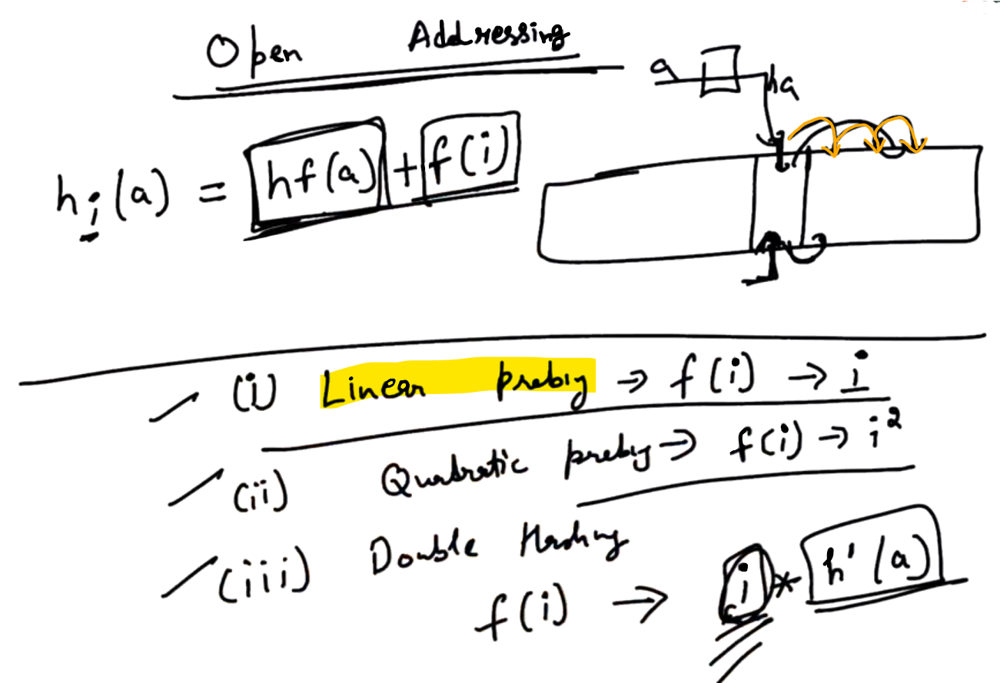

Some Open Addressing Techniques are:

- Linear Probing:     f(i)    ->    i

- Quadratic:     f(i)     ->     i^2

- Double Hashing:      f(i)    ->    i * h'(a)          // h'(a)     ->     Some other hash function

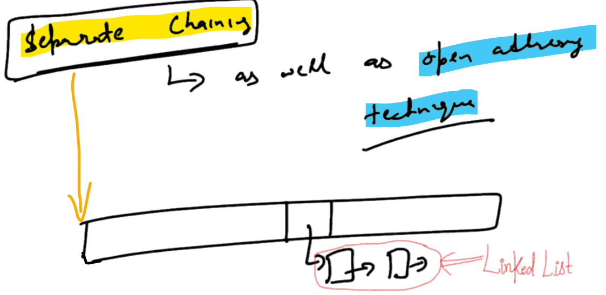

---------------

## 9.Hashmap Implementation - Insert

"key" will be String and "value" will be Template...

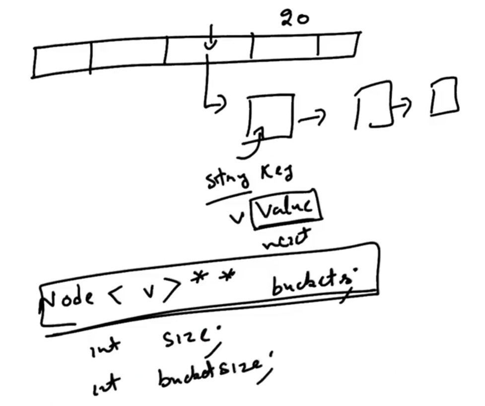

-

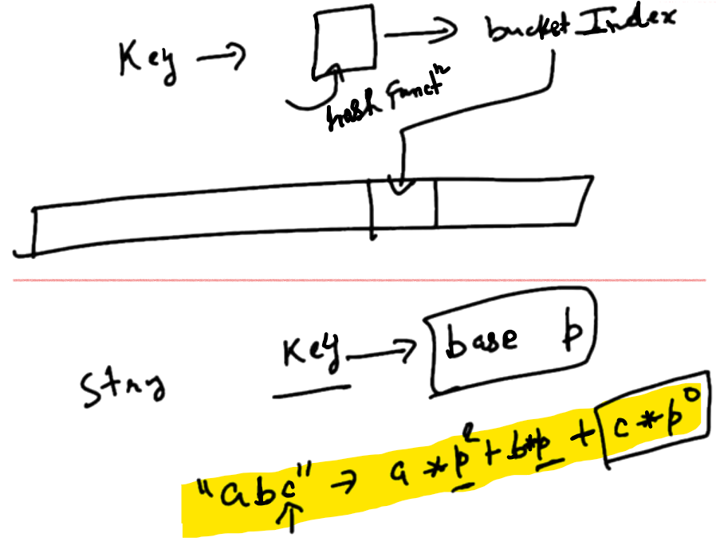

--

Note: (Use of %)

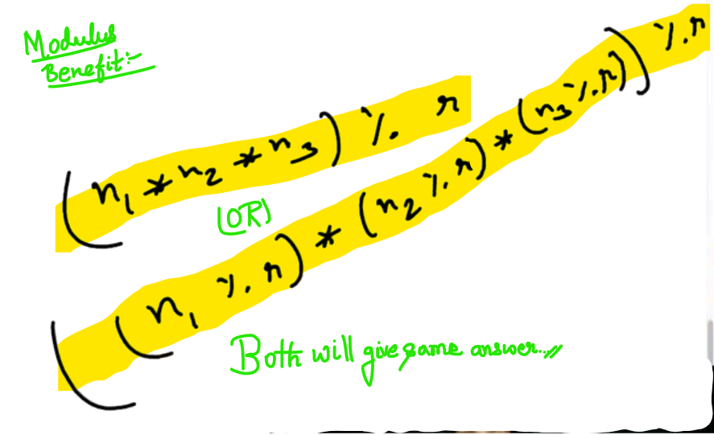

-------------

## 10.Hashmap Implementation - Delete and Search

Contd...


As soon as we find our "key" in the linked list, we need to delete it...

-

```cpp
// Example:

#include <iostream>
#include <string>
using namespace std;

template <typename V>
class MapNode {
    public:
        string key;
        V value;
        MapNode* next;

        MapNode(string key, V value) {
            this->key = key;
            this->value = value;
            next = NULL;
        }

        ~MapNode() {
            delete next;
        }
};

template <typename V>
class ourmap {
    MapNode<V>** buckets;
    int size;
    int numBuckets;

    public:
    ourmap() {
        count = 0;
        numBuckets = 5;
        buckets = new MapNode<V>*[numBuckets];
        for (int i = 0; i < numBuckets; i++) {
            buckets[i] = NULL;
        }
    }

    ~ourmap() {
        for (int i = 0; i < numBuckets; i ++) {
            delete buckets[i];
        }
        delete [] buckets;
    }

    int size() {
        return count;
    }

    V getValue(string key) {
        int bucketIndex = getBucketIndex(string key);
        MapNode<V>* head = buckets[bucketIndex];
        while (head != NULL) {
            if (head->key == key) {
                return head->value;
            }
            head = head->next;
        }
        return 0;
    }

    private:
    int getBucketIndex(string key) {
        int hashCode = 0;

        int currentCoeff = 1;
        for (int i = key.length() - 1; i >= 0; i--) {
            hashCode += key[i] * currentCoeff;
            hashCode = hashCode % numBuckets;
            currentCoeff *= 37;
            currentCoeff = currentCoeff % numBuckets;
        }

        return hashCode % numBuckets;
    }

    public:
    void insert(string key, V value) {
        int bucketIndex = getBucketIndex(string key);
        MapNode<V>* head = buckets[bucketIndex];
        while (head != NULL) {
            if (head->key == key) {
                head->value = value;
                return;
            }
            head = head->next;
        }
        head = buckets[bucketIndex];
        MapNode<V>* node = new MapNode<V>(key, value);
        node->next = head;
        buckets[bucketIndex] = node;
        count++;
    }

    V remove(string key) {
        int bucketIndex = getBucketIndex(string key);
        MapNode<V>* head = buckets[bucketIndex];
        MapNode<V>* prev = NULL;
        while (head != NULL) {
            if (head->key == key) {
                if (prev == NULL) {
                    buckets[bucketIndex] = head->next;
                } else {
                    prev->next = head->next;
                }
                V value = head->value;
                head->next = NULL;
                delete head;    // memory Free
                count--;
                return value;
            }
            prev = head;
            head = head->next;
        }
        return 0;
    }
}
```

Output:

-----------------

## 11.Time complexity and Load factor

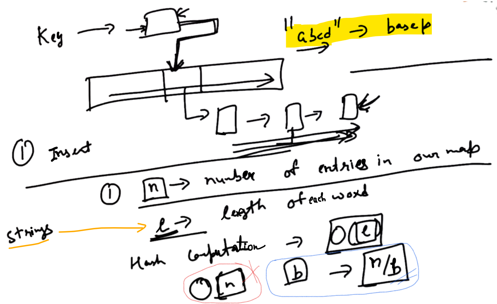

n    ->    number of entries in our Map...

Hash Computation Time: O(l) where "l" is the length of each word... (In case of Strings)

<u>Note</u>:

- E.g: If we put 10^5 entries in the Map then "l" will be negligible as compare to "n". And we will only worry about High orders of "n", we won't worry about small values of "n".

- If we have "b" boxes and "n" entries then each box will consist entries of: (n/b) 
  
  So, none of the box are going to have much bigger than: (n/b)
  
  (n/b) called "Load Factor" and Time Complexity is: O(n/b)
  
  - (n/b) < 0.7, we will assume that every box will have constant number of entries and Time Complexity will be of O(1). 
  
  - Rehashing (By increasing the number of Boxes in the Bucket Array...) for Decreasing the "Load Factor".

<u>Conclusion</u>:

"Load Factor" is that much less so that we can assume Time Complexity will be O(1) for <mark>Insertion</mark>.

Similarly, for <mark>Deletion</mark> and <mark>Finding</mark> the Time Complexity will also be O(1). 

-----------------

## 12.Rehashing

As soon as we insert a new element into our Map then after insertion we are going to check the "Load Factor", If the "load factor" becomes more than 0.7, We are going to "Rehash".

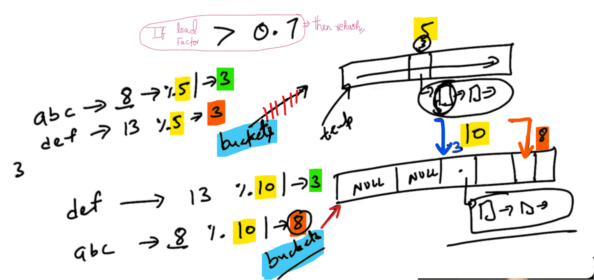

<u>Note</u>:

We can't copy overall linked list, We need to distribute in New Array by finding New Bucket Index 

--

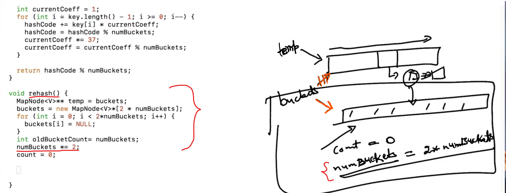

-

```cpp
#include <iostream>
#include <string>
using namespace std;

template <typename V>
class MapNode {
    public:
        string key;
        V value;
        MapNode* next;

        MapNode(string key, V value) {  //Constructor
            this->key = key;
            this->value = value;
            next = NULL;
        }

        ~MapNode() {    //Recursive Destructor
            delete next;
        }
};

template <typename V>
class ourmap {
    MapNode<V>** buckets;
    int count;
    int numBuckets;

    public:
    ourmap() {      // Contructor to initialise good
        count = 0;
        numBuckets = 5;
        buckets = new MapNode<V>*[numBuckets];
        for (int i = 0; i < numBuckets; i++) {
            buckets[i] = NULL;
        }
    }

    ~ourmap() {
        for (int i = 0; i < numBuckets; i ++) {
            delete buckets[i];
        }
        delete [] buckets;
    }

    int size() {
        return count;
    }

    V getValue(string key) {
        int bucketIndex = getBucketIndex(key);
        MapNode<V>* head = buckets[bucketIndex];
        while (head != NULL) {
            if (head->key == key) {
                return head->value;
            }
            head = head->next;
        }
        return 0;
    }

    private:
    int getBucketIndex(string key) {
        int hashCode = 0;

        int currentCoeff = 1;
        for (int i = key.length() - 1; i >= 0; i--) {
            hashCode += key[i] * currentCoeff;
            hashCode = hashCode % numBuckets;
            currentCoeff *= 37;
            currentCoeff = currentCoeff % numBuckets;
        }

        return hashCode % numBuckets;
    }

    void rehash() {
        MapNode<V>** temp = buckets;
        buckets = new MapNode<V>*[2 * numBuckets];
        for (int i = 0; i < 2*numBuckets; i++) {
            buckets[i] = NULL;
        }
        int oldBucketCount = numBuckets;
        numBuckets *= 2;
        count = 0;

        for (int i = 0; i < oldBucketCount; i++) {
            MapNode<V>* head = temp[i];
            while (head != NULL) {
                string key = head->key;
                V value = head->value;
                insert(key, value);
                head = head->next;
            }
        }

        for (int i = 0; i < oldBucketCount; i++) {
            MapNode<V>* head = temp[i];
            delete head;
        }
        delete [] temp;
    }

    public:
    double getLoadFactor(){
        return (1.0*count)/numBuckets;
    }

    public:
    void insert(string key, V value) {
        int bucketIndex = getBucketIndex(key);
        MapNode<V>* head = buckets[bucketIndex];
        while (head != NULL) {
            if (head->key == key) {
                head->value = value;
                return;
            }
            head = head->next;
        }
        head = buckets[bucketIndex];
        MapNode<V>* node = new MapNode<V>(key, value);
        node->next = head;
        buckets[bucketIndex] = node;
        count++;
        double loadFactor = (1.0*count)/numBuckets;
        if (loadFactor > 0.7) {
            rehash();
        }
    }

    V remove(string key) {
        int bucketIndex = getBucketIndex(key);
        MapNode<V>* head = buckets[bucketIndex];
        MapNode<V>* prev = NULL;
        while (head != NULL) {
            if (head->key == key) {
                if (prev == NULL) {
                    buckets[bucketIndex] = head->next;
                } else {
                    prev->next = head->next;
                }
                V value = head->value;
                head->next = NULL;
                delete head;    // memory Free
                count--;
                return value;
            }
            prev = head;
            head = head->next;
        }
        return 0;
    }
};

int main() {
    ourmap<int> map;
    for (int i = 0; i < 10; i++) {
        char c = '0' + i;
        string key = "abc";
        key = key + c;
        int value = i + 1;
        map.insert(key, value);
        cout << map.getLoadFactor() << endl;
    }

    cout << map.size() << endl;
    map.remove("abc2");
    map.remove("abc7");

    cout << map.size() << endl;
    for (int i = 0; i < 10; i++) {
        char c = '0' + i;
        string key = "abc";
        key = key + c;
        cout << key << ":" << map.getValue(key) << endl;
    }

    cout << map.size() << endl;
}
```

Output:

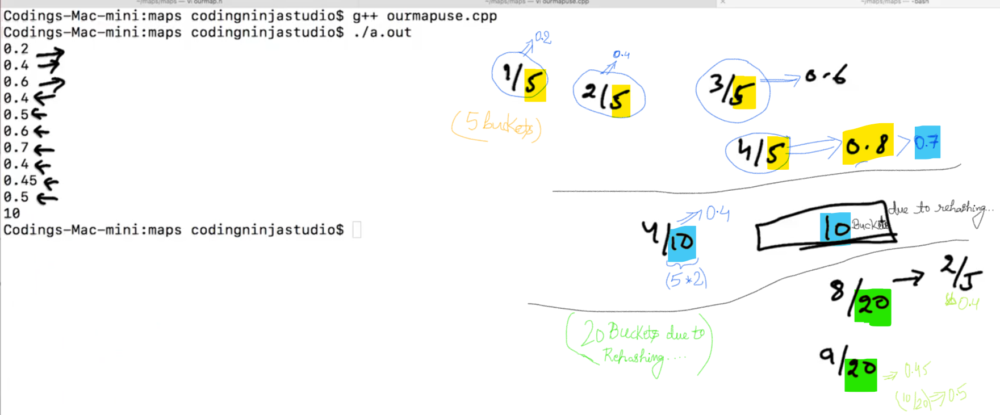

-

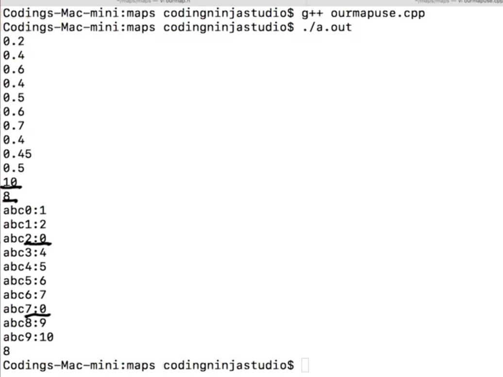

-

0.2
0.4
0.6
0.4
0.5
0.6
0.7
0.4
0.45
0.5
10
8
abc0:1
abc1:2
abc2:0
abc3:4
abc4:5
abc5:6
abc6:7
abc7:0
abc8:9
abc9:10
8

------


