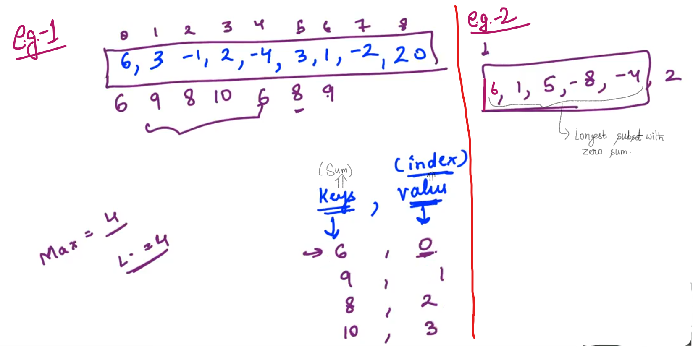

## 1.Longest Consecutive Sequence[HINT]

<u>Example</u>:

<u>Make variable</u>: 

- maxLength

- start

- curr             ->        Current

- startC         ->     Start of current sequence...

After selecting "curr" we need to explore around it i.e. ahead and behind of "curr".

For sequence including "9":

Note: Choose key as "Boolen". So, we can somehow mark and not do the reduldant work again...

----------

## 2.Pairs with difference K[HINT]

We have an Array and now we have to find out all pairs in the Array which has difference "k"...

Example:

-

We need to keep place every element of the Array along with the number of times the element is occuring...

After using the element (For pairing), Make the frequency count     =>     ZERO

-----------------

## 3.Longest subset zero sum[HINT]

Find the longest continuous Subset with Zero sum...

--

L    =>    Length of sub-set

If the Accumulative sum is Encountered again that means some of elements in between is ZERO and we can found out the length

--------------

