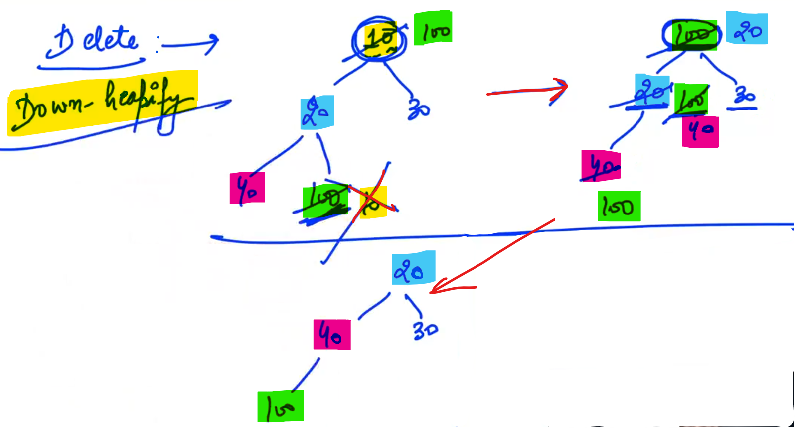
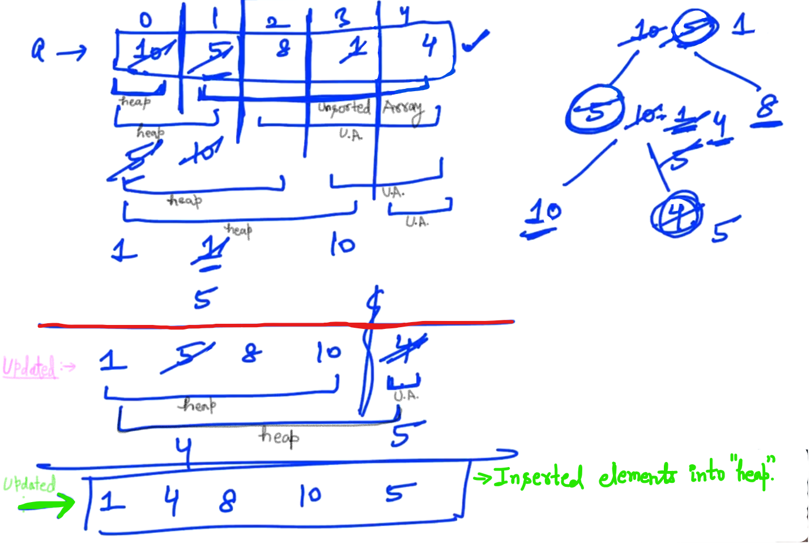
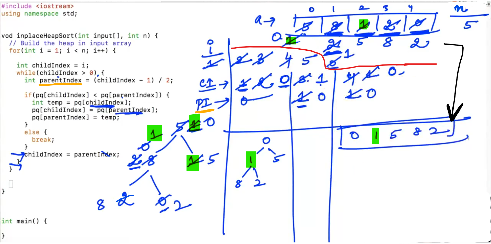

## 0.What is Priority Queue

<u>Example</u>:

Passengers seat available on the basis of:

- First Come, First Serve (FCFS) Basis...

- VIP Factor (Give priority to the VIP (OR) clear the waiting first of the Person with VIP factor)

- "Age" Factor (Clear the waiting of the person whose age is more...)

<u>Conclusion</u>:

We Extract the elements... based on the <u>importance factor</u> of the element... (More the Importance factor, we remove the element first...)


<u>NOTE</u>:

- In terms of "First Come and First Serve" basis, Importance factor is "Time" .

- In other case; the importance factor is "VIP factor".

- In next case; The importance factor is "AGE".

--

<u>Example</u>:


Hospital which have 20 rooms and all rooms are full, and their are 5 Patients, there are differnet basis for filling the rooms when there is availability of the room:

- FCFS basis

- Criticality Factor (On the basis of Critical situation of the Patient)

--

<u>Priority Queue</u>:   

Queue: First In, First Out (FIFO)


--

<u>Two Types of Priority Queue</u>:

- Min Priority Queue : We remove the element first whose priority value is lowest...

- Max Priority Queue : We remove the element first whose priority value is highest...

--

Functions:

1) Insert an Element

2) getMax / getMin priority element         (just like "top" in the Stack; read the "top-most" element)

3) removeMax / removeMin        (just like "pop" in the Stack; to remove the "top-most" element)

---------------

## 1.Ways to implement Priority Queues

The element and the priority both are same for the "n" numbers...


We have to remove minimum element in "n" numbers... and Insert the new element...


O(h)    ->    Order of height time...

So, Balanced BST is a good option, since overall complexity is <mark>n.logn</mark>.

-------------

## 2.Heaps Introduction

There are some issues of using Balanced BST:

- Balancing Factor : (Need to balance BST i.e. After every insertion we need to make it Balance i.e. Left height and Right height difference should not be greater than "1". )

- Store : We need to see how to store the BST which is quite complex because if we want to store BST then we need to store many Pointers and Arrays.

So, we are not using the balanced BST because of the above reason... and we need to use new Data structures called "heaps".

--

<u>Major properties of heaps</u>:

1) Complete Binary Tree (CBT)

2) Heap order property

--

<u>Complete Binary Tree</u> (CBT) :


Except the last level; all above levels should be completely filled.

Note: The last level should be filled from left to right

--


Insertion: In this, element will be fill from left to right in the last level...

Deletion: In CBT; the last element can only remove from the last level...

------------

## 3.CBT and its implementaion

CBT helps in solving the issues of "Balanced BST" i.e. Balancing Factor and Store...

1. Balancing / Height:
   
   Mathematical proof for finding the height:
   
   <u>For Minimum number of nodes with height "h" in CBT</u>:         <mark>2^(h-1)</mark>
   
   
   
   <u>For maximum number of nodes with height "h" in CBT</u>:        <mark>2^h - 1</mark>
   
   

--

In Complete Binary Tree (CBT), If "n" is the total number of nodes...


Here, "h" is the "height of the Complete Binary Tree".


<u>Conclusion</u>:

Height of Complete Binary Tree (CBT) is : log n

--


<u>Conclusion</u>:

- We have saved complete Binary Tree in the form of Array. (But Visualise it as Tree...)

- If there is any value present in the "ith" index then we get the left child at "2i+1" and right child at "2i+2".

<u>Example</u>:


Note: If we want to insert new element then we have to maintain next index (To insert new element in it...) So, In this way, our insertion in CBT will be O(1).

-


Now, if we want to delete an element from the Complete Binary Tree (CBT)... So, we can delete only previous element of the "next Index"...


If we want to find Child from Parent : <mark>(2i + 1, 2i + 2)</mark>

--


Now, if we want to know the Parent from the Child : <mark>(Child Index - 1) / 2</mark>

---------------

## 4.Insert and Delete in Heaps

There are two types of Heap:

1. Min-Heap

2. Max-Heap

Both have basic difference due to "Heap Order Property".

-


"Heap Order Property" of "Min-Heap" says Value of root should be lesser than the value of its both childs... (We only have to care about the relation between Parent and its children).

In "Max-heap" value of root should be greater than the value of both the children...

<u>Example</u>:


--

For the insertion of new element in the "heap":

If the value of new element is greater then the root then we need to swap...


The process of toggling and Swapping is called "<mark>up-Heapify</mark>"

--

Now, if we want to delete (OR) remove any element from the "Min-Heap" :

<u>Example</u>:

(According to CBT only last element can delete only, And we need the Minimum element...)



In above case since the smallest (Minimum) value is in the root... So, we need to swap the smallest element to the last element... Now delete the smallest element (Here, which is 10).

Now, after that we need to compare the values and have to swap... (To satisfy the property of heap)

This Process is called "<mark>Down-heapify</mark>".

--

Note: In case of "Min-heap", the minimum value will present in the "Root".

So, whenever we want to access "min" we need to access the "root", So, that the complexity of "get function" is O(1).

<u>Example</u>:


--

Now we have to make "min-heap" from some numbers:


NOTE: Before making "heap" we need to know about Complete Binary Tree (CBT) and "heap order property".

--

<u>Task</u>:

To create "Min-Heap" using numbers: 12, 6, 5, 100, 1, 9, 0, 14. After creating "Min-Heap" we need call "RemoveMin()" function twice...


-------------------

## 5.Example Solution and Max heap

Now for "Max-heap", i.e. root should consist of "Max" as compare to the both children... 


--------------------

## 6.Implementation of Priority Queues - 1

3 major functions that we want to create:

- isEmpty( )

- getSize

- getMin( )


---------------

## 7.Implementation - Insert

Example:


-


--

<u>Example</u>:

In the below case, we have to Toggle and reach to the "root".


-

<u>Example</u>: (To show the use of <mark>break;</mark>)


-------------

## 8.Remove Min - Explanation


<mark>pq.pop_back();</mark>

"Binary Property" is satisfy, but we need to satisfy "Heap order property".

PI    ->    Parent Index

LCI    ->    Left Child Index    (2i+1)

RCI    ->    Right Child Index    (2i+2)

- Minimum of all (PI, LCI, RCI) will be swap by Parent...

- We need to maintain a variable "minIndex" which holds the index of the element having the minimum value... and let's initialise the variable "minIndex" with the parent index...

---------

## 10.Remove Min Solution and Complexity Analysis

Contd...


- If LCI (Left Child Index) value is out of the limit of size of the vector then we can say our element is becomes leaf Node (i.e. there is no any further childen of it).

- <u>Note</u>: If Left Child Index (LCI) is not existing then RCI (Right Child Index) is also not existing... 

--

<u>Example</u>:


Condition required for the RCI (Right Child Index...): We should not access "Out of limit element".

<u>Dry Run</u>:


-

```cpp
//Example of "Priority Queue"

#include <iostream>
#include <vector>
using namespace std;

class PriorityQueue {
    vector<int> pq;

    public:

    PriorityQueue() {

    }

    bool isEmpty() {
        return pq.size() == 0;  //size() is the inbuilt function of vector pq (Gives number of elements of the vector)
    }

    // Return the size of priorityQueue - no of elements present
    int getSize() {
        return pq.size();
    }

    int getMin() {
        if(isEmpty()) {
            return 0; // Priority Queue is empty
        }
        return pq[0];
    }

    void insert(int element) {
        pq.push_back(element);

        int childIndex = pq.size() - 1;

        while(childIndex > 0) {
            int parentIndex = (childIndex - 1) / 2;

            if(pq[childIndex] < pq[parentIndex]) {
              int temp = pq[childIndex];
              pq[childIndex] = pq[parentIndex];
              pq[parentIndex] = temp;
            }
            else {
                break;
            }
            childIndex = parentIndex;
        }
    }

    int removeMin() {
        if(isEmpty()) {
            return 0;   //Priority Queue is empty
        }
        int ans = pq[0];
        pq[0] = pq[pq.size() - 1];
        pq.pop_back();

        // down-heapify

        int parentIndex = 0;
        int leftChildIndex = 2 * parentIndex + 1;
        int rightChildIndex = 2 * parentIndex + 2;

        while(leftChildIndex < pq.size()) {
            int minIndex = parentIndex;
            if(pq[minIndex] > pq[leftChildIndex]) {
                minIndex = leftChildIndex;
            }
            if(rightChildIndex < pq.size() && pq[rightChildIndex] < pq[minIndex]) {
                minIndex = rightChildIndex;
            }
            if(minIndex == parentIndex) {
                break;
            }
            int temp = pq[minIndex];
            pq[minIndex] = pq[parentIndex];
            pq[parentIndex] = temp;

            parentIndex = minIndex;
            leftChildIndex = 2 * parentIndex + 1;
            rightChildIndex = 2 * parentIndex + 2;
        }

        return ans;

    }
};

    int main() {
        PriorityQueue p;

        p.insert(100);
        p.insert(10);
        p.insert(15);
        p.insert(4);
        p.insert(17);
        p.insert(21);
        p.insert(67);

        cout << p.getSize() << endl;
        cout << p.getMin() << endl;

        while(!p.isEmpty()) {
            cout << p.removeMin() << " " ;

        }
        cout << endl;
    }
```

<u>Output</u>:

7
4
4 10 15 17 21 67 100 

--

<u>Note</u>:

- Minimum Priority Queue also called  "Heap Sort". (Since, we get elements in the sorted order.)

- - If we need in increasing order, we will use "minHeap".
  
  - If we want in decreasing order, we will use "maxHeap".

--

<u>Time Complexity</u>:

- In order to insert one element in the heap the complexity is "log n". So, for inserting "n" elements in the heap; the time will be <mark>n log n</mark>. 

- For getting elements in increasing or decreasing order; we need to call the <u>remove function</u> "n" times... So, time will be <mark>n log n</mark>. (Since complexity for calling one time of removing function takes "logn")

So, (n log n + n log n) => n log n.

So, the Time complexity of "heap sort" is: <mark>n log n</mark>

<u>Space Complexity</u>:

We are using Vector Array of size "n" to sort the elements; So, the space complexity is: <mark>O(n)</mark>.

(Since, we are inserting "n" elements in the heap... so we need a vector of size "n" (i.e. we using extra space of "n" size.))

---------------

## 12.Inplace Heap Sort

Here, we want to convert our input Array into Heap...

We want to improve the space complexity of "heap sort" and we want O(1) space complexity...

<u>Improvement</u>: 

- Rather than using one more Array, we can use input array to built heap...

- We have to visualise Array into two parts - 1) One part is heap, and 2) Second part is normal unsorted Array...



Till now we have inserted given "n" elements into the "heap".

Now, we have to call "n" time removeMin function:


From above example; We will assume our heap is till index 3 and index 4 didn't lies within "heap".

Here, Array is sorted in decresing order...

<u>Example</u>:

We have assumed that zeroth element already inserted in the heap... So, our unsorted array starts from one.


childIndex

PI    ->    Parent Index     ->    (Child Index - 1)/2

contd...


--------

## 14.Inplace heap sort Solution

- Here, we discuss heap sort without any extra space i.e. O(1).

- Sorting algorithm is called "Inplace sorting algorithm".


-



Building heap in given input Array, we didn't take an extra Array... And now we need to sort elements...

-

Contd...


We will not remove element from the Array and We will assume size of unsorted Array will reduce by one... And we will do "Down heapify"

PI    ->    Parent Index

LCI    ->    Left Child Index

RCI    ->    Right Child Index

mI    ->    minIndex

```cpp
#include <iostream>
using namespace std;

void inplaceHeapSort(int pq[], int n) {
    // Build the heap in input array
    for(int i = 1; i < n; i++) {

        int childIndex = i;

        while(childIndex > 0) {
            int parentIndex = (childIndex - 1) / 2;

            if(pq[childIndex] < pq[parentIndex]) {
              int temp = pq[childIndex];
              pq[childIndex] = pq[parentIndex];
              pq[parentIndex] = temp;
            }
            else {
                break;
            }
            childIndex = parentIndex;
        }
    }

    // Remove elements

    int size = n;

    while(size > 1) {
    int temp = pq[0];
    pq[0] = pq[size - 1];
    pq[size-1] = temp;

    size--;

    // down-heapify

    int parentIndex = 0;
    int leftChildIndex = 2 * parentIndex + 1;
    int rightChildIndex = 2 * parentIndex + 2;

    while(leftChildIndex < size) {
            int minIndex = parentIndex;
            if(pq[minIndex] > pq[leftChildIndex]) {
                minIndex = leftChildIndex;
            }
            if(rightChildIndex < size && pq[rightChildIndex] < pq[minIndex]) {
                minIndex = rightChildIndex;
            }
            if(minIndex == parentIndex) {
                break;
            }
            int temp = pq[minIndex];
            pq[minIndex] = pq[parentIndex];
            pq[parentIndex] = temp;

            parentIndex = minIndex;
            leftChildIndex = 2 * parentIndex + 1;
            rightChildIndex = 2 * parentIndex + 2;
        }
    }
}

int main() {
    int input[] = {5, 1, 2, 0, 8};
    inplaceHeapSort(input, 5);
    for(int i = 0; i < 5; i++)
    {
        cout << input[i] << " ";
    }
    cout << endl;
}
```

<u>Output</u>:

8 5 2 1 0


-----------

## 15.Inbuilt Priority Queue

- Inbuilt Priority Queue is by-default "<mark>max</mark>-priority queue".


T    ->    type

--

```cpp
// Example of Inbuilt Priority Queue:

#include <iostream>
using namespace std;
#include  <queue>

int main() {
    priority_queue<int> pq;

    pq.push(16);
    pq.push(1);
    pq.push(167);
    pq.push(7);
    pq.push(45);
    pq.push(32);

    cout << "Size : " << pq.size() << endl;
    cout << "Top : " << pq.top() << endl;

    while(!pq.empty()) {
        cout << pq.top() << endl;
        pq.pop();
    }
}
```

<u>Output</u>:

Size : 6
Top : 167
167
45
32
16
7
1        //Here, we get elements in the decreasing order...

------------

## 16.K Sorted Array

Solving a problem using inbuilt priority queue:

We will be given an input Array and we need to sort this Array in decreasing order...

-

<u>K sorted Array</u>: 

Element at index "i" in the input Array, after sorting the element at index "i" can go in position <mark>"K-1" left</mark> (OR) <mark>"K-1" right</mark>... that means each element is "K" distance away from its correct position. That array is called K sorted Array...

<u>Example</u>:


-


--

Example: (NOT UNDERSTAND)


--

<u>Example</u>:

Find max in the first <mark>k</mark>th elements...

The element which comes at "zeroth" index will come in the range of 0 to (k-1)


-

Example:


-

Example shows; In Top, we got maximum element of the priority queue...


-

<u>Program</u>:

```cpp
#include <iostream>
using namespace std;
#include <queue>

void kSortedArray(int input[], int n, int k) {
    priority_queue<int> pq;
    for(int i = 0; i < k; i++) {
        pq.push(input[i]);
    }
    
    int j = 0;  // Tells that which element we are figuring out...
    for(int i = k; i < n; i++) {
        input[j] = pq.top();
        pq.pop();
        pq.push(input[i]);
        j++;
    }
    
    while(!pq.empty()) {
        input[j] = pq.top();
        pq.pop();
    }
}

int main() {
    int input[] = {10, 12, 6, 7, 9};
    int k = 3;
    kSortedArray(input, 5, k);
    for(int i = 0; i < 5; i++) {
        cout << input[i] << " ";
    }
}
```

<u>Output</u>:

12 10 6 7 9 

--

Now to check the Time Complexity:


- Since, we have inserted "k" elements in the Priority Queue... So, here time will be "<mark>k.log k</mark>" (Since, inserting 1 element will take: "log k" time).

- Now, during "pop()" function; the complexity for one remove function is: "log n" if our heap size is "n" then for heap size is "k", So, we are calling (n-k) times pop() function... then complexity for one pop() is "log k" and for (n-k) times is: <mark>(n-k).log k</mark>.

- Now, we are calling pop() "k" times (For the "k" elements which are left in the priority queue...) therefore, complexity is: <mark>k.log k</mark>

Now, Overall complexity is: (k.log k + n.log k - k.log k + k.log k)        =>    **<mark>(n + k). log k</mark>**

Where, "n" is the size of the Array & "k" is the integer value which tells how our Array is sorted.

Value of "k" is small as compare to "n". So, we can Neglect "k".

Time Complexity: <mark>**n. log k**</mark> But since, "k" is small then "log k" is negligible... So, <mark>n. log k</mark> becomes <mark>n</mark>.

So, Function's approximate complexity is: O(n).

----------------------

## 17.K smallest Elements

We need to figure out smallest elements from a given Array... 

Example:


We want to improve the time complexity from "n log n" to "n log k". Since, "k" is smaller as compare to "n".


-

Example:


-

We need to perform 2 operations in the above:

- Insert new element...

- Figure out the maximum element...

------------------

## 19.Inbuilt Min Priority Queue

Here, we will see how can we convert our inbuilt Priority Queue to min heap...


-

```cpp
#include <iostream>
using namespace std;
#include <queue>

int main() {
    priority_queue<int, vector<int>, greater<int> > p;
    // Here, greater function specifies that when we need to swap our two elements...
    
    p.push(100);
    p.push(21);
    p.push(7);
    p.push(165);
    p.push(78);
    p.push(4);
    
    cout << p.size() << endl;
    cout << p.empty() << endl;
    cout << p.top() << endl;
    
    while(!p.empty()) {
        cout << p.top() << endl;
        p.pop();
    }
}
```

<u>Output</u>:

6
0
4
4
7
21
78
100
165

-----------------------


