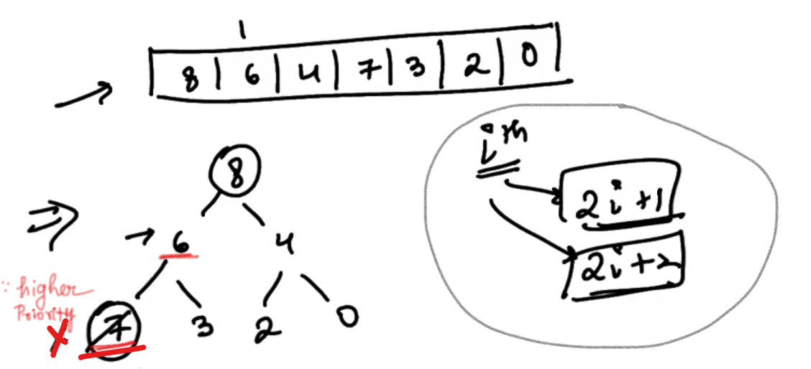
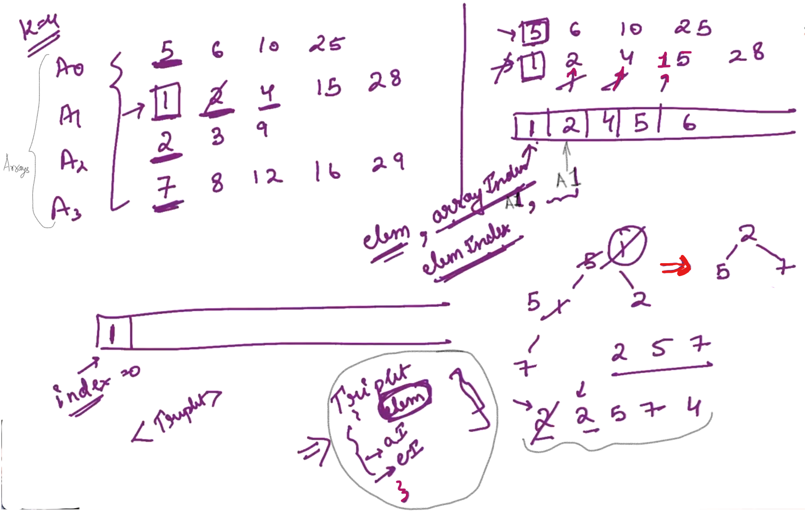
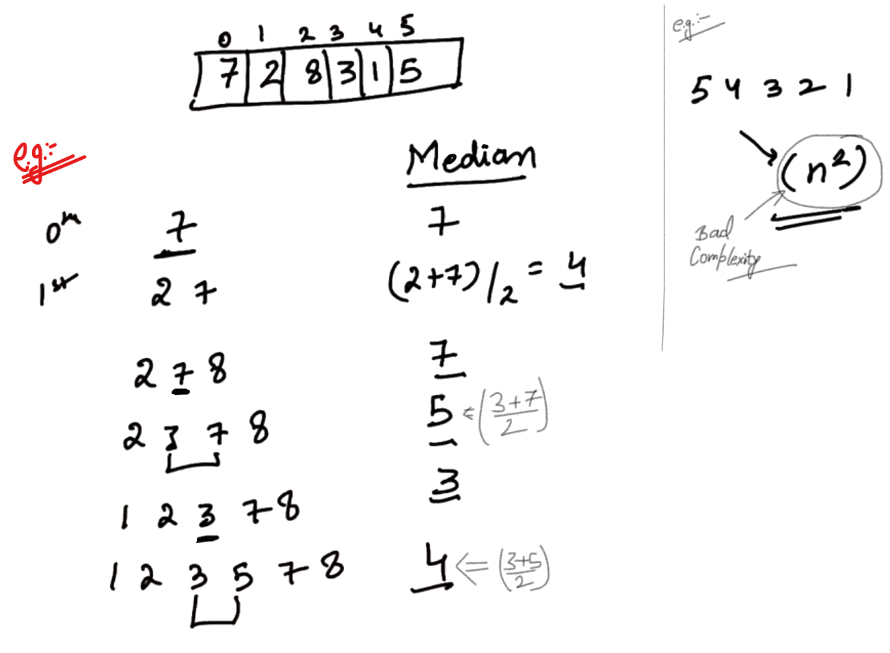
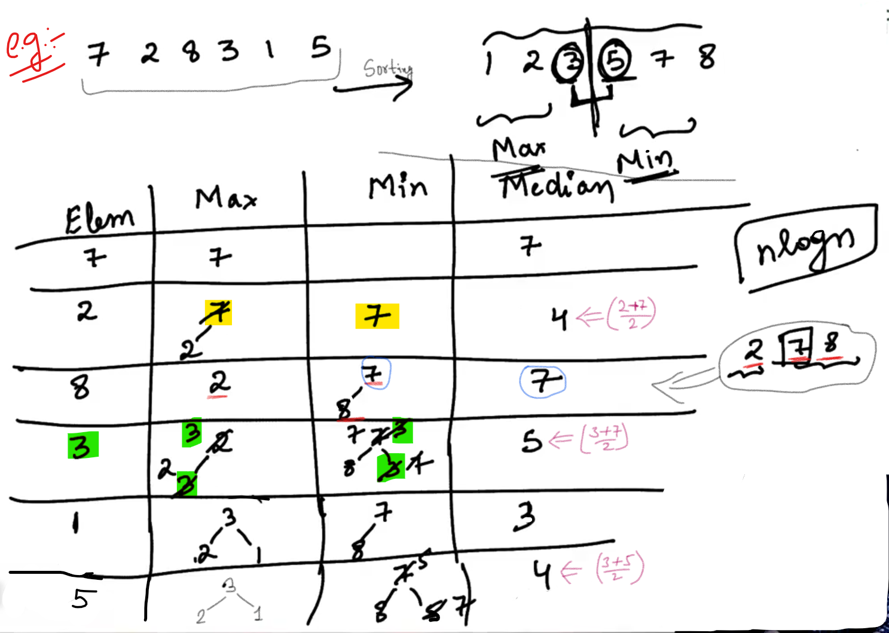
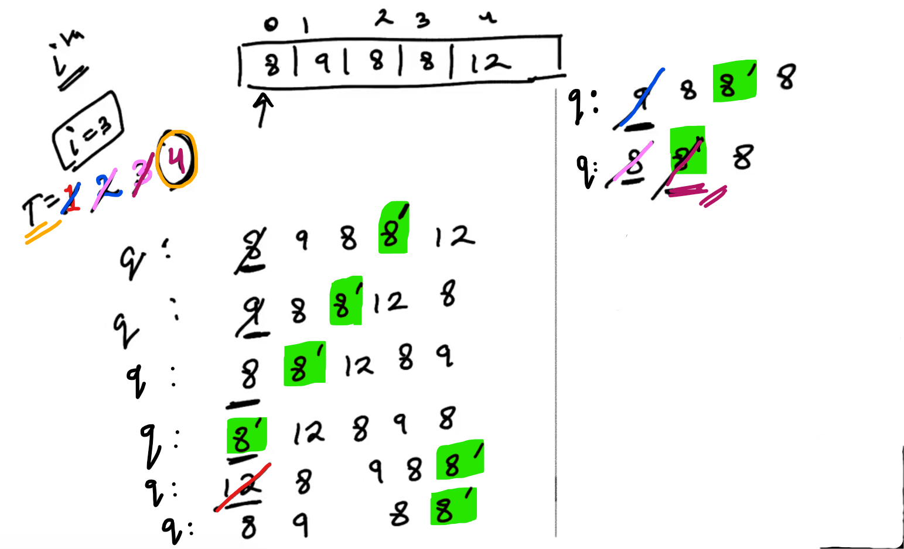

## 0.Check Max-Heap[HINT]

<u>Example</u>:

Left Child    =>    (2i + 1)

Right Child    =>    (2i + 2)

<u>Remember</u>: Be careful when we reach to a leaf node...

-----

## 2.Merge K sorted arrays[HINT]

With every element, I have to attach an another information (Array index) i.e. to which Array that elements belongs to...

So, we have to maintain the information for every element that we have:

- element

- Array Index

- element Index

Comparision among the value should be done on the basis of element... 

<u>Conclusion</u>:

In inserting the element in the priority queue, we should know the element belongs to which Array and at which index is this element...

----------

## 3.Running median[HINT]

-

We need to maintain the <mark>largest number</mark> of the first half of the sequence and the <mark>smallest number</mark> of the second half of the sequence... and take average of both and we will have the Median...

Here, "Heap" will help i.e. For finding out the largest element in the <u>first half</u>; we need "max heap" and for finding out the smallest element in the <u>second half</u>; we need "min heap".

And, Time Complexity is: <mark>n log n</mark>

--------------

## 4.Buy the ticket[HINT]

There are "n" people interested in buying ticket for a concert and we have to find out in what time <mark>i</mark>th person will get the ticket?

<u>Rules</u>:

- First Come First Serve (FCFS) basis

- The Number get the ticket first if it is the highest priority person till now...

<u>NOTE</u>:

The time consumed in removing a person from the queue and Adding to the queue is negligible...

Whenever we are allocating a ticket to a person it will take one second and that is the time we are interested in...

- In order to track the sequence of insertion and sequence in which the element should be allocated... We have to maintain a "q". And we should have a Priority queue (pq) to keep track of Priorities (The Highest priority number...).

- We are inserting indices in the "q" because that will be easier for us to track which particular element are we interested in...

- Now, For every element in the queue we have to find out whether we can allocate the ticket or not... (We can allocate if it is highest priority person and then remove it from the queue, Otherwise remove it and insert it at the end).

- In above example, for the Person with priority "8" but at index "3", the time unit we are interested in it is 4 second.

------------------
