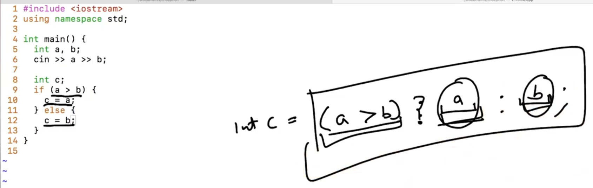
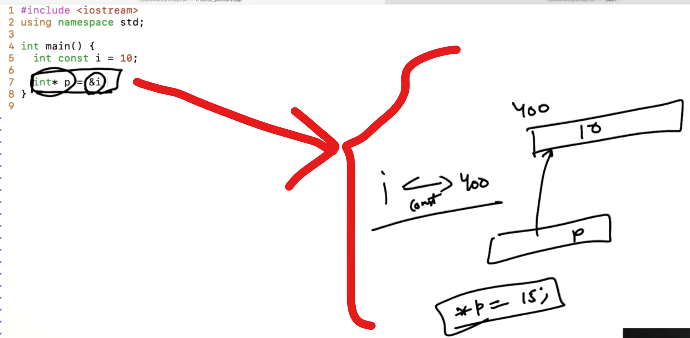

## 0.Address Typecasting

```cpp
int i = b;
int *p = &i;
-----------------------
char c = 'd';
char* p = &c;
```

--

```cpp
int i = 65;
char c = i;
// Implicit Type-Casting
-------------------------
int *p = &i;
--------------------------
char *pc = p;
-------------------------
float *pf = p;
```

-


--

<u>Implicit Type-Casting</u>:

One type of Data copy / cast in other type of Data... 


--

<u>Explicit type casting</u>:

    char * pc = p;    //Shows Error
    ---------------------------------
    char * pc = (char*)p;    //Explicit type casting

-


Example:


-


Reason for Different Arrangement because of 

1. Little Endian System

2. Big Endian System

In most of the cases, Little Endian were used... i.e. Last wali byte (little end) pehle likhi hoti hai... That's why *pc gives 65...

--

Note:

Pointer character "pc" print till the it don't get the <mark>NULL</mark> character...


-

```cpp
//Example
#include<iostream>
using namespace std;

int main()
{
    int i = 65;
    char c = i;
    cout << c << endl;

    int *p = &i;
    char *pc = (char*)p;    //Explicit type casting

    cout << p << endl;
    cout << pc << endl;

    cout << *p << endl;
    cout << *pc << endl;
    cout << *(pc + 1) << endl;
    cout << *(pc + 2) << endl;
    cout << *(pc + 3) << endl;
    return 0;
}
```

Output:

A
0x7fff008a5ea4
A
65
A

------------------

## 2.Reference and Pass By Reference


-

```cpp
#include<iostream>
using namespace std;

int main()
{
    int i = 10;
    int j = i;
    i++;
    cout << j << endl;
    return 0;
}
```

Conclusion:

"i" and "j" are different memory... So, change wheather in "i" or "j"... not gonna effect each other...

-

<u>Reference Variable</u>:


Conclusion:

Using "&" operator, <mark>int & j = i;</mark> Now, i and j will have the same Address... and "j" becomes Reference Variable... (Here, "j" is a reference to a Exisiting Variable...)

--

Example:

```cpp
#include<iostream>
using namespace std;

int main()
{
    int i = 10;
    int& j = i;

    i++;
    cout << j << endl;
    j++;
    cout << i << endl;

    int k = 100;
    j = k;
    cout << i << endl;
    return 0;
}
```

Output:

11
12
100

--

Example:

There is a way that functions can share their local Varibles... if we pass Variable as Reference i.e. "&"


```cpp
// Without reference variable
#include<iostream>
using namespace std;

void increment(int n)   //SEE
{
    n++;
}

int main()
{
    int i = 10;

    increment(i);
    cout << i << endl;

    int& j = i;

    i++;
    cout << j << endl;
    j++;
    cout << i << endl;

    int k = 100;
    j = k;
    cout << i << endl;
    return 0;
}
```

Output:

10
11
12
100

--

```cpp
// With Reference
// pass by reference
#include<iostream>
using namespace std;

void increment(int& n)   //SEE
{
    n++;
}

int main()
{
    int i = 10;

    increment(i);
    cout << i << endl;

    int& j = i;

    i++;
    cout << j << endl;
    j++;
    cout << i << endl;

    int k = 100;
    j = k;
    cout << i << endl;
    return 0;
}
```

Output:

11
12
13
100

--

The way we send Data by reference... Also We can receive Data by reference as well:


Conclusion:

Kisi bhi function se return by reference karwa rahe ho to dhyaan rakhna...


Ek function ke kisi bhi local variable ka "Reference" ya "Pointer" agar hum return karwa rahe hai... to galti kar rahe hai... Dhyaan rakha... 

```cpp
//Warning and Error will form 
#include<iostream>
using namespace std;

void increment(int& n)   //SEE
{
    n++;
}

// Bad Practice
int& f(int n)
{
    int a = n;
    return a;
}

// Bad Practice
int* f2()
{
    int i = 10;
    return &i;
}

int main()
{
    int* p = f2();  //SEE

    int i = 10;

    int& k1 = f(i);  //SEE

    increment(i);
    cout << i << endl;

    int& j = i;

    i++;
    cout << j << endl;
    j++;
    cout << i << endl;

    int k = 100;
    j = k;
    cout << i << endl;
    return 0;
}
```

ERROR:


---------------

## 4.Dynamic Memory Allocation

We can't  have Variable sized Array... We have to make an Array of Fixed Size...

```cpp
int a[20];    // This will work in the Compile Time...
----------------------------------
int n;    // This will work in the Run Time... // Not recommended...
cin >> n;
int a[n];
```

<u>Conclusion</u>:

In Compile time, it should be absolutely clear that what type of Array we want to make... not at Run time...

During Memory Allocation, there are two types of memory: 

1. Stack Memory

2. Heap Memory

Stack memory is less and Heap memory is more... When Program starts, it starts with some Stack memory... 


--

**<u>Dynamic Memory Allocation</u>**:

If we want to Allocate in the "Heap" then the Keyword "new" will use...


Steps:

1. Allocate the memory...

2. Store the memory in the address Pointer...


--

Address of the 1st element store in the <u>integer pointer</u>... (Allocate Array)


-


-

```cpp
// Not working - Only for Understanding
 #include<iostream>
using namespace std;
int main()
{
    int *p = new int;
    *p = 10;
    cout << *p << endl;

    double *pd = new double;

    char* c = new char;

    int* pa = new int[50];
    int n;
    cout << "Enter num of elements" << endl;
    cin >> n;

    int* pa2 = new int[n];
    // pa2[0] = 10;
    for (int i = 0; i < n; i++)
    {
        cin >> pa2[i];
    }

    int max = -1;
    for(int i = 0; i < n; i++)
    {
        if (max < a[i])
        {
            max = a[i];
        }
    }
    cout << max << endl;
    return 0;
}
```

pa2[0]    =>    *(pa2+0)    =>    It means 0th element...

pa2[i]    =>    *(pa2+i)    =>    It means <mark>i</mark>th element...

--


--

```cpp
#include<iostream>
using namespace std;
int main()
{
    while (true)
    {
        int *p = new int;
    }

    while (true)
    {
        int i = 10;
    }

    return 0;
}
```

--

Difference between Static Allocated Memory and Dynamic Allocated Memory:

<u>Static Allocated Memory</u>:

Automatically memory release on basis of Scope of variables...

<u>Dynamic Allocated Memory</u>:

Manual memory release is required...

--

NOTE:

To clean the memory in Dynamic Memory Allocation, We need to use the "delete" keyword...


-

```cpp
#include<iostream>
using namespace std;
int main()
{
   int *p = new int;
   delete p;

   // In case of single element, we will 
   //delete the integer pointed by p... (Single Element Deletion)
   p = new int;
   delete p;

   // In case of an Array, we will delete like... (Array Deletion)
   p = new int[100];
   delete [] p;

   return 0;
}
```

<u>Conclusion</u>:

"delete" keyword:

Pointer delete nahi ho raha hai... sirf pointer jaha point kar raha hai... wo memory delete ho raha hai...

--------------------------------

## 6.Dynamic Allocation of 2D Arrays

Steps:

Make an Array of Integer pointers... i.e.

<mark>int * *p = new int * [10];</mark>


For making indivisual row:

<mark>p[0] = new int[20];</mark>


p[4][5]    =>    4th Row, 5th Element....

Note: Here, Memory is Allocated in the Heap...

```cpp
// Case - 1
// Make a 2D Array
#include<iostream>
using namespace std;

int main()
{
    int m, n;   //m =>  no. of Rows and n   =>  no. of columns
    cin >> m >> n;

    //Now Make an Array of Integer pointers...
    int** p = new int*[m];
    for (int i = 0; i < m; i++)
    {
        p[i] = new int[n];
        // In each row, "n" number of columns are added...

        for (int j = 0; j < n; j++)
        {
            cin >> p[i][j];
        }
    }
}
```

-

p[i]     =>    is the <mark>i</mark>th row...

-

Q. If we want to make an Array of [5,10]... What will be the Total Memory Allocation ???

Answer:    ---------

-


--

```cpp
// Case - 2
// Make a 2D Array
#include<iostream>
using namespace std;

int main()
{
    int m, n;
    cin >> m >> n;

    //Now Make an Array of Integer pointers...
    int** p = new int*[m];
    for (int i = 0; i < m; i++)
    {
        p[i] = new int[i+1];    //SEE

        for (int j = 0; j < n; j++)
        {
            cin >> p[i][j];
        }
    }
}
```

<u>Conclusion</u>: 

Here, 0th row has 1 element / 1 entry,

1st row has 2 entries... 

i.e. We are making 2D Array in which each Row consisting of different number of Columns... 

--

Now we want to deallocate the Memory, since we had made memory using keyword "new"  and now we have to clean the memory...

**<u>Remember</u>**:

We don't have to leak the Memory... So clean it...

FIrstly, We should Delete all the Rows then Lastly delete the "Integer Pointer Array"

```cpp
// Contd. previously Case - 2
// Make a 2D Array

#include<iostream>
using namespace std;

int main()
{
    int m, n;
    cin >> m >> n;

    //Now Make an Array of Integer pointers...
    int** p = new int*[m];
    for (int i = 0; i < m; i++)
    {
        p[i] = new int[i+1];    //SEE

        for (int j = 0; j < n; j++)
        {
            cin >> p[i][j];
        }
    }

    for (int i = 0; i < m; i++)
    {
        delete [] p[i];
    }
    delete [] p;
}
```

<u>Conclusion</u>:

Now we can allocate memory by anyways...

--------------

## 9.Macros and Global Variables

**<u>#define</u>**:

Problem:

1. It will be hard to change the value... pi=3.14

2. Use of <mark>double pi = 3.14;</mark> can have many issues 
   
   (A) Value of "pi" can be change...
   
   (B) Extra storage (More memory) use... Since, we are accessing Variable "pi" everywhere... Some more time consuming...

```cpp
// Example:
#include<iostream>  //Pre-processor directive
using namespace std;
#define PI 3.14

int main()
{
    int r;
    cin >> r;
    // CASE - 3
    cout << PI*r*r << endl;

    // CASE - 1 
    // cout << 3.14*r*r << endl;

    /*
    CASE - 2

    double pi = 3.14;
    pi = pi +1; 

    //Change in the value of pi
    */
}
```

--

**<u>Global Variables</u>**:


NOTE:

Use of "Global Variable" is really BAD Practice... anyone can change the value of the variable which will leads to the WRONG result...

```cpp
//Example:
#include<iostream>
using namespace std;

int a;

void g()
{
    a++;
    cout << a << endl;
}

void f()
{
    cout << a << endl;
    a++;
    cout << a << endl;
    g();
}

int main()
{
    a=10;
    f();
    f();
    cout << a << endl;
    return 0;
}
```

---------------

## 11.Inline and Default Arguments

Example:

For finding Maximum:



-

```cpp
// Example for finding Maximum:
#include<iostream>
using namespace std;

int main()
{
    int a,b;
    cin >> a >> b;

    int c;
    if (a > b)
    {
        c = a;
    }
    else
    {
        c = b;
    }
    cout << "Maximum number is: " << c << endl;
 }
```

-

```cpp
// Use of Tertiary Operator: (Above Example)
#include<iostream>
using namespace std;

int main()
{
    int a,b;
    cin >> a >> b;

    int c = (a>b) ? a : b;    //SEE
    cout << "Maximum number is: " << c << endl;
 }
```

-

```cpp
// For finding Minimum
int min = (a>b)?b:a;
```

-

```cpp
// Problem is that we have to use Conditional Operator all time
// Example
#include<iostream>
using namespace std;

int main()
{
    int a,b;
    cin >> a >> b;

    int c = (a>b) ? a : b;
    cout << "Maximum number is: " << c << endl;

    int x = 32 , y = 64;
    int max = (x>y) ? x : y;
    cout << "max is: " << max << endl;
 }
```

-

```cpp
//Solution of the Above is:
#include<iostream>
using namespace std;

int max(int a, int b)
{
    return (a>b) ? a : b;
}

int main()
{
    int a,b;
    cin >> a >> b;

    int c = max(a, b);
    cout << "Maximum number is: " << c << endl;

    int x = 32 , y = 64;
    int z = max(x, y);
    cout << "max is: " << z << endl;
 }
```

-

**<u>INLINE</u>**:

Now, use of **<mark>Inline</mark>** function helps to replace "<mark>max(_ , _)</mark>" to  <mark>return (a>b) ? a : b;</mark> in main() function.


-

```cpp
// Still using max function consumes time 
// Use of "Inline" function as a Solution
#include<iostream>
using namespace std;

inline int max(int a, int b)    //SEE
{
    return (a>b) ? a : b;
}

int main()
{
    int a,b;
    cin >> a >> b;

    int c = max(a, b);
    cout << "Maximum number is: " << c << endl;

    int x = 32 , y = 64;
    int z = max(x, y);
    cout << "max is: " << z << endl;
 }
```

<u>NOTE</u>:

We will use "Inline" for very small function...

--

**<u>Default Arguments</u>**:


-

```cpp
//Example - (only for understanding)
#include<iostream>
using namespace std;

int sum(int a[], int size, int si = 0)    //si => Start Index
{
    int ans = 0;
    for(int i= si; i < size; i++)
    {
        ans += a[i];
    }
    return ans;
}

// int sum2(int a, int b, int c, int d = 0)
// int sum2(int a, int b, int c = 0, int d = 0)
int sum2(int a, int b = 0, int c = 0, int d = 0)    //SEE
{
    return a+b+c+d;
}

int main()
{
    int a[20];
    // input code for ans

    cout << sum(a,20) << endl;
}
```

Because of <mark>int sum2(int a, int b = 0, int c = 0, int d = 0)</mark> We can use all types of Arguments:

(4,5)    =>    a=4, b=5

(4,5,7)    =>    a=4, b=5, c=7

(4,5,7,8)    =>    a=4, b=5, c=7, d=8

<u>NOTE</u>:

If want to give the Default Value.... give to the Right most (and the next default value should be give to the next right most...)

i.e. <mark>int sum2(int a, int b = 0, int c = 0, int d = 0)</mark>

-----------------

## 13.Constant Variables

```cpp
#include<iostream>
using namespace std;

int main()
{
    const int i = 10;   //SEE
    i = 12;     // show ERROR
}
```

-

```cpp
#include<iostream>
using namespace std;

int main()
{
    const int i;   //SEE
    i = 10;     // show ERROR
}
```

<u>NOTE</u>:

Whenever we made a constant Integer (Here, "i") we need to INITIALISE it...

Here, "i" consists Garbage Value...

-

**SOME CASES**:

```cpp
#include<iostream>
using namespace std;

int main()
{
    const int i = 10;

    int j = 10;
    const int & k = j;  //Refernce "k" becomes Constant...
    k++;    //ERROR
    j++;
}
```


Conclusion:

Storage is not Constant, but the Path is constant (i.e. path is constant through "k") but storage still can change through the path of "j"...

```cpp
//From Previous
#include<iostream>
using namespace std;

int main()
{
    const int i = 10;

    int j = 12;
    const int & k = j;  //Refernce "k" becomes Constant...
    j++;
    cout << k << endl;
}
```

Here, We can read by going through "k" but can't write... And through "j" we can write...

-


-

```cpp
 //Same as Previous
#include<iostream>
using namespace std;

int main()
{
    // constant int
    const int i = 10;
    int const i2 = 10;    //Not issue with position of "const" 

    // we created a constant reference from a non const int
    int j = 12;
    const int & k = j;  //Refernce "k" becomes Constant...
    j++;
    cout << k << endl;

    // We can make constant reference from a const int
    int const  j2 = 12;
    int const &k2 = j2;
    // j2++;    =>  Will give ERROR... can't change...
    // k2++;    =>  Will give ERROR... can't change...

    // creating reference from a const int 
    int const j3 = 123;
    int & k3 = j3;
    /*ERROR SHOWS that binding value of type 'const int' to 
    reference to type 'int' drops 'const' qualifier
    */
    k3++;
    /* 
    Problem is that "j3" don't have access to write...(have only 
    access to read..) So, how can "k3" use "j3" to access that storage...
    i.e. its wrong...
    */

}
```

Conclusion: (From above Example)

- Storage is not constant... Path is Constant...

- If we have a Read only path... We <mark>can't</mark> make another write able path using this read only path...

--

**<u>Constant Pointers</u>**:

```cpp
#include<iostream>
using namespace std;

int main()
{
    int const i = 10;

    // int* p = &i;    //SEE // ERROR

    int const * p = &i;
    //  (*p)++;     //ERROR
}
```

<u>Conclusion</u>:

We can't store Address of a "Constant integer" into a "Normal Pointer".



Pointer have to be const... So, it will not change... Since "i" has only Read access... and by using "i" we <mark>can't</mark> have Write access...

<mark>int const * p</mark>    =>    p is a pointer to a constant integer...

--


```cpp
//From previous
#include<iostream>
using namespace std;

int main()
{
    int const i = 10;

    int const * p = &i;

    int j = 12;
    int const * p2 = &j;
    cout << *p2 << endl;
    j++;
    cout << *p2 << endl;

}
```

We mostly get beneficial of "const" is while Function calling:

```cpp
//From previous
#include<iostream>
using namespace std;

void g(int const & a)
{
    a++;  
//ERROR i.e. cannot assign to variable 'a' with 
// const-qualified type 'const int &' 
}

void f(const int * p)
{
    //  (*p)++;    
//ERROR i.e. read-only variable is not assignable...
}

int main()
{
    int const i = 10;

    int const * p = &i;

    int j = 12;
    int* p3 = &j;
    // f(&j);
    f(p3);      //SEE

    g(j);       //SEE

    int const * p2 = &j;
    cout << *p2 << endl;
    j++;
    cout << *p2 << endl;
}
```

-

```cpp
//From previous
#include<iostream>
using namespace std;

int main()
{
    int i = 10;
    int j = 21;
    int const * p = &i;

    p = &j;

    int * const p2 = &i;
    // variable 'p2' declared const here
    (*p2)++;
    // p2 = &j;     //ERROR


    int const * const p3 = &i;
    // p3 = &j;     //ERROR
    // (*p3)++;     //ERROR
}
```

<mark>int const * p</mark>    =>    p is a pointer to a constant integer... (i.e. "p" Jiski taraf point kar raha hu wo constant hai)

<mark>int * const p2</mark>    =>    p2 is a constant pointer to an integer... (i.e. "p2" ko change nahi kar sakte...)

<mark>int const * const p3</mark>    =>    p3 is a constant pointer to a constant integer... (i.e. p3 ko bhi change mat karna... p3 jisko point kar raha hai usko bhi change mat karna...)

-------------------
