## 0.Introduction to Tries

We want to implement a Dictionary with 3 major functions:

- addWord

- Search

- Remove Word

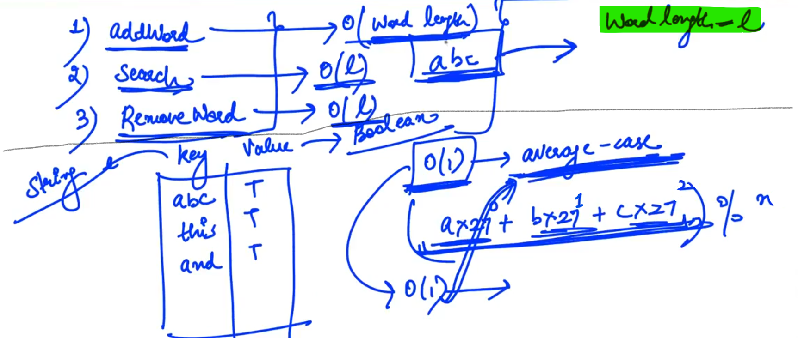

The Hashmaps we used for the string, they take time corresponding to the length of our string...

So, we are able to calculate the "Hashcode" for that particular string... 

--

l    ->    Word Length

- So, If we use Hashmap then the "addWord" time complexity will be: O(Word Length).

- For "Search", we have to figure out the HashCode. So, the time complexity will be: O(Word Length).

-  For "Removing" the word, we need a "Hash code". So, again the Time Complexity will be: O(l).

--

**<u>Trie</u>**:


- Here, for every node, there are at max 26 children (i.e. A-Z)

- Here, the time complexity for the "addWord" is: <mark>O(Word Length)</mark>

-

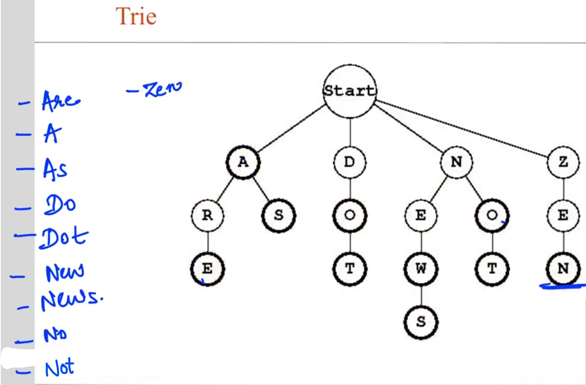

- In above Example, only those Node are Darked where word got finish (OR) Terminate. 

-

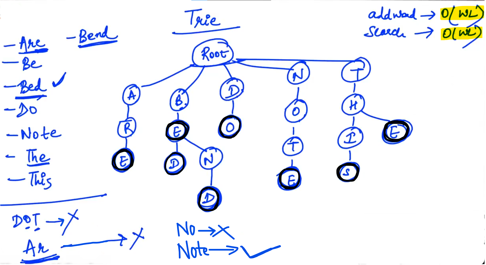

- Here, the time complexity for the "search" is: O(Word Length)

-

Now, for removing the word:

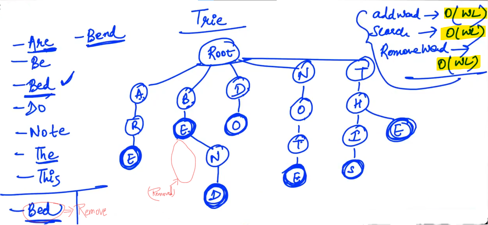

Terminal which is dark, is got removed; representing the letter has no ending word...

- Here, the time complexity for the "remove" is: O(Word Length)

-------------

## 1.TrieNode class

- One of the Advantage of Tries is that we can Optimise Space in comparision to Hashmaps.

- Fast searching in Trie.

- We need to find the path from Root to the Leaf.

Due to these reasons we are not using Hashmaps in making of our Dictionary. So, we are using Trie.

--

We need to make a class "TrieNode"

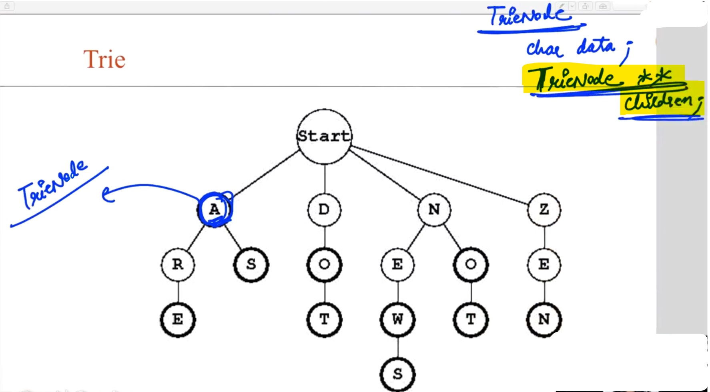

- Here, for every node, there are at max 26 children (i.e. A-Z) and we need to save their Addresses in Array.

--

We want to create an Array where in Every Index we want to store Address of Integer variable... (OR) We need to create an Array of Integer pointers.

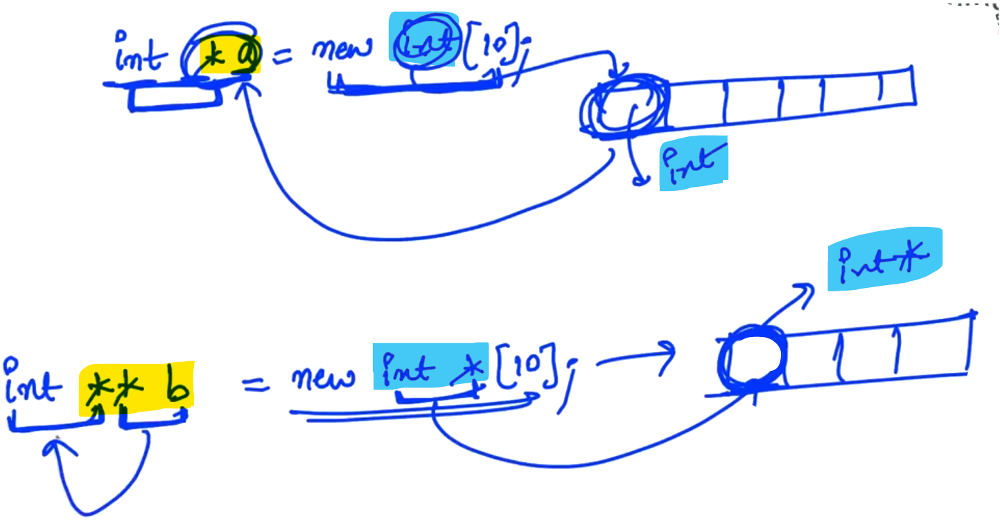

-

    int ** b    =>    b is a pointer variable which holds address of int *.
    
    
    int *a    =>    a is a pointer variable which holds address of Integer... 

NOTE: If we want to create an array of Integer pointers then we need to receive its address in a double pointer...

--

    TrieNode ** children = new TrieNode*[26]

Here, we want to create an Array and we want to save an Address of TrieNode in every index of the Array...

In above, All value should be of <mark>TrieNode*</mark>.

    TrieNode ** children  =>  Children Pointer which holds Address of TrieNode* type value...

--

Now, we need to store at which node, our any word got finish...

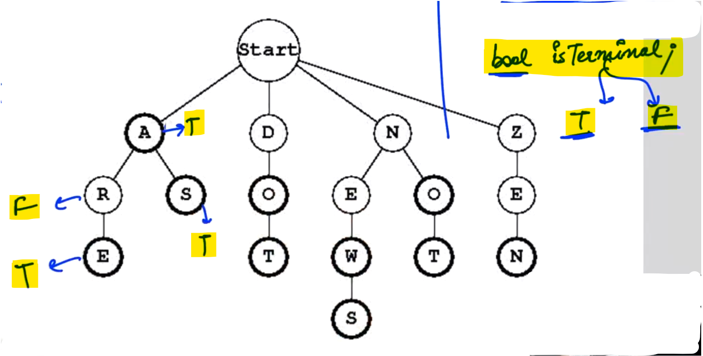

-------------

## 2.Tries Implementation -  Insert

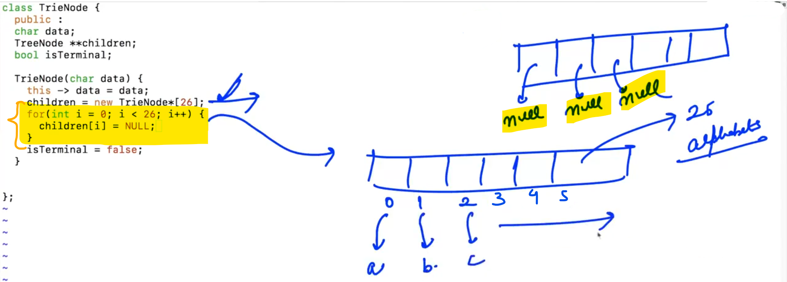

-

<u>Example</u>:

Process to insert any word in the "Trie".

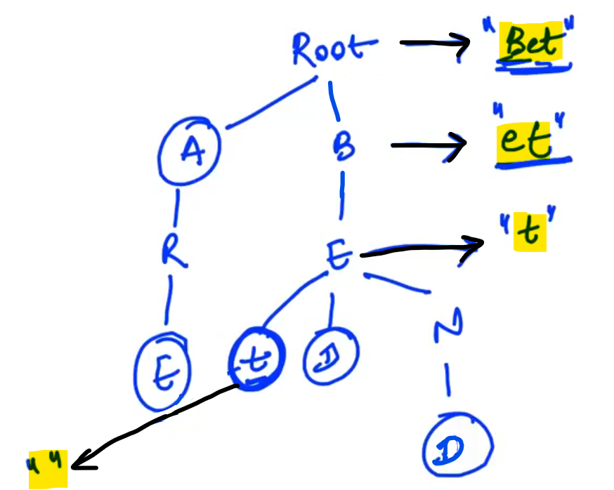

<u>Example</u>:

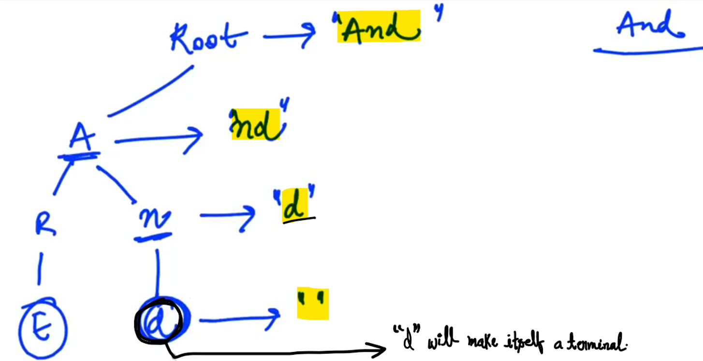

--

In recursion:

- <u>Small calculation</u>: We will check is there is any children of Root with the First character of the data...?? If No, then we will create a new Node and make that node as children...

- <u>Recursive Call</u>: will be inserting of remaining words in the sub-Tree.

- <u>Base case</u>: When word length will be Zero, we will stop... and will make the Node as Terminal...

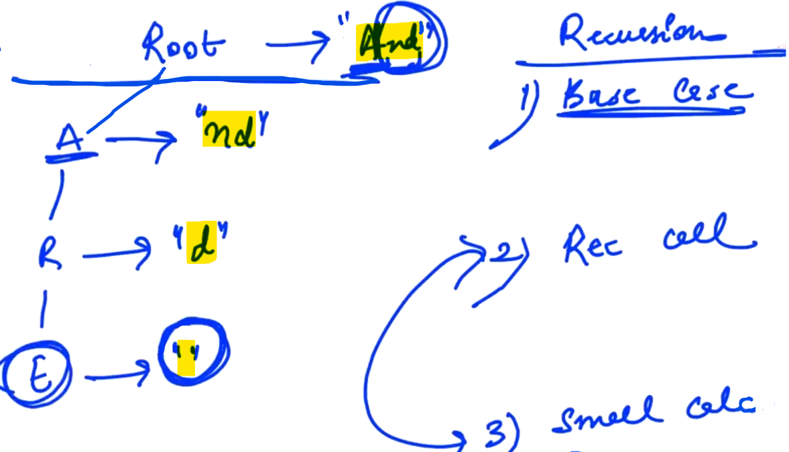

(Wrong Diagram)

--

Base Case:

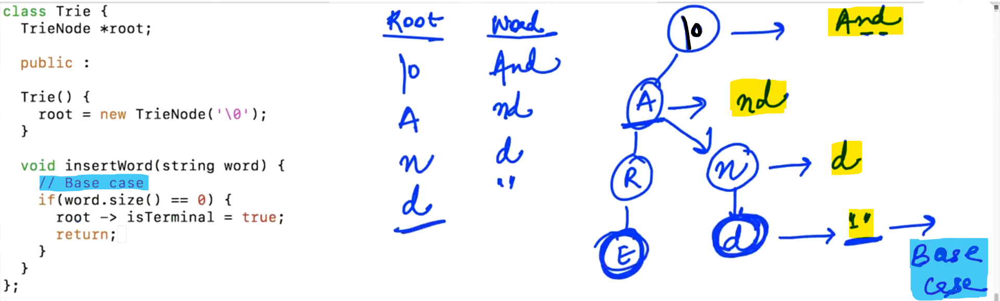

--

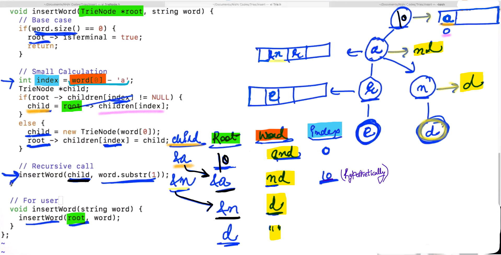

------------------------

## 3.Search in Tries

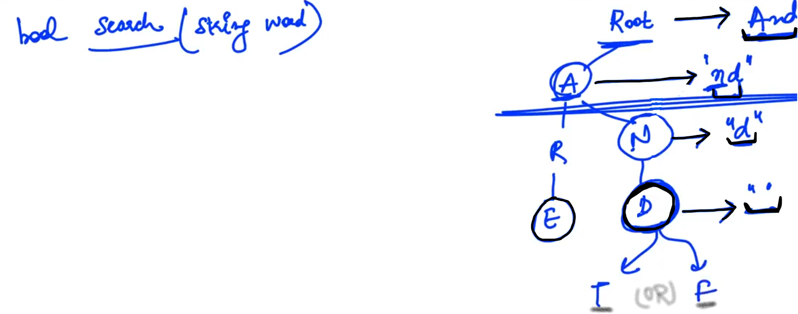

--

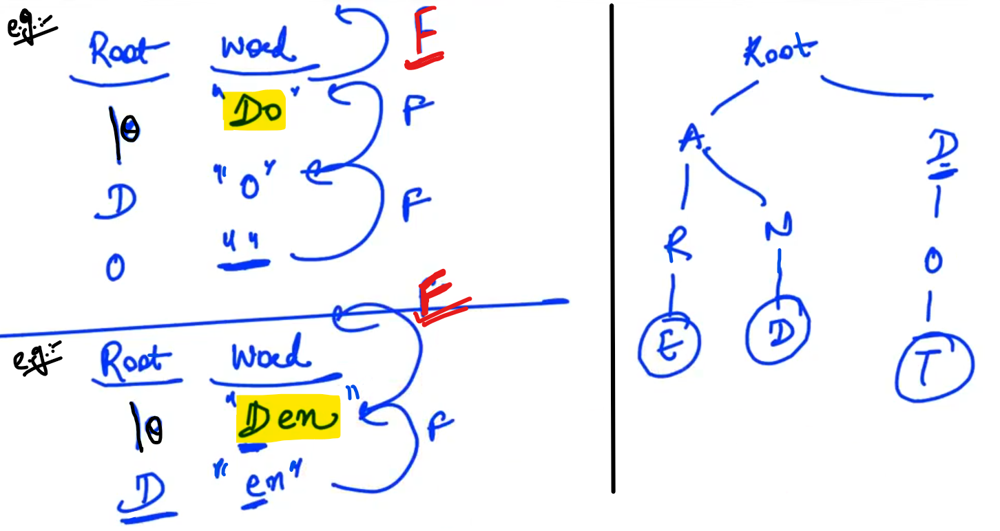

-------------

## 5.Tries Implement - Remove

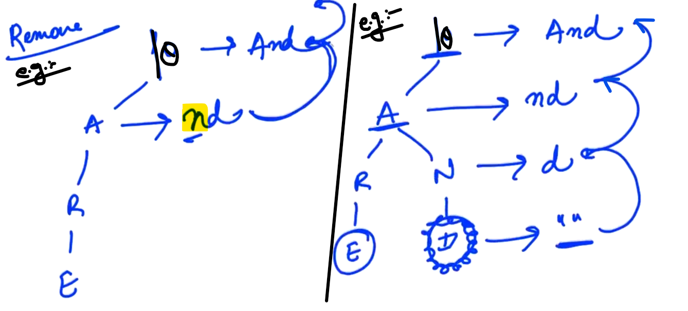

--

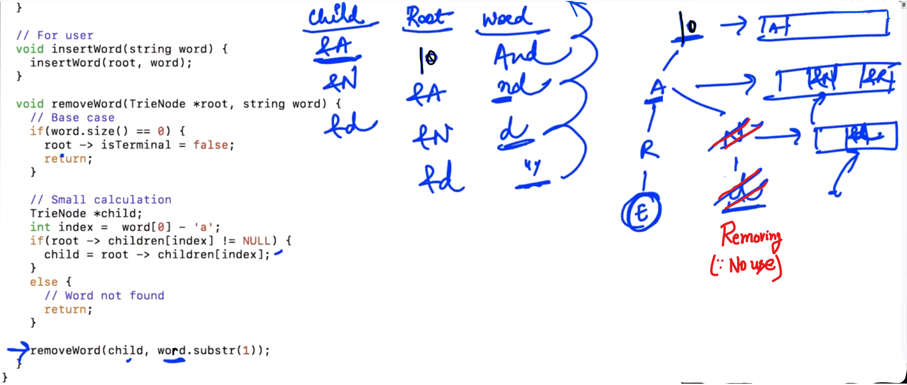

We are deallocate the useless nodes...

--

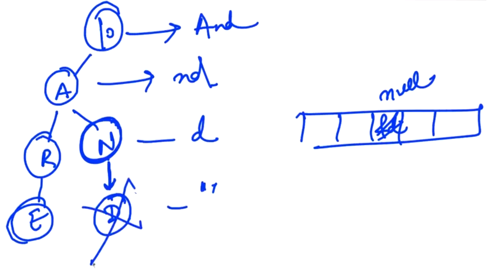

If we want to remove any Node from the Trie which only a parent can do...

--

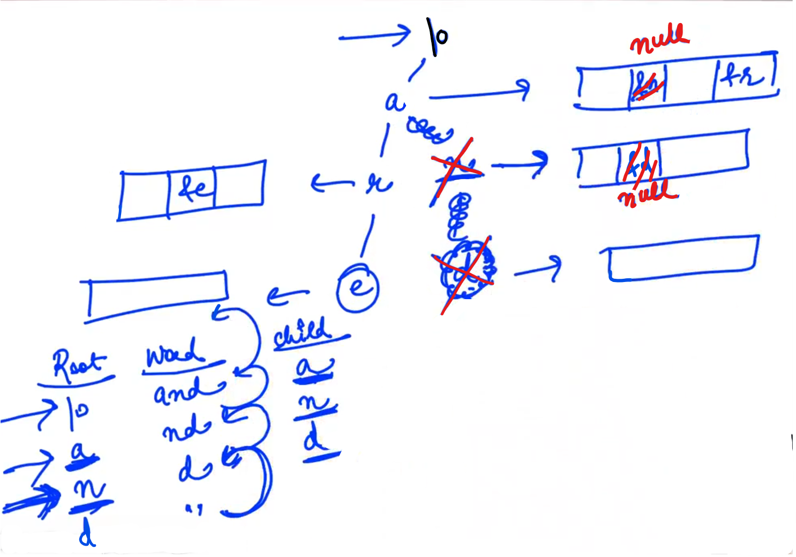

Any word is useless when: 

- It's isTerminal will be false (i.e. At that node there is no end of any word) and

- second condition is that there should be no further children of that node...

--

Example:

```cpp
//Not working

#include <iostream>
#include <string>
using namespace std;

class TrieNode {
    public :
    char data;
    // Now we need an Array in which we want to store Address of each children
    TrieNode **children;
    bool isTerminal;
    
    TrieNode(char data) {    // Constructor
        this -> data = data;
        children = new TrieNode*[26];
        isTerminal = false;
    }
    
};

class Trie {            // Here, we will built our "Trie"
    TrieNode *root;
    
    public:
    
    Trie( ) {
        root = new TrieNode('\0');
    }
    
    //search
    bool search(TrieNode *root, string word) {
        if(word.size() == 0) {
            return root -> isTerminal;
        }
        
        // Small Calculations:
        int index = word[0] - 'a';
        TrieNode *child;
        if(root -> children[index] != NULL) {
            child = root -> children[index];
        }
        else{
            return false;
        }
        
        //Recursive Call
        return search(child, word.substr(1));
    }
    
    bool search(string word){
        return search(root, word);
    }
    
    void insertWord(TrieNode *root, string word) {
        // Base case:
        if(word.size() == 0) {
            root -> isTerminal = true;
            return;
        }
        
        // Small Calculations:
        int index = word[0] - 'a';
        TrieNode *child;
        if(root -> children[index] != NULL) {
            child = root -> children[index];
        }
        else{
            child = new TrieNode(word[0]);
            root -> children[index] = child;
        }
        
        // Recursive Call
        insertWord(child, word.substr(1));
    }
    
    // For User...
    void insertWord(string word) {
        insertWord(root, word);
    }
    
    void removeWord(TrieNode *root, string word) {
        // Base case
        if(word.size() == 0) {
            root -> isTerminal = false;
            return;
        }
        
        // Small Calculation
        TrieNode *child;
        int index = word[0] - 'a';
        if(root -> children[index] != NULL) {
            child = root -> children[index];
        }
        else {
            // Word not found
            return;
        }
        
        removeWord(child, word.substr(1));
        
        // Remove child Node if it is useless
        if(child -> isTerminal == false) {
            for(int i = 0; i < 26; i++) {
                if(child -> children[i] != NULL) {
                    return;
                }
            }
            delete child;
            root -> children[index] = NULL;
        }
    }
};

int main() {
    Trie t;
    t.insertWord("and");
    t.insertWord("are");
    t.insertWord("dot");
    
    cout << t.search("and") << endl;
    
    t.removeWord("and");
    cout << t.search("and") << endl;
}
```

<u>Output</u>:

1

0

---------------

## 6.Types of Tries

The reason we choice the Tries over Hashmap in order to create a Dictionary:

- Space Optimisation

- Fast Searching

In case of "Hashmaps"; We need to check at every word that our Word starts with our searching LETTER or NOT...

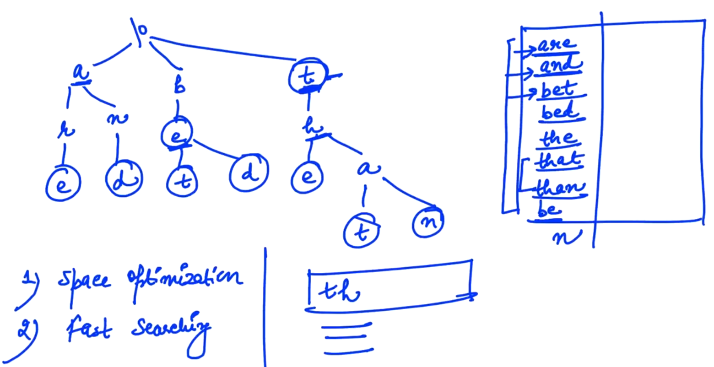

--

<u>Types</u>:

<u>Compressed Tries</u>: (We use it because of Space Optimisation)

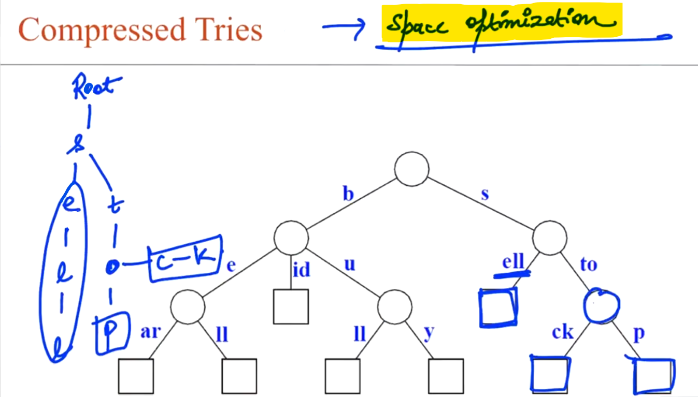

In above diagram, square represents that here multiple characters are lying...

<u>Example</u>:

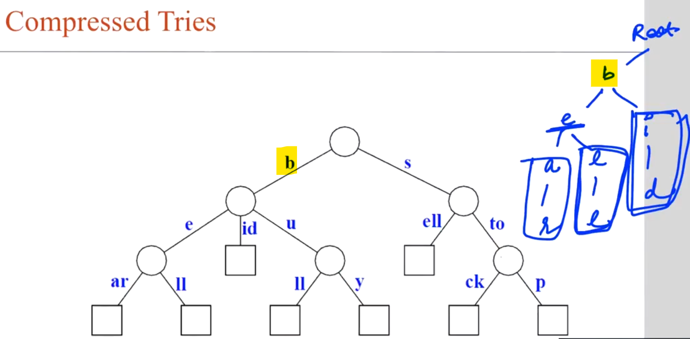

<u>Note</u>:

- During Insertion, we need to take the Decision of Clubbing...

- Sometimes we need to ungroup our Words...

- e.g.: During Deletion of word "bell", we need to club "ear" together in word "bear".

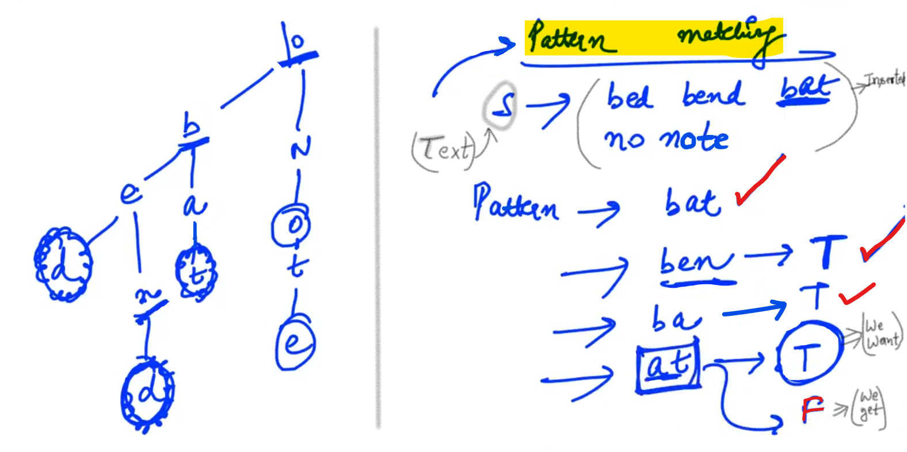

We need to see "Pattern matching", for this we need to remove "isTerminal".

--

<u>Example</u>:

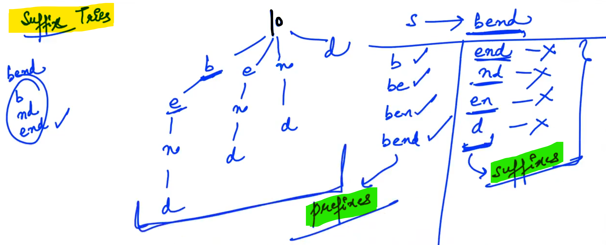

<u>Suffix Tries</u>: Whenever we want to insert a word, we need to add all possible "Suffixes" in our Trie.

<u>NOTE</u>: In case of "Pattern Matching",We can search any random pattern which can be a Word or NOT, For that we need to have all possible Patterns present in our Trie... so, We will use "Suffix Tries".

<u>Example</u>:

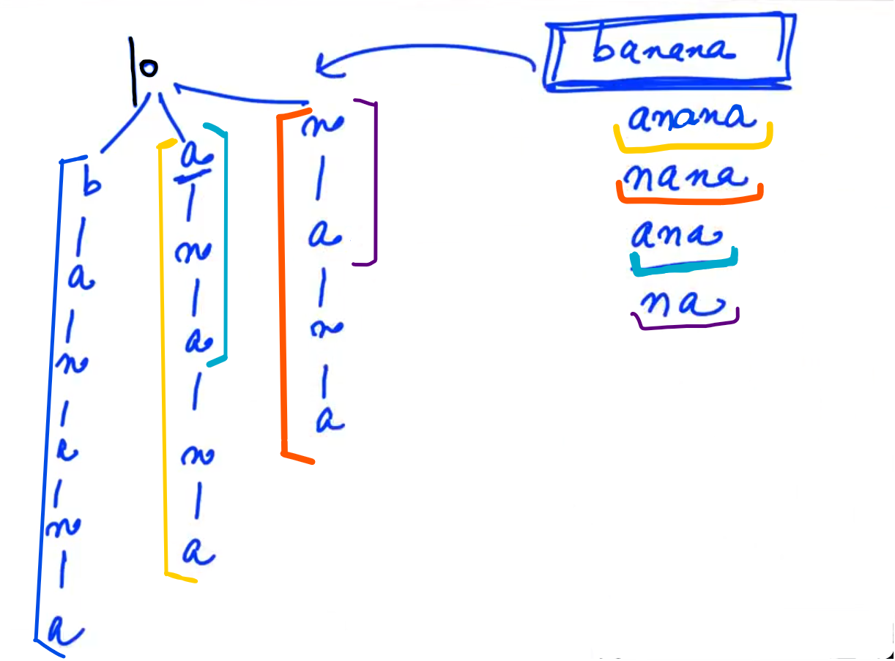

-------

## 7.Huffman Coding

Here, Disscussion is on "Text Compression"

Text Compression: Basically refers to reduction of amount of space required for saving a Particular Text...

- Somehow, Let's try to reduce the space requirement for the most Frequently occuring Character... If in this process if the space requirement of other characters increase then still we are Okay...
  
  <u>Example</u>:

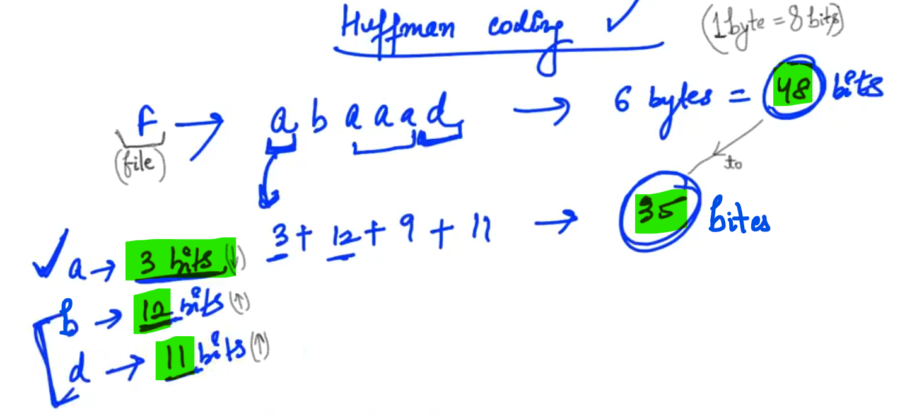

F    =>    File (which contains Characters)

a    =>    From 8 bites (1 Byte) to 3 bites

b    =>    From 8 bites (1 Byte) to 12 bites

a    =>    From 8 bites (1 Byte) to 11 bites

-

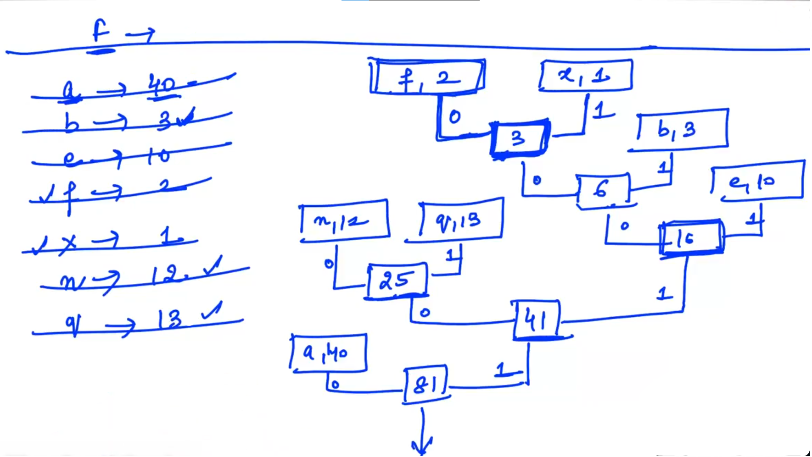

<u>Steps</u>:

- First step is to go and figure out the count of every character which is present in the File (with the help of an Array) and we need to maintain a list...

- After that we need to pick up 2 characters of minimum count... (We need to use Min. Priority Queue) and club them to make a 3rd entry...

- This 3rd entry and out of all remaining entries, again we need to pick 2 characters of minimum counts... and this will continue... till our list will not be completely empty...

-  We need to calculate the path from Root to Leaf...

- There are two paths left and right, we need to assign 0 to the left and 1 to the right.

- We need to save the codes (respective of character) in Hashmaps...

-

Here, we are replacing every character to its respective code (Note: Code should be save in the form of Bits (not character or integer)).

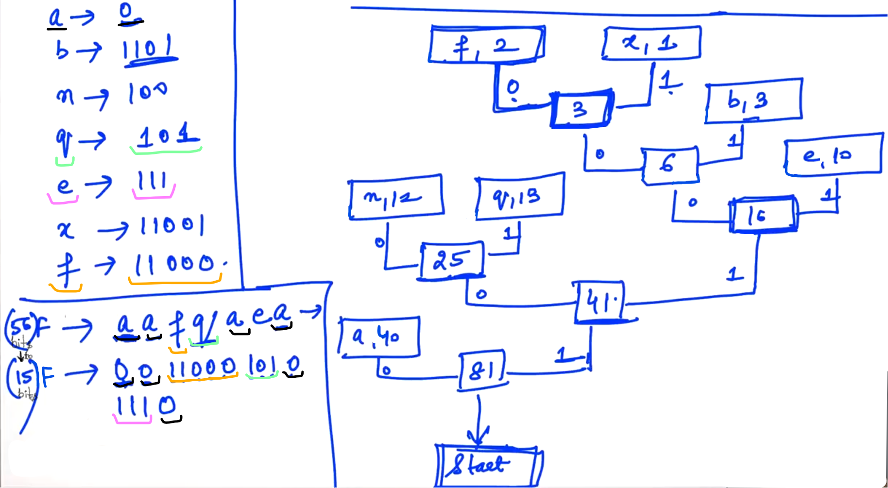

This is how compression will happen...

--

Now, Decompression of File (F): (From code to Character)

NOTE: Prefix of Code of any Character is never been code of any other character...

Contd...

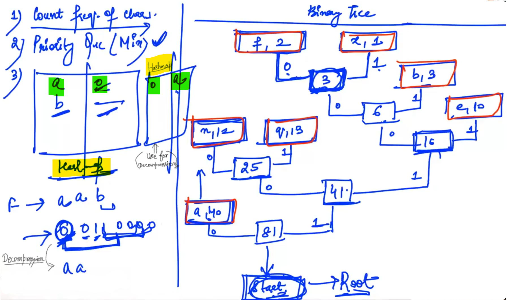

------------


