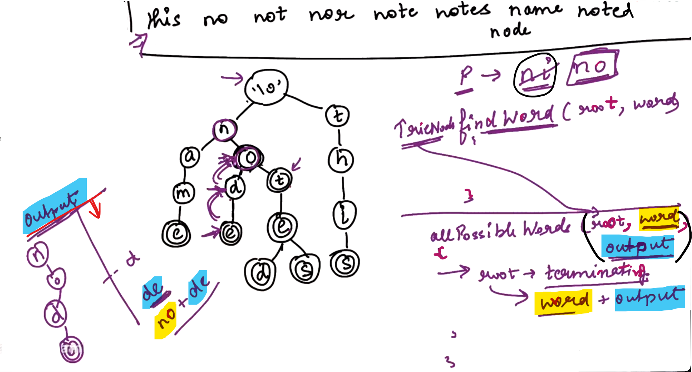

## 0.Pattern Matching[HINT]

Here, we are given a collection of words and also given a pattern and our task is to find out whether the Pattern exists in one of the word or not...

------------------

## 2.Auto complete[HINT]

-------------

