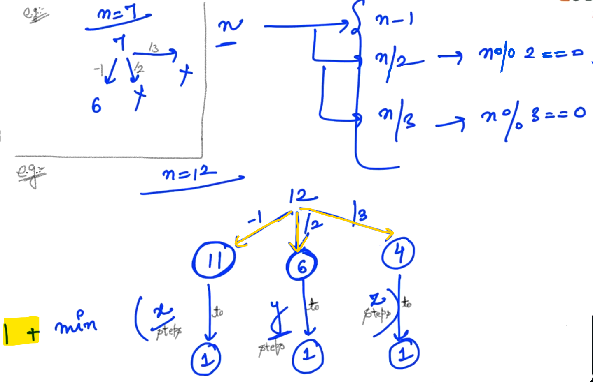
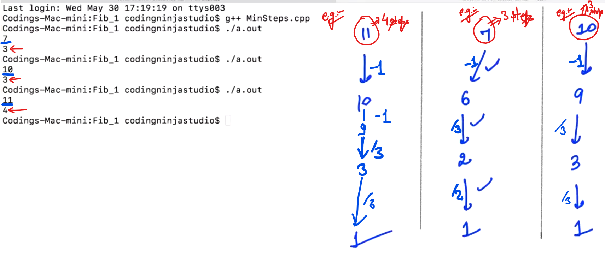

## 0.Fibonacci - 1

We are given integer "n" and we need to figure out nth Fabonacci number...


Here, the complexity of our Fibonacci series is <mark>Exponential</mark> which is very bad...

Now, We need to improve it... 


Note: Here we are doing alot Repetative work... and we should figure out How many unique answers are there which are required to be saved... 

- Unique calls / answers is happening for (n+1) number...

Due to repetation our complexity becomes 2^n.

-

- We will make an Array of size (n+1).

- Before starting any claculations process, we will check that is that answer already exists?


--


(In above example, We stopped the call because answer of "2" and "3" is already existing...)

- We have unique calling "n+1" and at every call we are doing some constant work "k". So, our complexity improves from 2^n to <mark>O(n)</mark>.

--


<u>Memoization</u>: (Top-down approach) 

In this, we save our previous answers... So, in future we can directly use it... and we can improve our Complexity very well...

```cpp
// Program for Fibonacci
#include <iostream>
using namespace std;

int fibo(int n) {
    if(n <= 1) {
        return n;
    }
    int a = fibo(n - 1);
    int b = fibo(n - 2);
    return a + b;
}

int fibo_helper(int n, int *ans) {        //SEE
    if(n <= 1) {
        return n;
    }

    // Check if output already exists
    if(ans[n] != -1) {
        return ans[n];
    }

    int a = fibo_helper(n-1, ans);
    int b = fibo_helper(n-2, ans);

    // Save the output for future use
    ans[n] = a + b;

    // Return the final output
    return ans[n];
}

int fibo_2(int n) {                //SEE
    int *ans = new int[n+1];

    for(int i = 0; i <= n; i++) {
        ans[i] = -1;
    }

    return fibo_helper(n, ans);
}

int main() {
    int n;
    cin >> n;
    cout << fibo(n) << endl;
}
```

-------

## 1.Fibonacci - 2


Now, the problem is solving ITERATIVELY...


--


- 1st Approach    =>    <mark>Brute Force</mark> (Simplest Approach which comes in our mind without Optimisation...) The Complexity is: <mark>O(2^n)</mark>.

- 2nd Approach    =>    <mark>Memoization</mark>    -    (<mark>Top - down Approach</mark>)  -  using **<u>recursion</u>** saved our previous answers for future use... The complexity is: <mark>O(n)</mark>.

- 3rd Approach    =>    <mark>Dynamic Programming</mark>    -    (<mark>Bottom - up Approach</mark>)    -    (**<u>Itratively</u>**)  ->  Here, also we are saving our previous answer in order to calculate further... The complexity is: <mark>O(n)</mark>.

```cpp
#include <iostream>
using namespace std;

int fibo_3(int n) {      //SEE... 3rd Approach  //Itrative // Dynamic Programming
    int *ans = new int[n+1];

    ans[0] = 0;
    ans[1] = 1;

    for(int i = 2; i <= n; i++) {
        ans[i] = ans[i-1] + ans[i-2];
    }
    return ans[n];
}

int fibo(int n) {       //1st Approach      //Brute Force
    if(n <= 1) {
        return n;
    }
    int a = fibo(n - 1);
    int b = fibo(n - 2);
    return a + b;
}

int fibo_helper(int n, int *ans) {      //2nd Approach      //Memoization
    if(n <= 1) {
        return n;
    }

    // Check if output already exists
    if(ans[n] != -1) {
        return ans[n];
    }

    int a = fibo_helper(n-1, ans);
    int b = fibo_helper(n-2, ans);

    // Save the output for future use
    ans[n] = a + b;

    // Return the final output
    return ans[n];
}

int fibo_2(int n) {                 //2nd Approach (contd.)
    int *ans = new int[n+1];

    for(int i = 0; i <= n; i++) {
        ans[i] = -1;
    }

    return fibo_helper(n, ans);
}

int main() {
    int n;
    cin >> n;
    cout << fibo(n) << endl;
}
```

------------

## 2.Min Steps To 1

We will get an Integer and we need to reduce it to 1 and we need to count how much steps it will take ?

We have to use 3 operations to give the minimum count of steps:

<u>Example</u>:


Here, "7" can reduce to "1" in 3 steps.

<u>Example</u>:

In any path, we can get minimum count of steps...


--

Task: 


-------------------

## 4.Solution - Min Steps to 1 (Using Recursion)



--


--

```cpp
// NOT WORKING...

#include <iostream>
#include <cmath>
// #include <limits.h>
using namespace std;

int minSteps(int n) {
    // Base case
    if(n <= 1) {
        return 0;
    }

    // Recursive call
    int x = minSteps(n - 1);

    int y = INT_MAX; 
    int z = INT_MAX;
    if(n % 2 == 0) {
        y = minSteps(n/2);
    }

    if(n % 3 == 0) {
        z = minSteps(n/3);
    }

    // Calculate final output
    int ans = min(x, min(y,z)) + 1;  
    // Using inbuilt min() function... #include<cmath>

    return ans;
}


int main() {
    int n;
    cin >> n;

    cout << minSteps(n) << endl;
}
```

Output:



------------

## 6.Solution Min Steps to 1 (Memoization)


- Approximately the complexity will be "2^n".

- Repeatative calculations also called "Overlapping sub-problems".

- We need to save "n+1" unique answers...


--


--

```cpp
// NOT WORKING...
// Memoization

#include <iostream>
#include <cmath>
#include <limits.h>
using namespace std;

int minStepsHelper(int n, int *ans) {
    // Base case
    if(n <= 1) {
        return 0;
    }

    // Check if output already exists
    if(ans[n] != -1) {
        return ans[n];
    }

    // Calculate output
    int x = minStepsHelper(n - 1, ans);

    int y = INT_MAX, z = INT_MAX;
    if(n % 2 == 0) {
        y = minStepsHelper(n/2, ans);
    }

    if(n % 3 == 0) {
        z = minStepsHelper(n/3, ans);
    }

    int output = min(x, min(y,z)) + 1;

    // Save output for future use...
    ans[n] = output;

    return output;
}

int minSteps_2(int n) {         //SEE...
    int *ans = new int[n+1];

    for(int i = 0; i <= n; i++) {
        ans[i] = -1;
    }

    return minStepsHelper(n, ans);
}

int minSteps(int n) {
    // Base case
    if(n <= 1) {
        return 0;
    }

    // Recursive call
    int x = minSteps(n - 1);

    int y = INT_MAX; 
    int z = INT_MAX;
    if(n % 2 == 0) {
        y = minSteps(n/2);
    }

    if(n % 3 == 0) {
        z = minSteps(n/3);
    }

    // Calculate final output
    int ans = min(x, min(y,z)) + 1;  
    // Using inbuilt min() function... #include<cmath>

    return ans;
}

int main() {
    int n;
    cin >> n;

    cout << minSteps(n) << endl;
}
```

-------------

## 8.Minimum Count

We have given an integer "n" and we need to find the count of Minimum numbers whose sum of square is equal to "n".

<u>Example</u>:


--


--


-----------------------

## 10.No. of Balanced BTs

Here, we need to figure out the count of possible number of Balanced Binary Trees possible for a given Height...

<u>Example</u>:


(We will get a integer from the user i.e. "h" and we have to tell for this height how many Balaced Binary Trees are possible???)

Approach 1: (Wrong)


contd...


<u>Approach 2</u>:

If binary tree height is "h" then the maximum possible height of left sub-tree will be <mark>(h-1)</mark> and the combination can be possible:


Note: Here, we need to make overall height "h" and Tree should be balanced...

So, We need to figure out the count of all these combinations, then Add and Return...

------------

## 12.Solution No. of Balanced BTs

Contd. 

We need to count the possible number of Balanced Binary Trees for a given Height...

Now, here we want to figure out the count for height "h-1"


(NOTE: If we have two DIES then the number of possible combinations are 6*6 i.e. 36.)

<u>Program</u>:

```cpp
#include<iostream>
using namespace std;

// h >= 0
int balancedBTs(int h) {
    //Base Case
    if(h <= 1) {
        return 1;
    }

    int x = balancedBTs(h - 1);
    int y = balancedBTs(h - 2);

    int ans = x*x + 2*x*y;    // (Since, 2*x*y = x*y + y*x)
    return ans;
}

int main() {
    int h;
    cin >> h;
    cout << balancedBTs(h) << endl;
}
```

<u>Output 1</u>:

1

1

<u>Output 2</u>:

3

15

<u>Output 3</u>:

5

108675

<u>Output 4</u>:

6

-1006181013    (Comes <mark>NEGATIVE</mark>)

- <mark>NOTE</mark>: Range for an integer variable is "<mark>-2^31 to 2^31 - 1</mark>".

- When we get Bigger answers, we need to use (<mark>ans % (10^9 + 7)</mark>) and return.

--


--

<u>Program</u>: (Updated)

```cpp
#include<iostream>
#include<cmath>
using namespace std;

// h >= 0
int balancedBTs(int h) {
    //Base Case
    if(h <= 1) {
        return 1;
    }

    int mod = (int) (pow(10, 9)) + 7;
    int x = balancedBTs(h - 1);
    int y = balancedBTs(h - 2);

    int temp1 = (int)(((long)(x)*x) % mod);  //Typecasting value to integer
    int temp2 = (int)((2* (long)(x) * y) % mod);  //Typecasting value to integer
    int ans = (temp1 + temp2) % mod;

    // int ans = (x*x + 2*x*y) % mod;
    return ans;
}

int main() {
    int h;
    cin >> h;
    cout << balancedBTs(h) << endl;
}
```

<u>Output 1</u>:

1

1

<u>Output 2</u>:

3

15

<u>Output 3</u>:
8
533723121
--


The complexity is <mark>2^n</mark> which is very Bad...

----------------
