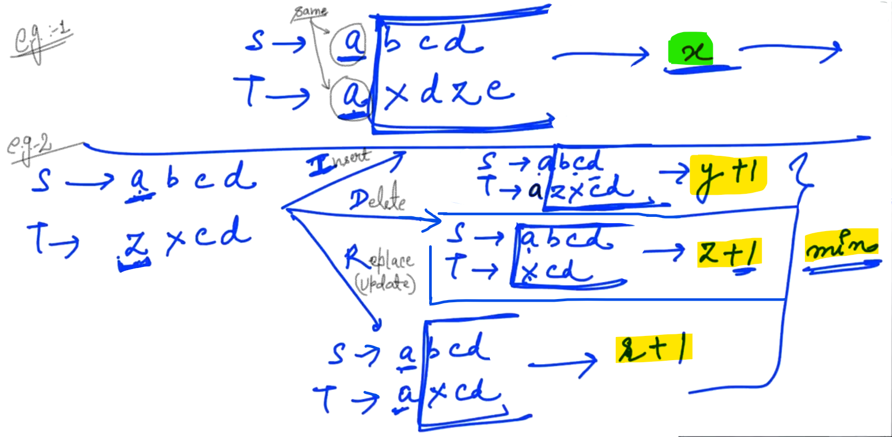

## 0.Min Cost Path

Here, we need to find out the Min. possible cost to reach from (0,0) to (m-1,n-1)


-


------------

## 2.Solution Min Cost Path (Brute Force)


--

We can possibly fail in one case...

(We should not call in Invalid shell, then we should return...)


Since we are calling infinitely (in invalid shell). So, Base case is not Enough...


<u>Program</u>:

```cpp
// By Brute Force Approach

#include <iostream>
#include <climits>
using namespace std;

int minCostPath(int **input, int m, int n, int i, int j) {
    // Base case
    if(i == m - 1 && j == n - 1) {
        return input[i][j];
    }

    if(i >= m || j >= n) {
        return INT_MAX;
    }

    // Recursive calls
    int x = minCostPath(input, m, n, i, j+1);
    int y = minCostPath(input, m, n, i+1, j+1);
    int z = minCostPath(input, m, n, i+1, j);

    // Small Calculation
    int ans = min(x, min(y, z)) + input[i][j];
    return ans;
}

int minCostPath(int **input, int m, int n) {
    return minCostPath(input, m, n, 0, 0);
}

int main() {
    int m, n;
    cin >> m >> n;
    int **input = new int*[m];  //Dynamically created 2D Array
    for(int i = 0; i < m; i++) {
        input[i] = new int[n];
        for(int j = 0; j < n; j++) {
            cin >> input[i][j];
        }
    }
    cout << minCostPath(input, m, n) << endl;
}
```

<u>Output</u>:

3 3
8 10 3
2 0 4
1 6 5
13

<u>Time Complexity</u>:     3^n    (i.e. Very Bad)


-----------------

## 3.Min Cost Path - Memoization

Contd...

Now we need to optimise... Since, because of repetative call, the complexity becomes very Bad...


--


Total possible combinations from 0 to "m-1" :    m

Total possible combinations from 0 to "n-1" :    n

Therefore, Unique Call will be: <mark>m*n</mark>

So, in order to save our answers, we need to make a 2D Array of dimension "<mark>m*n</mark>".

--


--

out[i][j]    =>    Save the Min cost from (i,j) to last...

```cpp
// By Memoization (Top-Down Approach)

#include <iostream>
#include <climits>
using namespace std;

int minCostPath_Mem(int **input, int m, int n, int i, int j, int **output) {
    // Base case
    if(i == m - 1 && j == n - 1) {
        return input[i][j];
    }

    if(i >= m || j >= n) {
        return INT_MAX;
    }

    // Check if ans already exists      //SEE...
    if(output[i][j] != -1) {
        return output[i][j];
    }

    // Recursive calls
    int x = minCostPath_Mem(input, m, n, i, j+1, output);
    int y = minCostPath_Mem(input, m, n, i+1, j+1, output);
    int z = minCostPath_Mem(input, m, n, i+1, j, output);

    // Small Calculation
    int a = min(x, min(y, z)) + input[i][j];

    // Save the answer for future use...    //SEE...
    output[i][j] = a;

    return a;
}

int minCostPath_Mem(int **input, int m, int n, int i, int j) {
    int **output = new int*[m];
    for(int i = 0; i < m; i++) {
        output[i] = new int[n];
        for(int j = 0; j < n; j++) {
            output[i][j] = -1;
        }
    }

    return minCostPath_Mem(input, m, n, i, j, output);
}

/*
int minCostPath(int **input, int m, int n) {
    return minCostPath(input, m, n, 0, 0);
}
*/

int main() {
    int m, n;
    cin >> m >> n;
    int **input = new int*[m];  //Dynamically created 2D Array
    for(int i = 0; i < m; i++) {
        input[i] = new int[n];
        for(int j = 0; j < n; j++) {
            cin >> input[i][j];
        }
    }
    cout << minCostPath_Mem(input, m, n, 0, 0) << endl;
    // cout << minCostPath(input, m, n) << endl;
}
```

<u>Output</u>:

2 3
3 6 9
1 2 6
11

Time Complexity: <mark>O(m*n) </mark>   =>    We are executing one call only one time... (We are not doing repetative work) Since, we have saved...

Space Complexity: <mark>O(m*n)</mark>    =>    Since, we are using extra output Array of size (m * n) to save our answers...

-------------

## 4.Min Cost Path - DP

Contd...

Dry Run: (Memoization)


--

Now, Using DP (Dynamic Programming):


There is a cell where we can fill straight away i.e. (m-1, n-1)     =>    Last Cell have no dependency...

<u>Program</u>:

```cpp
// By D.P.

#include <iostream>
#include <climits>
#include <cmath>
using namespace std;

int minCostPath_DP(int **input, int m, int n) {
    int **output = new int*[m];
    for(int i = 0; i < m; i++) {
        output[i] = new int[n];
    }

    // Fill the last cell i.e. destination
    output[m-1][n-1] = input[m-1][n-1];

    // Fill last row (right to left)
    for(int j = n-2; j >= 0; j--) {
        output[m-1][j] = output[m-1][j+1] + input[m-1][j];
    }

    // Fill last column (bottom to top)
    for(int i = m-2; i >= 0; i--) {
        output[i][n-1] = output[i+1][n-1] + input[i][n-1];
    }

    // Fill remaining cells
    for(int i = m-2; i >= 0; i--) {
        for(int j = n-2; j >= 0; j--) {
            output[i][j] = min(output[i][j+1], min(output[i+1][j+1], output[i+1][j])) + input[i][j];
        }
    }

    return output[0][0];
}

int main() {
    int m, n;
    cin >> m >> n;
    int **input = new int*[m];  //Dynamically created 2D Array
    for(int i = 0; i < m; i++) {
        input[i] = new int[n];
        for(int j = 0; j < n; j++) {
            cin >> input[i][j];
        }
    }
    // cout << minCostPath_Mem(input, m, n, 0, 0) << endl;
    // cout << minCostPath(input, m, n) << endl;
    cout << minCostPath_DP(input, m, n) << endl;
}
```

<u>Output</u>:

2 3
3 4 5
6 7 8
15

-

Time Complexity is  :  <mark>O(m*n)</mark>

Space Complexity: <mark>O(m*n)</mark>    =>    Since, we are using extra output Array of size (m * n) to save our answers...

---------

## 5.LCS

(Longest Common Sub-sequence)

We get two strings from User... We have to return the length of longest possible Common Sub-sequence...

Sub-sequence -> Part of the string but the order of characters should be maintained and they need not to be continuous...

<u>Example</u>:


Steps:


--

<u>Program</u>:

```cpp
#include <iostream>
using namespace std;

int lcs(string s, string t) {
    // Base case
    // Out of both the strings,if length of any one is Zero then return "0".
    if(s.size() == 0 || t.size() == 0) {
        return 0;
    }

    // Recursive calls
    if(s[0] == t[0]) {      //Checking 1st character is matching  or not...
        return 1 + lcs(s.substr(1), t.substr(1));   //If matches then return...
    }
    else {
        int a = lcs(s.substr(1), t);
        int b = lcs(s, t.substr(1));
        int c = lcs(s.substr(1), t.substr(1));
        return max(a, max(b, c));
    }
}

int main() {
    string s, t;
    cin >> s >> t;

    cout << lcs(s, t) << endl;
}
```

<u>Output</u>:

xyz
zxay
2

--

<u>Dry Run</u>:


<u>Complexity</u>: Exponential (which is Very bad) 

On removing the unreqired part, the complexity will be reduce from <mark>3^n to 2^n</mark>.

-----------

## 6.LCS - Memoization

We are doing work repeatatively... which leads to bad Complexity... but we can optimise it easily...

In memoization, we need to figure out how many unique calls will be there?

--


Possible length for "s" is from "0" to "m". Therefore, unique combinations for "s" is: "m+1".

Possible length for "t" is from "0" to "n". Therefore, unique combinations for "t" is: "n+1".

Therefore, Total unique combinations (OR) Total Recursive calls can be generate is: "(m+1)*(n+1) ".  So, we need to create an 2D Array of size: "(m+1) * (n+1)". So, that we can save all our unique possible answers...


--

```cpp
// By Memoization
#include <iostream>
using namespace std;

int lcs_mem(string s, string t, int **output) {
    int m = s.size();
    int n = t.size();

    // Base case
    if(s.size() == 0 || t.size() == 0) {
        return 0;
    }

    // Check if ans already exists
    if(output[m][n] != -1) {
        return output[m][n];
    }

    int ans;
    // Recursive calls
    if(s[0] == t[0]) {
        ans = 1 + lcs_mem(s.substr(1), t.substr(1), output);
    }
     else {
        int a = lcs_mem(s.substr(1), t, output);
        int b = lcs_mem(s, t.substr(1), output);
        int c = lcs_mem(s.substr(1), t.substr(1), output);
        ans = max(a, max(b, c));
    }

    // Save your calculation
    output[m][n] = ans;

    // Return ans
    return ans;
}

int lcs_mem(string s, string t) {       //SEE...
    int m = s.size();
    int n = t.size();
    int **output = new int*[m+1];   //Making an Array
    for(int i = 0; i <= m; i++) {
        output[i] = new int[n+1];
        for(int j = 0; j <= n; j++) {
            output[i][j] = -1;
        }
    }

    return lcs_mem(s, t, output);
}  

int lcs(string s, string t) {
    // Base case
    // Out of both the strings,if length of any one is Zero then return "0".
    if(s.size() == 0 || t.size() == 0) {
        return 0;
    }

    // Recursive calls
    if(s[0] == t[0]) {      //Checking 1st character is matching  or not...
        return 1 + lcs(s.substr(1), t.substr(1));   //If matches then return...
    }
    else {
        int a = lcs(s.substr(1), t);
        int b = lcs(s, t.substr(1));
        int c = lcs(s.substr(1), t.substr(1));
        return max(a, max(b, c));
    }
}

int main() {
    string s, t;
    cin >> s >> t;

    cout << lcs_mem(s, t) << endl;
    cout << lcs(s, t) << endl;
}
```

<u>Output -1</u>:

abcd
xyzw
0
0

<u>Output - 2</u>:

abcd
badce
2
2

(Answer is "2" because of  "ad", "ac", "bd" are 3 possible strings and all three have length    =>     2)

-----------------------

## 7.LCS - DP

Dry Run (for Memoization):  (Incomplete & Not Understand)


Now, our total unique calls are: <mark>(m + 1) * (n + 1)</mark>.


So, Time Complexity of our solution  is:  <mark>O(mn)</mark>

Space Complexity is: <mark>O(mn)</mark>, Since, We have created extra 2D Array of same size.

So, we have inproved from 3^n to O(mn).

--

Now, DP solution:


--


--

    // In code
    
    if(s[m-i] == t[n-j]) {
                    output[i][j] = 1 + output[i-1][j-1];
                }

<u>Example 1</u>:


<u>Example 2</u>:


--

<u>Program</u>:

```cpp
// Using DP

#include <iostream>
using namespace std;

int lcs_DP(string s, string t) {
    int m = s.size();
    int n = t.size();
    int **output = new int*[m+1];

    for(int i = 0; i <= m; i++) {
        output[i] = new int[n+1];   //Creating an Output Array...
    }

    // Fill 1st row
    for(int j = 0; j <= n; j++) {
        output[0][j] = 0;
    }

    // Fill 1st col 
    for(int i = 1; i <= m; i++) {
        output[i][0] = 0;
    }

    for(int i = 1; i <= m; i++) {   // "i" means length of "s"
        for(int j = 1; j <= n; j++) {   // "j" means length of "t"
            // Check if  1st char matches
            if(s[m-i] == t[n-j]) {
                output[i][j] = 1 + output[i-1][j-1];
            }
            else {
                int a = output[i-1][j];
                int b = output[i][j-1];
                int c = output[i-1][j-1];
                output[i][j] = max(a, max(b, c));
            }
        }
    }

    return output[m][n];
}

int lcs_mem(string s, string t, int **output) {
    int m = s.size();
    int n = t.size();

    // Base case
    if(s.size() == 0 || t.size() == 0) {
        return 0;
    }

    // Check if ans already exists
    if(output[m][n] != -1) {
        return output[m][n];
    }

    int ans;
    // Recursive calls
    if(s[0] == t[0]) {
        ans = 1 + lcs_mem(s.substr(1), t.substr(1), output);
    }
     else {
        int a = lcs_mem(s.substr(1), t, output);
        int b = lcs_mem(s, t.substr(1), output);
        int c = lcs_mem(s.substr(1), t.substr(1), output);
        ans = max(a, max(b, c));
    }

    // Save your calculation
    output[m][n] = ans;

    // Return ans
    return ans;
}

int lcs_mem(string s, string t) {
    int m = s.size();
    int n = t.size();
    int **output = new int*[m+1];   //Making an Array
    for(int i = 0; i <= m; i++) {
        output[i] = new int[n+1];
        for(int j = 0; j <= n; j++) {
            output[i][j] = -1;
        }
    }

    return lcs_mem(s, t, output);
}  

int lcs(string s, string t) {
    // Base case
    // Out of both the strings,if length of any one is Zero then return "0".
    if(s.size() == 0 || t.size() == 0) {
        return 0;
    }

    // Recursive calls
    if(s[0] == t[0]) {      //Checking 1st character is matching  or not...
        return 1 + lcs(s.substr(1), t.substr(1));   //If matches then return...
    }
    else {
        int a = lcs(s.substr(1), t);
        int b = lcs(s, t.substr(1));
        int c = lcs(s.substr(1), t.substr(1));
        return max(a, max(b, c));
    }
}

int main() {
    string s, t;
    cin >> s >> t;

    cout << lcs_DP(s, t) << endl;    //SEE
    cout << lcs_mem(s, t) << endl;
    cout << lcs(s, t) << endl;
}
```

<u>Output</u>:

abcdef
befadscv
3
3
3

-

For this case, both Time and Space Complexity is: <mark>O(mn)</mark>.

------------

## 8.Edit Distance

Here, we are given 2 strings and we need to make both the strings similar...

<u>Some certain operation are allowed</u>: (We want to do it in minimum number of operations and we have to return the minimum count...)


--

Solving this Problem using Recursion:



-------------------

## 10.Solution Edit Distance (Brute Force)

Note: Here, If length of any string is "0" then we have to insert all the characters or have to delete all the characters...


<u>Program</u>:

```cpp
// Using Recursion

#include <iostream>
using namespace std;

int editDistance(string s, string t) {
    // Base case
    if(s.size() == 0 || t.size() == 0) {
        return max(s.size(), t.size());
    }

    if (s[0] == t[0]) {
        return editDistance(s.substr(1), t.substr(1));
    }
    else {
        // Insert
        int x = editDistance(s.substr(1), t) + 1;
        // delete
        int y = editDistance(s, t.substr(1)) + 1;
        // Replace
        int z = editDistance(s.substr(1), t.substr(1)) + 1;

        return min(x, min(y, z));
    }
}

int main() {
    string s = "abcdf";
    string t = "afd";

    cout << editDistance(s, t) << endl;
}
```

<u>Output</u>:

3

-

<u>Time Complexity</u>:


Complexity in the worst case is: 3^n

 Where, "n" is length of string "s" or "t" whoseoever length is maximum... 

-----------

## 12.Solution Edit Distance (Memoization)

Here, there are Repeatations, So, we use Optimisation...


<u>Note</u>: Decreasing from (m,n) to (0,0). So, the total unique calls are: <mark>(m+1)*(n+1)</mark>. So, we need 2D array of this dimension i.e. <mark>(m+1)*(n+1)</mark> to save all our unique calls inside that...

    Defination for the one cell of the output Array:
    
    Out[i][j]    =>    Edit Distance of s(len = i) & t(len = j)
    
    We get our final answer in the cell:  =>      output[m][n] 

--

Program:

```cpp
// By Memoization
#include <iostream>
using namespace std;

int editDistance_mem(string s, string t, int **output) {    //SEE...
    int m = s.size();
    int n = t.size();

    // Base case
    if(s.size() == 0 || t.size() == 0) {
        return max(s.size(), t.size());
    }

    //Check if ans already exists
    if(output[m][n] != -1) {
        return output[m][n];
    }

    int ans;
    if (s[0] == t[0]) {
        ans = editDistance_mem(s.substr(1), t.substr(1), output);
    }
    else {
        // Insert
        int x = editDistance_mem(s.substr(1), t, output) + 1;
        // Delete
        int y = editDistance_mem(s, t.substr(1), output) + 1;
        // Replace
        int z = editDistance_mem(s.substr(1), t.substr(1), output) + 1;

        ans = min(x, min(y, z));
    }

    // Save the ans
    output[m][n] = ans;

    // Return the ans
    return ans;
}

int editDistance_mem(string s, string t) {
    int m = s.size();
    int n = t.size();
    int **ans = new int*[m+1];      //Creating an Integer Array i.e. ans
    for(int i = 0; i <= m; i++) {
        ans[i] = new int[n+1];
        for(int j = 0; j <= n; j++) {
            ans[i][j] = -1;
        }
    }
    return editDistance_mem(s, t, ans);

}


int editDistance(string s, string t) {
    // Base case
    if(s.size() == 0 || t.size() == 0) {
        return max(s.size(), t.size());
    }

    if (s[0] == t[0]) {
        return editDistance(s.substr(1), t.substr(1));
    }
    else {
        // Insert
        int x = editDistance(s.substr(1), t) + 1;
        // delete
        int y = editDistance(s, t.substr(1)) + 1;
        // Replace
        int z = editDistance(s.substr(1), t.substr(1)) + 1;

        return min(x, min(y, z));
    }
}

int main() {
    string s = "abcdf";
    string t = "afd";

    cout << editDistance_mem(s, t) << endl;    //SEE...
    cout << editDistance(s, t) << endl;

}
```

<u>Output</u>:

3

3

----------------

## 14.Solution Edit Distance (DP)


--

<u>Program</u>: (Not getting Expected answer from DP (CHECK IT))

```cpp
// Using DP

#include <iostream>
using namespace std;

int editDistance_DP(string s, string t) {
    int m = s.size();
    int n = t.size();
    int **output = new int*[m+1];
    for(int i = 0; i <= m; i++) {
        output[i] = new int[n+1];
    }

    // Fill 1st row
    for(int j = 0; j <= n; j++) {
        output[0][j] = j;
    }

    // Fill 1st col 
    for(int i = 1; i <= m; i++) {
        output[i][0] = i;
    }

    for(int i = 1; i <= m; i++) {
        for(int j = 1; j <= n; j++) {
            if(s[m-i] == t[n-j]) {
                output[i][j] = output[i-1][j-1];
            }
            else {
                int a = output[i-1][j];
                int b = output[i][j-1];
                int c = output[i-1][j-1];
                output[i][j] = min(a, min(b, c)) + 1;
            }
        }
    }
}

int editDistance_mem(string s, string t, int **output) {    //SEE...
    int m = s.size();
    int n = t.size();

    // Base case
    if(s.size() == 0 || t.size() == 0) {
        return max(s.size(), t.size());
    }

    //Check if ans already exists
    if(output[m][n] != -1) {
        return output[m][n];
    }

    int ans;
    if (s[0] == t[0]) {
        ans = editDistance_mem(s.substr(1), t.substr(1), output);
    }
    else {
        // Insert
        int x = editDistance_mem(s.substr(1), t, output) + 1;
        // Delete
        int y = editDistance_mem(s, t.substr(1), output) + 1;
        // Replace
        int z = editDistance_mem(s.substr(1), t.substr(1), output) + 1;

        ans = min(x, min(y, z));
    }

    // Save the ans
    output[m][n] = ans;

    // Return the ans
    return ans;
}

int editDistance_mem(string s, string t) {
    int m = s.size();
    int n = t.size();
    int **ans = new int*[m+1];      //Creating an Integer Array i.e. ans
    for(int i = 0; i <= m; i++) {
        ans[i] = new int[n+1];
        for(int j = 0; j <= n; j++) {
            ans[i][j] = -1;
        }
    }
    return editDistance_mem(s, t, ans);

}


int editDistance(string s, string t) {
    // Base case
    if(s.size() == 0 || t.size() == 0) {
        return max(s.size(), t.size());
    }

    if (s[0] == t[0]) {
        return editDistance(s.substr(1), t.substr(1));
    }
    else {
        // Insert
        int x = editDistance(s.substr(1), t) + 1;
        // delete
        int y = editDistance(s, t.substr(1)) + 1;
        // Replace
        int z = editDistance(s.substr(1), t.substr(1)) + 1;

        return min(x, min(y, z));
    }
}

int main() {
    string s = "abcdf";
    // string s = "abcdfabcdfabcdfabcdfabcdfabcdfabcdfabcdfabcdf";  //TRY
    string t = "afd";
    // string t = "afdafdafdafdafd";    //TRY


    cout << editDistance_DP(s, t) << endl; //SEE...
    cout << editDistance_mem(s, t) << endl;
    cout << editDistance(s, t) << endl;

}
```

<u>output</u>:

**6**    (Check)

3

3

Here, Both Time and Space Complexity is: <mark>O(mn)</mark>

------------

## 13.Knapsack

In this problem we are given the Weights and Values of "n" items that we want to put in a Knapsack which is of Capacity "W". We want to know the maximum value that we can obtain by putting items in that knapsack...

W        =>     Weight that Knapsack can hold at max...


-


We need to know from which path, we will get maximum weight... we need "2" recursion calls. In first time, Assume we will add first and in second call where we will not include first element... Out of these two, we will return the maximum...

-----------

## 16.Solution Knapsack (Brute Force)

For Every element we have two choices 1. We can pick the Element and put that inside the Knapsack and 2. Leave that element...


<u>Steps</u>:

1. Base Case: 
   
   - In case of an Array when our length of Array is Zero. So, we can't add more elements and we should return Zero as the value...
   
   - When maxWeight == 0; i.e. we can't put any more elements...

-


-

<u>Example</u>:

```cpp
#include <iostream>
using namespace std;

int knapsack(int *weight, int *values, int n, int maxWeight) {
    // Base case
    if(n == 0 || maxWeight == 0) {
        return 0;
    }

    if (weight[0] > maxWeight) {
        return knapsack(weight + 1, values + 1, n - 1, maxWeight);
    }

    // Recursive calls
    int x = knapsack(weight + 1, values + 1, n - 1, maxWeight - weight[0]) + values[0];
    int y = knapsack(weight + 1, values + 1, n - 1, maxWeight);

    return max(x, y);
}

int main() {
    int n;
    int weights[] = {5, 1, 8, 9, 2};
    int values[] = {4, 10, 2, 3, 1};
    int W = 15;
    cout << knapsack(weights, values, 5, W) << endl;
}
```

<u>Output</u>:

17

-

<u>Dry Run</u>:


------
