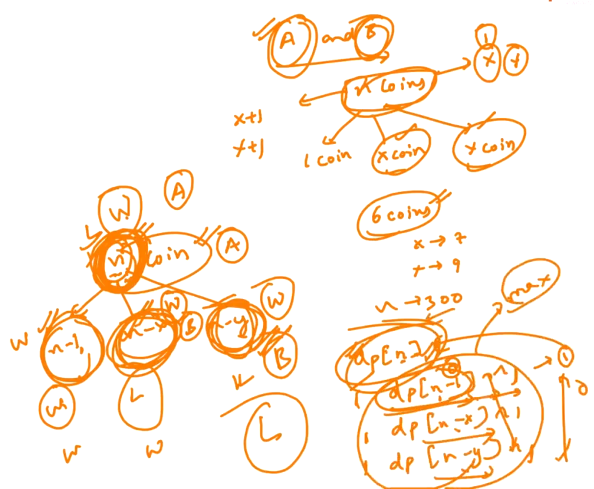

## 0.Loot Houses[HINT]

Find maximum sum possible (NOT UNDERSTAND...)


-


--------------

## 1.Longest Increasing Subsequence[HINT]

Here, in given array, Find the longest increasing subsequence (LIS)...


NOTE: We don't care about the actual sequence...

<u>Case</u>:

If we find all subsequence and it has to be increasing then we will get a possible answer... 

<u>Solution</u>:

First we find the longest increasing subsequence ending at each particular "i".

<u>Example</u>: (NOT understand)


<u>Example</u>: (NOT understand)


--

Program: (Not understand)

```cpp
#include <iostream>
using namespace std;

int lis(int* input, int n) {
    int* output = new int[n];
    output[0] = 1;
    for (int i = 1; i < n; i++) {
        output[i] = 1;
        for (int j = i - 1; j >= 0; j--) {
            if (input[j] > input[i]) {
                continue;
            }
            int possibleAns = output[j] + 1;
            if (possibleAns > output[i]) {
                output[i] = possibleAns;
            }
        }
    }
    int best = 0;
    for (int i = 0; i < n; i++) {
        if (best < output[i]) {
            best = output[i];
        }
    }
    delete [] output;
    return best;
}

int main() {
    int n;
    cin >> n;
    int * input = new int[n];
    for (int i = 0; i < n; i++) {
        cin >> input[i];
    }
    int ans = lis(input, n);
    cout << ans << endl;
    delete [] input;
}
```

<u>Output</u>:

7
4 3 9 7 6 8 20
4

-

<u>Dry Run</u>:


<u>Conclusion</u>:To find the answer for later index, we want to have previous answers... (So, we will store previous answers...)

-------------

## 4.Matrix Chain Multiplication[HINT]

We are given "M" matrices and we are suppose to find the minimum number of operations in which we can multiply all of them together... 

Example:


For total operations / multiplications of:     a0 * a1    &     a1 * a2    =>     (a0 * a1 * a2)    

<u>NOTE</u>: Its important where we are using brackets...

--


For "n" matrices, we need "n+1" integer...

--


"a"    =>    Array

--


a    =>    Array

s    =>    Starting Index

e    =>    Ending Index

-

We are trying to define bracket at Top level...


-

Time Complexity:        n^n    (Very Bad)

Since, Lot of Repeatation...


Maximum number of unique function calls:     (n+1)^2

------------

## 5.Coin Tower[HINT]

(Not understand)



--


--------

## 6.Maximum Square Matrix With All Zeros[HINT]

We are given a 2D array with only "0" and "1", and we need to find largest square with all "0s".

--


Using "Brute Force" technique the complexity will be: n^5. (Worst case)

-

We have Orginal Array and we are going to create an another Array... 

a[i][j]    =>    Length of largest square of all "0s" ending at i, j.


Maximum will be our answer...

-

How do we find out the largest square ending at (i, j).


-


-----------

## 7.Shortest Subsequence[HINT]


Here, we are given two strings - "s" & "t" and we have to find the smallest subsequence in "s" which is not a subsequence in "t".

--

<u>Case - 1</u>:

Find the all the subsequence at "s" and check subsequence are there at "t" and then return the smallest...

(Which is very slow because number of subsequence will be "2^n")

--

<u>Case - 2</u>: (Not understand)


---------------


