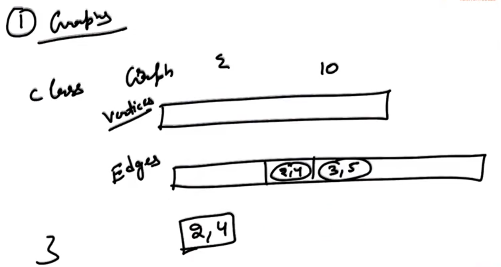

## 0.Graphs Introduction

A graph is a set of Vertices and a set of edges connecting them...

e.g: 

- If we wanna put network of people on a social network then we will be using a Graph.

- Road connecting cities (Road Network).

--

In case of Trees:

- Tree is a special kind of Graph... and there is always a way to go from one node to another node... i.e. All nodes are connected to each other... (Disconnection is not possible...)

- In Trees, we don't have cycles...

-----------------

## 1.Graphs Terminology


Terminologies we are using in case of Graph:

- Nodes call as <mark>Vertices</mark>...

- Connection will call as <mark>Edges</mark>...

- We will call Two Verices as adjacent if they have a direct edge between them... (<mark>Adjacent Vertices</mark>)

- <mark>Degree of a Vertex</mark> which will be define as the number of edges that are basically going through that vertex...

- <mark>Path</mark> is basically collection of edges through which we can reach from one point to other point (e.g: <mark>Direct edge</mark> between A and B)

- <mark>Connected Graph</mark> : We call a graph... connected graph if for every two vertices there is a path between them... 

- <mark>Connected Components</mark> : When we will have a graph which is not connected and we have components which are connected themselves...

- <mark>Tree</mark> : Tree is a connected graph which does not have a cycle...

--

Example:


We have a graph with "n" vertices and then 

- Minimum number of edges we can have is: 0.

- Minimum number of edges in a connected graph will be: <mark>(n-1)</mark> i.e. O(n).
  
  NOTE: A minimum connected graph is basically a Tree...

- When we have a complete graph i.e. Every vertex has an edge with every other vertex... Here, we have: <mark>nC2</mark> edges... i.e. O(n^2).

--

NOTE: When we are working on number of edges then we will not call them linear, we will call them Quardratic because its quardratic in terms of number of Vertices..

--------------

## 2.Graphs Implementation



--


1. Edge List     =>    O(n^2)

2. Adjacency List      =>     O(n)

3. Adjacency Matrix: 
   
   - Here, cell [i,j] going to tell me - "Is there is an edge from "i" to "j" ? ".
   
   - Adjacency Matrix is very fast to implement...
   
   - Problem from "Adjacency Matrix" is that it takes alot of space i.e. O(n^2).

-------------

## 3.DFS - Adjacency Matrix


--

```cpp
#include <iostream>
using namespace std;

void print(int** edges, int n, int sv, bool* visited) {
    cout << sv << endl;
    visited[sv] = true;
    for (int i = 0; i < n; i++) {
        if (i == sv) {
            continue;
        }
        if (edges[sv][i] == 1) {
            if (visited[i]) {
                continue;
            }
            print(edges, n, i, visited);
        }
    }
}

int main() {
    int n;
    int e;
    cin >> n >> e;
    int** edges = new int*[n];
    for (int i = 0; i < n; i++) {
        edges[i] = new int[n];
        for (int j = 0; j < n; j++) {
            edges[i][j] = 0;
        }
    }
    
    for (int i = 0; i < e; i++) {
        int f, s;
        cin >> f >> s;
        edges[f][s] = 1;
        edges[s][f] = 1;
    }
    
    bool* visited = new bool[n];
    for (int i = 0; i < n; i++) {
        visited[i] = false;
    }
    
    print(edges, n, 0, visited);

    // Delete all the memory
    delete [] visited;
    for(int i = 0; i < n; i++) {
        delete [] edges[i];
    }
    delete [] edges;
}
```

"0" means No Edge...

"1" means there is an Edge...

f    =>    First Vertex

s    =>    Second Vertex

sv    =>    Starting Vertex (Start from "0")

-

<u>Output</u>:

4
3
0 2
2 1
1 3
0
2
1
3
--


DFS    =>    Depth First Search (It means once we going to one direction will keep going into depth till the point we can't go anymore...)

--------------

## 4.BFS Traversal

BFS    =>    Breadth First Search


- BFS is very similar to the Level-Order Traversal (In case of Trees).

- We need to use "QUEUE" and Need to use Array to marked "visited" and have to done the work till "Queue" will Empty...

-------

## 6.Solution BFS Traversal

```cpp
#include <iostream>
#include <queue>
using namespace std;

void print(int** edges, int n, int sv, bool* visited) {
    cout << sv << endl;
    visited[sv] = true;
    for (int i = 0; i < n; i++) {
        if (i == sv) {
            continue;
        }
        if (edges[sv][i] == 1) {
            if (visited[i]) {
                continue;
            }
            print(edges, n, i, visited);
        }
    }
}

void printBFS(int** edges, int n, int sv) {     //SEE...
    queue<int> pendingVertices;
    bool * visited = new bool[n];
    for (int i = 0; i < n; i++) {
        visited[i] = false;
    }
    pendingVertices.push(sv);
    visited[sv] = true;
    while (!pendingVertices.empty()) {
        int currentVertex = pendingVertices.front();
        pendingVertices.pop();
        cout << currentVertex << endl;
        for (int i = 0; i < n; i++) {
            if (i == currentVertex) {
                continue;
            }
            if (edges[currentVertex][i] == 1 && !visited[i]) {
                pendingVertices.push(i);
                visited[i] = true;
            }
        }
    }
    delete [] visited;
}

int main() {
    int n;
    int e;
    cin >> n >> e;
    int** edges = new int*[n];
    for (int i = 0; i < n; i++) {
        edges[i] = new int[n];
        for (int j = 0; j < n; j++) {
            edges[i][j] = 0;
        }
    }
    
    for (int i = 0; i < e; i++) {
        int f, s;
        cin >> f >> s;
        edges[f][s] = 1;
        edges[s][f] = 1;
    }
    
    bool* visited = new bool[n];
    for (int i = 0; i < n; i++) {
        visited[i] = false;
    }
    
    cout << "DFS" << endl;
    print(edges, n, 0, visited);
    
    cout << "BFS" << endl;
    printBFS(edges, n, 0);      //SEE...
    
    // Delete all the memory
    delete [] visited;
    for(int i = 0; i < n; i++) {
        delete [] edges[i];
    }
    delete [] edges;
}
```

<u>Output</u>:

8
9
0 4
0 5
4 3
3 2
2 1
1 3
5 6
3 6
6 7
DFS
0
4
3
1
2
6
5
7
BFS
0
4
5
3
6
1
2
7


<u>NOTE</u>: If we have 2-3 Edges then we will go to the Lower vertex number because my for() loop is working between 0 to (n-1).

----------

## 7.BFS DFS for disconnected graph

For the vertices which have not been reached yet... (In case of <u>connected component</u>) then we will start BFS and DFS from one of these vertices again...


--

Program: (Example to show graph is disconnected but still working...)

```cpp
#include <iostream>
#include <queue>
using namespace std;

void printDFS(int** edges, int n, int sv, bool* visited) {
    cout << sv << endl;
    visited[sv] = true;
    for (int i = 0; i < n; i++) {
        if (i == sv) {
            continue;
        }
        if (edges[sv][i] == 1) {
            if (visited[i]) {
                continue;
            }
            printDFS(edges, n, i, visited);
        }
    }
}

void printBFS(int** edges, int n, int sv, bool* visited) {     //SEE...
    queue<int> pendingVertices;
    pendingVertices.push(sv);
    visited[sv] = true;
    while (!pendingVertices.empty()) {
        int currentVertex = pendingVertices.front();
        pendingVertices.pop();
        cout << currentVertex << endl;
        for (int i = 0; i < n; i++) {
            if (i == currentVertex) {
                continue;
            }
            if (edges[currentVertex][i] == 1 && !visited[i]) {
                pendingVertices.push(i);
                visited[i] = true;
            }
        }
    }
}

void BFS(int** edges, int n) {    //SEE...
    bool * visited = new bool[n];
    for (int i = 0; i < n; i++) {
        visited[i] = false;
    }
    for (int i = 0; i < n; i++) {
        if (!visited[i])
            printBFS(edges, n, i, visited);
    }
    delete [] visited;
}

void DFS(int** edges, int n) {        //SEE...
    bool * visited = new bool[n];
    for (int i = 0; i < n; i++) {
        visited[i] = false;
    }
    for (int i = 0; i < n; i++) {
        if (!visited[i])
            printDFS(edges, n, i, visited);
    }
    delete [] visited;
}

int main() {
    int n;
    int e;
    cin >> n >> e;
    int** edges = new int*[n];
    for (int i = 0; i < n; i++) {
        edges[i] = new int[n];
        for (int j = 0; j < n; j++) {
            edges[i][j] = 0;
        }
    }
    
    for (int i = 0; i < e; i++) {
        int f, s;
        cin >> f >> s;
        edges[f][s] = 1;
        edges[s][f] = 1;
    }
    
    cout << "DFS" << endl;
    DFS(edges, n);
    
    cout << "BFS" << endl;
    BFS(edges, n);
    
    // Delete all the memory
    for(int i = 0; i < n; i++) {
        delete [] edges[i];
    }
    delete [] edges;
}
```

<u>Output</u>:

7
5
0 2
0 3
2 3
1 4
5 6
DFS
0
2
3
1
4
5
6
BFS
0
2
3
1
4
5
6


----------------

## 8.Has path

Here, we are given two vertices - Starting vertex (s) and Ending Vertex (e). We want to check there is a path from start to end or not...??

Solution:

- We have to do BFS or DFS and have to do Traversal to the Graph, We will start from "s" and when we will find End (e), then we will return "TRUE".

- If after complete Traversal when we return and we will not able to find the end (e) then return "FALSE". 

--------------

## 10.Get Path - DFS


In this problem, we are supposed to return the path from "Starting Vertex" to "Ending Vertex". 

Here, we want "DFS" path:


- Case 1 : To check if "s" and "e" are same... Then we create a new dynamic Array where we put "e" and we return "e".

- Case 2 : We will go through all the vertices and check what all have an edge with "s".

- Case 3 : If none of my adjacent return a not NULL value, we will have to return a NULL value...

NOTE: We required a visited Array...

-----------

## 12.Get Path - BFS

In this problem, we are supposed to return the path from "Starting Vertex" to "Ending Vertex". (Using BFS)

NOTE:  It gives shortest path...


NOTE: In BFS, we use Queue... and we work till the "end vertex" will not go to the Queue...


(We will use Map... to rebuild the complete Path)

-----

## 14.Is Connected

Here, we are going to check if a graph is connected or not?


<u>SOLUTION</u>:

- We can just start from one and Run "DFS" and check wether everything is visited or Not...

- If anything left which is not visited then it's a disconnected graph.

- Our isConnected function will make "visited" Array... (and it will call any DFS function, which will going through the whole graph... and when that function returns we will check that everything is visited or NOT ?)

-------------

## 16.Return all connected components

Total output where inside each output is giving us one connected component... 


Steps:

- We will create an Empty output initially and then make empty one by one and will send it to BSF or DFS with the starting vertex as the first vertex that we can find that has not been visited yet... So, initially call will be with "0" and we will get one connected component... and so on we will get all the connected components... and by putting all together we will return it...

- Initial visited everything is False... So, we will pick the first one with the Visited False and start covering from this using BFS (or) DFS... When its done then we will get our one component... Simultaneously send empty "Array list" or  "Vector" to DFS.

- Again we will send our Dynamic Array to the not visited Vertex...

-------------

## 18.Weighted Directed Graphs


Variation of Graphs:

1. <u>Directed Graphs</u>: A graph which has directed edges (one way edges) is called Directed Graph... 
   
       edges[i][j] = 1;    
       //If there is an edge from "i" to "j"  We can go from "i" to "j"
       // it doesn't mean that we can go from "j" to "i" also... 
       
       edges[j][i] = 1; // So, we should not use it...

2. <u>Weighted Graphs</u>: Not all edges are equal...

----------


