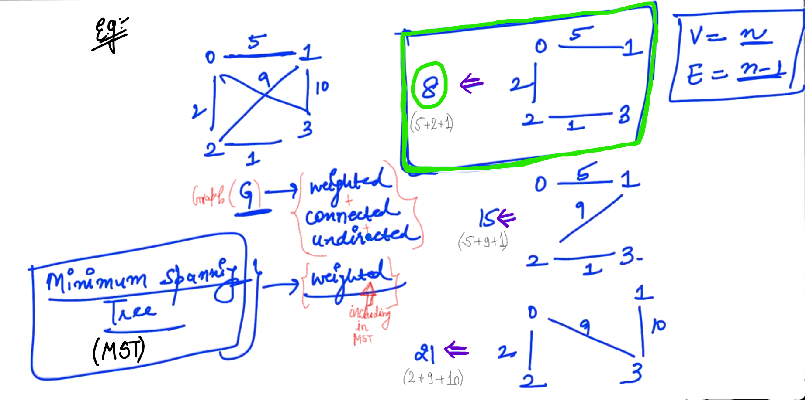
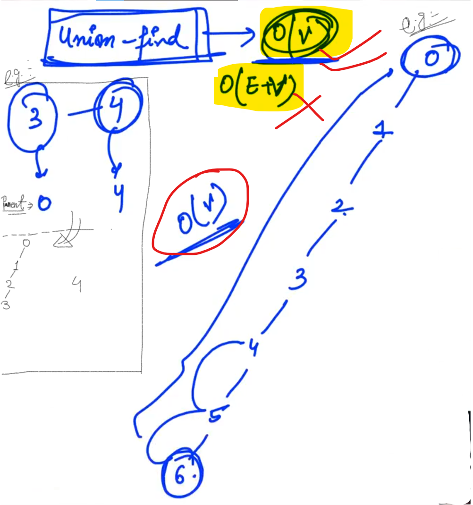
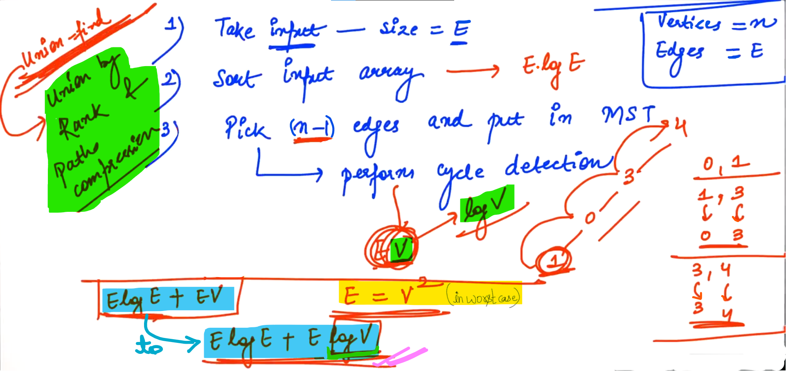

## 0.MST Kruskals Introduction

<u>Tree</u>: Tree is a graph with two important properties:

-  It should be connected

- It should not contain any cycle.

--

<u>Spanning Trees</u>: Spanning Trees means a tree which contains all the vertices... (Given Graph is: <mark>Undirected</mark> and <mark>Connected</mark>...)

<u>NOTE</u>:

- For a given graph, We can have multiple spanning Trees...

- In spanning tree, total number of vertices are "n" and total number of Edges are: "n-1"

--

<u>Minimum Spanning Trees (MST)</u>: <mark>Graph is: Undirected + Connected + Weighted</mark>.

Example:



NOTE: 

- In weighted graphs; weight of Edge of given Graph is Specified...

- It is the MST for the given graph, Since the weight of this spanning Tree is minimum out of all possible Spanning Trees... (Because we included only those edges whose weights are minimum...)

--

Example: (Here, we want to make MInimum Spanning Tree (MST))


--

<u>Kruskal's Algorithm</u>:

Helps to figure out the MST of a given Graph...

Total number of vertices are: "n" and Total number of edges are: "n-1"

Steps:

- Kruskal's Algorithm says let's pick the edges one by one... Firstly we pick the edge whose weight is minimum...

- Since, we want "n-1" edges then we will maintain a "count" which will tell us how many edges we have taken till now... 

<u>Example</u>:


<u>Example</u>:


- When we pick any edge with minimum weight out of all given edges we should check that Is there any cycle generates due to introducing of any edge in our current MST ?? If yes, then we need to skip that edge... and if No, then we will add that edge... And we will continue this process untill in our MST there will be "n-1" edges added... 

------------------

## 1.Cycle Detection

<u>Case - 1</u>:


- We are maintaining a list of vertices which are came in the MST.

- Note: We can't say if both Vertices are present in the list than cycle in MST form or NOT. So, this will <mark>FAIL</mark>.

--

<u>Case - 2</u>:

Before adding any edge, check If there is an already existing path between the two vertices in the MST ?? If yes, then adding edge will leads to formation of cycles... otherwise NOT...


In order to detect cycle, for every edge we have to do work: <mark>O(V+E)</mark>

V    :     Vertex,    

E    :     Edge (In worst case, number of Edges could be: V^2)

--

<u>**Union Find Algorithm**</u> (for cycle detection):

Initially, we have assumed our all vertices in different disjoint sets and we have maintained a Array of name "parents" and in that we are putting the parents of the Vertices.


- If the top-most parents of V1 and V2 comes different that means we can add that edge...

- Note: If parents of both vertices are same then it means both vertices lies in the same components and it means if we connect both vertices then cycle will add in the MST. So, we will skip this Edge...

- Note: **We are also making changes in the Parents Array**...

--

Example:


<u>Complexity</u>:

In worst case:



Complexity of <u>Union - find</u>:  <mark>O(V)</mark> ; When we need to travel each vertex to reach the Parent...

---------

## 2.Kruskals Algorithm


n    ->    Total number of vertices

e    ->    Total number of Edges

(Input    =>    Source, Destination and Weight)

<u>Steps</u>:

- We have to choose Edges based on their weights in increasing order...

- We will create a class "Edge"

- We will create an array of name "input" of type "Edge" and of size "e".

- In "input" Array we will save all the values (Source, Destination, Weight) of every Edge...

- We need to have another Array "output" which is also of type "Edge" of size "n-1" (Since, the edges in our MST is "n-1".)

- So, in "input" we will have given graph and in "output" we will put the edges which will belongs to the MST.

<u>NOTE</u>: Use Inbuilt sort function (To sort the input array in increasing order...), In sort we have to pass the Array (Let we have a integer Array "a" and its size is "n"). So, we have to pass like: <mark>sort(a, a+n)</mark> and this sort function will sort the array "a" by default in increasing order. Using "a" we are passing the starting Itrator and using  "a+n" we are passing the itrator which is pointing at end of my Array...

- We need to maintain parent of each vertex. (parent array of type integer of size "n".)

- If parents are same of the both vertices then in MST add edge "e" and make a update of count++.

- Update in parent Array (To connect the parents).

- If parents of both vertices are same then go to the next iteration i.e. pick the next edge and skip the current edge...

-------------

## 4.Kruskals Algorithm - Solution

- "n" represents total number of Vertices and "E" represents total number of edges...

- input[i]    ->    "i"th index of the "input" Array... 

- In every index of "input" Array have object of "edge" class.

- "input[i]" represents one object of class "Edge".


--

```cpp
#include <iostream>
#include <algorithm>    // To use inbuilt sort() function
using namespace std;

class Edge {
    public:
        int source;
        int dest;
        int weight;
};

bool compare(Edge e1, Edge e2) {
    return e1.weight < e2.weight; // When we want to sort Array in increasing order
}

int findParent(int v, int *parent) {
    if(parent[v] == v) {
        return v;
    }
    return findParent(parent[v], parent);
}

void kruskals(Edge *input, int n, int E) {
    // Sort the input array in Ascending order based on weights
    sort(input, input + E, compare);
    
    //Creating output Array of type "Edge"
    Edge *output = new Edge[n-1];   //Since, we want to add "n-1" edges in our MST
    
    int *parent = new int[n];   //Size "n" because we have to store parent of each vertex
    
    for(int i = 0; i < n; i++) {
        parent[i] = i;
    }
    
    int count = 0;  //Tells currently edges added in the MST
    int i = 0;  //Tells the current working Edge...
    while(count != n-1) {
        Edge currentEdge = input[i]; 
        
        //Check if we can add the currentEdge in MST or not...
        int sourceParent = findParent(currentEdge.source, parent);
        int destParent = findParent(currentEdge.dest, parent);
        
        if(sourceParent != destParent) {
            output[count] = currentEdge;    //"count" maintain that edges gone in the output...
            count++;
            parent[sourceParent] = destParent;
        }
        i++;
        
    }
    
    for(int i = 0; i < n-1; i++) {
        if(output[i].source < output[i].dest) {
            cout << output[i].source << " " << output[i].dest << " " << output[i].weight << endl;
        }
        else{
            cout << output[i].dest << " " << output[i].source << " " << output[i].weight << endl;
        }
    }
}

int main() {
    int n, E;
    cin >> n >> E;
    Edge *input = new Edge[E];
    
    for(int i = 0; i < E; i++) {
        int s, d, w;
        cin >> s >> d >> w;
        input[i].source = s;
        input[i].dest = d;
        input[i].weight = w;
    }
    
    kruskals(input, n, E);
}
```

<u>Output</u>:

6 11
0 1 2
1 3 1
0 2 4
2 4 9
4 5 5
3 5 7
4 3 11
2 5 10
0 3 3
2 1 8
2 3 6
1 3 1    //From here...
0 1 2
0 2 4
4 5 5
3 5 7


-------------------

## 5.Complexity of Kruskals Algorithm

Steps that we have followed for our code:



- For sorting, complexity will be: "<mark>E.logE</mark>"

- We are connecting source parent and destination parent... Possibly for figuring out the parent of any vertex we may have to travel all the vertices. So, <mark>cycle detection</mark> for <u>**one edge**</u> can take <mark>O(V)</mark> time in worst case... Lets we have to skip many edges and finally in order to extract "n-1" edges, It might happen that we have to travel total Edges (E). So, for one edge if the time is "V" then for "E" number of edges the time will be "<mark>E.V</mark>".

So, Total complexity of the function will be: <mark>**ElogE + EV**</mark>. It is Bad because in worst case value of "E" i.e. Total number of Edges could be "V^2" (When our graph will be complete graph.)

Here, We can't improve the sorting part but we can improve the cycle detection part... Right now we are using "<mark>Union find algorithm</mark>" and we can use better version of it i.e. "**<mark>Union by Rank & path compression</mark>**". So, we can reduce from "V" to "log V" (To figure out the parent). So, the Total complexity of the function will be: <mark>**E.logE + E.logV**</mark>.

------------------------------

## 6.Prims Algorithm

Prims Algorithm for finding Minimum Spinning Tree (MST)


Here, we need to follow "Greedy Approach/Algoritm" (If we have multiple options we will pick currently the one which seen best to us).

-


- "a" is the index of the vertex with the minimum weight...

- Mark "a" as visited...

- We have to Travel all neighbours of "a" which are unvisited.

- We need to decide whether to update or NOT...
  
  - parent [ ] of the neighbour
  
  - weight[ ] of the neighbour...

---------------------

## 8.Solution Prims Algorithm

```cpp
#include<iostream>
#include<climits>
using namespace std;

int findMinVertex(int* weights, bool* visited, int n){
    
    int minVertex = -1;
    for(int i = 0; i < n; i++){
        if(!visited[i] && (minVertex == -1 || weights[i] < weights[minVertex])){
            minVertex = i;
        }
    }
    return minVertex;
}

void prims(int** edges, int n){
    
    int* parent = new int[n];
    int* weights = new int[n];
    bool* visited = new bool[n];
    
    for(int i = 0; i < n; i++){
        visited[i] = false;
        weights[i] = INT_MAX;
    }
    parent[0] = -1;
    weights[0] = 0;
    
    for(int i = 0; i < n - 1; i++){
        // Find Min Vertex
        int minVertex = findMinVertex(weights, visited, n);
        visited[minVertex] = true;
        // Explore unvisited neighbours
        for(int j = 0; j < n; j++){
            if(edges[minVertex][j] != 0 && !visited[j]){
                if(edges[minVertex][j] < weights[j]){
                    weights[j] = edges[minVertex][j];
                    parent[j] = minVertex;
                }
            }
        }
        
    }
    
    // Print edges of MST
    for(int i = 1; i < n; i++){
        if(parent[i] < i){
            cout << parent[i] << " " << i << " " << weights[i] << endl;
        }else{
            cout << i << " " << parent[i] << " " << weights[i] << endl;
        }
    }
}

int main() {
    int n;
    int e;
    cin >> n >> e;
    int** edges = new int*[n];  //  Adjacency Matrix (structure to store graph)
    for(int i = 0; i < n; i++) {
        edges[i] = new int[n];
        for (int j = 0; j < n; j++) {
            edges[i][j] = 0;
        }
    }
    
    for (int i = 0; i < e; i++) {
        int f, s, weight;
        cin >> f >> s >> weight;    // f -> first vertex & s -> second vertex
        edges[f][s] = weight;
        edges[s][f] = weight;
    }
    cout << endl;
    prims(edges, n);
    
    for (int i = 0; i < n; i++) {
        delete [] edges[i];
    }
    delete [] edges;
}
```

n    =>    Total number of vertices

<u>Output</u>:

5 7
0 1 4
0 2 8
1 3 6
1 2 2
2 3 3
2 4 9
3 4 5


0 1 4    //From here
1 2 2
2 3 3
3 4 5

-----------

## 9.Complexity of Prims Algorithm

Complexity of findMinVertex: O(n), where, "n" is number of vertices.


Overall complexity is: <mark>O(n^2)</mark>

--

Some improvements: 

- One of the redultant work is that because of <mark>Adjacency Matrix</mark>, we have to travel through all the vertices to check is it Neighbour or Not? So, For neglecting travelling  to every vertices, we should use <mark>Adjacency List</mark> instead of <mark>Adjacency Matrix</mark>...

- We have certain list of vertices and we have to find the one with minimum weight...  So, we can use "<mark>Priority Queue</mark>" which can quickly give minimum from the current list... 
  
  In minimum priority queue, if we want to remove the vertex, then complexity will be "log n" if there are "n" vertices total.

So, the new improved complexity will be: <mark>(E + n).log n</mark>

NOTE: (n = number of vertices)

-------------

## 10.Dijkstras Algorithm

Dijkstras Algorithm to find out the shortest distance between any two nodes...


- We will pick vertex with minimum distance i.e. "0" and then mark "0" as visited... 

- Now, explore the adjacent vertices (Neighbours) of "0". Find Cost of the path from the vertex to the neighbour... If the cost is less than the existing cost then we will update distance if possible... 

- We need to add lebel to check current element is visited or Not?

- We need to store distance value for each vertex...

-


For "V" vertices, we will do (v-1) times this process...

-----------------

## 12.Solution Dijkstras Algorithm


-


-

    #include<iostream>
    #include<climits>
    using namespace std;
    
    int findMinVertex(int* distance, bool* visited, int n){
        
        int minVertex = -1; //Since, Initially we don't have any vertex
        for(int i = 0; i < n; i++){
            if(!visited[i] && (minVertex == -1 || distance[i] < distance[minVertex])){
                minVertex = i;
            }
        }
        return minVertex;
    }
    
    void dijkstra(int** edges, int n){
        int* distance = new int[n];
        bool* visited = new bool[n];
        
        for(int i = 0; i < n; i++){
            distance[i] = INT_MAX;
            visited[i] = false;
        }
        
        distance[0] = 0;
        
        for(int i = 0; i < n - 1; i++) {
            int minVertex = findMinVertex(distance, visited, n);
            visited[minVertex] = true;
            for(int j = 0; j < n; j++){
                if(edges[minVertex][j] != 0 && !visited[j]){
                    int dist = distance[minVertex] + edges[minVertex][j];
                    if(dist < distance[j]){
                        distance[j] = dist;
                    }
                }
            }
        }
        
        for(int i = 0; i < n; i++){
            cout << i << " " << distance[i] << endl;
        }
        delete [] visited;
        delete [] distance;
    }
    
    int main() {
        int n;
        int e;
        cin >> n >> e;
        int** edges = new int*[n];  //  Adjacency Matrix (structure to store graph)
        for(int i = 0; i < n; i++) {
            edges[i] = new int[n];
            for (int j = 0; j < n; j++) {
                edges[i][j] = 0;
            }
        }
        
        for (int i = 0; i < e; i++) {
            int f, s, weight;
            cin >> f >> s >> weight;    // f -> first vertex & s -> second vertex
            edges[f][s] = weight;
            edges[s][f] = weight;
        }
        cout << endl;
        dijkstra(edges, n);
        
        for (int i = 0; i < n; i++) {
            delete [] edges[i];
        }
        delete [] edges;
    }

<u>Output</u>:

5 7
0 1 4
0 2 8
1 3 5
1 2 2
2 3 5
2 4 9
3 4 4 

0 0    //From here...
1 4
2 6
3 9
4 13

<u>Complexity</u>: <mark>O(n^2)</mark>


We can improve this complexity:

- One of the redultant work is that because of Adjacency Matrix, we have to travel through all the vertices to check is it Neighbour or Not? So, For neglecting travelling to every vertices, we should use <mark>Adjacency List</mark> instead of <mark>Adjacency Matrix</mark>...

-     int minVertex = findMinVertex(distance, visited, n);
  
  Here, function takes O(n) times, we scanning Array in all vertices and get minimum.
  
  So we can use <mark>Priority Queue</mark>...

So, new complexity will be: <mark>(V+E).logV</mark> where, "V" (or) "n" is number of vertices...

---------


