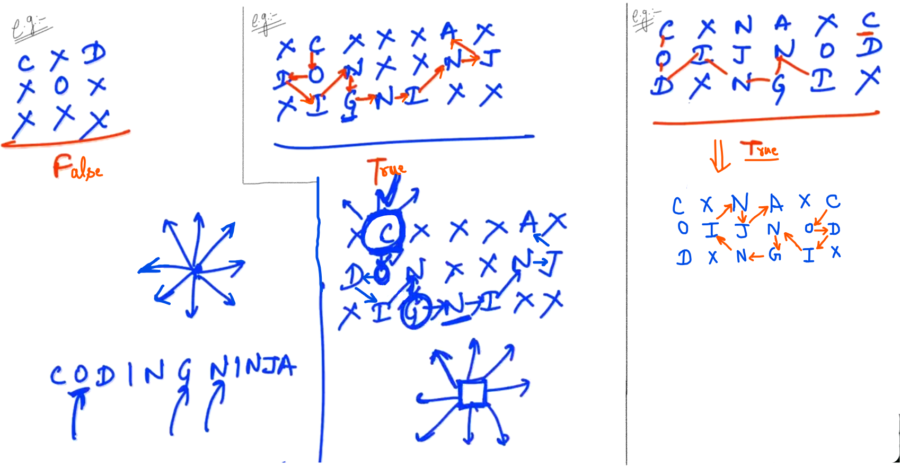

## 0.Islands[HINT]

Here, we are given "N" number of islands and we need to figure out the number of connected group of Islands (i.e. Path is present between the islands)...

- We can use DFS (or) BFS

<u>Example</u>:

total number of vertices = 7

<u>Steps</u>: (DFS)

- Maintain a "count" which will be zero initially... ("0" represents the count of connected components in the graph is 0.)

- Pick the 1st vertex and visit the other vertices through this vertex (i.e. Figure out the Adjacent vertices)

- Create a Adjacency matrix from the given input...

- Call recursion over the adjacent vertex of 1st matrix...

- Maintain the visited vertices... After the marking of all the vertices in the one connected component (i.e. completing one traversal) then RETURN and we need to update the count by "1".

- Now, we need to check that out of all given vertices which vertex is still not visited... and pick the vertex of the other component... and then again call recursion in that vertex...

- At last we need to return the "count" variable...

<u>Example</u>:

total number of vertices = 9

We need to call "helper" function till we have a single vertex left <u>as not visited</u>... and the number of times "helper" function called... We need to update the "count" and then return the "count".

---------------

## 1.Coding Ninjas[HINT]

In this question, we are given few strings and we need to figure out if we can find out coding ninja with the help of characters given or not... If yes, answer should be "TRUE" otherwise answer should be "FALSE".

In moving 8 possible direction, somehow we need to figure out the path that creates coding ninja... 

- In any direction, if we get a valid character then we will call recursion on that... an tell recursion that search the required valid path... If yes, answer should be "TRUE" otherwise answer should be "FALSE".

- <u>NOTE</u>: The characters we are already visiting (used) we should mark it as VISITED... So, we will not call again...

<u>NOTE</u>: After marking characters as visited if we didn't get answer and we return back by marking Un-visited all characters. So, that those characters will available again for other next path...

----------

## 3.Largest Piece[HINT]

Here, we are given a square cake with "0" and "1" only and we need to figure out the largest piece of cake with only "1" and need to return its size.

- Connected (Edge Share) i.e. can move in 4 possible directions only...

<u>Example</u>:

<u>Step</u>:

- We are running a loop over the square piece of cake... and finding the index where "1" is present. (We need to search the index where "1" is present...)

- Call recursion and get the "count" (Return "count + 1")

- Use mark "Visited"

- Compare Largest size (s) with "max" and return "max".

<u>Example</u>:

- In all 4 directions; it should be within limits... 

- and then it is "1" or not...

- and then we should check Visited or Not...

----------------

## 4.3 Cycle[HINT]

In this question, we are given a graph and we need to figure out the count of distinct three cycles...

- NOTE: We generally need Adjacency Matrix (or) Adjacency list for given graph where we want to traverse over all adjacent vertices for a particular vertex...

<u>Steps</u>:

- Pick the first vertex then go one by one to all of its adjacent vertices...

- Initially "count" is ZERO... then "count++".

- We need three vertices; so, for all three we had run "3" loops...

- <u>Note</u>: From the way we are solving our problems... We are getting one cycle two times in both possible directions i.e. Clockwise and Anticlockwise and Here, we are getting one cycle 6 times... so, answer should be: <mark>(count/6)</mark>

- We need to Avoid "visited" in this question because if we mark "visited" any vertex then we will not able to use that vertex for any other cycle... It (vertex) might be shared...

----------------------

