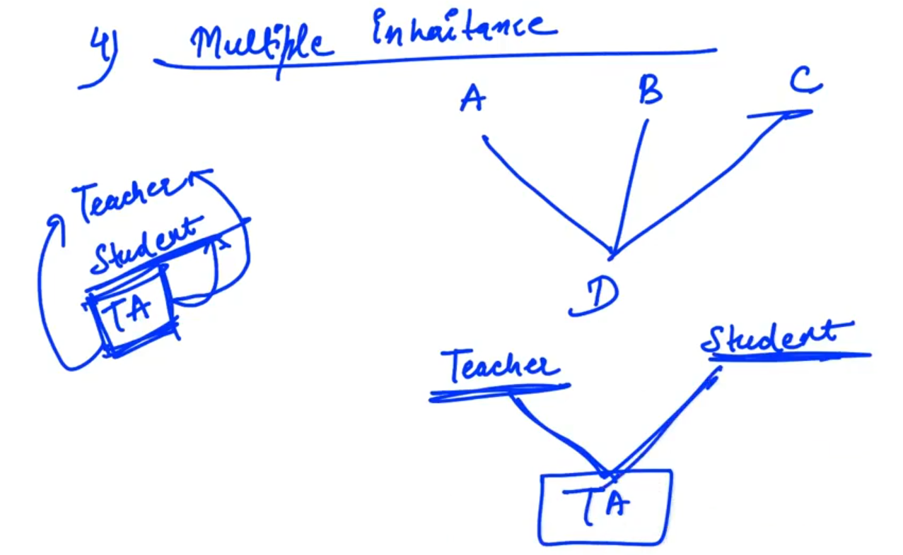
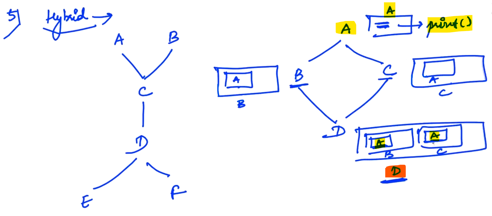
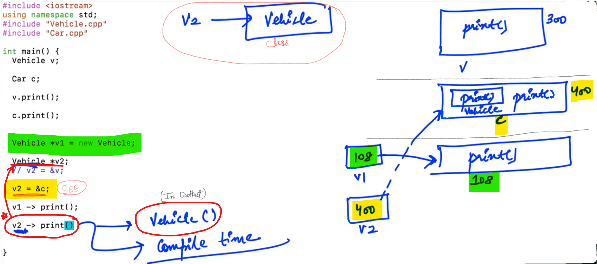
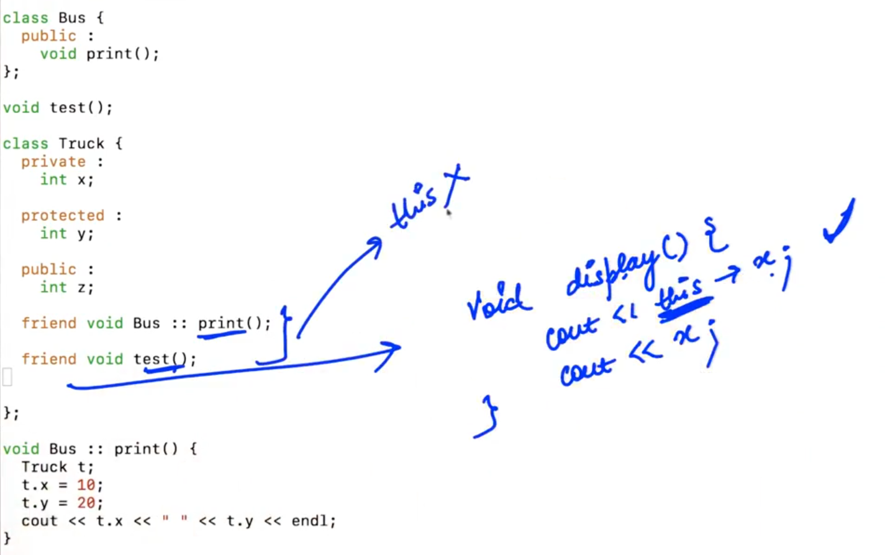

## 0.Abstraction Encapsulation

<u>Encapsulation</u>:

Encapsulation refers to the clubbing of data and functions of any entity using classes...


--

<u>Abstraction</u>: (Hiding)

- e.g.:  (i) sort( )
  
  (ii) We are using STL (Standard Template Libraries) and In STL, many Data Structures are already implimented (Stacks, Queues, Hashmaps, Priority Queues)

- If we want to hide something from the outside world, we can make them <u>private</u>... So that noone can access from the outside of the class...


Qs. Why we want to achieve Abstraction (i.e. Hide Details)??

Ans.: 1. End user code should not affected from any Updation or change...

2. To Avoid the errors (So that any third person can't make changes by accessing the code)

------------

## 1.Inheritance Introduction

<u>Inheritance</u>: To inheritate the characteristics or properties from parents...

- We are reusing the code...

<u>Example</u>:


<u>Example</u>:


--

<u>**Access Modifiers**</u>:

- private

- public

- protected (If we declare any property as protected it means that property is accessable to the child classes only...)


<u>NOTE</u>: By default, our access modifier is "Private" at the time of Inheritance...

------------

## 2.Inheritance Syntax

NOTE:

- Parent class is also called "Base Class".

- Child class is also called "Derived Class".


-


-


-


If we inheriate using "protected" ; then protected members and public members of Base class becomes "protected" members of derived class...

--


If we inheriate using "private" ; then protected members and public members of Base class becomes "private" members of derived class... and further we can't use these properties...

---------------

## 3.Inheritance Order of Constructor Destructor call


--

```cpp
#include <iostream>
using namespace std;

class Vehicle {
    private:
        int maxSpeed;

    protected:
        int numTyres;

    public:
        string color;

    Vehicle() {
        cout << "Vehicle's default constructor " << endl;
    }

    ~Vehicle() {
        cout << "Vehicle's Destructor " << endl;
    }
};

class Car : public Vehicle {
    public:
        int numGears;

        Car() {
        // Car() : Vehicle() {
            cout << "Car's default constructor " << endl;
        }

        ~Car() {
            cout << "Car's Destructor " << endl;
        }

        void print() {
            cout << "NumTyres : " << numTyres << endl;
            cout << "Color : " << color << endl;
            cout << "Num gears : " << numGears << endl;
         // cout << "Max Speed : " << maxSpeed << endl;  //maxSpeed is private and not inheritate // Error
        }
};

int main() {
    Vehicle v;

    v.color = "Blue";
    // v.maxSpeed = 100;    //Private so, show ERROR
    // v.numTyres = 4;  // Protected... So, not accessible

    Car c;
    c.color = "Black";
    // c.numTyres = 4; //ERROR // Protected property are accessible from the outside of the class using Drived Class
    c.numGears = 5;

}
```

<u>Output</u>:

Vehicle's default constructor
Vehicle's default constructor 
Car's default constructor 
Car's Destructor 
Vehicle's Destructor 
Vehicle's Destructor

--

```cpp
#include <iostream>
using namespace std;

class Vehicle {
    private:
        int maxSpeed;

    protected:
        int numTyres;

    public:
        string color;

    Vehicle() {
        cout << "Vehicle's default constructor " << endl;
    }

    Vehicle(int z) {    //SEE... Parameterised constructor
        cout << "Vehicle's Parameterized Constructor " << endl;
        maxSpeed = z;
    }

    ~Vehicle() {
        cout << "Vehicle's Destructor " << endl;
    }
};

class Car : public Vehicle {
    public:
        int numGears;

        Car() : Vehicle(5) {        //SEE... //Parameterised Constructor of "Vehicle" class...
            cout << "Car's default constructor " << endl;
        }

        ~Car() {
            cout << "Car's Destructor " << endl;
        }

        void print() {
            cout << "NumTyres : " << numTyres << endl;
            cout << "Color : " << color << endl;
            cout << "Num gears : " << numGears << endl;
         // cout << "Max Speed : " << maxSpeed << endl;  //maxSpeed is private and not inheritate // Error
        }
};

int main() {

    Car c;

}
```

<u>Output</u>:

Vehicle's Parameterized Constructor 
Car's default constructor 
Car's Destructor 
Vehicle's Destructor 
--

<u>NOTE</u>: 

- Default calls      =>       Implicitly

- Parameterised calls       =>       Explicitly

--

<u>Example</u>:

```cpp
#include <iostream>
using namespace std;

class Vehicle {
    private:
        int maxSpeed;

    protected:
        int numTyres;

    public:
        string color;

    /*    
    Vehicle() {
        cout << "Vehicle's default constructor " << endl;
    }
    */

    Vehicle(int z) {    //SEE... Parameterised constructor
        cout << "Vehicle's Parameterized Constructor " << endl;
        maxSpeed = z;
    }

    ~Vehicle() {
        cout << "Vehicle's Destructor " << endl;
    }
};

class Car : public Vehicle {
    public:
        int numGears;

        Car() : Vehicle(5) {
            cout << "Car's default constructor " << endl;
        }

        ~Car() {
            cout << "Car's Destructor " << endl;
        }

        void print() {
            cout << "NumTyres : " << numTyres << endl;
            cout << "Color : " << color << endl;
            cout << "Num gears : " << numGears << endl;
         // cout << "Max Speed : " << maxSpeed << endl;  //maxSpeed is private and not inheritate // Error
        }
};

int main() {

    Car c;

}
```

<u>Output</u>:

Vehicle's Parameterized Constructor 
Car's default constructor 
Car's Destructor 
Vehicle's Destructor

--

<u>Example</u>:

```cpp
// Calling Parameterised constructor of parent class... //In case of : Car c(5);

#include <iostream>
using namespace std;

class Vehicle {
    private:
        int maxSpeed;

    protected:
        int numTyres;

    public:
        string color;

    /*    
    Vehicle() {
        cout << "Vehicle's default constructor " << endl;
    }
    */

    Vehicle(int z) {    //Parameterised constructor
        cout << "Vehicle's Parameterized Constructor " << endl;
        maxSpeed = z;
    }

    ~Vehicle() {
        cout << "Vehicle's Destructor " << endl;
    }
};

class Car : public Vehicle {
    public:
        int numGears;

        // Car(int x) : Vehicle(x) {        //SEE1....
        Car(int x, int y) : Vehicle(x) { 
            cout << "Car's Parameterised constructor " << endl;
            numGears = y;
        }

        ~Car() {
            cout << "Car's Destructor " << endl;
        }

        void print() {
            cout << "NumTyres : " << numTyres << endl;
            cout << "Color : " << color << endl;
            cout << "Num gears : " << numGears << endl;
         // cout << "Max Speed : " << maxSpeed << endl;  //maxSpeed is private and not inheritate // Error
        }
};

class HondaCity : public Car {
    public:

        // HondaCity() : Car(5) {
        HondaCity(int x, int y) : Car(x, y) {
            cout << "Honda city constructor " << endl;
        }

        ~HondaCity() {
            cout << "Honda city destructor " << endl;
        }
};

int main() {

    HondaCity h(4,5);
    // HondaCity h;
    // Car c(5);  //SEE1...

}
```

<u>Output</u>:

Vehicle's Parameterized Constructor 
Car's Parameterised constructor 
Honda city constructor 
Honda city destructor 
Car's Destructor 
Vehicle's Destructor 

------------------

## 4.Inheritance Types

1. Single Inheritance

2. Multilevel Inheritance

3. Hirarchial Inheritance

4. Multiple Inheritance

5. Hybrid Inheritance


--



TA    ->    Teaching Assistant

<u>Example</u>:

```cpp
#include <iostream>
using namespace std;

class Teacher {
    public:
        string name;
        string age;

        void print() {
            cout << "Teacher" << endl; 
        }
};

class Student {
    public:

        void print() {
            cout << "Student " << endl;
        }
};

//Syntax for creating multiple inheritance
class TA : public Teacher, public Student {
    public:
        void print() {
            cout << "TA " << endl;
        }
};

int main() {
    TA a;

    a.print();  //Case - 1
    /* Error - Since, print() found in multiple base classes i.e. Teacher & Student
    and When "TA" class not have print() function...
    */
    // a.Student :: print(); //So, use " :: "   //Case - 2

    //NOTE: a.print(); works for "TA" class when print() function is present...

}
```

<u>Output (Case - 1)</u>:

TA

<u>Output (Case - 2)</u>:

Student

--

<u>Example</u>:

```cpp
#include <iostream>
using namespace std;

class Teacher {
    public:
        string name;
        string age;

        void print() {
            cout << "Teacher" << endl; 
        }
};

class Student {
    public:

        string name;

        void print() {
            cout << "Student " << endl;
        }
};

//Syntax for creating multiple inheritance
class TA : public Teacher, public Student {
    public:
        void print() {
            cout << "TA " << endl;
        }
};

int main() {
    TA a;

    a.print();

    // a.name = "abcd";    // ERROR - multiple base classes i.e. Teacher & Student
    a.Teacher :: name = "abcd";
}
```

<u>Output</u>:

TA

----------------

## 5.Hybrid Inheritance



<u>Example</u>: (<mark>DIAMOND PROBLEM</mark>)

```cpp
// DIAMOND PROBLEM

#include <iostream>
using namespace std;

class Vehicle {
    private:
        int maxSpeed;

    protected:
        int numTyres;

    public:
        string color;

    Vehicle() {
        cout << "Vehicle's default constructor " << endl;
    }

    Vehicle(int z) {    //Parameterised constructor
        cout << "Vehicle's Parameterized Constructor " << endl;
        maxSpeed = z;
    }

    ~Vehicle() {
        cout << "Vehicle's Destructor " << endl;
    }
};

class Car : public Vehicle {
    public:
        int numGears;

       Car() {
           cout << "Car's default constructor " << endl;
       }

        ~Car() {
            cout << "Car's Destructor " << endl;
        }

        void print() {
            cout << "NumTyres : " << numTyres << endl;
            cout << "Color : " << color << endl;
            cout << "Num gears : " << numGears << endl;
         // cout << "Max Speed : " << maxSpeed << endl;  //maxSpeed is private and not inheritate // Error
        }
};

class Truck : public Vehicle {
    public:

        Truck() {
            cout << "Truck's constructor " << endl;
        }
};

class Bus : public Car, public Truck {
    public:

        Bus() {
            cout << "Bus's constructor " << endl;
        }
};

int main() {
    Bus b;

}
```

<u>Output</u>:


--

```cpp
// DIAMOND PROBLEM (Different Variations)

#include <iostream>
using namespace std;

class Vehicle {
    private:
        int maxSpeed;

    protected:
        int numTyres;

    public:
        string color;

    Vehicle() {
        cout << "Vehicle's default constructor " << endl;
    }

    Vehicle(int z) {    //Parameterised constructor
        cout << "Vehicle's Parameterized Constructor " << endl;
        maxSpeed = z;
    }

    ~Vehicle() {
        cout << "Vehicle's Destructor " << endl;
    }
};

class Car : public Vehicle {
    public:
        int numGears;

       Car() {
           cout << "Car's default constructor " << endl;
       }

        ~Car() {
            cout << "Car's Destructor " << endl;
        }

        void print() {
            cout << "NumTyres : " << numTyres << endl;
            cout << "Color : " << color << endl;
            cout << "Num gears : " << numGears << endl;
         // cout << "Max Speed : " << maxSpeed << endl;  //maxSpeed is private and not inheritate // Error
        }
};

class Truck : public Vehicle {
    public:

        Truck() {
            cout << "Truck's constructor " << endl;
        }
};

class Bus : public Car, public Truck {
    public:

        Bus() {
            cout << "Bus's constructor " << endl;
        }

        void print() {
            cout << "BUS" << endl;
        }
};

int main() {
    Bus b;

    // b.print();   //ERROR - "print" found in multiple base classes
    // In above, When print() function is not present in the "Bus" class

    b.print();  // When "print" function is present in the "Bus" class...
}
```

<u>Output</u>:

Vehicle's default constructor 
Car's default constructor 
Vehicle's default constructor 
Truck's constructor 
Bus's constructor 
BUS                                //SEE
Vehicle's Destructor 
Car's Destructor 
Vehicle's Destructor 
--

```cpp
// DIAMOND PROBLEM (Different Variations)
// CASE: When we don't want to add "print" function in the "Bus" class...

#include <iostream>
using namespace std;

class Vehicle {
    private:
        int maxSpeed;

    protected:
        int numTyres;

    public:
        string color;

    Vehicle() {
        cout << "Vehicle's default constructor " << endl;
    }

    void print() {  //SEE
        cout << "Vehicle" << endl;
    }

    Vehicle(int z) {    //Parameterised constructor
        cout << "Vehicle's Parameterized Constructor " << endl;
        maxSpeed = z;
    }

    ~Vehicle() {
        cout << "Vehicle's Destructor " << endl;
    }
};

class Car : public Vehicle {
    public:
        int numGears;

       Car() {
           cout << "Car's default constructor " << endl;
       }

        ~Car() {
            cout << "Car's Destructor " << endl;
        }

};

class Truck : public Vehicle {
    public:

        Truck() {
            cout << "Truck's constructor " << endl;
        }
};

class Bus : public Car, public Truck {
    public:

        Bus() {
            cout << "Bus's constructor " << endl;
        }

        /*
        void print() {
            cout << "BUS" << endl;
        }
        */
};

int main() {
    Bus b;

    b.Car :: print();    //SEE
}
```

<u>Output</u>:

Vehicle's default constructor 
Car's default constructor 
Vehicle's default constructor 
Truck's constructor 
Bus's constructor 
Vehicle                            //SEE
Vehicle's Destructor 
Car's Destructor 
Vehicle's Destructor 
--

Example:


Program:

```cpp
// DIAMOND PROBLEM (Different Variations)
// CASE: When we have "print" function in "Car" class

#include <iostream>
using namespace std;

class Vehicle {
    private:
        int maxSpeed;

    protected:
        int numTyres;

    public:
        string color;

    Vehicle() {
        cout << "Vehicle's default constructor " << endl;
    }

    Vehicle(int z) {    //Parameterised constructor
        cout << "Vehicle's Parameterized Constructor " << endl;
        maxSpeed = z;
    }

    ~Vehicle() {
        cout << "Vehicle's Destructor " << endl;
    }
};

class Car : public Vehicle {
    public:
        int numGears;

       Car() {
           cout << "Car's default constructor " << endl;
       }

        ~Car() {
            cout << "Car's Destructor " << endl;
        }

        void print() {
            cout << "NumTyres : " << numTyres << endl;
            cout << "Color : " << color << endl;
            cout << "Num gears : " << numGears << endl;
         // cout << "Max Speed : " << maxSpeed << endl;  //maxSpeed is private and not inheritate // Error
        }
};

class Truck : public Vehicle {
    public:

        Truck() {
            cout << "Truck's constructor " << endl;
        }
};

class Bus : public Car, public Truck {
    public:

        Bus() {
            cout << "Bus's constructor " << endl;
        }

        /*
        void print() {
            cout << "BUS" << endl;
        }
        */
};

int main() {
    Bus b;

    b.Car :: print();
}
```

<u>Output</u>:

Vehicle's default constructor 
Car's default constructor 
Vehicle's default constructor 
Truck's constructor 
Bus's constructor 
NumTyres : 0            //"print" function of "Car" class
Color : 
Num gears : 0
Vehicle's Destructor 
Car's Destructor 
Vehicle's Destructor 

--

Example: 


(Here, In "D" class we have two copies of properties of "A" class... We need only one copy... So, for avoiding this copying, We need to use keyword "Virtual".)

```cpp
// DIAMOND PROBLEM (Different Variations)
// CASE: "Virtual" keyword

#include <iostream>
using namespace std;

class Vehicle {
    private:
        int maxSpeed;

    protected:
        int numTyres;

    public:
        string color;

    Vehicle() {
        cout << "Vehicle's default constructor " << endl;
    }

    Vehicle(int z) {    //Parameterised constructor
        cout << "Vehicle's Parameterized Constructor " << endl;
        maxSpeed = z;
    }

    ~Vehicle() {
        cout << "Vehicle's Destructor " << endl;
    }
};

class Car : virtual public Vehicle {    //SEE...
    public:
        int numGears;

       Car() {
           cout << "Car's default constructor " << endl;
       }

        ~Car() {
            cout << "Car's Destructor " << endl;
        }

        void print() {
            cout << "NumTyres : " << numTyres << endl;
            cout << "Color : " << color << endl;
            cout << "Num gears : " << numGears << endl;
         // cout << "Max Speed : " << maxSpeed << endl;  //maxSpeed is private and not inheritate // Error
        }
};

class Truck : virtual public Vehicle {
    public:

        Truck() {
            cout << "Truck's constructor " << endl;
        }
};

class Bus : public Car, public Truck {
    public:

        Bus() {
            cout << "Bus's constructor " << endl;
        }

        /*
        void print() {
            cout << "BUS" << endl;
        }
        */
};

int main() {
    Bus b;

    // b.Car :: print();
}
```

<u>Output</u>:

In initial case when we didn't add virtual "vehicle" constructor called two times... Now, using "virtual" keyword "vehicle" constructor called only one time...


<u>NOTE</u>: A child class can call to its grant parent class contructor when "virtual" keyword is used... This type of Inheritance is also called "Virtual Inheritance".

```cpp
// DIAMOND PROBLEM (Different Variations)
// CASE: "Virtual" keyword
// Virtual Inheritance

#include <iostream>
using namespace std;

class Vehicle {
    private:
        int maxSpeed;

    protected:
        int numTyres;

    public:
        string color;

    /*    //SEE Commented... the default constructor
    Vehicle() {
        cout << "Vehicle's default constructor " << endl;
    }
    */

    void print() {
        cout << "Vehicle" << endl;
    }

    Vehicle(int z) {    //Parameterised constructor     //SEE...
        cout << "Vehicle's Parameterized Constructor " << z << endl;
        maxSpeed = z;
    }

    ~Vehicle() {
        cout << "Vehicle's Destructor " << endl;
    }
};

class Car : virtual public Vehicle {
    public:
        int numGears;

       Car() : Vehicle(3) {             //SEE...
           cout << "Car's default constructor " << endl;
       }

        ~Car() {
            cout << "Car's Destructor " << endl;
        }

        void print() {
            cout << "NumTyres : " << numTyres << endl;
            cout << "Color : " << color << endl;
            cout << "Num gears : " << numGears << endl;
         // cout << "Max Speed : " << maxSpeed << endl;  //maxSpeed is private and not inheritate // Error
        }
};

class Truck : virtual public Vehicle {
    public:

        Truck() : Vehicle(4) {
            cout << "Truck's constructor " << endl;
        }
};

class Bus : public Car, public Truck {
    public:

        Bus() : Vehicle(5) {            //SEE...
            cout << "Bus's constructor " << endl;
        }

        /*
        void print() {
            cout << "BUS" << endl;
        }
        */
};

int main() {
    Bus b;

    // b.Car :: print();
}
```

<u>Output</u>:

Vehicle's Parameterized Constructor 5
Car's default constructor 
Truck's constructor 
Bus's constructor 
Car's Destructor 
Vehicle's Destructor 

-

In above "Virtual Inheritance" case, call of the "Vehicle" class constructor is done by "Bus" class... Not by "Car" class (or) "Truck" class...

----------------

## 6.Polymorphism Compile time

Polymorphism : (Many Forms) Where a Set of codes behaves differently in different context...

Polymorphism basically of Two types:

- Compile Time Polymorphism

- Run Time Polymorphism

<u>Compile Time Polymorphism</u>: 

1. Can be achieved using "Function overloading" or "Operator Overloading".
   
   - Function Overloading: We have different functions with same name but the structure is different...
     
     ```cpp
     #include <iostream>
     using namespace std;
     
     int test(int a, int b) {
     
     }
     
     int test(int a) {
     
     }
     
     int test() {
     
     }
     
     int main() {
     
     }
     ```
   
   - Operator Overloading: Operator behaving differently in different situation....
     
     
     
       
     
     2. Can be achieved by "Method Overriding" / "Function Overriding".
     
     
     
       -
     
     
     
       NOTE: Base class pointer can point to "Derived class object" / "Child class object".
     
       -
     
     ```cpp
     #include <iostream>
     using namespace std;
     
     class Vehicle {
         public:
             string color;
     
             void print() {
                 cout << "Vehicle" << endl;
             }
     };
     
     class Car : public Vehicle {
         public:
             int numGears;
     
             void print() {
                 cout << "Car" << endl;
             }
     };
     
     int main() {
         Vehicle v;  //Statically
     
         Car c;
     
         v.print();      //  =>  Vehicle (in output)
     
         c.print();      //  =>  Car (in output)
     
         Vehicle *v1 = new Vehicle; //Dynamically
         //We have created an object of "Vehicle" class dynamically...
     
         Vehicle *v2;
         // v2 = &c;
     
         v1 -> print();  //  =>  Vehicle (in output)
     
         v2 -> print();  //  =>  Vehicle (in output) //SEE... NOTE
     }
     ```
     
       <u>Output</u>:
     
       Vehicle
       Car
       Vehicle
       Vehicle        //  SEE
       
     
       In " v2 = &v "; using "v2" we can only access those properties which are present in my "Vehicle" class... Because "v2" pointer is of "Vehicle" type...

-----------

## 7.Polymorphism Run time

Run Time Polymorphism means we have to take decision at Run Time...

- For Achieving run time polymorphism we need to take help of "<mark>virtual functions</mark>".

- <mark>Virtual functions</mark> are those functions which are present in a Base class and they  are Overridden in the Derived class...

```cpp
// Example of Runtime Polymorphism 

#include <iostream>
using namespace std;

class Vehicle {
    public:
        string color;
        
        virtual void print() {          //SEE...
            cout << "Vehicle" << endl;
        }
};

class Car : public Vehicle {
    public:
        int numGears;
        
        void print() {
            cout << "Car" << endl;
        }
};

int main() {
    Vehicle v;  //Statically
    
    Car c;
    
    v.print();     //  =>  Vehicle (in output)

    c.print();      //  =>  Car (in output)

    Vehicle *v1 = new Vehicle; //Dynamically
    //We have created an object of "Vehicle" class dynamically...
    
    Vehicle *v2;
    // v2 = &v;
    
    v2 = &c;
    
    v1 -> print();  //  =>  Vehicle (in output)
    
    v2 -> print();  //  =>  Car (in output)     //SEE...
}
```

<u>Output</u>:

Vehicle
Car
Vehicle
Car            //SEE...
-


-

```cpp
// Example of Runtime Polymorphism 

#include <iostream>
using namespace std;

class Vehicle {
    public:
        string color;
        
        virtual void print() { 
            cout << "Vehicle" << endl;
        }
};

class Car : public Vehicle {
    public:
        int numGears;
        /*
        void print() {              //COMMENTED
            cout << "Car" << endl;
        }
        */
};

int main() {
    Vehicle v;  //Statically
    
    Car c;
    
    v.print();     //  =>  Vehicle (in output)

    c.print();      //  =>  Vehicle (in output)

    Vehicle *v1 = new Vehicle; //Dynamically
    //We have created an object of "Vehicle" class dynamically...
    
    Vehicle *v2;
    // v2 = &v;
    
    v2 = &c;
    
    v1 -> print();  //  =>  Vehicle (in output)
    
    v2 -> print();  //  =>  Vehicle (in output)
}
```

<u>Output</u>:

Vehicle
Vehicle
Vehicle
Vehicle

--

NOTE: "Virtual function" is an example of Runtime Polymorphism...

--

<u>Use Case</u>:

Example: In a organisation, there are different kind of Employees (28) are present (HR, Managers, Engineers, Others) and we have to calculate salary of each Employee...


- We will create a class named "Employee" then we will create classes named "HR, Managers, Engineers, Others".

- Now, we will make an Array of type Employee i.e. "e"

- We maked double pointers because we want to make Array of pointers...

- Here, we are calculating salary at Run Time... (Since, caculateSalary is "Virtual")

-----------------

## 8.Virtual functions  Abstract classes

- Virtual functions are those functions which are present in a Base class and they are Overridden in the Derived class...

```
// Normal Virtual Function

virtual void print() {
    ------
    ------
}
```

<u>Pure Virtual Functions</u>: are those whose don't have definition.

    // Example of "Pure Virtual Function"
    
    virtual void print() = 0;

<u>NOTE</u>: 

- Any class which contains any "Pure Virtual Function" becomes an <mark>Abstract class</mark>.

- "Abstract" word means "incomplete". So, the class becomes incomplete...

- In "Abstract class", we can't make object... When we try to make object; ERROR will form...

--

<u>NOTE</u>: 

- When any class inheritate the "Abstract class" then the class has two options:
  
  - Implement all the Pure Virtual Functions... (i.e. Complete by adding the Definition)
  
  - Become an Abstract class...

```cpp
// Example of Pure Virtual Function

#include <iostream>
using namespace std;

class Vehicle {
    public:
        string color;
        
        virtual void print() = 0;       //Pure Virtual Function
        
};

class Car : public Vehicle {
    public:
        int numGears;
        
        /*    
        void print() {  
            cout << "Car" << endl;
        }*/
/* (For removing the ERROR for the "Car" class...)
If we want that "Car" class not become the "Abstract class" then its 
compulsory to implement all the "Pure Virtual Functions" of Base class...
(i.e. Remove the above commented "void print()".)
*/
};

int main() {
    Vehicle v;  //Statically
    
    Car c;
    
}
```

<u>Output</u>: 

ERROR    i.e.

‘v’ to be of abstract type ‘Vehicle’

‘c’ to be of abstract type ‘Car’

--

<u>Use Case</u>:


Ideally, "CalculateSalary" function should be "Pure Virtual Function" because We can't give it's definition i.e. We can't decide how salary should calculate... This can only be decide by the Derived class...

-----------

## 9.Friend Functions  Classes

With the help of Friend function we can access the private / protected properties of some class...


--

```cpp
// Example of "Friend" function

#include <iostream>
using namespace std;

class Bus {
    public:
        void print();
        // Access "x" of Truck
};

class Truck {
    private :
        int x;
        
    protected :
        int y;
        
    public :
        int z;
        
    friend void Bus :: print(); //SEE...
    
};

void Bus :: print() {
    Truck t;
    t.x = 10;
    t.y = 20;
    cout << t.x << " " << t.y << endl;
}

int main() {
    Bus b;
    b.print();
}
```

<u>Output</u>:

10 20

--

```cpp
// Example of "Friend" function
// If we have global function which is not part of any class... Now access the "private" property..

#include <iostream>
using namespace std;

class Bus {
    public:
        void print();
        // Access "x" of Truck
};

void test();

class Truck {
    private :
        int x;
        
    protected :
        int y;
        
    public :
        int z;
        
    friend void Bus :: print();
    
    friend void test();     //SEE...
    
};

void Bus :: print() {
    Truck t;
    t.x = 10;
    t.y = 20;
    cout << t.x << " " << t.y << endl;
}

void test() {       //SEE...
    // Here, we will access "private" property of class "truck"...
    Truck t;
    t.x = 10;
    t.y = 20;
    cout << t.x << " " << t.y << endl;
    
}

int main() {
    Bus b;
    b.print();
    
    test();     //SEE...
}
```

<u>Output</u>:

10 20
10 20

--

<u>NOTE</u>:



- Address of current object is available in "this" pointer...

-  In the "Friend" function, they don't have access of "this" pointer because they are not member of our class...

- For the "Friend" function; Access modifier (like - private, protected (or) public) doesn't matters... Effect will be the same...

--

```cpp
// Example of "Friend" function
/* When we have multiple function in the class "Bus" like print1, print2, print3 & print4
and we want all these functions can access the "private" properties of "Truck" class...
Solution 1 : To make "Friend" to each functions...
Solution 2 : "friend class Bus;"    (SHORTCUT)
*/
#include <iostream>
using namespace std;

class Bus {
    public:
        void print();
        // Access "x" of Truck
};

void test();

class Truck {
    private :
        int x;
        
    protected :
        int y;
        
    public :
        int z;
        
    friend class Bus;   //SEE... Solution : 2
    // Now each member function of the "Bus" class becomes the "friend" of "Truck" class...
    // This kind of classes are called "Friend" classes...
    
    /*    
    friend void Bus :: print();
    
    friend void test();
    */
    
};

void Bus :: print() {
    Truck t;
    t.x = 10;
    t.y = 20;
    cout << t.x << " " << t.y << endl;
}

void test() {
    Truck t;
    t.x = 10;
    t.y = 20;
    cout << t.x << " " << t.y << endl;
    
}

int main() {
    Bus b;
    b.print();
    
    test();
}
```

NOTE:

- In above example, "Truck" makes "friend" to "Bus". So, members of "Bus" class can access all properties of "Truck" BUT functions of "Truck" can't access the "private" properties of "Bus" because "Bus" didn't declare "Truck" as "Friend".

---------------


