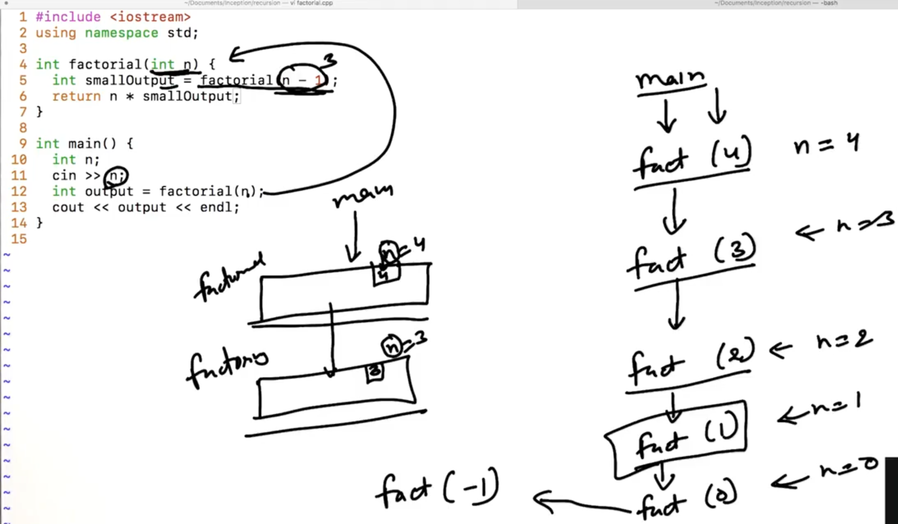
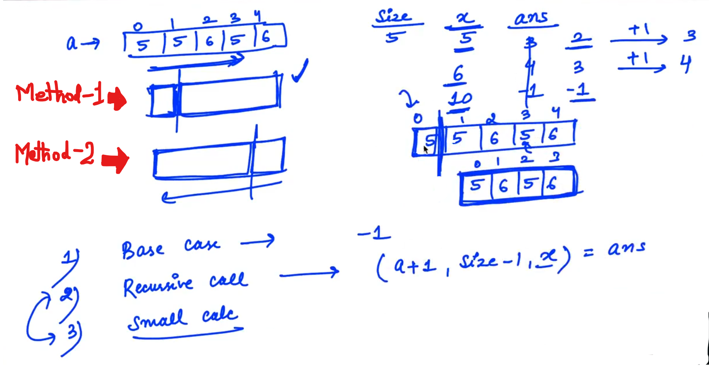
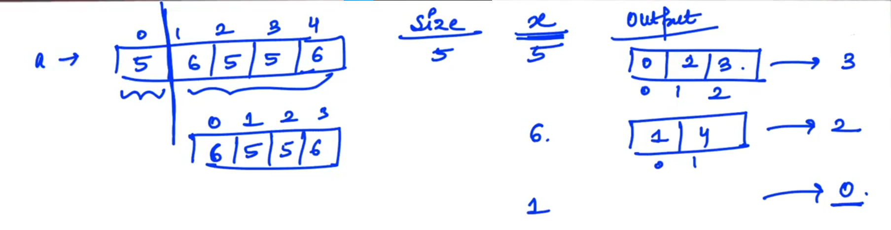

## 0.Introduction to Recursion

Example of Recursion:


-

Some space in memory is taken by it... In Infinite call, At some moment it will not create or use any memory... At that moment  we will get "Segmentation Fault"...



-

```cpp
// Segmentation Fault
#include<iostream>
using namespace std;

int factorial(int n)
{
    cout << n <<endl;
    int smallOut = factorial(n-1);
    return n * smallOut;
}

int main()
{
    int n;
    cin >> n;
    int output = factorial(n);
    cout << output << endl;
}
```

Output:

Segmentation Fault

--


-


-

```cpp
// Factorial Program
#include<iostream>
using namespace std;

int factorial(int n)
{
    cout << n << endl;
    if (n == 0)
    {
        return 1;
    }
    int smallOutput = factorial(n-1);
    return n * smallOutput;
}

int main()
{
    int n;
    cin >> n;
    int output = factorial(n);
    cout << output << endl;
}
```

-


main() comes first but it will go last... main() will wait till all function will complete... (its called Call Stack...)

-------

## 1.Recursion and PMI

Principle behind Recursion: PMI (Principle of Mathematical Induction)


**<u>Example</u>**:

Prove Sum of first "n" natural number...


Steps:

1. Base Case

2. Assume karlena chhoti problem ke liye chal jaayega...

```cpp
// Factorial using recursion
#include<iostream>
using namespace std;

int factorial(int n)
{
    if (n == 0)    //Step - 1 (Base Case)
    {
        return 1;
    }
    int smallOutput = factorial(n-1);    //Step - 2
    int output = n * smallOutput;
    return output;
}

int main()
{
    cout << factorial(4) << endl;
}
```

------------

## 6.Fibonacci Number

nth fibonacci number:


-

Extended of PMI:


-


-

```cpp
// Fibonacci Number

#include<iostream>
using namespace std;

int fib(int n)
{
    if (n == 0)     //Base Case - 1
    {
        return 0;
    }

    if (n == 1)     //Base Case - 2
    {
        return 1;
    }

    int smallOutput1 = fib(n-1);
    int smallOutput2 = fib(n-2);
    return smallOutput1 + smallOutput2;
}

int main()
{
    cout << fib(3) << endl;
}
```

Explanation:


----------------------

## 8.Recursion and Arrays

Example:


Solution:


Case - 1:


Case  - 2


-

```cpp
// (SAMPLE)
#include<iostream>
using namespace std;

bool is_sorted2(int a[], int size)  //Alternate option
{
    if (size == 0 || size == 1)
    {
        return true;
    }

    bool isSmallerOutput = is_sorted2(a + 1, size - 1);
    if (!isSmallerOutput)
    {
        return false;
    }
    if (a[0] > a[1])
    {
        return false;
    }
    else{
        return true;
    }
}

bool is_sorted(int a[], int size)
{
    if (size == 0 || size == 1)
    {
        return true;
    }
    bool isSmallerSorted = is_sorted(a + 1, size - 1);
    return isSmallerSorted;
    /*
    if (isSmallerSorted)
    {
        return true;
    }
    else{
        return false;
    }
    */
}

int main()
{

}
```

-----------------------

## 11.Hint First index

Example:

We need to return the 1st index of the variable "x"


Note:

At x = 10 in the Array "a", ans = -1 because "10" not exists in the Array...

Case 2 :- Can we return the value of "ans"???


-------------------

## 13.Hint Last Index



-


----------------

## 15.Hint 1 All Indices of a number



Base case is ZERO when the size of the Array is ZERO... (i.e. return ZERO...)

-


--------------------

## 16.Hint 2 All Indices of a number

By method - 2


-


-------------------------
