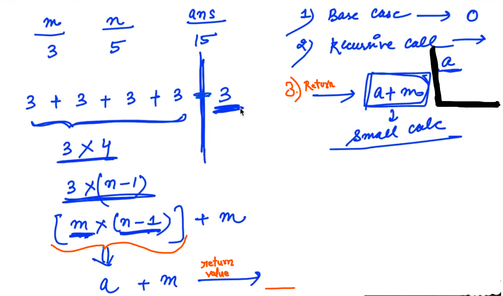
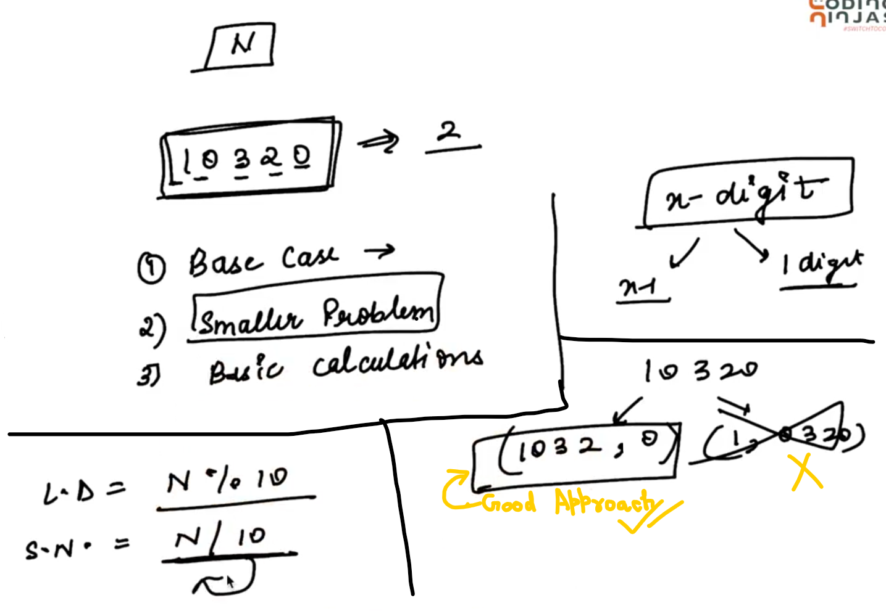
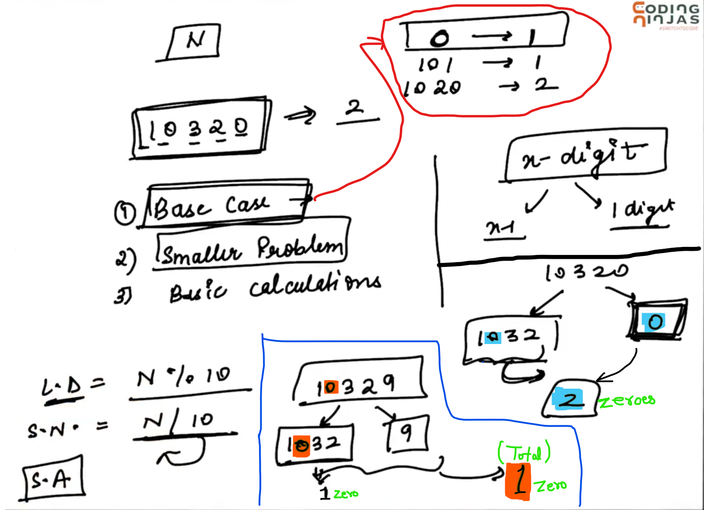
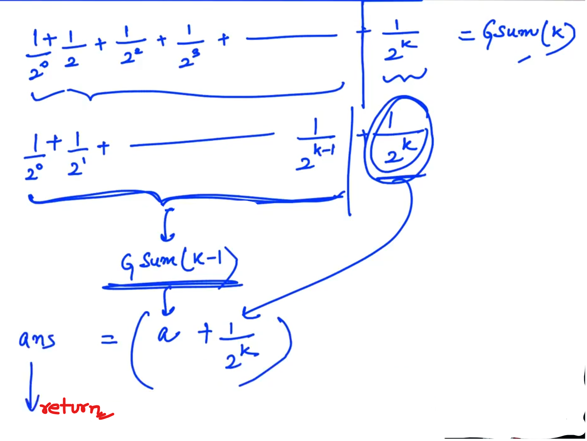
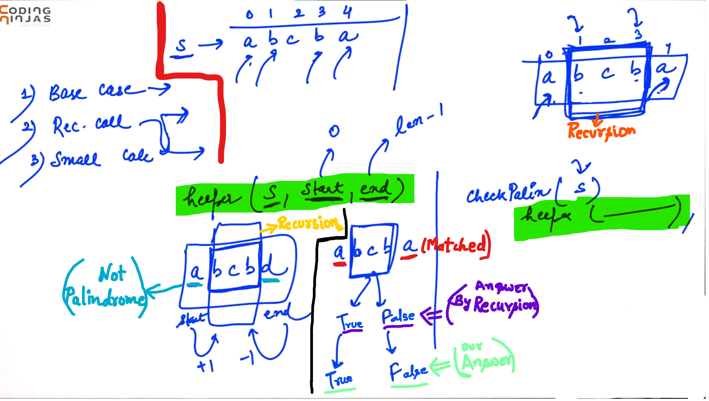

## 0.Multiplication (Recursive)[HINT]

Example:

Not use "*" operator instead Use "+" and "-" operator...

In Base Case, since "m" remains same and only "n" were making small... So, terminating point should be on "n" i.e. If the value of "n" becomes ZERO then return ZERO...

"a" variable will receive the answer of the Recursion...

------------

## 1.Count Zeros[HINT]

L.D.    =>    Last Digit

S.N.    =>    Smaller Number

S.A.    =>    Small Answer...

--------------

## 2.Geometric Sum[HINT]

--------

## 3.Check Palindrome (recursive)[HINT]

**<u>Example</u>**:

Check string passed is Palindrome or not... and return True or False accordingly...

**<u>Steps</u>**:

Compare 1st and Last character... and Eleminate them...

Perform comparision on the left string using Recursion...

**<u>NOTE</u>**:

In Base case, If length of the string is 1 (OR) zero... then that string is Palindrome.... (We simply return "TRUE")

----------
