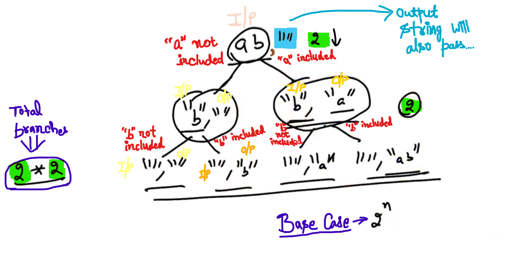

## 0.Recursion and Strings

**<u>Example</u>**:

Find size of the Character Array...


-


-

```cpp
#include<iostream>
using namespace std;

int length(char s[])    //Function took string
{
    if(s[0] == '\0')    //see NOTE
    {
        return 0;
    }
    int smallStringLength = length(s+1);
    return 1 + smallStringLength;
}
int main()
{
    char str[100];
    cin >> str;

    int l = length(str);
    cout << l << endl;
}
```

NOTE:

Base Case: String is Empty... then At index "0" there is "NULL" character i.e. \0... (OR) string length is ZERO...

**Steps**:


--

**<u>Example</u>**:

To remove the character from a string


**<u>Note</u>**:

Base Case:    For Empty String just return Zero...


-


-

```cpp
#include<iostream>
using namespace std;

void removeX(char s[])
{
    if (s[0] == '\0')
    {
        return;
    }

    if (s[0] != 'x')
    {
        removeX(s + 1);
    }
    else
    {
        int i = 1;
        for (; s[i] != '\0'; i++)   //SEE
        {
            s[i - 1] = s[i];
        }
        s[i - 1] = s[i];    //SEE
        removeX(s);
    }
}

int length(char s[])
{
    if (s[0] == '\0')
    {
        return 0;
    }
    int smallStringLength = length(s+1);
    return 1 + smallStringLength;
}

int main()
{
    char str[100];
    cin >> str;

    int l = length(str);
    cout << l << endl;
    removeX(str);
    cout << str << endl;
    l = length(str);
    cout << l << endl;
}
```

 Output:

axcdxbgxhj
10
acdbghj
7

-

    int i = 1;
     for (; s[i] != '\0'; i++)     //SEE
     {
     s[i - 1] = s[i];
     }
     s[i - 1] = s[i];     //SEE

Result:


-------------

## 3.Merge Sort Algo

Methods for sorting:

1. Insertion Sort

2. Selection Sort

3. Bubble Sort

4. Merge Sort

**<u>Merge Sort</u>**:

Merge sort is faster than other sorting... and Merge sort is a Recursive Algorithm...


Base Case:

If Array length is ZERO or 1 then Array is already sorted... so, simply return...

-

Now, In merge sort divide Array into two parts and sort the both two Array using recursion and merge both the Arrays into a third Array...

**<u>Example</u>**:

Option 1:


Call Merge sort at Arrays "b" and "c" and after sorting of both... We call Merge two sorted Arrays...

Option 2:


We call two merge sorts using the same Array... by passing indices... (Here, We are not creating two smaller Arrays... like "b" and "c" as previous option 1)

-


si    =>    Starting Index

ei    =>    End Index

start index is equal to end index (e.g. 4 se 4 tak swap kardo... i.e. Single Element... already sorted)

Base Case: Empty Array i.e. Starting Index will be greater than end Index...


-


-

Make a new output Array of same, merge the both halves... makes the elements in the sorted Order... (Elements from "si" and "ei" will come in the new output Array...)


Now copy back the elements of new output Array to the Original Array...

So, Original Array will sort from the start index to the end index...

-------------

## 5.Quick Sort Algo


-


si    =>    starting index

ei    =>    ending index


For Partition function:

(1) Count of smaller elements...


-


------------------

## 6.Quick Sort - Dry Run

Note:

Partition function returns the position of the pivot.

-

Little steps:

1. "First position" will be pivot.

PI    =>    Pivot Index


(start,end)    =>    start > end    => return

-----------------------

## 8.Strings

```cpp
// Example
#include<iostream>
using namespace std;

int  main()
{
    string s = "abc";
    string s1;
    s1 = "def";
    cout << s1 << endl;
    cout << s << endl;
}
```

Output:

def
abc

-

```cpp
// same as Previous Example
#include<iostream>
using namespace std;

int  main()
{
    string* sp = new string;
    *sp = "xyz1";
    cout << sp << endl;
    cout << *sp << endl;
    
    string s = "abc";
    string s1;
    s1 = "def";
    cout << s1 << endl;
    cout << s << endl;
}
```

Output:

0x55e51776eeb0
xyz1
def
abc

```cpp
// same as Previous Example
#include<iostream>
using namespace std;

int  main()
{
    string* sp = new string;
    *sp = "xyz1";
    cout << sp << endl;
    cout << *sp << endl;
    
    string s = "abc";
    cin >> s;
    cout << s << endl;
    
    string s1;
    s1 = "def";
    cout << s1 << endl;
    cout << s << endl;
}
```

<u>Output 1</u>:

0x560d3f7abeb0
xyz1
Nandan    <mark>//Input Given</mark>
Nandan
def
Nandan

-

<u>Output 2</u>:

0x563ce0ac6eb0
xyz1
Nandan Kumar    <mark>//<=    cin beaks at Space </mark>
Nandan
def
Nandan

--

```cpp
// same as Previous Example
#include<iostream>
using namespace std;

int  main()
{
    string* sp = new string;
    *sp = "xyz1";
    cout << sp << endl;
    cout << *sp << endl;
    
    string s = "abc";
    getline(cin, s);
    //getline ko "cin" se input lena hai... aur "s" mai input lena hai...
    cout << s << endl;
    
    string s1;
    s1 = "def";
    cout << s1 << endl;
    cout << s << endl;
}
```

<u>Output</u>:

0x5634a3557eb0
xyz1
Nandan Kumar  
Nandan Kumar
def
Nandan Kumar

```cpp
// same as Previous Example
#include<iostream>
using namespace std;

int  main()
{
    string* sp = new string;
    *sp = "xyz1";
    cout << sp << endl;
    cout << *sp << endl;
    
    string s = "abc";
    getline(cin, s);
    cout << s << endl;
    
    s = "defdef2";
    cout << s[0] << endl;   //SEE
    s[0] = 'l';
    
    string s1;
    s1 = "def";
    cout << s1 << endl;
    cout << s << endl;
}
```

<u>Output</u>:

0x564ce1a8feb0
xyz1
n k l
n k l
d
def
lefdef2

-

```cpp
// same as Previous Example
#include<iostream>
using namespace std;

int  main()
{
    string* sp = new string;
    *sp = "xyz1";
    cout << sp << endl;
    cout << *sp << endl;
    
    string s = "abc";
   // getline(cin, s);
    cout << s << endl;
    
    s = "defdef2";
    cout << s[0] << endl;
    s[0] = 'l';
    string s1;
    s1 = "def";
    
    string s2 = s + s1;     //SEE
    cout << s2 << endl;
    
    s += s1;    //SEE
    
    cout << s1 << endl;
    cout << s << endl;
    
    cout << s.size() << endl;   //SEE
    cout << s.length() << endl; //SEE
}
```

<u>Output</u>:

0x56500e77ceb0
xyz1
abc
d
lefdef2def
def
lefdef2def
10
10

-

```cpp
// All previous step in deail

#include<iostream>
using namespace std;

int  main()
{
    string* sp = new string;    //String can dynamically allocate
    *sp = "xyz1";
    cout << sp << endl;
    cout << *sp << endl;
    
    string s = "abc";   //String can Statically allocate
   // getline(cin, s);
    cout << s << endl;
    
    s = "defdef2";          //can change string content 
    cout << s[0] << endl;
    s[0] = 'l';         //String can change characterwise 
    string s1;
    s1 = "def";
    
    string s2 = s + s1;     //SEE
    cout << s2 << endl;
    
    s += s1;    //SEE
    
    cout << s1 << endl;
    cout << s << endl;
    
    cout << s.size() << endl;   //SEE
    cout << s.length() << endl; //SEE
    
    cout << s.substr(3) << endl; //SEE Note
    cout << s.substr(3, 3) << endl;
    
    cout << s.find("def") << endl;  //find("def") gives index of "def" 
}
```

Output:

0x55bbb82e8eb0
xyz1
abc
d
lefdef2def
def
lefdef2def
10
10
def2def
def
3

-

NOTE:

substr() : Gives some part of the string...

-------------------------------------------------------------------

## 9.Return Subsequences of a String

e.g.:    "abc"

Sub-string    =>    Continuous    =>    abc

sub-sequence    =>    pick any character    =>    ac

-

How many subsequence have if a string is of length "n"     =>    2^n


Here, for every character we have to take the Decision that we have to include or not...(i.e. 0,1)


Array don't tell us the size...

-

Function signature:


-

Subsequence of empty string is 1 i.e. empty string its self... (Base Case)


-


-

Working:


-

```cpp
// Above Program:
#include<iostream>
using namespace std;

int subs(string input, string output[]){
    if (input.empty()){        //BASE CASE
        output[0] = "";
        return 1;
    }
    
    string smallString = input.substr(1);
    int smallOutputSize = subs(smallString, output);
    for (int i = 0; i < smallOutputSize; i++){
        output[i + smallOutputSize] = input[0] + output[i];
    }
    return 2 * smallOutputSize;
}

int main(){
    string input;
    cin >> input;
    string* output = new string[1000];
    int count = subs(input, output);
    for (int i = 0; i < count; i++){
        cout << output[i] << endl;
    }
}
```

<u>Output</u>:

abc

c
b
bc
a
ac
ab
abc

----------------------

## 10.Return Keypad Approach

SEE Dialer (Keypad)


-

Hint:


- Base case with number is Zero will have one output... i.e. empty...

(No typing in the keypad will give only one output i.e. "Empty string")


-----------------------

## 12.Print Subsequences of a String


-



-

```cpp
#include<iostream>
using namespace std;

void print_subs(string input, string output){
    if (input.length() == 0){
        cout << output << endl;
        return;
    }
    
    print_subs(input.substr(1), output);
    print_subs(input.substr(1), output + input[0]);
}

int main(){
    string input;
    cin >> input;
    string output = "";
    print_subs(input, output);
}
```

<u>output</u>:

abc

c
b
bc
a
ac
ab
abc

-

Hint:


--------------

## 13.Print Keypad Combinations Approach


-------------------


