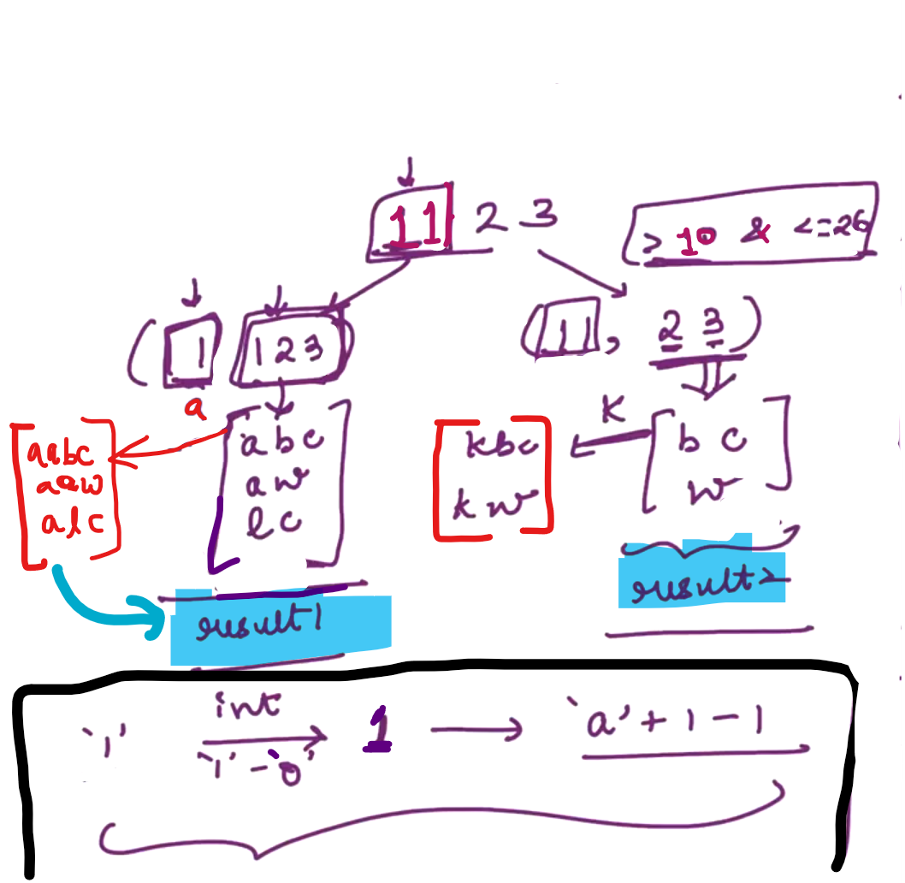

## 4.Print Subsets of Array[HINT]

We need to maintain an "output" Array where we save our subset...

We need help of integer 1 D ouput array... to save a subset... and print it...

"output" array should be integer 1 D array... 

-

In case of "JAVA"

Steps:

Base Case: When start index will be equal to the length of the Array i.e. Array finished... and then we will print our Output array and return...

-

In case of "C++"

Base Case:

When value of the "n" becomes zero i.e. Array gets finished and print the ouput Array...

-

NOTE: 

(m+1) because the size of the new output Array increased by one...

--------------

## 5.Return subsets sum to K[HINT]

--

In case of "JAVA":

Make a new integer 2 D array... i.e. output

Note: out[0][0]    =>    shows that we didn't get valid subset...

--

In case of "C++":

n    =>    size of the input Array...

output[][]    =>    Here we suppose to save all our subset and return its number of rows...

o1 and o2 are the two outputs 2D integer arrays...

s1 = 1 since, there is only one row...

return 1;    =>    represents output array have one valid subset... which size is zero...

return 0;    =>    represents output array don't have any valid subset...

-----------------

## 6.Print Subset Sum to K[HINT]

We need an "output" array which is integer 1 D array

if (k == 0)    =>    it means output array contains a valid subset... then we have to print our output array...

else  (i.e. k != 0)  =>    without any print, return from the base case...

----------------------

## 7.Return all codes - String[HINT]

Mapping work:

Steps:

Get corresponding Integer from the "collection of characters to character"

Get codes of the corresponding integer... e.g.:    <mark>i + 'a' - 1</mark>

<u>Step-1</u>:

<u>Step-2</u>:

--------------------------

## 8.Print all Codes - String[HINT]

Return : Need to save all the answer and return....

Print : Get the answer and print it....

<u>NOTE</u>:

In print when we call the recursion along with its input, then we need to give (pass) the output till now...

"output" variable should be of type string and is empty initially...

Base Case: When length of input string is zero, we will just print empty string as an output...

-

In example 2:  

If first two characters convert to integer then that lies between (10 to 26), If this condition will be false then we should <mark>not</mark> make this second call... and we should make only one recursive call...

----------------------------

## 9.Return Permutations - String[HINT]

**<u>1st way</u>**:

-

**<u>2nd way</u>**:

-------------------------

## 10.Print Permutations[HINT]

When "s" is empty, print "output".

-----------------

