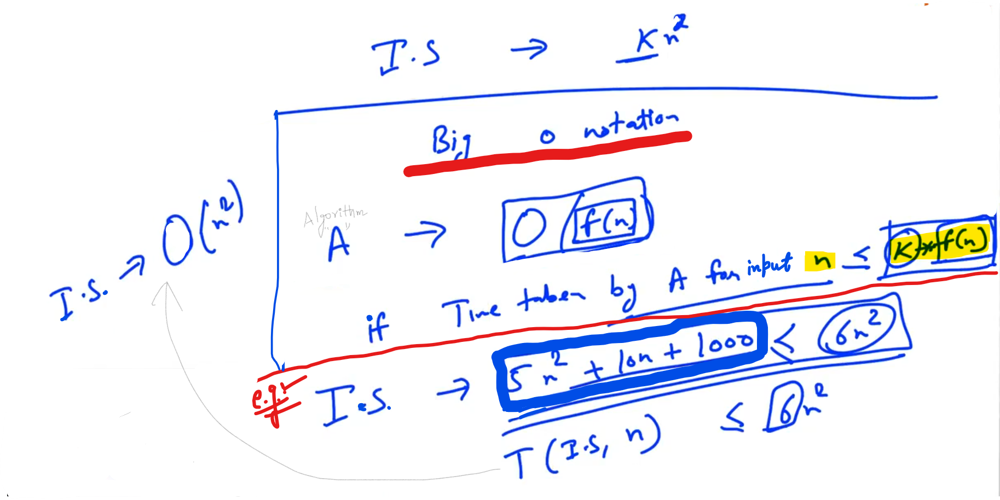
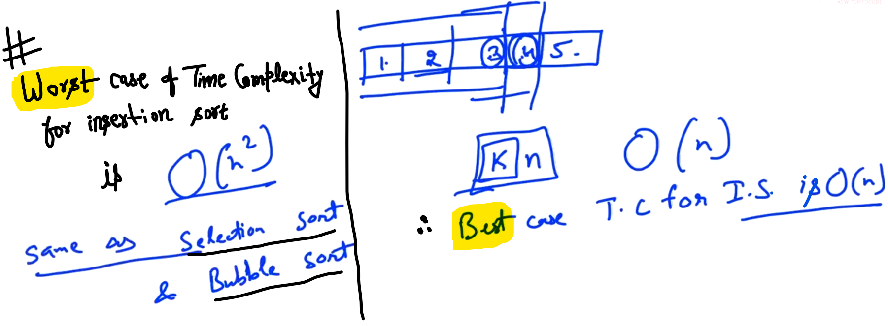
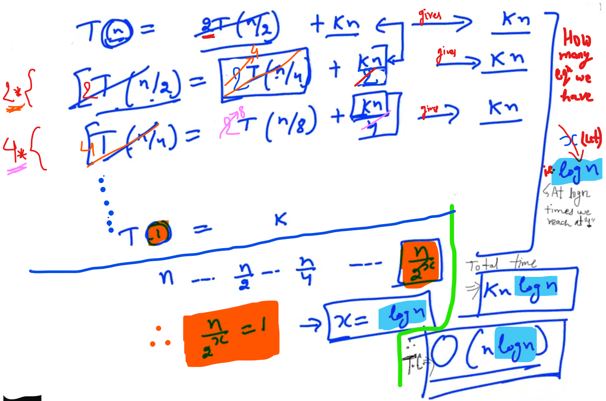

## 0.Order Complexity Analysis


e.g: Sorting


Different methods for doing the same thing...

--

For sorting - 10 numbers (or) 100 numbers (or) 1000 numbers (or) 10000 numbers - in each cases the amount of time taking is Different... i.e. If input size is large than time taking is large.. if input size is less time taken is less...


A    =>    is the function of "Input Size" i.e. "n"

--


n = 1, 10, 100, 1000, 10000

--

<mark>Comparision between Merge Sort and Selection Sort</mark>:

**<u>For Merge Sort</u>**:

```cpp
// For Merge Sort
// #include <iostream>
#include <sys/time.h>
#include <iostream>
using namespace std;

long getTimeinMicroSeconds() {
    struct timeval start;
    gettimeofday(&start, NULL);         // Inbuilt function
    return start.tv_sec * 1000000 + start.tv_usec;
}

void merge(int arr[], int start, int mid, int end){
    int temp[end-start];
    int i = start;
    int j = mid+1;
    int k = 0;
    while (i <= mid && j <= end){
        if (arr[i] < arr[j]){
            temp[k++] = arr[i++];
        }
        else{
            temp[k++] = arr[j++];
        }
    }
    if (i <= mid){
        while(i <= mid){
            temp[k++] = arr[i++];
        }
    }
    else if (j <= end) {
        while(j <= end){
            temp[k++] = arr[j++];
        }
    }
    k=0;
    for(int l = start; l <= end; l++){
        arr[l] = temp[k++];
    }
}


void mergesort(int arr[], int start, int end){
    if (start >= end) {
        return;
    }
    int mid = (end+start)/2;
    mergesort(arr, start, mid);
    mergesort(arr, mid+1, end);
    merge(arr, start, mid, end);
}

int main(){

    for(int n = 10; n <= 1000000; n *= 10){

        int *arr = new int[n];
        long starttime, endtime;
        for(int i = 0; i < n; i++){
            arr[i] = n-i;
        }
        starttime = getTimeinMicroSeconds();
        mergesort(arr, 0, n-1);
        endtime = getTimeinMicroSeconds();

        cout << "Merge Sort n = " << n << " time = " <<endtime - starttime << endl;
    }
}
```

<u>Output</u>:

Merge Sort n = 10 time = 1
Merge Sort n = 100 time = 9
Merge Sort n = 1000 time = 103
Merge Sort n = 10000 time = 1310
Merge Sort n = 100000 time = 16056
Merge Sort n = 1000000 time = 188231

-


<u>Output</u>: (from lec.)


--

**<u>For Selection Sort</u>**:

```cpp
// For Selection Sort
// #include <iostream>
#include <sys/time.h>
#include <stdio.h>
#include <iostream>
#include <unistd.h>
using namespace std;

long getTimeinMicroSeconds() {
    struct timeval start;
    gettimeofday(&start, NULL);         // Inbuilt function
    return start.tv_sec * 1000000 + start.tv_usec;
}

void selectionSort(int a[], int n)
{
    for(int j = 0; j < n-1; j++){
        int min = a[j];
        int pos = j;
        for(int i = j+1; i < n; i++){
            if(a[i] < min){
                min = a[i];
                pos = i;
            }
            int temp = a[j];
            a[j] = min;
            a[pos] = temp;
        }
    }
}

int main()
{

    for(int n = 10; n <= 1000000; n *= 10){
        int *arr = new int[n];
        long starttime, endtime;

        for(int i = 0; i < n; i++){
            arr[i] = n-i;
        }
        starttime = getTimeinMicroSeconds();
        selectionSort(arr, n);
        endtime = getTimeinMicroSeconds();

        cout << "Selection Sort n = " << n << " time = " <<endtime - starttime << endl;
    }
}
```

Output:

Selection Sort n = 10 time = 0
Selection Sort n = 100 time = 29
Selection Sort n = 1000 time = 3253
Selection Sort n = 10000 time = 420177
Selection Sort n = 100000 time = 19532796

Selection Sort n = 1000000 time = .................

-

Output: (From lec)


--

Net result:


For 1,00,000  -  Selection sort takes 24 sec... and 

For 1,000,000  -  Merge Sort takes 0.148 sec

<u>**Conclusion**</u>:

Merge Sort is more better compare to Selection Sort...

-----------------------

## 1.Theoretical Analysis

Experimental Analysis:


I.S.    =>    Insertion Sort

S.S.    =>    Selection Sort

Due to such reasons we are not going to concenterate on "Experimental Analysis"

-

If we have three solutions "A1, A2 and A3", we should able to analysis "A1, A2 and A3" and figureout which one is going to be the best... 

--

<u>**Big O notation**</u>:


-


-



Algorithm A

T(I.S., n)   =>    Time taken by "Insertion sort" for Input size "n"

--

Problem 1:

Largest Element in an Array...


Going to each number, Comparing with "max" and then updating "max"; let have "k" unit operations...

T(n) i.e. Amount of time take for input size "n" = kn

--

Problem 2:

Bubble Sort...


-


T(Bubble Sort, n)    =>    Time taken by the Bubble Sort for input size "n"

----------------

## 3.Linear Search time complexity


Best Case => When we find the element at zeroth location

Worst case => element which user had given us to search is not present in the Array...

-

"K" operations:

"K" is "going to each element comparing with it and moving to the next element".

----------------------------

## 4.Insertion Sort time complexity


-


-


-

<u>Best case scenerio for Insertion sort</u>:

In case of best case, All elements need to compare the previous element... For every element I'm doing only "k" work



(Best case (or) Worst case scenerio for selection sort, Time Complexity is always Order n square(i.e. n^2))

----------------

## 5.Selection Sort time complexity

In selection sort, we go to each element and find the minimum...


----------------

## 7.Theoretical Analysis - Recursive Algorithms

**<u>Factorial</u>**:

Recurence relationship


T(n)    =>    Time taken for input size "n"

T(n-1)    =>    Time taken for input size "n-1"

k=(k1+k2)    =>    k1, k2 are some constant work and k is the Total Work...


**<u>Binary Search</u>**:

Binary Search Algorithm is very recursive in Nature...


-


<u>Example</u>:


Worst Case: In primary case, We have to access less elements... (i.e. here, only 10 elements accessing)

(In linear worst Case: In linear search accessing each element is required (i.e. Here, 1024 elements) and can possible that the element is getting at the END (or) not present in the Array...)

----------------------------------

## 9.Merge Sort Space Time complexity


Recurence relationship in case of Merge Sort:



Time Complexity of Merge sort is:    n.logn

----------------------

## 11.Fibonacci Time Complexity Analysis


k    =>    Some constant work


-


Here, node refers to function call...

-


Fibonacii Series will take Exponential time...

-


----------------------------

## 12.Space Complexity Analysis


f(n)    =>    Function of input size...

Space Complexity     =>    (Auxilary Space used i.e. When Additional Space required)

Note: Only take care about Auxilary Space...


-

Example: <u>Factorial</u>


3. Points while calculating space complexity is in case of Recursion...

e.g: When we reach the base case (i.e. n=0), there are "n" functions have the local variables which are waiting in the memory that, next function do their work then functions will work...

In each function we are using constant space "k" and if "n" functions are waiting then we are using "kn" space at that point of time when we reached the base case...

--

Example: <u>Bubble Sort</u>


S(Bubble sort, n)    =>    space required for bubble sort for input size "n"

"K" - constant space,  its not depended on "n"

--

Example: <u>Binary Search</u>


Each function using Constant space i.e. "K".

------------------

## 14.Merge Sort Space Complexity Analysis


We are allocating a space of size "n" i.e. new array of size "n"... Where halves get merge...

---------------------

## 15.Fibonacci Space Complexity Analysis


Space Complexity: At what point of time is the space usage maximum and what is the space usage...


Each function will use constant memory i.e. "K"... And maximum number of functions at any point of time we have in the memory will be "n"...

------------------


