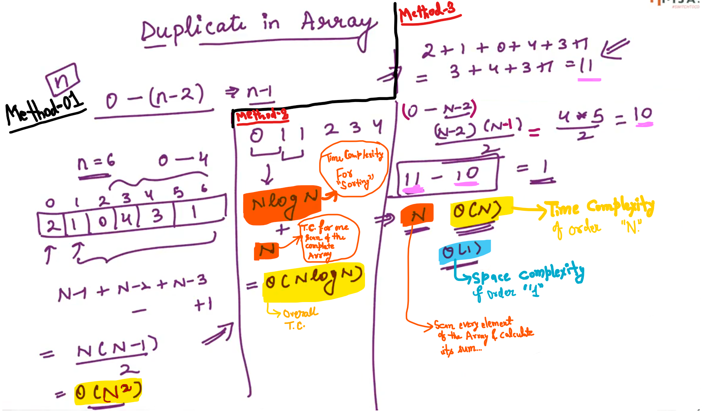

## 0.Find the Unique Element[HINT]

Array of size: (2N+1) where "N" elements are duplicate and one element is unique...

Find that unique element...

At N = 3,

Check Time-Complexity also...

Method-2:

S    =>    size of the Array

Time complexity for sorting is: S.logS

Time complexity for one scan of the complete Array will  take order of "S" times....

Therefore, Overall Time Complexity (Shown in pic for method 2)  of this Approach is order of (N logN)

---------------

## 1.Duplicate in array[HINT]

Array Contains elements from 0 to (n-2) i.e. (n-1) unique numbers and out of (n-1) unique number there is one number which is duplicate, Find the Duplicate number...

"n" is the size of the Array...

Method-3:

Since, only one number is duplicate number, that means in excluding duplicate number... it is effectively sum of first (n-2) natural number + the duplicate number...

Subtract the sum of first (n-2) natural number from the Array sum... and the result will be Duplicate number...

------------------------------

## 2.Array Intersection[HINT]

Find common elements from both the Array...

Size of the first Array is "m" and Size of the second array is "n"

-

complexity in sorting the second Array is "nlogn" and overall complexity for the binary search on every element of the first array is (m*logn)...

NOTE: For using Binary Search, All elements in the Arrays should have unique element (No Duplicates)

-

Method - 3

Complexity for sorting first Array is (mlogm) and for second Array is (nlogn) and complexity for merging take (m+n)  

-

Method - 4

Using hashmaps

---------------------------

## 3.Pair sum in array[HINT]

**Example**:

Pair sum to 0

Method - 2:

"i" and "j" pointing to the same element... so, we cannot find anymore pair...

We should stop the adding of "i" and "j" (the process of adding should work till <mark>i<j</mark>)

--

**Example**: (Cases with Duplicates)

Pair sum to 12 and Pair sum to 4

---------------------------

## 5.Rotate array[HINT]

"d" is the number of shifts which is given and we need to rotate the complete Array by the positions towards left...

**<u>Method - 1</u>**:

<u>Steps</u>:

Store zeroth index in "temp"

Shift all elements from index "1" to "end" by "1" and then at the last index place the "temp" 

The above shifting step is done in total "d" times...

--

**<u>Method - 2</u>**:

Steps:

    For all elements from position "d" to "end"
    
    arr[i] = arr[i+d];

There is a displacement of "2" positions towards the left (from position 2 to 6)

Make an Array of size "d" where we store first "d" elements...

After storing first "d" elements in the New Array... restore(replace) the elements back in the last "d" elements of the Array (Old / Original)

--

**<u>Method - 3</u>**:

----------------

