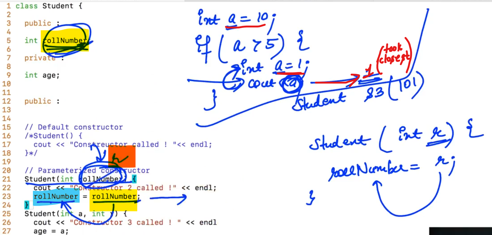
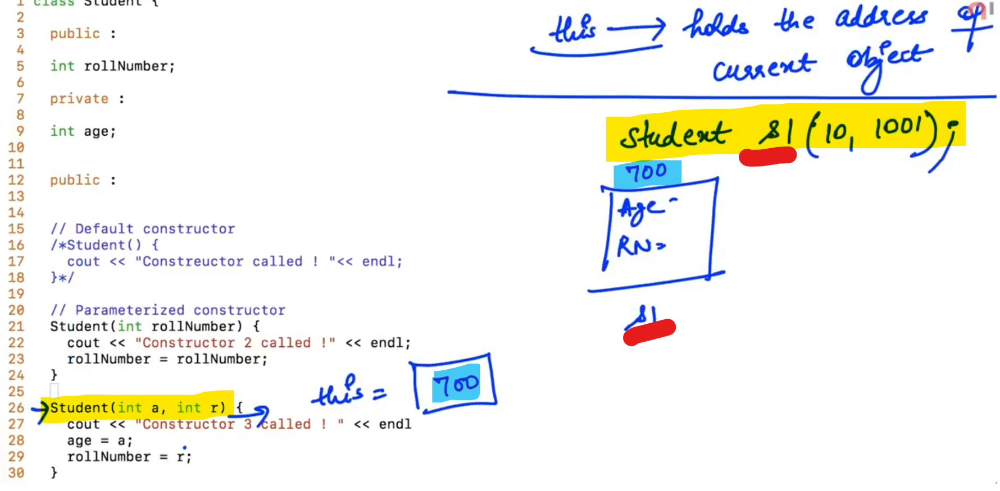

## 0.Introduction to OOPS


-


-


Class is basically a blueprint that defines the properties and functions of a particular object... whereas Object is a specific copy of class...

Classes are basically user defined Data Types...

    class Student {
        int rollNumber;
        int age;
    };

-

    class Product {
        int id;
        int weight;
        char name[100];
    };

--------------

## 1.Creating Objects


-


-

Creating object of any class Statically vs Dynamically


-


-

```cpp
// Student.cpp

class Student {
    
    public:

    int rollNumber;    //rollNumber is public member
    int age;            //age is a Public Member
};
```

-


-

<u>**Access Modifiers**</u>:

These decides the accessible limits of the properties and functions of the class...

**<u>Three Types of Access Modifiers</u>**:

1. Public

2. Private

3. Protected

-----------------

## 3.Getters and Setters

```cpp
// Example with sample test...

#include<iostream>
using namespace std;

class Student{
    public:
    int rollNumber;
    
    private:
    int age;
    
    public:
    void display(){
        cout << age << " " << rollNumber << endl;
    }
    
    int getAge(){
        return age;
    }
};

int main()
{
    //Create objects statically
    Student s1, s2, s3, s4, s5;
    
    // s1.age = 24;
    s1.rollNumber = 101;
    
    cout << "S1 age: " << s1.getAge() << endl;
    cout << "S1 Roll number: " << s1.rollNumber << endl;
    
    s1.display();
    s2.display();
    
    // s2.age = 30;
    
    //Create objects dynamically
    Student *s6 = new Student;
    // (*s6).age = 23;
    (*s6).rollNumber = 104;
    
    (*s6).display();
    
    cout << "S6  age : " << s6 -> getAge() << endl;
    
    /*
    // s6 -> age = 23;
    s6 -> rollNumber = 104;
    s6 -> display();
    */
    
}
```

<u>Output</u>:

S1 age: 21909
S1 Roll number: 101
21909 101
0 0
0 104
S6  age : 0

--

```cpp
// Using the private function

#include<iostream>
using namespace std;

class Student{
    public:
    int rollNumber;
    
    private:
    int age;
    
    public:
    void display(){
        cout << age << " " << rollNumber << endl;
    }
    
    int getAge(){
        return age;
    }
    
    void setAge(int a){
        age = a;
    }
};

int main()
{
    Student s1;
    
    Student *s2 = new Student;
    
    s1.setAge(20);
    s2 -> setAge(24);
    
    s1.display();
    s2 -> display();
    
}
```

Output:

20 -1450419792
24 0

--

get (getter)   =>    The function which is used to read the private value...

set (setter)    =>    This function used to change or edit or update the value of any private property...

    // (Sample example for "getter" and "setter")
    
    #include<iostream>
    using namespace std;
    
    class Student{
        public:
        int rollNumber;
        
        private:
        int age;
        
        public:
        void display(){
            cout << age << " " << rollNumber << endl;
        }
        
        int getAge(){
            return age;
        }
        
        void setAge(int a, int password){     //see
            if(password != 123){
                return;
            }
            
            if(a<0){
                return;
            }
            age = a;
        }
    };
    
    int main()
    {
        Student s1;
        
        Student *s2 = new Student;
        
        s1.setAge(20);
        s2 -> setAge(24);
        
        s1.display();
        s2 -> display();
        
    }

--------------------

## 4.Constructors and this keyword


-

    // Default Constructor
    
    Student(){
        
    }

<u>**NOTE**</u>:

Constructor helps to initialise data members of the class with its Default value (i.e. Garbage Value)

--


At the time of the creation of the object, only one Constructor will work either Default or Parameterized....

```cpp
// Whenever we make object, Automatically inbuilt constructor called...

#include<iostream>
using namespace std;

class Student{
    public:
    int rollNumber;
    
    private:
    int age;
    
    public:
    
    // Default Constructor
    Student(){
        cout << "Constructor called ! " << endl;
    }
    
    // Parameterized Constructor (since, Constructor takes Arguments)
    Student(int r){
        cout << "Constructor 2 called !" << endl;
        rollNumber = r;
    }
    
    Student(int a, int r){
        cout << "Constructor 3 called !" << endl;
        age = a;
        rollNumber = r;
    }
    
    void display(){
        cout << age << " " << rollNumber << endl;
    }
    
    int getAge(){
        return age;
    }
    
    void setAge(int a, int password){     //see
        if(password != 123){
            return;
        }
        
        if(a<0){
            return;
        }
        age = a;
    }
};

int main()
{
    Student s1;     //1st time constructor called
    
    s1.display();
    
    Student s2;     //2nd time construtor called
    
    Student *s3 = new Student;      //3rd time constructor called
    s3 -> display();
    
    cout << "Parameterized constructor Demo" << endl;
    Student s4(10);
    
    s4.display();
    
    Student *s5 = new Student(101);     //SEE
    s5 -> display();
    
    Student s6(20, 1002);
    s6.display();
}
```

 Student s6(20, 1002);    =>    s6.Student(20, 1002)

<u>Output</u>:

Constructor called ! 
22043 -2012318467
Constructor called ! 
Constructor called ! 
0 0
Parameterized constructor Demo
Constructor 2 called !
22043 10
Constructor 2 called !
0 101
Constructor 3 called !
20 1002

--

```cpp
//Error case

#include<iostream>
using namespace std;

class Student{
    public:
    int rollNumber;
    
    private:
    int age;
    
    public:
    
    /*              //SEE......
    // Default Constructor
    Student(){
        cout << "Constructor called ! " << endl;
    }
    */
    
    // Parameterized Constructor (since, Constructor takes Arguments)
    Student(int r){
        cout << "Constructor 2 called !" << endl;
        rollNumber = r;
    }
    
    Student(int a, int r){
        cout << "Constructor 3 called !" << endl;
        age = a;
        rollNumber = r;
    }
    
    void display(){
        cout << age << " " << rollNumber << endl;
    }
    
    int getAge(){
        return age;
    }
    
    void setAge(int a, int password){  
        if(password != 123){
            return;
        }
        
        if(a<0){
            return;
        }
        age = a;
    }
};

int main()
{
    Student s1;     //1st time constructor called..   //Show "ERROR" here...
    
    s1.display();
    
    Student s2;     //2nd time construtor called..    //Show "ERROR" here...
    
    Student *s3 = new Student;      //3rd time constructor called..   //ERROR
    s3 -> display();
    
    cout << "Parameterized constructor Demo" << endl;
    Student s4(10);
    
    s4.display();
    
    Student *s5 = new Student(101);     //SEE
    s5 -> display();
    
    Student s6(20, 1002);
    s6.display();
}
```

<u>Note</u>:

If we make any constructor (Default/Parameterized) then the Automatic Default constructor will not available...

--



-


-

this    =>    holds the Address of Current object...

(keyword which is present at every function of the class... and it has address of the current object.)



-

```cpp
// this example     //this  =>  holds the Address of Current object...
#include<iostream>
using namespace std;

class Student{
    public:
    int rollNumber;
    
    private:
    int age;
    
    public:
    Student(int a, int r){
    cout << "this : " << this << endl;
        cout << "Constructor 3 called !" << endl;
        age = a;
        rollNumber = r;
    }
    
    void display(){
        cout << age << " " << rollNumber << endl;
    }
};

int main(){
    Student s1(10, 1001);
    cout << "Address of s1 : " << &s1 << endl;
}


```

<u>Output</u>:

this : 0x7fff98a43330
Constructor 3 called !
Address of s1 : 0x7fff98a43330

--

this => It is a pointer variable...


-


-

    this -> rollNumber = rollNumber
    
    Value of "rollNumber" argument, put it in the "this" block's "rollNumber"

-

    #include<iostream>
    using namespace std;
    
    class Student{
        public:
        int rollNumber;
        
        private:
        int age;
        
        public:
        
          // Parameterized Constructor
        Student(int rollNumber){
            cout << "Constructor 2 called !" << endl;
            
            this -> rollNumber = rollNumber;
        }
        
        Student(int a, int r){
        cout << "this : " << this << endl;
            cout << "Constructor 3 called !" << endl;
            this -> age = a;    // age = a;
            this -> rollNumber = r;     // rollNumber = r;
        }
        
        void display(){
            cout << age << " " << rollNumber << endl;
        }
    };
    
    int main(){
        Student s1(10, 1001);
        cout << "Address of s1 : " << &s1 << endl;
        
        Student s2(20);
        s2.display();
    }
    
    

<u>Output</u>:

this : 0x7ffede1a8978
Constructor 3 called !
Address of s1 : 0x7ffede1a8978
Constructor 2 called !
32766 20

----------------

## 6.Inbuilt Constructors and Destructor

1. Default Constructor

2. Copy Constructor


-

    // If want to pass the same arrgument in s2 same as s1 object...
    Student s1(10,1001);
    
    // Instead of using:
    s2.age = s1.age;
    s2.rollNo = s2.rollNo;
    
    // Use:
    s2.Student(s1);

-

```cpp
// Using copy constructor; Dynamic to Static, Static to Dynamic
// Copy of "value of other objects" to "the required objects"

#include<iostream>
using namespace std;

class Student{
    public:
    int rollNumber;
    
    private:
    int age;
    
    public:
    
      // Parameterized Constructor
    Student(int rollNumber){
        cout << "Constructor 2 called !" << endl;
        
        this -> rollNumber = rollNumber;
    }
    
    Student(int a, int r){
    cout << "this : " << this << endl;
        cout << "Constructor 3 called !" << endl;
        this -> age = a;    // age = a;
        this -> rollNumber = r;     // rollNumber = r;
    }
    
    void display(){
        cout << age << " " << rollNumber << endl;
    }
};

int main(){
    Student s1(10, 1001);
    cout << "S1 : ";
    s1.display();
    
    Student s2(s1); //Copy  Constructor
    cout << "S2 : ";
    s2.display();
    
    //Dynamically
    Student *s3 = new Student (20, 2001);
    cout << "S3 : ";
    s3 -> display();
    
    Student s4(*s3);   //Statically
    //Note: s3 is a pointer which stores the address of actual Student...
    //that's why we use: (*s3) i.e. derefering
    
    Student *s5 = new Student(*s3);     // s3 copy in s5
    Student *s6 = new Student(s1);      // s1 copy in s6
    
}


```

--

3. **<u>Copy Assignment Operator</u> (=)**:


-

```cpp
// Can change the value of any object...

#include<iostream>
using namespace std;

class Student{
    public:
    int rollNumber;
    
    private:
    int age;
    
    public:
    
      // Parameterized Constructor
    Student(int rollNumber){
        cout << "Constructor 2 called !" << endl;
        
        this -> rollNumber = rollNumber;
    }
    
    Student(int a, int r){
    cout << "this : " << this << endl;
        cout << "Constructor 3 called !" << endl;
        this -> age = a;    // age = a;
        this -> rollNumber = r;     // rollNumber = r;
    }
    
    void display(){
        cout << age << " " << rollNumber << endl;
    }
};

int main(){
    Student s1(10, 1001);
    Student s2(20, 2001);
    
    Student *s3 = new Student(30, 3001);    //Dynamically
    
    s2 = s1;
    
    *s3 = s2;
    
    s2 = *s3;
}


```

-

4. **<u>Destructor</u>**:


NOTE:

We can make multiple Constructor but can make Destructor only one...  

Destructor calls just before the exit from the Function....


-

```cpp
#include<iostream>
using namespace std;

class Student{
    
    public:
    int rollNumber;
    
    private:
    int age;
    
    public:
    
    ~Student(){         //Destructor
        cout << "Destructor called ! " << endl;
    }
    
      // Parameterized Constructor
    Student(int rollNumber){
        cout << "Constructor 2 called !" << endl;
        
        this -> rollNumber = rollNumber;
    }
    
    Student(int a, int r){
    cout << "this : " << this << endl;
        cout << "Constructor 3 called !" << endl;
        this -> age = a;    // age = a;
        this -> rollNumber = r;     // rollNumber = r;
    }
    
    void display(){
        cout << age << " " << rollNumber << endl;
    }
};

int main(){
    Student s1(10, 1001);
    Student s2(20, 2001);
    
    Student *s3 = new Student(30, 3001);
    
    s2 = s1;
    
    *s3 = s2;
    
    s2 = *s3;
    
//Note: Dynamically created memory (in heap memory) can be delocate explicitally
    delete s3;
}


```

Output:

this : 0x7ffc1932eb48
Constructor 3 called !
this : 0x7ffc1932eb50
Constructor 3 called !
this : 0x55975816d2c0
Constructor 3 called !
Destructor called ! 
Destructor called ! 
Destructor called ! 

-----------

## 7.Play With Constructors


-

```cpp
// Constructor in summary:
#include<iostream>
(Same as previous example...)

int main(){
    Student s1;     // Constructor 1 called
    
    Student s2(101);    // Constructor 2 called
    
    Student s3(20, 102);    // Constructor 3 called
    
    Student s4(s3);     // Copy Constructor
    
    s1 = s2;        // Copy Assignment operator
    
    Student s5 = s4;    // Copy Constructor
}
```

-------------------

## 9.Fraction Class


-


f1.print();    =>    "f1" address will go in the "this" keyword of the "print( )" function...


-


-


-

```cpp
// Not getting right result: ?????(SEE Output)?????
// Program for LCM of fractions and updating "f1"

#include<iostream>
using namespace std;

class Fraction {
    private:
        int numerator;
        int denominator;
        
    public:
    
        Fraction(int numerator, int denominator){
            this -> numerator = numerator;
            this -> denominator = denominator;
        }
        
        void print(){
            cout << this -> numerator << " / " << this -> denominator << endl;
            // cout << numerator << " / " << denominator << endl; //(Same use)
        }
        
        void simplify(){
            int gcd = 1;
            int j = min(this -> numerator, this -> denominator);
            for(int i; i <= j; i++){
                if(this -> numerator % i == 0 && this -> denominator % i == 0){
                    gcd = i;
                }
            }
            this -> numerator = this -> numerator / gcd;
            this -> denominator = this -> denominator / gcd;
        }
        
        void add(Fraction f2){
            int lcm = denominator * f2.denominator;
            int x = lcm / denominator;
            int y = lcm / f2.denominator;
            
            int num = x * numerator + (y * f2.numerator);
            
            numerator = num;
            denominator = lcm;
        
            simplify();     // means this -> simplify(); // "this" is used for "f1"
        }
};

#include<iostream>
using namespace std;

int main(){
    Fraction f1(10, 2);
    Fraction f2(15, 4);
    
    f1.add(f2);
    
    f1.print();
    f2.print();
}

```

gcd    =>    Greatest common divisor (or, HCF)

Output:

70 / 8            //        Right Result =>    35 / 4 (simplify( ) function didn't work properly...)
15 / 4

----------------

## 10.Fraction Class contd.

(Not understand)


pass "f2" by reference in order to avoid copy...

conclusion:    To avoid the call of copy constructor...


-


-

```cpp
void add(Fraction f2){    
}
---------
void add(Fraction &f2){    //"f2" by passing reference... 
}
----------
void add(Fraction const &f2){    //In order to AVOID any illegal changes
//Here only can read the value...
}
```

-

```cpp
f1.multiply(f2)
/* 
Multiply result should update in the "f1" and "f2" should remain 
unchanged
*/
```

Example:

```cpp
// Not getting right result: ?????(SEE Output)?????
// Including Multiplication of Fractions (From previous)

#include<iostream>
using namespace std;

class Fraction {
    private:
        int numerator;
        int denominator;
        
    public:
    
        Fraction(int numerator, int denominator){
            this -> numerator = numerator;
            this -> denominator = denominator;
        }
        
        void print(){
            cout << this -> numerator << " / " << this -> denominator << endl;
            // cout << numerator << " / " << denominator << endl; //(Same use)
        }
        
        void simplify(){
            int gcd = 1;
            int j = min(this -> numerator, this -> denominator);
            for(int i; i <= j; i++){
                if(this -> numerator % i == 0 && this -> denominator % i == 0){
                    gcd = i;
                }
            }
            this -> numerator = (this -> numerator) / gcd;
            this -> denominator = (this -> denominator) / gcd;
        }
        
        void add(Fraction f2){
            int lcm = denominator * f2.denominator;
            int x = lcm / denominator;
            int y = lcm / f2.denominator;
            
            int num = x * numerator + (y * f2.numerator);
            
            numerator = num;
            denominator = lcm;
        
            simplify();     // means this -> simplify(); // "this" is used for "f1"
        }
        
        void multiply(Fraction const &f2){
            numerator = numerator * f2.numerator;
            denominator = denominator * f2.denominator;
            simplify();
        }
};

#include<iostream>
using namespace std;

int main(){
    Fraction f1(10, 2);
    Fraction f2(15, 4);
    
    f1.add(f2);
    
    f1.print();
    f2.print();
    
    f1.multiply(f2);
    f1.print();
    f2.print();
}

```

<u>Output</u>:

70 / 8            // Right result:     35 / 4
15 / 4
1050 / 32        // Right result:     525 / 16
15 / 4

--------------------------

## 11.Complex Number Class Introduction


-

```cpp
// Do
```

-----------------------


