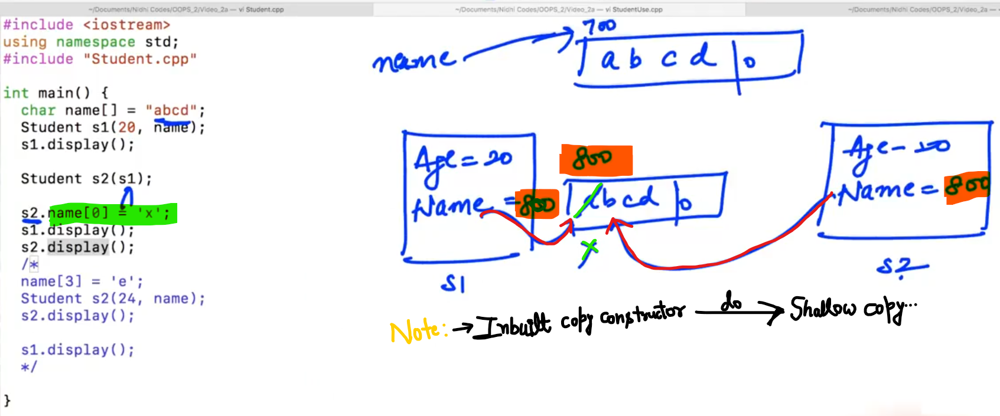
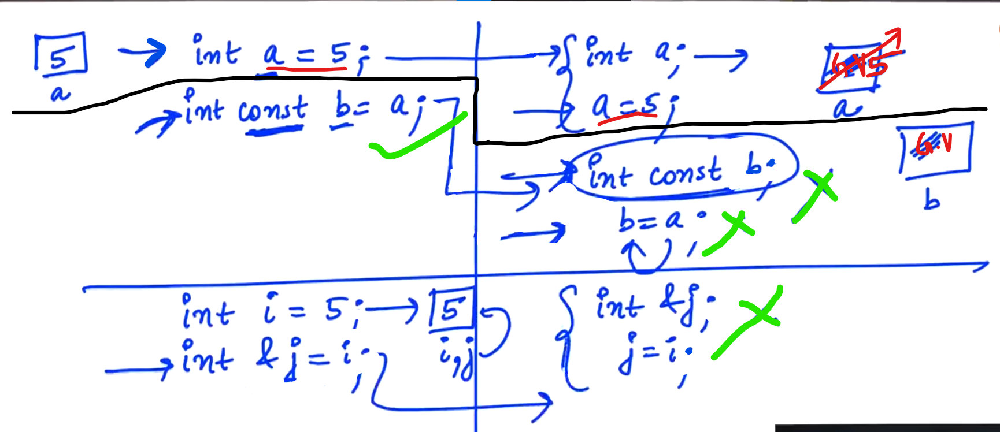
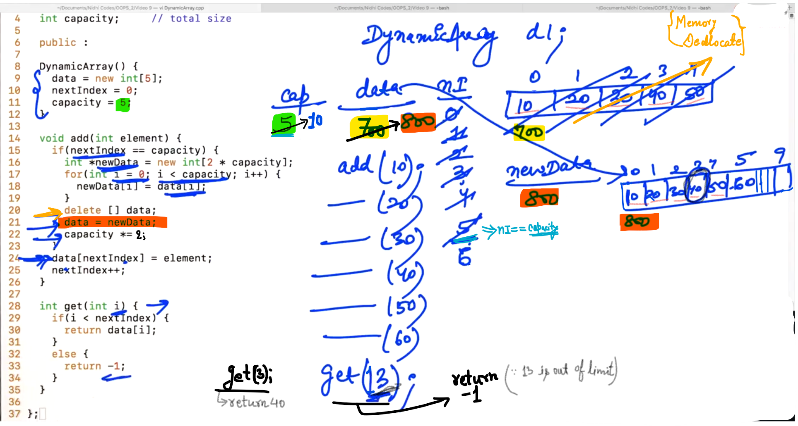

## 0.Shallow and Deep Copy


<u>Conclusion</u>:

Problem is that s1, s2 and name pointing to the same Array... any change reflects to both the objects s1 and s2...

<u>Shallow copy</u>:

When we pass the Array... rather than copy the entire Array, we copy the Address of the 0th index of the Array... and that copy is called "Shallow Copy".

```cpp
// Example of Shallow Copy:
#include<iostream>
using namespace std;

class Student {
    int age;
    char *name;

    public:

    Student(int age, char *name){
        this -> age = age;
        // Shallow copy
        this -> name = name;
    }

    void display(){
        cout << name << " " << age << endl;
    }
};

int main(){
    char name[] = "abcd";
    Student s1(20, name);
    s1. display();

    name[3] = 'e';
    Student s2(24, name);
    s2.display();

    s1.display();   //Name changed in the output of s1 object...

}
```

<u>Ouput</u>:

abcd 20
abce 24
abce 20        //Changed name of s1 (Shallow Copy)

-

**<u>Deep Copy</u>**: Make new copy of entire Array...


-

```cpp
// Example of Deep Copy (From previous)
#include<iostream>
#include <cstring>
using namespace std;

class Student {
    int age;
    char *name;

    public:

    Student(int age, char *name){
        this -> age = age;
        // Deep Copy
        this -> name = new char[strlen(name) + 1]; // "1" is for Null character
        strcpy(this -> name, name);
    }

    void display(){
        cout << name << " " << age << endl;
    }
};

int main(){
    char name[] = "abcd";
    Student s1(20, name);
    s1. display();

    name[3] = 'e';
    Student s2(24, name);
    s2.display();

    s1.display();   //Name changed in the output

}
```

Output:

abcd 20
abce 24
abcd 20    // No change in the name (Deep Copy)

-----------------

## 2.Copy Constructor



From above case; s1 and s2 pointing to the same Array... because in <mark>Student s2(s1);</mark> s2 also copies the Address of Array in "Name".... so any change reflects also in the "s1"

<u>Output</u>:

abcd 20    // for s1
xbcd 20    //SEE (for s1 - index [0] i.e. "a" changes to "x")
xbcd 20    // for s2

<u>Conclusion</u>:

We should always create our own copy constructor, just to <mark>avoid</mark> "Shallow Copy". We want "Deep Copy".

-

-


-


Here, pass by value works i.e. values of s1 object were copying in "s" by making objects in "s". So, implicitly in line <mark>Student(Student s)</mark> "copy constructor" calls...

<u>Conclusion</u>:

We don't want to call "Copy constructor" (To avoid the infinite loop of Copy Constructor)

<u>Solution</u>:

If we don't want to create copy; pass by reference...

Example:


-

Use of reference


Use of constant Reference:


-

    // Only for understanding
    
    Student const &s = main.s1;

"s" is a reference variable of "const (Constant) Student" ... Now, we can only read the values of "s" but can't change it...

```cpp
// Correct solution 
// Exxample for "inbuilt copy constructor" related...

#include<iostream>
#include <cstring>
using namespace std;

class Student {
    int age;

    public:

    char *name;

    Student(int age, char *name){
        this -> age = age;

        // Deep Copy
        this -> name = new char[strlen(name) + 1];
        strcpy(this -> name, name);
    }

    // Copy constructor
    Student (Student const &s){
        this -> age = s.age;
        // this -> name = s.name;   // Shallow Copy

        // Deep  Copy
        this -> name = new char[strlen(s.name) + 1];
        strcpy(this -> name, s.name);
    }

    void display(){
        cout << name << " " << age << endl;
    }
};

int main(){
    char name[] = "abcd";
    Student s1(20, name);
    s1. display();

    Student s2(s1);

    s2.name[0] = 'x';
    s1.display();
    s2.display();

}
```

<u>Output</u>:

abcd 20    // For s1
abcd 20    // For s1 - No changes reflect in s1
xbcd 20    // For s2

--------------------

## 3.Initialisation List



G.V.    =>    Garbage Value

-

```cpp
// Example of Initialisation List:
#include<iostream>
using namespace std;

class Student {
    public:

        int age;
        const int rollNumber;

        Student(int r) : rollNumber(r){    //SEE
            //  rollNumber = r; //ERROR
        }
};

int main(){
    Student s1(101);
    s1.age = 20;
    // s1.rollNumber = 101; //ERROR
}
```

Output: (No output)

-

            const int rollNumber;
               
             Student(int r) : rollNumber(r){
             //It means:-> const int rollNumber = r;
            
            }

-

    // For initialising multiple values:
    
    Student(int r, int a) : rollNumber(r), age(a) {

-

Reference Variables should initialise at the time of the Creation...

 "x" to be a reference variable of the "age"

int &x = age;     //Show Error


Correct is:    int &x = this -> age;

-

```cpp
// Example of Initialisation List:
#include<iostream>
using namespace std;

class Student {
    public:

        int age;
        const int rollNumber;
        int &x; // age reference variable 

        Student(int r, int age) : rollNumber(r), age(age), x(this -> age) {
            //  rollNumber = r; //ERROR
        }
};

int main(){
    Student s1(101, 20);
    s1.age = 20;
    // s1.rollNumber = 101; //ERROR
}
```

Output: (No output)

--

<u>Conclusion</u>:

We need help of "initialisation list" whenever in our class there is constant data members or reference data members....

---------------------------------

## 5.Constant Functions


-

```cpp
// making functions constant in the class, so that the function will
// also call through the constant object...

#include<iostream>
using namespace std;

class Fraction{
    private:
        int numerator;
        int denominator;

    public:

    Fraction(){     //default constructor

    }

    //parameterised constructor
    Fraction(int numerator, int denominator){
        this -> numerator = numerator;
        this -> denominator = denominator;
    }

    int getNumerator() const{   //SEE
        return numerator;
    }

    int getDenominator() const{     //SEE
        return denominator;
    }

    void setNumerator(int n){
        numerator = n;
    }

    void setDenominator(int d){
        denominator = d;
    }

    void print() const{     //SEE
        cout << this -> numerator << " / " << denominator << endl;
    }

    void simplify(){
        int gcd = 1;
        int j = min(this -> numerator, this -> denominator);
        for(int i = 1; i <= j; j++){
            if(this -> numerator % i == 0 && this -> denominator % i == 0){
                gcd = i;
            }
        }
        this -> numerator = this -> numerator / gcd;
        this -> denominator = this -> denominator / gcd;
    }

    void add(Fraction const &f2){
        int lcm = denominator * f2.denominator;
        int x = lcm / denominator;
        int y = lcm / f2.denominator;

        int num = x * numerator + (y * f2.numerator);

        numerator = num;
        denominator = lcm;
        simplify();
    }

    void multiply(Fraction const &f2){
        numerator = numerator * f2.numerator;
        denominator = denominator * f2.denominator;

        simplify();
    }

};

int main(){
    Fraction f1(10, 2);
    Fraction f2(15, 4);

    Fraction const f3;

    cout << f3.getNumerator() << " " << f3.getDenominator() << endl;

    f3.setNumerator(10);


}
```

-


<u>Note</u>:

Fraction const f3;     =>    "f3" is a constant object, we can call only constat functions...

constant functions :- Constant functions are those which don't change any property in the current object... (i.e. Doesn't change any property of "this")

--------------------

## 7.Static Members


-


<u>Note</u>:

<mark>cout << s1.totalStudents;</mark>     =>    is wrong because "s1" don't have property to access "totalStudents"

Student class has property "totalStudents"


-

```cpp
// Example of Static
#include<iostream>
using namespace std;

class Student{
    public:

    int rollNumber;
    int age;

    static int totalStudents;   // total number of students present

};

int Student :: totalStudents = 0;   // initialze static data member

int main() {
    Student s1;

    cout << s1.rollNumber << " " << s1.age << endl;
    cout << s1.totalStudents << endl;   // No ERROR but logically incorrect.

    s1.totalStudents = 20;        //SEE

    Student s2;

    cout << s2.totalStudents << endl;

    cout << Student :: totalStudents << endl;
}
```

Output:

0 0
0    // No ERROR but logically incorrect.
20
20

-

       s1.totalStudents = 20;
    
        Student s2;
    
        cout << s2.totalStudents << endl;

"totalStudents" property is static, so there is no copy of it... and present in the class... So, any change from "s1" or "s2" there will be change inside the class...

-

```cpp
//Update of no. of students i.e. totalStudents
#include<iostream>
using namespace std;

class Student{
    public:

    int rollNumber;
    int age;

    static int totalStudents;   // total number of students present

    Student(){                //SEE
        totalStudents++;
    }

};

int Student :: totalStudents = 0;   // initialze static data member

int main() {
    Student s1;

    Student s2;

    Student s3, s4, s5;

    cout << Student :: totalStudents << endl;

}
```

<u>Output</u>:

5

-


-

Note: "static" means property belongs to a class, not to an object...

we can even make data members and functions to static in class...

-

```cpp
// Example
#include<iostream>
using namespace std;

class Student{

    static int totalStudents;   // total number of students present
    //"totalStudents" is private here...

    public:

    int rollNumber;
    int age;

    Student(){
        totalStudents++;
    }

    int getRollNumber(){
        return rollNumber;
    }

    static int getTotalStudents(){        //SEE
        return totalStudents;
    }

};

int Student :: totalStudents = 0;   // initialze static data member

int main() {
    Student s1;

    Student s2;

    Student s3, s4, s5;

    // cout << Student :: totalStudents << endl; // show ERROR
    // since "totalStudents" is now "private"

    cout << Student :: getTotalStudents() << endl;    //SEE

}
```

<u>Output</u>:

5

--

<u>Note</u>:

1. Static functions only can access to static properties...

2. Static functions don't have "this" pointer / keyword...

---------------------

## 9.Operator Overloading 1

```cpp
// Example using add() function:
#include<iostream>
using namespace std;

class Fraction{
    private:
        int numerator;
        int denominator;

    public:

    Fraction(){     //default constructor

    }

    //parameterised constructor
    Fraction(int numerator, int denominator){
        this -> numerator = numerator;
        this -> denominator = denominator;
    }

    int getNumerator() const{   //SEE
        return numerator;
    }

    int getDenominator() const{     //SEE
        return denominator;
    }

    void setNumerator(int n){
        numerator = n;
    }

    void setDenominator(int d){
        denominator = d;
    }

    void print() const{     //SEE
        cout << this -> numerator << " / " << denominator << endl;
    }

    void simplify(){
        int gcd = 1;
        int j = min(this -> numerator, this -> denominator);
        for(int i = 1; i <= j; j++){
            if(this -> numerator % i == 0 && this -> denominator % i == 0){
                gcd = i;
            }
        }
        this -> numerator = this -> numerator / gcd;
        this -> denominator = this -> denominator / gcd;
    }

    Fraction add(Fraction const &f2){
        int lcm = denominator * f2.denominator;
        int x = lcm / denominator;
        int y = lcm / f2.denominator;

        int num = x * numerator + (y * f2.numerator);

        Fraction fNew(num, lcm);
        fNew.simplify();
        return fNew;
    }

    void multiply(Fraction const &f2){
        numerator = numerator * f2.numerator;
        denominator = denominator * f2.denominator;

        simplify();
    }

};

int main(){
    Fraction f1(10, 2);
    Fraction f2(15, 4);

    Fraction f3 = f1.add(f2);
    f1.print();
    f2.print();
    f3.print();

}
```

Output:

10 / 2
15 / 4
70 / 8        // 35 / 4 (Correct one in simplified format)

--

    // Using "add()"
    Fraction f3 = f1.add(f2);
    -------------------------------
    // Using "+" operator
    Fraction f4 = f1 + f2;
    ---------------------------
    // Using "*" operator
    Fraction f3 = f1 * f2;

-


-


-

```cpp
// Example using "+" operator (i.e. Operator Overloading)
#include<iostream>
using namespace std;

class Fraction{
    private:
        int numerator;
        int denominator;

    public:

    Fraction(){     //default constructor

    }

    //parameterised constructor
    Fraction(int numerator, int denominator){
        this -> numerator = numerator;
        this -> denominator = denominator;
    }

    int getNumerator() const{   //SEE
        return numerator;
    }

    int getDenominator() const{     //SEE
        return denominator;
    }

    void setNumerator(int n){
        numerator = n;
    }

    void setDenominator(int d){
        denominator = d;
    }

    void print() const{     //SEE
        cout << this -> numerator << " / " << denominator << endl;
    }

    void simplify(){
        int gcd = 1;
        int j = min(this -> numerator, this -> denominator);
        for(int i = 1; i <= j; j++){
            if(this -> numerator % i == 0 && this -> denominator % i == 0){
                gcd = i;
            }
        }
        this -> numerator = this -> numerator / gcd;
        this -> denominator = this -> denominator / gcd;
    }

    Fraction add(Fraction const &f2){
        int lcm = denominator * f2.denominator;
        int x = lcm / denominator;
        int y = lcm / f2.denominator;

        int num = x * numerator + (y * f2.numerator);

        Fraction fNew(num, lcm);
        fNew.simplify();
        return fNew;
    }

    // operator overloasding using "+"
    Fraction operator+(Fraction const &f2){
        int lcm = denominator * f2.denominator;
        int x = lcm / denominator;
        int y = lcm / f2.denominator;

        int num = x * numerator + (y * f2.numerator);

        Fraction fNew(num, lcm);
        fNew.simplify();
        return fNew;
    }


    // Multiply Operator using "*"
    Fraction operator*(Fraction f2){
        int n = numerator * f2.numerator;
        int d = denominator * f2.denominator;
        Fraction fNew(n, d);
        fNew.simplify();
        return fNew;
    }

    bool operator==(Fraction f2){
        return (numerator == f2.numerator && denominator == f2.denominator);
    }

    void multiply(Fraction const &f2){
        numerator = numerator * f2.numerator;
        denominator = denominator * f2.denominator;

        simplify();
    }

};

int main(){
    Fraction f1(10, 2);
    Fraction f2(15, 4);

    Fraction f3 = f1.add(f2);
    Fraction f4 = f1 + f2;

    f1.print();
    f2.print();
    f3.print();
    f4.print();

    Fraction f5 = f1 * f2;
    f5.print();

    if(f1 == f2){
        cout << "Equal" << endl;
    }
    else {
        cout << "Not equal " << endl;
    }

}
```

<u>Output</u>:

10 / 2
15 / 4
70 / 8        // Correct one is 35 / 4
70 / 8        // Correct one is 35 / 4
150 / 8        // Correct one is 75 / 4
Not equal 

-

```cpp
// Same as previous (with some optimisation)
#include<iostream>
using namespace std;

class Fraction{
    private:
        int numerator;
        int denominator;

    public:

    Fraction(){     //default constructor

    }

    //parameterised constructor
    Fraction(int numerator, int denominator){
        this -> numerator = numerator;
        this -> denominator = denominator;
    }

    int getNumerator() const{   //SEE
        return numerator;
    }

    int getDenominator() const{     //SEE
        return denominator;
    }

    void setNumerator(int n){
        numerator = n;
    }

    void setDenominator(int d){
        denominator = d;
    }

    void print() const{     //SEE
        cout << this -> numerator << " / " << denominator << endl;
    }

    void simplify(){
        int gcd = 1;
        int j = min(this -> numerator, this -> denominator);
        for(int i = 1; i <= j; j++){
            if(this -> numerator % i == 0 && this -> denominator % i == 0){
                gcd = i;
            }
        }
        this -> numerator = this -> numerator / gcd;
        this -> denominator = this -> denominator / gcd;
    }

    Fraction add(Fraction const &f2){
        int lcm = denominator * f2.denominator;
        int x = lcm / denominator;
        int y = lcm / f2.denominator;

        int num = x * numerator + (y * f2.numerator);

        Fraction fNew(num, lcm);
        fNew.simplify();
        return fNew;
    }

    // operator overloasding using "+"
    Fraction operator+(Fraction const &f2) const {  //SEE
        int lcm = denominator * f2.denominator;
        int x = lcm / denominator;
        int y = lcm / f2.denominator;

        int num = x * numerator + (y * f2.numerator);

        Fraction fNew(num, lcm);
        fNew.simplify();
        return fNew;
    }


    // Multiply Operator using "*"
    Fraction operator*(Fraction const &f2) const {  //SEE
        int n = numerator * f2.numerator;
        int d = denominator * f2.denominator;
        Fraction fNew(n, d);
        fNew.simplify();
        return fNew;
    }

    bool operator==(Fraction const &f2) const { //SEE
        return (numerator == f2.numerator && denominator == f2.denominator);
    }

    void multiply(Fraction const &f2){
        numerator = numerator * f2.numerator;
        denominator = denominator * f2.denominator;

        simplify();
    }

};

int main(){
    Fraction f1(10, 2);
    Fraction f2(15, 4);

    Fraction f3 = f1.add(f2);
    Fraction f4 = f1 + f2;

    f1.print();
    f2.print();
    f3.print();
    f4.print();

    Fraction f5 = f1 * f2;
    f5.print();

    if(f1 == f2){
        cout << "Equal" << endl;
    }
    else {
        cout << "Not equal " << endl;
    }

}
```

NOTE:

Since we are using reference "i.e. &" (to avoid any copy...) and then to avoid the illegal changes we have used "const &"

-----------

## 10.Operator Overloading 2


-


-

**<u>Pre-increment Overloading</u>**:


-

```cpp
// Example:
#include<iostream>
using namespace std;

class Fraction{
    private:
        int numerator;
        int denominator;

    public:

    Fraction(){     //default constructor

    }

    //parameterised constructor
    Fraction(int numerator, int denominator){
        this -> numerator = numerator;
        this -> denominator = denominator;
    }

    int getNumerator() const{   //SEE
        return numerator;
    }

    int getDenominator() const{     //SEE
        return denominator;
    }

    void setNumerator(int n){
        numerator = n;
    }

    void setDenominator(int d){
        denominator = d;
    }

    void print() const{     //SEE
        cout << this -> numerator << " / " << denominator << endl;
    }

    void simplify(){
        int gcd = 1;
        int j = min(this -> numerator, this -> denominator);
        for(int i = 1; i <= j; j++){
            if(this -> numerator % i == 0 && this -> denominator % i == 0){
                gcd = i;
            }
        }
        this -> numerator = this -> numerator / gcd;
        this -> denominator = this -> denominator / gcd;
    }

    Fraction add(Fraction const &f2){
        int lcm = denominator * f2.denominator;
        int x = lcm / denominator;
        int y = lcm / f2.denominator;

        int num = x * numerator + (y * f2.numerator);

        Fraction fNew(num, lcm);
        fNew.simplify();
        return fNew;
    }

    // operator overloasding using "+"
    Fraction operator+(Fraction const &f2) const {  //SEE
        int lcm = denominator * f2.denominator;
        int x = lcm / denominator;
        int y = lcm / f2.denominator;

        int num = x * numerator + (y * f2.numerator);

        Fraction fNew(num, lcm);
        fNew.simplify();
        return fNew;
    }


    // Multiply Operator using "*"
    Fraction operator*(Fraction const &f2) const {  //SEE
        int n = numerator * f2.numerator;
        int d = denominator * f2.denominator;
        Fraction fNew(n, d);
        fNew.simplify();
        return fNew;
    }

    bool operator==(Fraction const &f2) const { //SEE
        return (numerator == f2.numerator && denominator == f2.denominator);
    }

    void multiply(Fraction const &f2){
        numerator = numerator * f2.numerator;
        denominator = denominator * f2.denominator;

        simplify();
    }

    // Pre-increment
    void operator++(){
        numerator = numerator + denominator;
        simplify();
    }

};

int main(){
    Fraction f1(10, 2);
    Fraction f2(15, 4);

    f1.print();
    ++f1;
    f1.print();

}
```

-

Output:

10 / 2
12 / 2    // Correct one is: 6 / 1

-

```cpp
 // Pre-increment
    void operator++(){    // WRONG

    Fraction operator++(){        // Right
 /* 
 In case of void return type of a function, we only have to call 
 directly...  
 */
        numerator = numerator + denominator;
        simplify();
    }

};
```

-


"This" is a pointer which contains address of the f1 block...

-

```cpp
// From Previous:
#include<iostream>
using namespace std;

class Fraction{
    private:
        int numerator;
        int denominator;

    public:

    Fraction(){     //default constructor

    }

    //parameterised constructor
    Fraction(int numerator, int denominator){
        this -> numerator = numerator;
        this -> denominator = denominator;
    }

    int getNumerator() const{   //SEE
        return numerator;
    }

    int getDenominator() const{     //SEE
        return denominator;
    }

    void setNumerator(int n){
        numerator = n;
    }

    void setDenominator(int d){
        denominator = d;
    }

    void print() const{     //SEE
        cout << this -> numerator << " / " << denominator << endl;
    }

    void simplify(){
        int gcd = 1;
        int j = min(this -> numerator, this -> denominator);
        for(int i = 1; i <= j; j++){
            if(this -> numerator % i == 0 && this -> denominator % i == 0){
                gcd = i;
            }
        }
        this -> numerator = this -> numerator / gcd;
        this -> denominator = this -> denominator / gcd;
    }

    Fraction add(Fraction const &f2){
        int lcm = denominator * f2.denominator;
        int x = lcm / denominator;
        int y = lcm / f2.denominator;

        int num = x * numerator + (y * f2.numerator);

        Fraction fNew(num, lcm);
        fNew.simplify();
        return fNew;
    }

    // operator overloasding using "+"
    Fraction operator+(Fraction const &f2) const {  //SEE
        int lcm = denominator * f2.denominator;
        int x = lcm / denominator;
        int y = lcm / f2.denominator;

        int num = x * numerator + (y * f2.numerator);

        Fraction fNew(num, lcm);
        fNew.simplify();
        return fNew;
    }


    // Multiply Operator using "*"
    Fraction operator*(Fraction const &f2) const {  //SEE
        int n = numerator * f2.numerator;
        int d = denominator * f2.denominator;
        Fraction fNew(n, d);
        fNew.simplify();
        return fNew;
    }

    bool operator==(Fraction const &f2) const { //SEE
        return (numerator == f2.numerator && denominator == f2.denominator);
    }

    void multiply(Fraction const &f2){
        numerator = numerator * f2.numerator;
        denominator = denominator * f2.denominator;

        simplify();
    }

    // Pre-increment
    Fraction operator++(){
        numerator = numerator + denominator;
        simplify();

        return *this;
    }
};

int main(){
    Fraction f1(10, 2);
    Fraction f2(15, 4);

    f1.print();

    Fraction f3 = ++f1;
    f1.print();
    f3.print();
}
```

Output:

10 / 2
12 / 2            // Correct one: 6 / 1
-326434000 / 32764    // Correct one: 6 / 1

-

Case: 

++(++f1);


-


Output: (Right result)

10 / 2

6 / 1    // Not comes as per our thought

 -

```cpp
#include<iostream>
(... SAME as Previous...)

  // Pre-increment
    Fraction operator++(){
        numerator = numerator + denominator;
        simplify();

        return *this;
    }
};
int main(){
    Fraction f1(10, 2);
    Fraction f2(15, 4);

    f1.print();
    Fraction f3 = ++(++f1);
    f1.print();        //SEE
    f3.print();

}
```

Output: (Correct one)

10 / 2

6 / 1    // Here should be 7 / 1 but 

7 / 1

-


Whenever any function returns the value, Firstly our system receives the value in the temporary buffer... and then get assigned where we want to assign...

-

**<u>Nesting of Pre-increment</u>**:


-


Whenever we want to return the value or pass the value and don't make the copy... so, just "return by reference i.e. &" or "pass by reference..."

```cpp
// Example on Nesting of Pre-increment:
#include<iostream>

...Same as previous...

    // Pre-increment
    Fraction& operator++(){            //SEE
        numerator = numerator + denominator;
        simplify();

        return *this;
    }
};

int main(){
    Fraction f1(10, 2);
    Fraction f2(15, 4);

    f1.print();
    Fraction f3 = ++(++f1);
    f1.print();
    f3.print();

}
```

 Output:

10 / 2
14 / 2    // Correct one: 7 / 1
14 / 2    // Correct one: 7 / 1

-------------------------------

## 11.Operator Overloading 3

++ => Post-increment

e.g. int j = ++i;  (First use then increment)


-

```cpp
#include<iostream>
using namespace std;

class Fraction{

...Same as Previous...


    // Pre-increment
    Fraction& operator++(){
        numerator = numerator + denominator;
        simplify();

        return *this;
    }

    // Post-increment
    Fraction operator++(int){
        Fraction fNew(numerator, denominator);
        numerator = numerator + denominator;
        simplify();
        fNew.simplify();
        return fNew;
    }

};

int main(){
    Fraction f1(10, 2);
    Fraction f2(15, 4);

    Fraction f3 = f1++;
    f1.print();
    f3.print();   
}
```

Output:

12 / 2        // Correct one: 6 / 1
10 / 2        // Correct one: 5 / 1

--

**<u>Nesting of "post increment"</u>**:    

e.g.:        (i++)++;

Note: In post increment operator, nesting is not Allowed...

--

**<u>Overloading of "+=" operator</u>**:

It is Allowed...

e.g:


-

```cpp
#include<iostream>
using namespace std;

int main()
{
    int i = 5, j = 3;
    (i += j) += j;

    cout << i << " " << j << endl;
}
```

Output:

11 3

--


-

```cpp
// Use of Nesting in "+="

#include<iostream>
using namespace std;

class Fraction{
    private:
        int numerator;
        int denominator;

    public:

    Fraction(){     //default constructor

    }

    //parameterised constructor
    Fraction(int numerator, int denominator){
        this -> numerator = numerator;
        this -> denominator = denominator;
    }

    int getNumerator() const{   //SEE
        return numerator;
    }

    int getDenominator() const{     //SEE
        return denominator;
    }

    void setNumerator(int n){
        numerator = n;
    }

    void setDenominator(int d){
        denominator = d;
    }

    void print() const{     //SEE
        cout << this -> numerator << " / " << denominator << endl;
    }

    void simplify(){
        int gcd = 1;
        int j = min(this -> numerator, this -> denominator);
        for(int i = 1; i <= j; j++){
            if(this -> numerator % i == 0 && this -> denominator % i == 0){
                gcd = i;
            }
        }
        this -> numerator = this -> numerator / gcd;
        this -> denominator = this -> denominator / gcd;
    }

    Fraction add(Fraction const &f2){
        int lcm = denominator * f2.denominator;
        int x = lcm / denominator;
        int y = lcm / f2.denominator;

        int num = x * numerator + (y * f2.numerator);

        Fraction fNew(num, lcm);
        fNew.simplify();
        return fNew;
    }

    // operator overloasding using "+"
    Fraction operator+(Fraction const &f2) const {  //SEE
        int lcm = denominator * f2.denominator;
        int x = lcm / denominator;
        int y = lcm / f2.denominator;

        int num = x * numerator + (y * f2.numerator);

        Fraction fNew(num, lcm);
        fNew.simplify();
        return fNew;
    }


    // Multiply Operator using "*"
    Fraction operator*(Fraction const &f2) const {  //SEE
        int n = numerator * f2.numerator;
        int d = denominator * f2.denominator;
        Fraction fNew(n, d);
        fNew.simplify();
        return fNew;
    }

    bool operator==(Fraction const &f2) const { //SEE
        return (numerator == f2.numerator && denominator == f2.denominator);
    }

    void multiply(Fraction const &f2){
        numerator = numerator * f2.numerator;
        denominator = denominator * f2.denominator;

        simplify();
    }

    // Pre-increment
    Fraction& operator++(){
        numerator = numerator + denominator;
        simplify();

        return *this;
    }

    // Post-increment
    Fraction operator++(int){
        Fraction fNew(numerator, denominator);
        numerator = numerator + denominator;
        simplify();
        fNew.simplify();
        return fNew;
    }

    void operator += (Fraction const &f2){  //"Fraction" removed
    /* 
    During passing in an Argument, we need to 
    pass constant reference i.e. "const &" to avoid copying
    */
        int lcm = denominator * f2.denominator;
        int x = lcm / denominator;
        int y = lcm / f2.denominator;

        int num = x * numerator + (y * f2.numerator);

        numerator = num;
        denominator = lcm;
        simplify();
    }

};

int main(){

    Fraction f1(10, 3);
    Fraction f2(5, 2);

    f1 += f2; 

    f1.print();
    f2.print();
}
```

Output:

35 / 6
5 / 2

```cpp
//Nesting of "+=" (From previous) // Updated...

#include<iostream>
using namespace std;

class Fraction{
    private:
        int numerator;
        int denominator;

    public:

    Fraction(){     //default constructor

    }

    //parameterised constructor
    Fraction(int numerator, int denominator){
        this -> numerator = numerator;
        this -> denominator = denominator;
    }

    int getNumerator() const{   //SEE
        return numerator;
    }

    int getDenominator() const{     //SEE
        return denominator;
    }

    void setNumerator(int n){
        numerator = n;
    }

    void setDenominator(int d){
        denominator = d;
    }

    void print() const{     //SEE
        cout << this -> numerator << " / " << denominator << endl;
    }

    void simplify(){
        int gcd = 1;
        int j = min(this -> numerator, this -> denominator);
        for(int i = 1; i <= j; j++){
            if(this -> numerator % i == 0 && this -> denominator % i == 0){
                gcd = i;
            }
        }
        this -> numerator = this -> numerator / gcd;
        this -> denominator = this -> denominator / gcd;
    }

    Fraction add(Fraction const &f2){
        int lcm = denominator * f2.denominator;
        int x = lcm / denominator;
        int y = lcm / f2.denominator;

        int num = x * numerator + (y * f2.numerator);

        Fraction fNew(num, lcm);
        fNew.simplify();
        return fNew;
    }

    // operator overloasding using "+"
    Fraction operator+(Fraction const &f2) const {  //SEE
        int lcm = denominator * f2.denominator;
        int x = lcm / denominator;
        int y = lcm / f2.denominator;

        int num = x * numerator + (y * f2.numerator);

        Fraction fNew(num, lcm);
        fNew.simplify();
        return fNew;
    }


    // Multiply Operator using "*"
    Fraction operator*(Fraction const &f2) const {  //SEE
        int n = numerator * f2.numerator;
        int d = denominator * f2.denominator;
        Fraction fNew(n, d);
        fNew.simplify();
        return fNew;
    }

    bool operator==(Fraction const &f2) const { //SEE
        return (numerator == f2.numerator && denominator == f2.denominator);
    }

    void multiply(Fraction const &f2){
        numerator = numerator * f2.numerator;
        denominator = denominator * f2.denominator;

        simplify();
    }

    // Pre-increment
    Fraction& operator++(){
        numerator = numerator + denominator;
        simplify();

        return *this;
    }

    // Post-increment
    Fraction operator++(int){
        Fraction fNew(numerator, denominator);
        numerator = numerator + denominator;
        simplify();
        fNew.simplify();
        return fNew;
    }

    Fraction& operator += (Fraction const &f2){  //"Fraction" added again
    /* 
    During passing in an Argument, we need to 
    pass constant reference i.e. "const &" to avoid copying
    */
        int lcm = denominator * f2.denominator;
        int x = lcm / denominator;
        int y = lcm / f2.denominator;

        int num = x * numerator + (y * f2.numerator);

        numerator = num;
        denominator = lcm;
        simplify();

        return *this;
    }

};

int main(){

    Fraction f1(10, 3);
    Fraction f2(5, 2);

    (f1 += f2) += f2; //ERROR // Nesting not allowed... 

    f1.print();
    f2.print();
}
```

Output:

100 / 12        // Correct one: 25 / 3
5 / 2

------------------

## 12.Dynamic Array Class

"nextIndex" will tell me about "the element which is added by the User, that element will go in which index...??" and initial value of "nextIndex" will be zero...


-

On occupying all the elements in the the Array, We should create an Array of Double size, And copy the old content and Allow user to Add in it...


nI    =>    next Index

-


-


-



-

Now, we want to place our value at a particiular index...


-


Note:

Copy constructor always do <u>Shallow copy</u> (i.e. only Address copy) instead of <u>Deep copy</u> (i.e. creating a new Array)

-

```cpp
// Example on 1. "add", 2. "get" and 3. "add at particular index..."
#include<iostream>
using namespace std;

class DynamicArray {
    int *data;
    int nextIndex;
    int capacity;       // total size 
    
    public:
    
    DynamicArray(){
        data = new int[5];
        nextIndex = 0;
        capacity = 5;
    }
    
    // Making our own constructor to use "Deep copy" instead of "Shallow copy" 
    DynamicArray(DynamicArray const &d){
        
        // this -> data = d.data;  // reference address copied // Shallow copy
        
        //Now for Deep copy
        this -> data = new int [d.capacity];
        for(int i = 0; i < d.nextIndex; i++){
            this -> data[i] = d.data[i];
        }
        this -> nextIndex = d.nextIndex;
        this -> capacity = d.capacity;
    }
    
    //copy assignment operator
    void operator=(DynamicArray const &d){
        this -> data = new int [d.capacity];
        for(int i = 0; i < d.nextIndex; i++){
            this -> data[i] = d.data[i];
        }
        this -> nextIndex = d.nextIndex;
        this -> capacity = d.capacity;
    }
    
// 1. add    
    void add(int element) {
        if(nextIndex == capacity){
            int *newData = new int[2 * capacity];
            for(int i = 0; i < capacity; i++){
                newData[i] = data[i];
            }
            delete [] data;
            data = newData;
            capacity *= 2;
        }
        data[nextIndex] = element;
        nextIndex++;
    }
    
// 2. get
    int get(int i) const{
        if(i < nextIndex){
            return data[i];
        }
        else {
            return -1;
        }
    }
    
//3. Now we want to place our value at a particiular index...
    void add(int i, int element){
        if(i < nextIndex){
            data[i] = element;
        }
        else if(i == nextIndex){
            add(element);
        }
        else{   //When value of "i" is greater than "nextIndex"...
            return;
        }
    }
    
    void print() const{
        for(int i = 0; i < nextIndex; i++){
            cout << data[i] << " ";
    }
    cout << endl;
    }
};

int main(){
    DynamicArray d1;
    
    d1.add(10);
    d1.add(20);
    d1.add(30);
    d1.add(40);
    d1.add(50);
    d1.add(60);
    
    d1.print();
    
    DynamicArray d2(d1);    // Copy Constructor (Shallow Copy)
    
    DynamicArray d3;
    
    d3 = d1; // Copy assignment operator
    
    d1.add(0, 100);     // We only change the "0" index of "d1"
    
    d2.print();     // result of "d2" also changes because of Copy Constructor

    d3.print();     // Copy assignment operator... also do Shallow copy
}


```

Output:

10 20 30 40 50 60
10 20 30 40 50 60 
10 20 30 40 50 60 

-

During use of "Copy Assignment operator":


Conclusion:

Whenever in any class while using Array, "inbuilt copy constructor" and "copy assignment operator" always do "Shallow Copy". So, we should create our own Constructor so that we can do "Deep Copy" 

------------------------

## 13.Polynomial Class Introduction


-


Things Default constructor have to do: 

1. Initialise <mark>int *drgCoeff;</mark> and <mark>int capacity;</mark> 

2. Make new Array

3. initialise capacity

4. Set value of each Array as Zero... 

-

In case of Copy Constructor:

Polynomial     =>    <mark>P2(P1);</mark>     =>    Here, "inbuilt copy constructor" will create its "Shallow Copy"... So, that P2 will also points to the same Array. But we want P2 will make a new Array and copy each element of  P1 in P2 New Array... 

-

In Copy Assignment Operator:  <mark>P2 = P1;</mark>   =>    Also makes a Shallow copy

-

overload    =>    "+", "-", "*"

-


-


-------------


  
