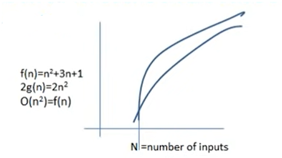

## Lec 1 - Introduction to Data Structure Hindi

**<u>VARIABLES</u>**:

- Variables names are the placeholders for representing the data.

--

**<u>Data Types</u>**:

- A data type in a programming language is a set of data with the values having predefined characteristics.

- System/Compiler defined data type are called <u>primitive data type</u>.

- Structure in C/C++ and classes in C++/JAVA are the means to create our own data type known as <u>user defined data type</u>.

--

**<u>Data Structure</u>**:

- Data Structure is a particular way of storing and organizing data in a computer so that it can be used efficiently.

(Data Structure is a kind of structure where we want to store our Data...)

--

**<u>Classification</u>**:

Two major classification of data structures are

- Linear Data Structure (Link list, stack queue)

- Non Linear Data Structure (tree ,graph)

--

**<u>Abstract Data Type</u>**:

- All primitive data types supports basic operations like addition, subtraction, etc.

- The system is providing the implementation for the primitive data types

- For non primitive data types we also need to define operations

- Combination of data structure and their operations are known as <u>Abstract Data Type</u>.

- So data structure is all about creating abstract data type.

- Any piece of information can be handled by defining appropriate data type and set of possible operations.

---------------

## Lec 2 - Analysis of Algorithm in DA

**<u>Algorithm</u>**:

An algorithm is the step by step instructions to solve a given problem.

<mark>**<u>Analysis of Algorithm</u>**</mark>:

- The goal of analysis of algorithms is to compare algorithms mainly in terms of
  running time but also in terms of other factors (like memory, efforts etc)

-

<mark>**<u>Types of Analysis</u>**</mark>:

To analyze the given algorithm we need to know on what inputs the algorithm is taking
less time and on what inputs the algorithm is taking huge time.

- Worst case

- Average case

- Best case

-

-

-

-

--

-

--

-

-----------

## Lec 3 - Arrays in Data Structure

**<u>Arrays</u>**:

- Arrays are the collection of a finite number of homogeneous data elements.

- Elements of the array are referenced respectively by an index set consisting of n  consecutive numbers and are stored respectively in successive memory locations.

- The number n of elements is called the length or size of the array.

- The array elements can be accessed in a constant time by using the index of the particular element.

- To access an array element, address of an element is computed as an offset from the base address of the array and one <mark>multiplication</mark> is needed to compute what is supposed to be <mark>added</mark> to the base address to get the memory address of the element.

Here, Base address is 100...

    main()
    {
        int a[5];
        a[0]=45;
        a[1]=56;
        a[3]=44;
    }

- First the size of an element of that data type is calculated and then it is multiplied with the index of the element to get the value to be added to the base address.

- This process takes one multiplication and one addition. Since these two operations take constant time, we can say the array access can be performed in constant time.

--

**<u>Array Dimensions</u>**:

- **1d array**: A list of data items that can be represented by one variable name using only one subscript and such variable is called one dimensional array.

- **2d array**: A list of data items that can be conceptualize as rows and columns, which can be represented using one name and two subscripts.

-

    main()
    {
        int a[5];        // 1d Array
        int b[3][4];    // 2d Array
        b[0][0]=34;
        b[0][3]=22;
        a[0]=45;
        a[1]=56;
        a[3]=44;
    }

-------------------

